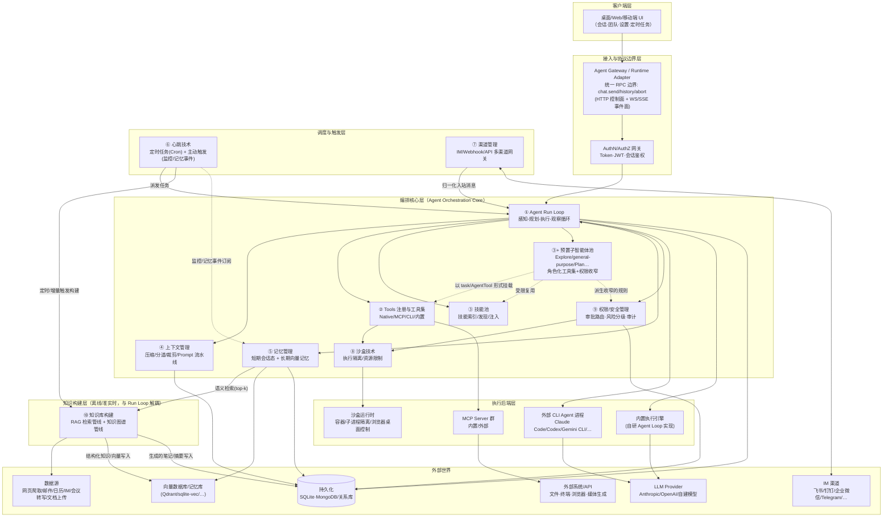
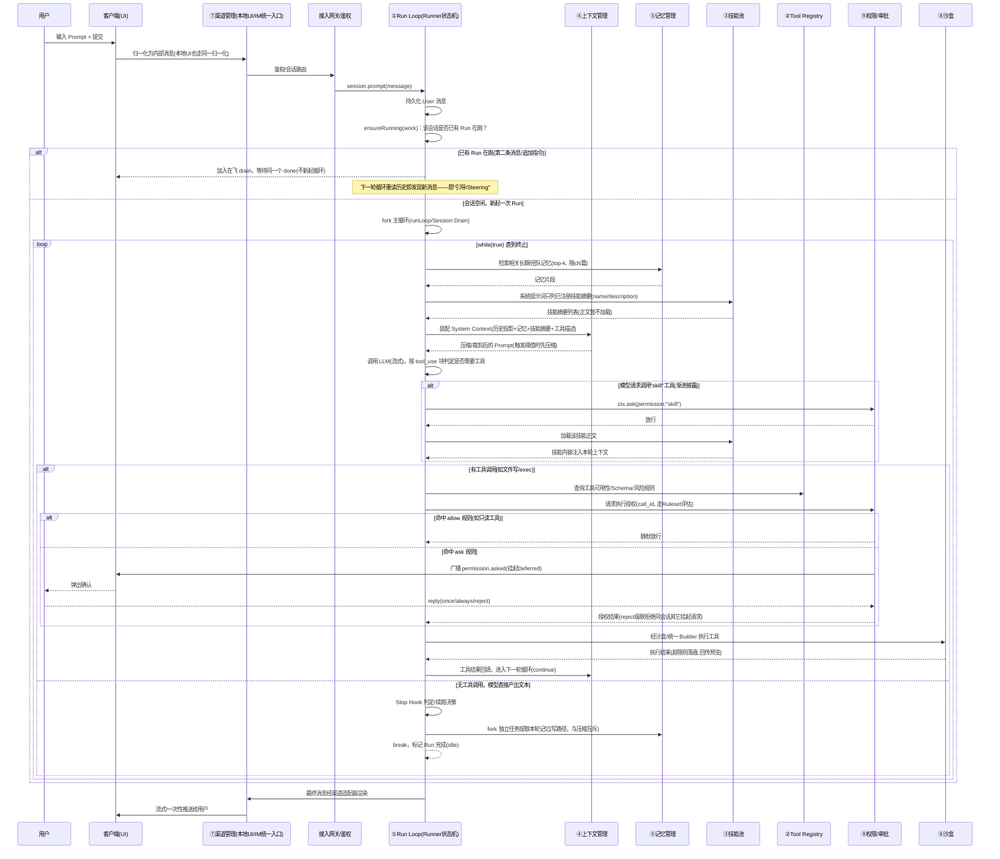
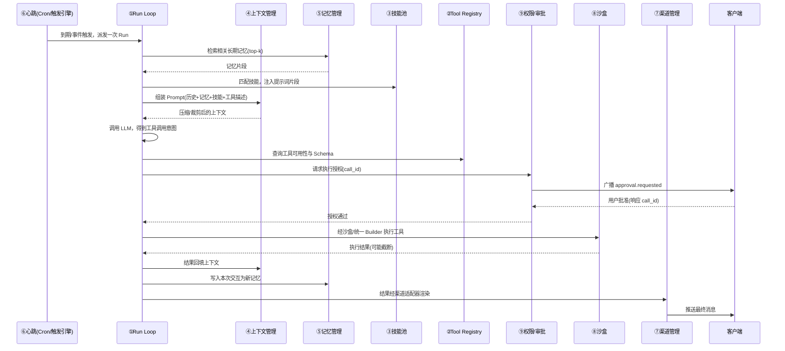
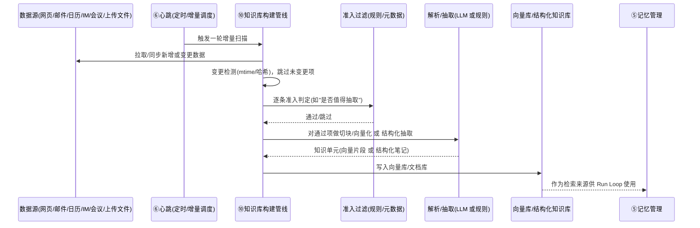

# Agent 平台通用技术架构图

> 提炼自五份逐源码架构分析：`AionUi-architecture.md`（AionUi + AionCore）、`LobsterAI-architecture.md`（LobsterAI + OpenClaw）、`Rowboat-architecture.md`（Classic Rowboat + RowboatX）、`claude-code-架构流程图.md`（Claude Code）、`opencode深度技术架构解读报告.md`（OpenCode）。抽象为不绑定具体技术栈的「桌面/服务端 Agent 平台」通用分层架构，覆盖：**agent-run-loop、Tools（注册+工具集/CLI工具集）、预置子智能体池、技能池、上下文管理、记忆管理、渠道管理、心跳技术（定时+主动触发）、沙盒技术、权限/安全管理、知识库构建** 十大模块（其中「预置子智能体池」是贯穿 ①Run Loop / ②Tools / ③技能池 三者的复合能力，单独成节说明，见 §2③+）。
>
> 五个参考项目分两类证据来源：**产品级拓扑证据**（AionUi/AionCore、LobsterAI/OpenClaw、Rowboat）——胖客户端 ⇄ 独立 Agent 后端/网关 ⇄（外部 CLI Agent | 内置执行引擎）⇄ LLM Provider / MCP / IM 渠道 / 知识库，解释"模块之间怎么连"；**单体引擎工程证据**（Claude Code、OpenCode）——两者都是被大规模生产验证过的单进程/单机 Agent 内核，代码可直接读到"Run Loop 到底怎么写、压缩到底怎么算、权限规则到底怎么合并"这类此前三个产品级项目里语焉不详或"预留但未实现"的细节，专门用来补齐**模块内部**的实现方案，尤其是此前标注为"两者均未实现，需自行设计"的几处空白（多端审批竞速、上下文压缩阈值算法、长期记忆分层）。

---

## 0. 设计原则（三个项目共同验证过的取舍）

| 原则                                                                        | AionUi/AionCore 证据                                                                                                                         | LobsterAI/OpenClaw 证据                                                                                                                       | Rowboat 证据                                                                                                                                                        |
| --------------------------------------------------------------------------- | -------------------------------------------------------------------------------------------------------------------------------------------- | --------------------------------------------------------------------------------------------------------------------------------------------- | ------------------------------------------------------------------------------------------------------------------------------------------------------------------- |
| **UI 与执行引擎之间只暴露一个稳定协议边界，UI 不感知底层引擎**        | `IWorkerTaskManager` trait 是 `aionui-conversation/team/channel/cron` 对 `aionui-ai-agent` 的唯一依赖，上层不知道 ACP 还是 aionrs 在跑 | `OpenClawRuntimeAdapter` 只对接 Gateway 的 `chat.send/history/abort` RPC 边界，`coworkEngineRouter` 可无感知切换 Claude/OpenClaw 双引擎 | RowboatX Renderer 只通过泛型`window.ipc.invoke/send/on` 与 Main 通信，具体走 `@x/core` 哪个领域模块对前端透明                                                   |
| **外部 CLI Agent 与内置引擎是同一抽象下的两条可插拔执行路径**         | ACP 路径（驱动 Claude Code/Codex/Gemini CLI）与 aionrs 路径（内置引擎）共用`manager/process_registry.rs`                                   | `extensions/acpx` 把外部 CLI Agent 桥接为"嵌入式子代理"，与内置 Provider 插件走同一套 `PluginRuntime`                                     | RowboatX`code-mode/acp/` 同样用 ACP 桥接 Claude Code/Codex，与自研 `agents-runtime`/后台 Agent 并存                                                             |
| **审批/权限是独立于业务流程的横切事件流，而非嵌入业务代码**           | `permission_router.rs` + `pending_permissions: HashMap<call_id, oneshot::Sender>`                                                        | `exec.approval.requested` 广播事件 + `ExecApprovalManager` 挂起登记 + 多渠道转发                                                          | `apps/cli` 遗留原型的 `/runs/:id/permissions/authorize` 独立端点，与消息投递端点分离                                                                            |
| **技能/工具/渠道/Provider 都是"注册到同一运行时"的可插拔单元**        | `aionui-extension`（Extension/Hub/Skill 发现）与 `aionui-mcp`（多 CLI adapter）结构对称                                                  | `registerTool/registerProvider/registerChannel/registerHook` 统一挂在 `PluginRuntime`                                                     | Classic Rowboat 的 MCP/Composio 工具与 RAG 数据源在 Workflow schema 中同级配置，Copilot 可联想真实第三方工具                                                        |
| **子进程/工具调用一律经统一 Builder 构建，禁止裸调用**                | `aionui-runtime::Builder::agent()/clean_cli()`，PATH 增强                                                                                  | `bash-tools.exec-host-gateway.ts` 统一 exec 入口                                                                                            | RowboatX 浏览器自动化统一经`apps/main/src/browser/view.ts` 的 `WebContentsView` 封装，不裸开子进程                                                              |
| **状态/上下文有唯一真源，禁止分散存字段**                             | `AcpRuntimeSnapshot/AcpState` 是会话状态唯一来源                                                                                           | `SessionAccessor`/`TaskStore` 落 SQLite，`agent-command.ts` 单一编排入口                                                                | Classic Rowboat`draftWorkflow`/`liveWorkflow` 明确区分草稿态与生效态，避免编辑中状态污染运行态                                                                  |
| **知识库构建是独立于会话记忆的离线/准实时管线，产出物才进入记忆检索** | —                                                                                                                                           | —                                                                                                                                            | RAG：Firecrawl/解析→切块→embedding→Qdrant 独立`rag-worker` 长驻进程；知识图谱：`sync_*`→变更检测→抽取→笔记，`build_graph.ts` 编排，与对话运行时完全解耦 |

### 0.2 单体引擎工程基石（Claude Code / OpenCode 补充验证）

以下六条不是"要不要抄哪个产品"的取舍，而是**两套独立技术栈（Claude Code：Bun+TS+Ink；OpenCode：Bun+Effect-TS+SolidJS）各自收敛到同一结论**，可信度高于单一项目的设计选择，建议作为编排核心层的内部工程准则：

| 原则                                                                                                    | Claude Code 证据                                                                                                                                                                                                                       | OpenCode 证据                                                                                                                                                                                                                                      |
| ------------------------------------------------------------------------------------------------------- | -------------------------------------------------------------------------------------------------------------------------------------------------------------------------------------------------------------------------------------- | -------------------------------------------------------------------------------------------------------------------------------------------------------------------------------------------------------------------------------------------------- |
| **循环终止/续跑必须是显式枚举，不能靠模型返回字段猜**                                             | `query.ts` 明确注释"工具检测靠 `tool_use` 块存在性，非 `stop_reason`，后者不可靠"；`Terminal` 有 9 种具名原因（`blocking_limit/completed/max_turns/…`），`Continue` 有 6 种（`token_budget_continuation/next_turn/…`） | `handleEvent` 路由 text/tool-call/tool-result/step-start/finish 到显式分支；"完成检测的纵深防御"——带 tool-calls 的 stop、孤儿中断工具、content-filter finish 各有独立分支，确保会话不会静默卡死                                                |
| **"引导/中断"靠单飞执行器+加入同一个运行中的 drain，而非取消重启**                                | ACP 协议原生会话中断+追加指令（见 §1① Run Loop 表）                                                                                                                                                                                  | `Runner` 状态机 `Idle/Running/Shell/ShellThenRun`：`ensureRunning(work)` 若已在 Running，**不起第二个 fiber，而是返回在飞 run 的 `awaitDone`**——第二个 prompt 仍持久化消息，drain 下一轮重读历史即发现新消息，这是"转向"的核心实现 |
| **工具输出必须有统一截断/落盘策略，否则一次工具调用就能把上下文预算打穿**                         | `services/tools/` 结果收集后先过压缩管线（`applyToolResultBudget`）才进下一轮                                                                                                                                                      | `wrap()`：`Truncate.output(..., agent)` 超限即整份写盘、只回传头尾预览+提示（提示本身 agent-aware：建议委派 explore 子 agent 处理落盘文件），文件 7 天自动清理                                                                                 |
| **权限规则是有序数组 + "最后匹配胜出"，用户配置永远追加在最后以保证覆盖内置**                     | 规则来源分层`userSettings<projectSettings<localSettings<flagSettings<policySettings`，Shell 命令按 AST 拆分匹配（`ls && git push` 触发 `Bash(git *)`）                                                                           | `Ruleset` 是有序数组，`evaluate` 返回**最后一条**匹配规则；`merge(defaults, agentSpecific, user)` 让 user 规则物理上追加在最后，天然覆盖一切                                                                                           |
| **技能对模型只暴露摘要，正文按需加载并过权限门，而不是把所有技能全文塞进系统提示词**              | `SKILL.md` 目录格式，`SkillTool.call()` 按 `context` 选择 fork 独立子 agent（带独立 token 预算）或内联注入                                                                                                                       | Skill 在 system prompt 只列`name/description/location`；模型调 `skill` 工具传 `{name}`，执行时经 `ctx.ask({permission:"skill",...})` 权限门控才加载正文——即"渐进披露"，与权限系统复用同一挂起/审批机制                                   |
| **契约优先：一份 API 契约同时驱动路由/文档/客户端代码生成，内嵌调用与联网调用复用同一套 Handler** | Bridge/Remote/Server 三种远程传输共享`bridgeMessaging`（无状态处理器）与 `BoundedUUIDSet` 去重，而非各自重实现协议解析                                                                                                             | `packages/protocol` 的 `HttpApi` 同时驱动运行时路由、OpenAPI 文档、Promise/Effect 双客户端代码生成；`toWebHandler` 让同一套 Handler 既服务真实 socket 也服务内存 fetch（Embedded 模式），UI 对"进程内还是走网络"无感                         |

---

## 1. 总体分层架构图

---

## 2. 十大模块详解

### ① Agent Run Loop（编排核心）

**共性抽象**：一个 Provider 无关的通用循环——组装 Prompt → 调 LLM → 解析工具调用 → 经权限路由与沙盒执行 → 观察结果回填上下文 → 判定终止/继续/中断（steering）。

| 层次                  | AionUi/AionCore                                                                                                             | LobsterAI/OpenClaw                                                               |
| --------------------- | --------------------------------------------------------------------------------------------------------------------------- | -------------------------------------------------------------------------------- |
| 循环内核              | `manager/acp/agent_session_flow.rs`（ACP 路径）、`aion-agent`（aionrs 内置引擎路径），两条路径共用 `process_registry` | `packages/agent-core/agent-loop.ts`：Provider 无关的 LLM 调用/工具调用通用循环 |
| 单次 Run 生命周期治理 | `active_lease.rs`（租约防并发）、`idle_scanner.rs`（空闲回收）                                                          | `embedded-agent-runner/`：压缩、并行分道（lanes）、工具结果截断、超时/降级兜底 |
| 中断/引导（Steering） | ACP 协议原生支持会话中断与追加指令                                                                                          | `agent-command.ts` 负责会话/模型选择、投递、失败重试                           |
| 双运行时/双引擎路由   | ACP 路径（外部 CLI）↔ aionrs 路径（内置） 二选一，由`factory/` 决策                                                      | `coworkEngineRouter.ts` 按 `agentEngine` 配置路由 Claude/OpenClaw 双引擎     |

**Claude Code / OpenCode 补充参考**（循环内部实现，两者独立收敛到同一形态）：

| 维度                  | Claude Code                                                                                                                            | OpenCode                                                                                                                                                                           |
| --------------------- | -------------------------------------------------------------------------------------------------------------------------------------- | ---------------------------------------------------------------------------------------------------------------------------------------------------------------------------------- |
| 循环形态              | `query.ts:307` 单个 `while(true)`，每轮：压缩管线→模型调用→流式收集→工具检测→执行/终止判定                                     | `SessionPrompt.runLoop`（"Session Drain"）：重建工作集→idle 测试→处理队列工作→装配 System Context→单轮 provider turn→续跑决策                                               |
| 工具调用检测          | 靠`tool_use` 内容块是否存在，**不信任** `stop_reason`（源码注释明确指出后者不可靠）                                          | `handleEvent` 对 `tool-call`/`tool-result` 走独立分支，`takeUntil(needsCompaction)` 控制轮内提前停流                                                                       |
| 单飞/引导（Steering） | 无显式状态机描述，依赖 ACP 协议层中断                                                                                                  | `Runner` 状态机 `Idle/Running/Shell/ShellThenRun`：第二个 prompt 到达时**不新起循环**，而是加入已有 drain 等待同一个 `done`                                            |
| 异常恢复              | `FallbackTriggeredError`→切模型重置执行器 continue；`max_output_tokens` 恢复升级 `ESCALATED_MAX_TOKENS`；连续 529 触发 fallback | doom-loop 守卫（连续 3 次相同工具调用即拦截）；整流重试尊重`retry-after`；中断走 fiber 级 finalizer（`finalizeInterruptedAssistant` 补时间戳，未完成工具标记 `interrupted`） |
| 终止判定              | 9 种具名`Terminal` 原因 + 6 种 `Continue` 原因的显式枚举                                                                           | idle 测试三条件同时成立才 break：末条 assistant 完成原因非 tool-calls、无待处理工具调用、用户消息早于它                                                                            |

**通用设计要点**：Run Loop 必须与"执行后端是外部 CLI 还是内置引擎"解耦，只依赖统一的 Task/Session 抽象；单次 Run 需要显式生命周期状态机（排队→运行→等待审批→完成/超时/取消），供心跳与渠道模块复用；**终止/续跑原因必须是具名枚举而非布尔值或猜测 `stop_reason`**，否则"为什么这轮没有继续"会变成排查黑洞；"引导/中断"应实现为 Runner 式单飞状态机（新请求加入在飞 drain 而非另起循环），比"取消当前 Run 再重新发起"更能保留上下文连续性。

### ② Tools（注册模块 + 工具集，含 CLI 工具集）

**共性抽象**：三层——**Tool Registry**（名称/Schema/健康状态）→ **Tool Adapter**（把不同形态的能力统一成同一调用接口）→ **Tool Execution Engine**（实际发起调用，经沙盒/权限）。

| 工具形态                                                    | AionUi/AionCore                                                                                 | LobsterAI/OpenClaw                                                                                           |
| ----------------------------------------------------------- | ----------------------------------------------------------------------------------------------- | ------------------------------------------------------------------------------------------------------------ |
| 注册表                                                      | `registry.rs`（`AgentRegistry`/`UnavailableReason`，探测可用性）                          | `src/plugins/registry.ts` + `activation-planner.ts`（插件发现与激活）                                    |
| Native/内置工具                                             | `process/resources/builtinMcp/`（如图像生成）                                                 | `computerUse/`（浏览器/桌面控制 MCP Server）                                                               |
| MCP 工具                                                    | `aionui-mcp`：多 CLI adapter（claude/codex/gemini/qwen/opencode/codebuddy）+ OAuth/连通性测试 | `src/mcp/`：`channel-bridge.ts`（自身工具反向暴露为 MCP）+ `plugin-tools-serve.ts`（插件工具接入 MCP） |
| **CLI 工具集**（把外部命令行 Agent 当"超级工具"驱动） | ACP 协议驱动 Claude Code/Codex/Gemini CLI/opencode/CodeBuddy，经`protocol/cli_detect.rs` 探测 | `extensions/acpx` 驱动外部 CLI Agent 作为嵌入式子代理，`acp/translator.ts` 做事件转换                    |
| 统一子进程构建                                              | `aionui-runtime::Builder::agent()/clean_cli()`，禁止裸 `tokio::process::Command`            | `bash-tools.exec-host-gateway.ts` 统一 exec 网关入口                                                       |
| 工具可用性/描述/规划                                        | `services/availability/`、`services/provider_health.rs`                                     | `tools/descriptors.ts`/`execution.ts`/`availability.ts`/`planner.ts`                                 |

**Claude Code / OpenCode 补充参考**（注册表与执行编排的具体机制）：

| 维度             | Claude Code                                                                                                                                                                                                                                                                                              | OpenCode                                                                                                                                                                                              |
| ---------------- | -------------------------------------------------------------------------------------------------------------------------------------------------------------------------------------------------------------------------------------------------------------------------------------------------------- | ----------------------------------------------------------------------------------------------------------------------------------------------------------------------------------------------------- |
| 工具契约         | `Tool<Input,Output,P>`：身份(name/schema)+行为谓词(`isReadOnly`/`isConcurrencySafe`/`isDestructive`/`shouldDefer`)+校验(`validateInput`→`checkPermissions`)+执行(`call`)+渲染；`buildTool` 默认值**全部 fail-closed**（`isConcurrencySafe→false`、`isDestructive→false`） | `Tool.Def{id, description, parameters(Schema), execute, formatValidationError?}`；`wrap()` 统一做参数 Schema 解码 + 执行 + 输出截断三段式                                                         |
| 注册与装配       | `getAllBaseTools()`→构建期/运行时双重开关裁剪→`getTools(permCtx)`→`assembleToolPool`(内置+MCP，`uniqBy(name)` 内置优先)                                                                                                                                                                       | `registry.tools(model, agent, permission)` 是**每请求过滤器**：按模型选 edit 变体、触发插件 `tool.definition` 钩子、`task` 工具描述**动态只列出该 agent 实际允许 spawn 的子 agent** |
| 并发模型         | 连续只读/并发安全工具批量并发（默认上限 10，可配），写/非安全工具串行且立即应用上下文修改；流式路径每工具子`AbortController`，Bash 报错可中止兄弟调用(`sibling_error`)                                                                                                                               | 无显式并发批处理描述，但工具输出经`Truncate.output` 统一限界，避免单个工具调用撑爆上下文                                                                                                            |
| 输出治理         | 结果先过`applyToolResultBudget` 再进下一轮压缩管线                                                                                                                                                                                                                                                     | **超限输出整份落盘**，只回传头尾预览+提示（agent-aware：建议委派 explore 子 agent 读取落盘文件），文件 7 天自动清理——这是两个项目里目前唯一显式的"工具输出防爆"机制                           |
| Agent 作用域裁剪 | `ALL_AGENT_DISALLOWED_TOOLS`（禁递归 AgentTool）/`ASYNC_AGENT_ALLOWED_TOOLS`（子 agent 可用集）/`COORDINATOR_MODE_ALLOWED_TOOLS`                                                                                                                                                                   | `task` 子 agent 权限**派生受限**：只继承父会话的 `external_directory` 与 `deny` 规则，强制拒绝 `todowrite`/`task` 除非子 agent 显式放行——防止子 agent 无限递归起孙 agent            |

**通用设计要点**：CLI 工具集不应与"函数调用式工具"两套体系并存——统一抽象为 `ToolSpec{name, schema, invoke()}`，CLI Agent 只是 `invoke()` 内部经子进程+协议适配（ACP/自定义 stdio 协议）实现的一种特例；工具注册表需要携带"可用性探测结果"（如 CLI 未安装、鉴权失效），供 Run Loop 在规划阶段过滤不可用工具；**工具默认值应 fail-closed**（未声明则视为不安全/不可并发/有副作用），比"默认开放、出问题再加白名单"更安全；**必须有工具输出防爆机制**（预算裁剪 + 超限落盘回退），这是此前文档未覆盖、但两个单体引擎都独立实现的必需环节；子 agent 的工具集合应从父会话**派生并收窄**而非重新声明，防止递归失控。

### ③ 技能池（Skill Pool）

**共性抽象**：技能 = **提示词模板 + 工具子集绑定 + 触发条件** 的打包单元，独立于代码发布、可动态发现/安装/同步。

| 维度             | AionUi/AionCore                                                                                    | LobsterAI/OpenClaw                                                                                                   |
| ---------------- | -------------------------------------------------------------------------------------------------- | -------------------------------------------------------------------------------------------------------------------- |
| 技能定义与索引   | `aionui-extension`：Extension/Hub/Skill 发现与安装                                               | `skills/skillManager.ts`：28 个内置 Skill（docx/pptx/pdf/xlsx/web-search/playwright/…）                           |
| 系统提示词注入   | `capability/skill_manager/`：技能索引/系统提示词构建，`first_message_injector.rs` 首条消息注入 | 与 OpenClaw`skills/` 目录（Markdown + 工具技能包）双向同步（`openClawSync.ts`），作为运行期上下文注入 Agent 循环 |
| 团队场景专属技能 | `aionui-team-prompts`：团队协作场景系统提示词模板                                                | `Kits`（Expert Kits）：能力组合打包供上层调用                                                                      |

**Claude Code / OpenCode 补充参考**（两者的 `SKILL.md` 格式与发现路径几乎一致，说明这已是事实标准）：

| 维度                                         | Claude Code                                                                                                                                     | OpenCode                                                                                                                                                                                                        |
| -------------------------------------------- | ----------------------------------------------------------------------------------------------------------------------------------------------- | --------------------------------------------------------------------------------------------------------------------------------------------------------------------------------------------------------------- |
| 定义格式                                     | `SKILL.md` 目录格式，`parseSkillFrontmatterFields` 解析 frontmatter                                                                         | 同样`SKILL.md`（前置元数据+正文），显式标注"Claude Code 兼容"                                                                                                                                                 |
| 发现路径                                     | `getSkillDirCommands`：managed/user/project/`--add-dir`，`realpath` 去重；另有 `bundledSkills`（verify/remember/simplify/loop…内置）   | `~/.claude/skills` 与 `~/.agents/skills`（全局）→ 项目级 `.claude`/`.agents`（向上走）→ 配置目录 → 额外路径/远程 URL（下载缓存）                                                                     |
| **渐进披露（Progressive Disclosure）** | 命令化为`Command(type:prompt)`，调用时 `SkillTool.call()` 按 `context` 选 fork（独立子 agent + 独立 token 预算）或 inline（注入当前对话） | System Prompt**只列 `name/description/location`，不含正文**；模型调 `skill` 工具传 `{name}`，执行时经 `ctx.ask({permission:"skill",...})` 权限门控**才**加载正文，返回内容+兄弟资源文件列表 |
| 条件/权限过滤                                | 条件技能（`paths:` 声明）——文件被触碰时才激活，不常驻上下文                                                                                 | `Skill.available(agent)` 按权限过滤，可把某类 agent 限定到技能子集                                                                                                                                            |

**通用设计要点**：技能池与工具注册表是正交关系——技能是"面向任务场景的高层封装"，工具是"面向单一能力的原子调用"；技能被激活时应向 Run Loop 的 Prompt 流水线注入片段，而不是直接改代码路径，这样才能支持"运行期同步新增技能"；**系统提示词只放技能摘要（name/description），正文按需加载并经权限门控**——两个单体引擎独立收敛到这个模式，是此前文档遗漏的关键设计（否则技能数量增长会直接线性推高每轮基础 token 消耗）；技能的"是否可见"应可按 Agent 角色过滤（子 agent 只暴露其任务所需技能子集），而不是全局单一技能列表。

### ③+ 预置子智能体池（Preset Sub-Agent Pool）

**共性抽象**：平台预先注册一批"角色化子 Agent 配置"——**系统提示词模板 + 收窄后的工具子集 + 收窄后的权限默认值 + 可选模型覆盖**——供主 Agent 在运行中按需"起一个新会话"委派任务，而不是要求每次手写子 Agent 定义。它与③技能池的区别：技能是"任务片段，注入同一个循环"，预置子智能体是"开一个隔离的、独立生命周期的 Run Loop 实例"；子智能体运行时内部仍可使用①Run Loop/②Tools/③技能池/④上下文管理/⑨权限的全部机制，因此严格说不是第十一个独立模块，而是前三者的一种组合形态——本节单独成节是为了让"委派"这一常见交互模式有据可查。

| 维度                     | AionUi/AionCore                                                                                                                        | LobsterAI/OpenClaw                                                                                                                    |
| ------------------------ | ----------------------------------------------------------------------------------------------------------------------------------------- | ----------------------------------------------------------------------------------------------------------------------------------------- |
| 与"预置角色子 Agent"最接近的实现 | `registry.rs` 的 `AgentRegistry` 只是"外部 CLI Agent 类型注册表"（Claude Code/Codex/Gemini CLI 等），本质是**引擎选择**而非"角色化子智能体"；团队协作场景走 `aionui-team-prompts` 系统提示词模板，配合 `IWorkerTaskManager` 派发给不同"团队成员"角色 | `Kits`（Expert Kits）是能力组合打包供上层调用；`extensions/acpx` 把外部 CLI Agent 桥接为"嵌入式子代理"，但这两者仍是"能力/引擎接入"而非"平台内置角色模板" |
| 显式差距                 | 未见"探索型/规划型/执行型"这类**默认收窄工具集的预置角色**，委派主要靠切换引擎或团队角色提示词，工具集不随角色自动收窄                | 同上，`Kits`/`acpx` 均未见按角色自动收窄工具/权限的机制                                                                                |

**Claude Code / OpenCode 补充参考**（两者是本文档五个参考项目中唯一把"预置子智能体"做成平台级、可配置、按角色收窄工具/权限的一等公民）：

| 维度                       | Claude Code                                                                                                                                                                                                                                                     | OpenCode                                                                                                                                                                                                                    |
| -------------------------- | ------------------------------------------------------------------------------------------------------------------------------------------------------------------------------------------------------------------------------------------------------------------ | ------------------------------------------------------------------------------------------------------------------------------------------------------------------------------------------------------------------------------ |
| 预置角色清单               | 内置目录 + `.claude/agents/*.md`（frontmatter 声明 `name/description/tools/model`）双来源合并；内置角色典型如 `Explore`（只读检索，禁 Edit/Write）、`general-purpose`（通用并行执行，工具全集）、`Plan`（架构规划，禁 Edit/Write，产出计划供确认）、`statusline-setup`（窄场景单任务角色，工具收窄到 `Read/Edit`） | `agent.ts` 内置 `build`（默认主 agent）、`plan`（拒绝一切 edit 类工具、拒绝再起 `task.general`）、`general`（通用并行子 agent）、`explore`（只读：base ruleset 先 `*:deny` 再放行 `grep/glob/read` 等）、`compaction`/`title`/`summary`（隐藏，内部专用） |
| 委派机制                   | `AgentTool`：`call()`→`runAgent()` 返回 Message 异步迭代器（嵌套 query 引擎回合），子 agent 用受限工具集(`ASYNC_AGENT_ALLOWED_TOOLS`)，`createSubagentContext` 做状态隔离(`setAppState` no-op)，`queryTracking={chainId,depth}` 追踪递归深度                                                              | `task` 工具"把会话循环当工具用"：校验自身 `task` 权限→解析目标 agent→**派生受限子会话权限**（只继承父会话 `external_directory` 与 `deny` 规则，强制拒绝 `todowrite`/`task` 除非子 agent 显式放行）→建 `parentID=ctx.sessionID` 子会话→重新进入 session prompt 循环→结果包成 `<task .../>` XML |
| 递归/失控防护              | 非高权限用户的 `AgentTool` 直接在 `ALL_AGENT_DISALLOWED_TOOLS` 禁用列表中，防止子 agent 无限递归再起子 agent；团队/协调场景下另有 `coordinator/coordinatorMode.ts` + `TeamCreateTool`/`SendMessageTool` 支持多 worker 协同（`AgentTool` 触发异步 worker，即 `local_agent` 后台任务） | 子 agent 权限默认不含 `task` 自身，需显式放行才能二级递归；`registry.tools(model, agent, permission)` 对 `task` 工具描述做**动态增补**——只列出该 agent 实际被允许 spawn 的子 agent 清单，而非静态全量暴露 |
| 后台化与结果回传           | foreground agent 运行 **120s 后自动翻转为 `isBackgrounded`**，完成经 `enqueueTaskNotification` 生成 `<task-notification>` 回报领导 agent（§⑥心跳已述，此处是同一机制在"子智能体"场景下的复用）                                                                                                     | `task` 工具后台模式（标志门控）起 `BackgroundJob`，完成时向父会话**注入合成结果消息**，父会话循环下一轮即可读到                                                                                                        |

RowboatX 的"后台 Agent"系统提供了第三种佐证角度：`bg-tasks/<slug>/task.yaml` 声明式配置的 Agent 按 **OUTPUT**（维护笔记）/**ACTION**（执行副作用）/**CODE MODE**（切隔离 git worktree 全自动跑 Claude Code/Codex）三种模式运行，同样是"预先声明角色 + 按角色收窄能力边界"的思路，但走的是磁盘配置文件而非代码内置清单，可作为"预置子智能体定义可配置化"的另一佐证。

**通用设计要点**：

1. 子智能体应作为 ②Tools 体系里的一种特例工具接入（`task`/`AgentTool`），不必另开一套编排框架；"委派"的本质是"起一个新的 Session/Run"，完整复用①Run Loop 的生命周期状态机与④上下文管理、⑨权限判定，差异只在**初始 System Prompt、初始工具集、初始权限规则**三处配置不同。
2. 预置子智能体至少应覆盖三类角色，这是 Claude Code 与 OpenCode 两个独立技术栈收敛到的最小集：**只读探索型**（Explore/`explore`：工具集只放行 grep/glob/read 等只读操作，禁写禁 exec，用于定位代码/信息且不产生副作用）、**通用执行型**（general-purpose/`general`：工具集与主 agent 接近，用于可并行的子任务）、**规划型**（Plan/`plan`：禁一切编辑类工具，只产出计划供主 agent 或用户确认）。三者的核心差异不是提示词措辞，而是**工具/权限的默认收窄程度**。
3. 子 agent 对外暴露的"可委派角色列表"应**按当前 agent 的实际权限动态生成**，而非静态硬编码全量列表（借鉴 OpenCode `registry.tools` 对 `task` 描述的动态增补）——否则一个本应受限的角色，反而可能召唤出权限更高的子智能体，绕过收窄设计的初衷。
4. 子 agent 权限**只能收窄、不能放大**：默认继承父会话的 deny 规则与目录白名单；默认不含"再起子 agent"的能力（`task`/`AgentTool` 自身默认排除在子 agent 工具集之外），需要显式放行才能有限度地开二级递归，从设计上杜绝无限递归。
5. 预置子智能体定义应支持"配置化扩展"而非硬编码在代码里：借鉴 Claude Code `.claude/agents/*.md`（frontmatter 声明 `name/description/tools/model`，按全局/项目目录发现）与 RowboatX `task.yaml`——子智能体定义可以和③技能池共用同一套"Markdown/YAML + frontmatter + 分层目录发现"机制，用户/团队能像加技能一样加自定义子智能体，无需改动核心代码。
6. 子 agent 的执行需要与①Run Loop 的"前台/后台自动切换"、⑥心跳的任务通知机制打通：长时间运行的子 agent 应能自动后台化，完成时向父会话注入合成结果消息（而非阻塞主循环同步等待返回），这样"委派一个子智能体去跑，先继续处理别的事"才能真正落地。

### ④ 上下文管理（Context Management）

**共性抽象**：Prompt 组装流水线（系统提示词 + 技能片段 + 历史消息 + 工具描述）与上下文预算控制（压缩/裁剪/分道）分离为两个子职责。

| 维度           | AionUi/AionCore                                                                                                                       | LobsterAI/OpenClaw                                                                                                                             |
| -------------- | ------------------------------------------------------------------------------------------------------------------------------------- | ---------------------------------------------------------------------------------------------------------------------------------------------- |
| 状态唯一真源   | `shared_kernel::AcpRuntimeSnapshot/AcpState`——会话运行期状态（mode/model/config）的唯一来源，新增字段先判断能否复用而非到处加字段 | `agent-command.ts` 为单一编排入口，`SessionAccessor` 统一加载/落盘转录                                                                     |
| Prompt 流水线  | `capability/prompt_pipeline.rs` + `first_message_injector.rs`                                                                     | `runtime/index.ts` 装配 `AgentCoreRuntimeDeps`，接入 `llm.js` 的 `completeSimple/streamSimple`                                         |
| 上下文预算控制 | （由 aionrs 内置引擎 Provider 层处理 token 限额）                                                                                     | `embedded-agent-runner/`：显式压缩（上下文裁剪）、并行分道（lanes）、工具结果截断、超时/降级兜底——是目前两个项目中最系统化的上下文管理实现 |
| 会话恢复       | `persistence/acp_session_sync.rs`：ACP 会话状态同步落库，支撑断线恢复                                                               | `SessionAccessor.loadTranscriptEvents/patchSessionEntry`                                                                                     |

**Claude Code / OpenCode 补充参考**（此前文档最薄弱的一环，两个单体引擎给出了可直接落地的算法级细节）：

| 维度                   | Claude Code                                                                                                                                                                             | OpenCode                                                                                                                                                                                                                         |
| ---------------------- | --------------------------------------------------------------------------------------------------------------------------------------------------------------------------------------- | -------------------------------------------------------------------------------------------------------------------------------------------------------------------------------------------------------------------------------- |
| 管线阶段               | 严格顺序：`applyToolResultBudget`(工具结果预算裁剪)→`snip`(HISTORY_SNIP 历史裁剪)→`microcompact`(按 `tool_use_id` 折叠)→`contextCollapse`(投影)→`autoCompact`(阈值触发) | System Context 装配（并行拉取 skills/env/instruction/mcp 贡献）+ History projection（`toModelMessagesEffect`：parts→provider 消息格式，"投影 ≠ 存储"——历史以富 parts 永久存储，按需投影）                                  |
| **压缩阈值算法** | `effectiveWindow = contextWindow − min(maxOutputTokens,20k)`；`autoCompactThreshold = effectiveWindow − 13k(缓冲)`；`blockingLimit = effectiveWindow − 3k`（硬阻塞）           | `usable = limit.input − reserved`（`reserved` 默认 `min(20000, maxOutputTokens)`）；两个触发点：轮内被动（`processor` 设 `needsCompaction`，`takeUntil` 停流）+ 循环顶部主动（对上一完成轮判定）                    |
| 压缩执行               | `trySessionMemoryCompaction` 优先，失败降级 `compactConversation` 传统摘要；连续 3 次失败触发 **circuit breaker** 停止自动压缩                                                | `select` = 待摘要头部 + `tail_start_id` 保留尾部（默认保留最后 2 轮，受 `preserve_recent_tokens` 预算约束），摘要时媒体剥离+工具输出截断到 2000 字符；`filterCompacted` 重排为 `[压缩-user, 摘要, …保留尾部…, 续写]` |
| 溢出恢复               | 413/媒体错误后`recoverFromOverflow`→`tryReactiveCompact`（响应式压缩，区别于阈值触发的主动压缩）                                                                                   | 无独立命名，但`overflow.ts` 的双触发点已覆盖轮内被动场景                                                                                                                                                                       |
| **旧数据修剪**   | 无独立命名的"修剪"步骤（依赖压缩折叠）                                                                                                                                                  | **Prune**：擦除超过 `PRUNE_PROTECT=40k` token 的旧工具输出（**技能输出受保护不被擦**），渲染为 `"[Old tool result content cleared]"`，与"压缩"是两个独立机制（压缩处理消息层，Prune 处理工具输出层）             |
| 状态唯一真源           | `task_budget.remaining` 跨压缩边界追踪服务端可见预算                                                                                                                                  | `Context Epoch` 概念——每次压缩定义一个不可变缓存基线跨度，`filterCompacted` 只投影"最近一次完成压缩摘要之后+保留尾部"的消息                                                                                                |

**通用设计要点**：上下文管理应拆成至少三个独立可组合的阶段——① **预算裁剪**（工具结果/历史按 token 预算硬裁）② **压缩/摘要**（阈值触发，达到硬阻塞前留缓冲区，失败要有降级路径+ circuit breaker 防止死循环重试）③ **修剪**（对"已压缩过的旧工具输出"做二次清理，与摘要是正交的两层，且要能保护特定类型输出如技能内容不被误删）；压缩阈值不能是单一数字，至少要分「触发压缩」「硬阻塞」两档并留出安全缓冲（如 Claude Code 的 13k/3k 两级缓冲）；压缩后的历史重排顺序（先摘要后保留尾部）要保证模型能看懂"这是被压缩过的历史"而非产生逻辑断裂感。

### ⑤ 记忆管理（Memory Management）

**共性抽象**：区分**短期记忆**（当前会话上下文，随 Run 生命周期存在）与**长期记忆**（跨会话持久化，可检索），后者通常经向量化支持语义检索。

| 维度          | AionUi/AionCore                               | LobsterAI/OpenClaw                                                                                  |
| ------------- | --------------------------------------------- | --------------------------------------------------------------------------------------------------- |
| 会话级持久化  | `aionui-db`：Repository trait + SQLite 实现 | `coworkStore.ts`/`sqliteStore.ts`（会话/消息/配置）                                             |
| 长期/向量记忆 | （未见独立向量记忆模块，依赖会话历史）        | `packages/memory-host-sdk`：`sqlite.ts` + `sqlite-vec.ts`——两个项目中唯一显式的向量记忆实现 |
| 子代理级状态  | —                                            | `agents/subagent-registry.store.sqlite.ts`                                                        |

**Claude Code 补充参考**（"三套记忆"是目前所有参考项目里唯一对"记忆分层"给出完整方案的实现，OpenCode 无对等模块）：

| 记忆层                           | 实现                                                                                                | 写路径                                                                                                  | 读路径                                                                                        |
| -------------------------------- | --------------------------------------------------------------------------------------------------- | ------------------------------------------------------------------------------------------------------- | --------------------------------------------------------------------------------------------- |
| **自动记忆（跨会话持久）** | `memdir/`：`MEMORY.md` 入口文件**始终载入系统提示**（≤200 行/25KB 截断）+ 主题文件存细节 | 回合结束`stopHook` → `extractMemories`（**fork 出的独立 agent** 做提取，不占用主对话上下文） | `findRelevantMemories`：用小模型（Sonnet）在主题文件里挑选 ≤5 个相关文件注入，而非全量检索 |
| **会话记忆（单对话）**     | `SessionMemory/`：`postSampling` hook 定期更新，被压缩机制消费                                  | 采样后台钩子，非阻塞                                                                                    | 直接被 §④ 上下文管理的压缩流程读取（`trySessionMemoryCompaction`）                        |
| **团队记忆（服务端同步）** | `teamMemorySync/`：按 git-remote hash 分仓库，增量 GET/PUT                                        | 仅上传变更 hash（删除不传播），**`secretScanner` 密钥防护**，250KB/文件上限                     | 拉取时服务端优先/按 key 覆盖本地                                                              |
| **自动整合（Dream）**      | `autoDream/`：三重门控（时间→会话数→锁）触发 `/dream` fork agent 蒸馏历史日志                 | 与"自动记忆写入"**互斥**（主 agent 本回合已写记忆时，提取器跳过该区间，防止重复/冲突写入）        | 产出物汇入自动记忆的主题文件                                                                  |

**通用设计要点**：记忆管理应对 Run Loop 暴露"写入（write）/检索（retrieve, top-k 语义匹配）/遗忘（TTL 或显式删除）"三个接口，与上下文管理协作——检索结果作为 Prompt 流水线的一个片段来源，而不是把全部历史消息硬塞进上下文；长期记忆库（向量）与会话关系库（SQLite）应是两套独立存储，通过会话/用户 ID 关联；**记忆写入应该 fork 到独立子任务执行**（不占用主对话的 token 预算/上下文窗口），且要与"自动压缩摘要"这类同样会读写记忆的机制做互斥保护，避免竞态重复写入；检索不应做全量语义召回，**限定返回条数**（如 Claude Code 的 ≤5 篇）能显著控制注入上下文的膨胀；若要支持团队/多设备共享记忆，同步协议必须做密钥/敏感信息扫描后再上传。

### ⑥ 心跳技术（定时任务 + 主动触发）

**共性抽象**：**定时触发（Cron）** 与 **事件触发（主动触发）** 汇入同一个任务队列，最终都落到 Run Loop 的"发起一次 Run"这一动作上。

| 维度                      | AionUi/AionCore                                                                                                              | LobsterAI/OpenClaw                                                                    |
| ------------------------- | ---------------------------------------------------------------------------------------------------------------------------- | ------------------------------------------------------------------------------------- |
| 定时任务                  | `aionui-cron`：cron 表达式、事件触发，依赖 `aionui-conversation` 复用消息/会话模型，经 `IWorkerTaskManager` trait 派发 | `ipcHandlers/kits·scheduledTask`：定时任务 IPC 域                                  |
| 任务持久化                | （随 Conversation 落 SQLite）                                                                                                | `tasks/task-registry.store.sqlite.ts`/`task-flow-registry.store.sqlite.ts`        |
| 主动触发（监控/记忆驱动） | 架构预留：`Cron` crate 名称本身即包含"事件触发"语义，可扩展为订阅系统事件                                                  | 未见显式实现，但插件运行时的`registerHook` 机制可承载"监听某类事件→触发 Agent Run" |

**Claude Code / OpenCode 补充参考**（仍未给出完整的"基于监控/记忆的主动触发"，但补齐了任务轮询/后台化的工程细节）：

| 维度              | Claude Code                                                                                                                                                                                                              | OpenCode                                                                                                                      |
| ----------------- | ------------------------------------------------------------------------------------------------------------------------------------------------------------------------------------------------------------------------ | ----------------------------------------------------------------------------------------------------------------------------- |
| 定时/后台任务原语 | `constants/tools.ts` 门控的 Sleep/Cron/Monitor/Workflow 工具族（feature-gated，非全量可见），`Task.ts` 定义 `local_bash`/`local_agent`/`remote_agent`/`in_process_teammate`/`dream`(记忆整合) 五种任务类型 | `background-job` 注册表：`start/wait/promote/cancel`，`task` 工具后台模式（标志门控）完成时向父会话注入合成结果消息     |
| 轮询与增量        | `pollTasks` **1s 轮询** + `getTaskOutputDelta`**偏移量读取**（不全量重载输出）→ `enqueueTaskNotification` 生成 `<task-notification>` 回报领导 agent                                                 | 无独立轮询描述，但`EventV2` 的 `durable({aggregateID, after})` 支持"重放历史行再追尾"的增量读取模式，可复用于任务状态轮询 |
| 前台/后台自动切换 | **foreground agent 运行 120s 后自动翻转为 `isBackgrounded`**——防止长任务占用交互式前台无响应                                                                                                                   | —                                                                                                                            |
| 输出存储防护      | `DiskTaskOutput`：`O_NOFOLLOW\|O_EXCL` 防符号链接攻击，5GB 上限                                                                                                                                                       | 工具输出落盘复用 §②Tools 的`Truncate.output` 机制                                                                         |

**通用设计要点（"时间驱动"两个单体引擎均有成熟实现，"基于监控/记忆的主动触发"仍是全部五个参考项目共同的空白，需自行设计）**：

1. **Scheduler（时间驱动）**：标准 Cron 表达式解析 + 到期任务入队，与 Conversation/Session 模型解耦，只依赖 `IWorkerTaskManager` 式的统一派发接口；任务执行状态查询应走"**轮询+偏移量增量读取**"而非每次全量拉取输出（借鉴 Claude Code `pollTasks`/`getTaskOutputDelta`）。
2. **Trigger Engine（事件驱动/主动触发）**：订阅记忆写入事件、外部监控指标越限事件、渠道消息到达事件，经规则匹配（如"连续 3 次同类告警"）后生成一次 Run 请求——本质是把 `registerHook` 类插件钩子系统化为"条件→动作"规则引擎；**这是十大模块中目前唯一没有任何参考项目给出完整实现的部分**，需要自行设计。
3. 二者共用同一个任务队列与去重/限流机制（防止同一触发条件短时间内重复派发），任务执行结果可写回记忆模块，形成"监控→触发→执行→记忆→再触发"的闭环。
4. **长时间运行任务应有前台/后台自动切换阈值**（借鉴 Claude Code 120s 规则），避免占用交互式会话的同时又不给用户任何反馈；任务输出落盘要做符号链接攻击防护与大小上限（`O_NOFOLLOW|O_EXCL` + 上限字节数）。

### ⑦ 渠道管理（Channel Management）

**共性抽象**：渠道适配器统一实现"入站消息归一化 → 会话绑定 → 出站消息渲染"，与 Provider/工具共用同一套插件注册机制。

| 维度         | AionUi/AionCore                                                                                                   | LobsterAI/OpenClaw                                                                                                                                                      |
| ------------ | ----------------------------------------------------------------------------------------------------------------- | ----------------------------------------------------------------------------------------------------------------------------------------------------------------------- |
| 渠道范围     | Telegram/飞书/钉钉/企业微信                                                                                       | 飞书/钉钉/企业微信/QQ/网易云信/Telegram/Discord/IRC/Google Chat 等（数量更多，插件化程度更高）                                                                          |
| 实现方式     | `aionui-channel`：IM 渠道 + 配对会话，经 `IWorkerTaskManager` 派发，依赖 `aionui-conversation` 复用消息模型 | `src/main/im/`（LobsterAI 侧网关）+ `src/channels/` + `extensions/{discord,feishu,irc,…}`（OpenClaw 侧，渠道与 Provider 复用同一插件注册表 `registerChannel`） |
| 消息分发链路 | 渠道→会话绑定→Agent 派发（一体）                                                                                | `auto-reply/dispatch.ts`（`dispatchInboundMessage` 归一化）→`ReplyDispatcher`→`agent-command.ts`                                                              |

**Claude Code / OpenCode 补充参考**（两者没有 IM 渠道，但对"同一会话被多种外部传输接入"给出了比 AionUi/LobsterAI 更完整的抽象，可迁移到多渠道场景）：

| 维度          | Claude Code                                                                                                                                                                                                                                                 | OpenCode                                                                                                                                     |
| ------------- | ----------------------------------------------------------------------------------------------------------------------------------------------------------------------------------------------------------------------------------------------------------- | -------------------------------------------------------------------------------------------------------------------------------------------- |
| 多传输统一    | Bridge（claude.ai/IDE 远程控制，spawn 子进程或附着 REPL）/ Remote（CCR 云容器会话，WS 订阅）/ Server（自托管本地直连）三种传输，共享同一套**无状态**处理器 `bridgeMessaging`（`handleIngressMessage` 统一路由 `control_response/request/user`） | 同一`HttpApi` Handler 组**传输无关**，被 network TCP、内嵌 `toWebHandler`、内存 fetch 三处复用，差异只在鉴权配置层，不在业务逻辑层 |
| 去重/幂等     | `BoundedUUIDSet` 对入站事件去重，防止重连/多路径重复投递                                                                                                                                                                                                  | ULID 单调 ID 保证消息排序，`EventV2` 幂等检查防重复提交                                                                                    |
| 会话-连接解耦 | 权限请求"上浮"（`sendPermissionResponseEvent`）与业务消息走同一条共享传输，但逻辑分层清晰                                                                                                                                                                 | `SessionLocationMiddleware` 按 sessionID 查目录/工作区，实现"消息与具体连接解耦，按会话 ID 路由"                                           |

**通用设计要点**：借鉴 OpenClaw 的做法——渠道适配器与 Provider/Tool 走同一套插件注册接口（`registerChannel`），而不是单独一套渠道专属框架；入站消息统一归一化为内部消息模型后再进入 Run Loop，出站同理，这样新增一个 IM 渠道只需实现"归一化/渲染"两个函数，不改动编排核心；**渠道/传输层的消息路由处理器应做成无状态且传输无关**（借鉴 Claude Code `bridgeMessaging`、OpenCode Handler 传输无关设计），同一套业务逻辑可以同时服务"进程内直连"和"跨网络接入"两种形态，无需为每种渠道重新实现一遍消息路由；多渠道/多连接同时接入同一会话时要有去重机制（UUID 去重集合或单调 ID），防止断线重连造成重复处理。

### ⑧ 沙盒技术（Sandbox）

**共性抽象**：两个项目都没有把"沙盒"做成独立重型模块，而是分散在**统一子进程构建**、**执行模式配置**、**审批网关**三处，可归纳为一套分级隔离策略。

| 维度                | AionUi/AionCore                                                                                       | LobsterAI/OpenClaw                                                                                           |
| ------------------- | ----------------------------------------------------------------------------------------------------- | ------------------------------------------------------------------------------------------------------------ |
| 子进程隔离          | `aionui-runtime::Builder`：统一构建子进程，PATH 增强，managed Node runtime，禁止裸 `Command` 调用 | `bash-tools.exec-host-gateway.ts`：exec 工具统一入口                                                       |
| 执行模式分级        | （未见显式分级，ACP/aionrs 路径本身即隔离）                                                           | `openclawConfigSync.ts` 同步 `executionMode: local/auto/sandbox`——是两个项目中唯一显式的"沙盒等级"配置 |
| 桌面/浏览器操作隔离 | —                                                                                                    | `computerUse/`：浏览器/桌面控制通过独立 MCP Server 承载，天然与主进程隔离                                  |
| 执行前风险拦截      | ACP`permission_router.rs` 在执行前拦截                                                              | `infra/exec-approvals.ts`：allowlist/durable-approval 策略判定，先于实际执行                               |

**Claude Code / OpenCode 补充参考**（同样未做容器级沙盒，但把"策略级"隔离做得比三个产品级项目更精细）：

| 维度           | Claude Code                                                                                                                                                                   | OpenCode                                                                                                    |
| -------------- | ----------------------------------------------------------------------------------------------------------------------------------------------------------------------------- | ----------------------------------------------------------------------------------------------------------- |
| 命令级风险识别 | Shell 命令**按 AST 拆分匹配**权限规则（`utils/permissions/`）：`ls && git push` 会被拆解出 `git push` 子命令并触发 `Bash(git *)` 规则——不是简单字符串前缀匹配 | `bash` 工具同样用 **tree-sitter 解析命令**做结构化权限分析，与 Claude Code 独立收敛到同一手法       |
| 目录级隔离     | `.git`/`.claude`/shell 配置等敏感路径的 `safetyCheck ask` 规则**对 bypass 模式免疫**（S1e/S1f/S1g，见 §⑨ 权限系统表），即使用户开了"全放行"模式也仍会询问       | `external_directory` 策略默认 `*:ask` + 白名单，`.env` 读**强制** `ask`（不可被覆盖为 allow） |
| 执行环境隔离   | 无独立沙盒模块，隔离主要靠权限拦截                                                                                                                                            | 周边包`codemode` 提供独立的代码执行沙箱（细节未展开，但作为独立包与内核解耦是值得借鉴的物理隔离方式）     |
| 递归/失控防护  | `AgentTool` 递归深度追踪 `queryTracking={chainId,depth}`，非高权限用户的 `AgentTool` 直接在禁用列表中防止无限递归                                                       | doom-loop 守卫：连续 3 次相同工具调用即拦截，防止模型陷入无效重复执行                                       |

**通用设计要点**：沙盒不必等价于容器化，可分级实现——① 进程级隔离（统一 Builder + 受限 PATH/env，最低成本）；② 模式级隔离（`local`/`sandbox`/`remote-container` 可配置，`sandbox` 模式下工具调用重定向到隔离的执行宿主）；③ 高风险操作（exec/文件写/网络）前置到权限路由做拦截，即使沙盒本身被绕过，审批环节仍是最后一道闸。三者组合使用，而非依赖单一机制；④ **命令级风险识别应做结构化解析而非字符串匹配**（AST/tree-sitter 拆分 shell 命令），否则 `cmd1 && cmd2` 这类组合命令会绕过基于前缀的规则；⑤ **部分安全规则应对"信任提升模式"免疫**（如 Claude Code 的 bypass 模式仍会询问 `.git`/`.env` 等敏感路径），防止用户一次性放开全部权限时误伤关键资产；⑥ 需要独立的"失控防护"机制（递归深度上限、doom-loop 重复调用检测），这是沙盒之外、执行侧本身该有的兜底。

### ⑨ 权限/安全管理（Permission & Security）

**共性抽象**：**AuthN**（谁在连）+ **AuthZ/审批**（这次调用是否放行）+ **审计**（发生了什么），三者独立分层，审批环节做成异步事件流而非同步阻塞调用。

| 维度                 | AionUi/AionCore                                                                                                          | LobsterAI/OpenClaw                                                                                                                                                                   |
| -------------------- | ------------------------------------------------------------------------------------------------------------------------ | ------------------------------------------------------------------------------------------------------------------------------------------------------------------------------------ |
| 鉴权                 | `aionui-auth`：JWT/用户上下文/鉴权中间件                                                                               | Provider 侧 OAuth（`extensions/anthropic` 等），渠道侧各 IM 平台鉴权                                                                                                               |
| 工具调用权限路由     | `manager/acp/permission_router.rs`：`pending_permissions: HashMap<call_id, oneshot::Sender>`，会话内单消费者等待模型 | `exec-approval-manager.ts`（`ExecApprovalManager` 挂起请求登记）+ `exec-approvals.ts`（allowlist/durable-approval 策略）                                                       |
| 审批事件广播         | `BroadcastEventBus.broadcast()` 无差别广播给所有连接                                                                   | `server-broadcast.ts` 广播 `exec.approval.requested`，`exec-approval-forwarder.ts` 转发到渠道/Push                                                                             |
| 审批来源可能有多个   | 单一 ACP 会话流                                                                                                          | `exec.approval.requested` 有两个源头：`bash-tools.exec-host-gateway.ts`（本地 exec）与 `acp/translator.ts`（外部 CLI Agent 的 ACP 事件转换）——多来源统一汇聚到同一审批事件流 |
| 客户端解析并恢复执行 | UI 经 RPC 响应`call_id` 对应的等待方                                                                                   | 客户端`handleApprovalResolve` 解析后恢复执行                                                                                                                                       |

**Claude Code / OpenCode 补充参考**（OpenCode 的 `reply` 语义是目前唯一直接解决"多端竞速审批"问题的参考实现，应作为该空白项的首选方案）：

| 维度                           | Claude Code                                                                                                                                                                                                                                                                                                                                                                                                                                                                     | OpenCode                                                                                                                                                                                                                                                                                                                             |
| ------------------------------ | ------------------------------------------------------------------------------------------------------------------------------------------------------------------------------------------------------------------------------------------------------------------------------------------------------------------------------------------------------------------------------------------------------------------------------------------------------------------------------- | ------------------------------------------------------------------------------------------------------------------------------------------------------------------------------------------------------------------------------------------------------------------------------------------------------------------------------------ |
| 规则表示与合并                 | 规则来源**八层**分层：`userSettings/projectSettings/localSettings/flagSettings/policySettings/cliArg/command/session`，越靠后优先级越高                                                                                                                                                                                                                                                                                                                                 | `Ruleset = {permission, pattern, action}[]` 有序数组，`evaluate` 扁平化后取**最后一条匹配**（last-match-wins）；`merge(defaults, agentSpecific, user)` 让 user 规则物理追加在最后，天然覆盖内置默认值                                                                                                                    |
| **两层判定**             | **A 层**（纯策略 `hasPermissionsToUseTool`）：7 步判定（deny 规则→ask 规则→工具自身 `checkPermissions`→工具直接拒绝→需交互确认(bypass 免疫)→内容级 ask(bypass 免疫)→`safetyCheck`(bypass 免疫)）→模式变换(`dontAsk`把 ask 强转 deny；`auto`模式让 **AI 安全分类器**替代用户判断)→**B 层**（UI/副作用）：`handleCoordinatorPermission`→`handleSwarmWorkerPermission`→speculative Bash 分类器竞速→`handleInteractivePermission` 弹窗 | `ask(input)`：任一 pattern `deny` 立即 `DeniedError`；全 `allow` 静默放行；否则建 `Deferred`、广播 `permission.asked` 事件、**挂起该工具调用的 Effect** 等待回复                                                                                                                                                   |
| **多端竞速审批解决方案** | 未见完整实现（本文档 §4 此前标注的空白）                                                                                                                                                                                                                                                                                                                                                                                                                                       | **`reply` 支持三种语义：`once`（本次生效）/`always`（追加到 approved 规则并**重新评估其它待处理请求**）/`reject`（**级联拒绝同会话其它全部待处理请求**）**——这正是"多端同时在线、任一端响应即生效、其余端收到失效通知"场景的现成解法：`reject`/`always` 触发的重新评估天然会让其余客户端展示的确认弹窗失效 |
| 权限模式                       | `default`(完整管线) / `plan`(只读意图) / `acceptEdits`(编辑快速放行) / `bypassPermissions`(全放行，除免疫项) / `dontAsk`(ask→deny) / `auto`(AI 分类器代人审批)                                                                                                                                                                                                                                                                                                     | 无独立命名模式，但`agent.permission: Ruleset` 让不同 Agent 角色天然带不同默认策略（如 `plan` agent 拒绝所有 edit）                                                                                                                                                                                                               |
| 竞速判定原语                   | —                                                                                                                                                                                                                                                                                                                                                                                                                                                                              | `Deferred` + 挂起 Effect 的模型本身就是"多消费者可同时等待同一个决议"的现成原语，无需额外发明"哪个先响应生效"的锁                                                                                                                                                                                                                  |

**通用设计要点**：

1. 鉴权与业务解耦为独立中间件，即使本机 spawn 的子进程间通信也建议默认要求 token（不假设"同机=可信"），审计埋点收敛在唯一的网关/中转层。
2. 审批走**异步事件流**：`call_id`/`request_id` 关联请求与响应，`pending_map` 挂起等待，支持超时兜底；广播优先于单播。
3. **多端竞速审批**：借鉴 OpenCode 的 `reply(once|always|reject)` 语义——`always`/`reject` 都会触发对同会话**其余待处理请求的重新评估**，重新评估的结果本身就是"通知其余端过期"的机制，不需要在广播基础上再发明一套"首个响应生效+失效通知"协议；`once` 对应"仅本次放行"，`always` 对应"本次会话内记住"（即 durable-approval），三态覆盖了此前文档设想的分级审批策略。
4. 审批规则表示建议采用 **"有序数组 + last-match-wins"**（而非"第一条匹配生效"），并保证用户/会话级规则永远物理追加在最后——这样"用户配置覆盖内置默认"不需要额外的优先级数字字段，减少一类配置错误。
5. 高风险场景（如 `.git`/`.env`/bypass 模式全放行）应设计"规则免疫"标记，使某些安全检查不受信任提升模式影响；可选支持"AI 安全分类器代替用户一次性判断"作为 `auto` 模式，降低高频低风险操作的用户打扰。

### ⑩ 知识库构建（Knowledge Base Construction）

**共性抽象**：与 ⑤记忆管理（面向"单次对话/会话历史"的运行期读写）不同，知识库构建是一条**独立于 Run Loop 的离线/准实时批处理管线**——从外部数据源持续采集 → 变更检测/去重 → 解析抽取 → 结构化/向量化 → 写入检索层，管线自身也常驻为长跑进程，产出物才作为 ⑤记忆管理的检索来源之一。Rowboat 一个仓库内验证了两条截然不同、但同样成熟的路线：

| 维度         | 路线 A：RAG 检索管线（Classic Rowboat，`apps/rowboat`）                                                               | 路线 B：知识图谱管线（RowboatX "Brain"，`apps/x`）                                                                                                                                                |
| ------------ | ----------------------------------------------------------------------------------------------------------------------- | --------------------------------------------------------------------------------------------------------------------------------------------------------------------------------------------------- |
| 定位         | 面向"给 Agent 挂载外部知识源做检索增强"，数据源由用户显式配置（`data_sources` 集合）                                  | 面向"把用户全部数字痕迹自动沉淀为可回链知识"，数据源为用户账号自动同步                                                                                                                              |
| 采集         | Firecrawl 网页爬取 / 用户上传文件                                                                                       | `sync_gmail.ts`/`sync_calendar.ts`/`sync_fireflies.ts`(会议转写)/`sync_slack.ts`/Granola，写为本地 WorkDir Markdown                                                                         |
| 变更检测     | `jobs`/`data_source_docs` 走 MongoDB `findOneAndUpdate` 原子"轮询领取"队列                                        | `graph_state.ts` 用 **mtime + SHA-256 混合缓存**，只处理新增/变更文件                                                                                                                       |
| 准入过滤     | 无显式过滤，用户主动添加的数据源默认全量处理                                                                            | **"Email Reply Gate"**：`classify_thread.ts` 打 `knowledge: extract                                                                                                                         |
| 解析         | OpenAI 或 Gemini(`gemini-2.5-flash`) 解析文件内容                                                                     | 无独立"解析"步骤，源数据本身已是同步阶段生成的 Markdown                                                                                                                                             |
| 切块/抽取    | LangChain`RecursiveCharacterTextSplitter`（1024 字符/20 重叠）切块                                                    | `createNotesFromBatch`：**`BATCH_SIZE=1` 刻意逐文件处理**（防跨文件实体污染），`note_creation` Agent 生成/更新笔记，注入"Owner Of This Memory"身份块防止 Agent 把用户本人也记成一个实体 |
| 向量化       | `embedMany`（默认 `text-embedding-3-small`）→ 写入 **Qdrant** `embeddings` 集合（维度 1536，`Dot` 距离） | 不做通用向量化，而是 Obsidian 风格 Markdown 笔记，按`People/Organizations/Projects/Topics` 分类、互相 wikilink 回链——检索靠图结构/全文而非向量近邻                                              |
| 归纳/压缩    | 无（RAG 检索时按 query 实时召回原始切块）                                                                               | 每日"园丁"任务`curateNotes()`：活动记录≥8 条的笔记归纳压缩为按日期的关键事实                                                                                                                     |
| 版本化       | 无                                                                                                                      | `version_history.ts` 做 **git 版本化**，笔记变更可回溯                                                                                                                                      |
| 调度         | 独立长驻进程`rag-worker.ts`：`while(true)` 轮询 Mongo，5s 空闲休眠                                                  | `init()`：每 15s 增量处理一次，每日跑一次整理，同样是常驻服务循环                                                                                                                                 |
| 检索接入方式 | `createRagTool`：Agent 配置 `ragDataSources` 后作为一个**工具**接入 Run Loop（属于 ②Tools 的一种特例）       | 笔记文件本身作为知识源，被 Run Loop/后台 Agent 读取或经全文检索接入 Prompt                                                                                                                          |

**通用设计要点**：

1. 知识库构建管线必须与 Run Loop **进程/生命周期解耦**——它是长驻的批处理服务（轮询/定时增量），不应阻塞对话请求；两条路线都验证了"独立 worker/常驻循环"是标准形态，可直接复用 ⑥心跳技术的 Scheduler 机制来驱动增量扫描。
2. **准入过滤是必需环节，不能省略**：Rowboat 的"Email Reply Gate"证明了"全部丢给 LLM 判断是否值得抽取"在真实数据上误报率过高（7/14），工程上应该先用规则/元数据（是否回复过、来源白名单、mtime 变化）做廉价过滤，再把通过筛选的少量数据送入更贵的 LLM 抽取步骤。
3. **变更检测优先用哈希/mtime 而非重新处理全量**：`graph_state.ts` 的 mtime+SHA-256 混合缓存是通用可复用的模式，避免每次调度都全量重新向量化/抽取。
4. **抽取粒度要防止跨条目污染**：`BATCH_SIZE=1` 逐文件处理这一"看似低效"的选择是刻意的工程取舍，用于防止批量抽取时不同来源的实体互相污染；通用设计应把"抽取批大小"作为可调参数，而非默认最大化吞吐。
5. **知识库产出物对 Run Loop 只有两种接入方式**：① 作为 ②Tools 体系里的一个"检索工具"（RAG 路线，Run 时按需查询）；② 作为 ⑤记忆管理的检索来源之一直接汇入 Prompt 流水线（知识图谱路线，笔记本身即结构化记忆）。两种方式不互斥，可根据知识库形态（向量库 vs 结构化文档库）选择接入点。
6. 知识库构建管线应与会话数据库物理隔离（Rowboat 两条路线均是独立存储：Qdrant 独立于 MongoDB 业务库；知识图谱笔记独立于会话 SQLite/Markdown 文件系统），避免知识库的批量写入影响会话读写性能。

**Claude Code / OpenCode 参照说明**：两者均**没有**独立的知识库构建管线（都是面向单机开发场景的编码 Agent，不做外部数据源的持续采集），Rowboat 仍是本模块唯一的成熟参考。唯一相关的旁证是 Claude Code §⑤ 记忆管理中的 `findRelevantMemories`——用小模型在有限候选文件中挑 ≤5 篇相关文件，属于"轻量语义检索"而非完整 RAG/知识图谱管线，可以作为"知识库规模较小、不值得上向量数据库时的简化替代方案"，但不能替代⑩本身描述的批处理构建能力。

---

## 3. 模块协作时序

三种触发源殊途同归——都在 ①Run Loop 内落到同一个"组装上下文→调模型→按需工具调用→审批→执行→回填→判定续跑/终止"的循环体，区别仅在**谁发起了这次 Run、以及会话是否已有一个 Run 在跑（是否需要"加入 drain"而非新起一次）**。

### 3.1 场景一：用户一次 Prompt 输入（含并发追加消息的"引导"分支）

对应 §0.2「单飞执行器+加入同一个 drain」原则与 §2①Run Loop 的 `Runner` 状态机、§2③技能池的"渐进披露"、§2⑨权限的两层判定——这是十大模块里被触发**最频繁**的路径，也是唯一需要处理"用户在 Run 进行中又发一条消息"的场景。

### 3.2 场景二：定时触发 → 工具调用需审批 → 结果写回记忆

**两个场景的关键差异**：① 用户 Prompt 场景必须处理"会话已在运行"的并发情形（进 `ensureRunning` 判定分支），定时触发场景通常假定发起时会话是空闲的（心跳模块自身应保证不对同一会话重复派发，见 §2⑥）；② 用户场景里"技能渐进披露"和"工具审批弹窗"都需要**实时**面向在线用户，定时触发场景的审批请求需要经 §2⑦渠道管理转发到用户当前在线的任意渠道（IM/推送），而不能假设有人正盯着 UI。

### 3.3 知识库构建管线时序（独立于上述两种 Run，常驻批处理）

---

## 4. 归纳：哪些该"抄"，哪些还需要自行设计

结合五个参考项目后，此前（仅参考三个产品级项目时）标注的多处"均未实现"已经能找到可直接落地的方案，只剩**知识库互通**与**主动触发引擎**两项是真正意义上"五个参考项目都没做"的空白。

| 模块          | 已验证的成熟实现（可直接参考）                                                                                                                                                                                        | 仍需自行设计                                                                                                                                                                            |
| ------------- | --------------------------------------------------------------------------------------------------------------------------------------------------------------------------------------------------------------------- | --------------------------------------------------------------------------------------------------------------------------------------------------------------------------------------- |
| ① Run Loop   | AionCore 双运行时路由、OpenClaw 压缩/分道/降级兜底；**Claude Code 的 9+6 种具名终止/续跑原因、OpenCode 的 `Runner` 单飞状态机**已给出"引导/中断"的落地方案                                                    | 多端同时在线的"引导"目前只解决了单会话层面（新请求加入在飞 drain），跨设备同时编辑同一会话状态的合并策略仍需细化                                                                        |
| ② Tools      | AionCore 多 CLI adapter + 统一 Builder；OpenClaw 插件化 registerTool；**OpenCode `wrap()` 的输出截断+落盘+7天清理、Claude Code 的 fail-closed 默认值**补齐了工具执行侧的防爆机制                              | 工具"风险分级元数据"仍散落在审批策略里，没有独立的风险等级字段可供 Run Loop 规划阶段主动避让高危工具                                                                                    |
| ③ 技能池     | 五者结构高度相似（发现→索引→Prompt 注入）；**Claude Code / OpenCode 的"渐进披露"（系统提示词只放摘要，正文按需加载+权限门控）**是比"直接注入全文"更优的默认方案                                                     | 技能与工具的显式依赖声明（技能声明"需要哪些工具"）仍未做强约束，多依赖运行时探测                                                                                                        |
| ③+ 预置子智能体池 | **Claude Code `.claude/agents/*.md` + 内置目录（Explore/general-purpose/Plan…）、OpenCode 内置 `build/plan/general/explore` 四类角色**已给出"角色→工具收窄→权限收窄"的完整可落地方案；RowboatX `task.yaml` 提供配置化路线的佐证 | AionUi/LobsterAI/Rowboat 均无平台级"预置角色子智能体"，仅有引擎/能力接入层面的注册表；"子智能体角色市场"（社区共享/安装第三方角色定义）五者均未涉及，需自行设计发现与信任机制 |
| ④ 上下文管理 | **Claude Code 的五阶段压缩管线+双阈值缓冲算法、OpenCode 的 Context Epoch/Prune 机制**是目前最系统、可直接复刻算法参数的实现                                                                                     | 阈值参数（缓冲区大小、保留轮数）需要按自身模型 context window 与业务场景重新标定，不能照搬数值                                                                                          |
| ⑤ 记忆管理   | OpenClaw`memory-host-sdk`（向量记忆）、Rowboat 知识图谱笔记；**Claude Code 的三套记忆分层（自动记忆/会话记忆/团队记忆）+ Dream 整合**给出了迄今最完整的记忆分层方案                                           | 团队/多设备记忆同步的冲突合并策略（Claude Code 用"服务端优先"简化处理）在强一致性场景下可能不够用                                                                                       |
| ⑥ 心跳技术   | AionCore`aionui-cron`、Rowboat `JobRulesWorker`；**Claude Code 的 1s 轮询+偏移量增量读取、120s 自动后台化**补齐了任务调度的工程细节                                                                         | **主动触发（基于监控/记忆的事件驱动）仍是五个参考项目共同的空白**，需要新建 Trigger Engine；Rowboat 的 Composio 触发器是距此最近的雏形                                            |
| ⑦ 渠道管理   | OpenClaw 渠道与 Provider 复用同一插件注册表；**Claude Code Bridge/Remote/Server 的传输无关处理器 + `BoundedUUIDSet` 去重、OpenCode 的传输无关 Handler**给出了多渠道/多连接统一处理的范式                      | 多渠道同一用户身份的统一识别/去重仍是薄弱环节（现有去重机制解决的是"同一连接重复投递"，不是"多个不同渠道账号对应同一自然人"）                                                           |
| ⑧ 沙盒技术   | OpenClaw`executionMode` 分级思路、RowboatX 隔离浏览器；**Claude Code / OpenCode 均独立实现了 AST/tree-sitter 级 shell 命令结构化权限分析、bypass 免疫规则**                                                   | **五者都没有重型沙盒（容器级隔离）实现**，仅做到进程级隔离+策略级拦截；OpenCode 的 `codemode` 沙箱包细节未公开，需另行调研或自建                                                |
| ⑨ 权限/安全  | OpenClaw 审批分级 + 多源事件汇聚；**OpenCode 的 `reply(once\|always\|reject)` 语义直接解决了"多端竞速审批"**——`reject`/`always` 触发对同会话其余待处理请求的重新评估，等价于"首个响应生效+其余端失效通知" | 上述方案解决的是"单会话内多个挂起请求"，尚未覆盖"同一用户但不同渠道账号"级别的身份合一审批（依赖 ⑦ 渠道管理先解决身份识别）                                                            |
| ⑩ 知识库构建 | Classic Rowboat 的 RAG 管线、RowboatX 的知识图谱管线均是完整可复用的成熟实现                                                                                                                                          | AionUi/LobsterAI/Claude Code/OpenCode 均无此模块；**两条 Rowboat 路线之间也没有互通**（RAG 向量检索结果与知识图谱笔记是两套独立存储，未做统一检索层），仍是五个参考项目共同的空白 |

---

## 5. 参考来源

- `AionUi-architecture.md` §2、§3（`aioncore`/`aionui-ai-agent` 模块依赖图）
- `LobsterAI-architecture.md` §2、§3（`OpenClaw Gateway` 模块依赖图）
- `Rowboat-architecture.md` §3.5（Classic Rowboat RAG 管线）、§4.3（RowboatX 知识图谱"Brain"管线）、§3.6/§4.4（触发器与后台 Agent 心跳机制）
- `claude-code-架构流程图.md` §3（query loop）、§5（工具系统）、§6（两层权限系统）、§7（上下文压缩）、§10（多 Agent 编排）、§11（Skills/Plugins）、§12（三套记忆系统）、§13（Hooks）、§14（Bridge/Remote/Server）
- `opencode深度技术架构解读报告.md` §5（会话运行时/Session Drain/Runner 状态机）、§6（Agent/Tool/Skill/Permission 子系统）、§8（契约优先 HttpApi/传输无关 Handler）
- `uAgentCLI技术框架设计指导方案（基于AionUi与LobsterAI通信架构对比）.md`（审批竞速、鉴权策略的既有结论，第 4、5 节可与本文档 ⑨ 权限/安全管理部分中 OpenCode 的 `reply` 语义方案对照参考）
