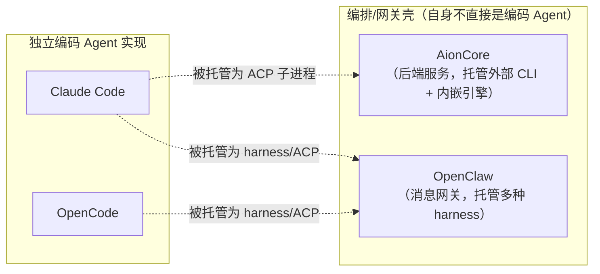
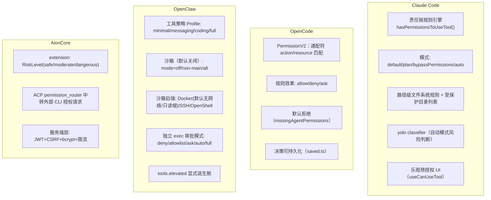

# AionCore / OpenClaw / OpenCode / Claude Code 技术架构对比报告

> 基于 `opensource/AionCore`、`opensource/openclaw-2026.7.1`、`opensource/opencode`、`opensource/claude-code-main`（及 `opensource/claude-code-analysis` 补充资料）源码分析整理。

## 0. 结论先行

四个项目看似同属"AI Agent CLI/平台"赛道，但**定位并不在同一层面**，直接对比需先厘清坐标：

- **OpenCode、Claude Code** 是"选手"——各自独立实现了完整的编码 Agent 循环、工具体系、权限模型，是彼此最直接的对标对象。
- **AionCore、OpenClaw** 是"裁判台/调度台"——它们把 Claude Code、Codex、Gemini CLI、OpenCode 等外部 CLI 当作可插拔的执行后端（ACP/harness）来编排，同时各自也内置了一个轻量 Agent 引擎作为兜底。

对 uAgentCli 的参考意义：如果目标是**自研一个独立编码 Agent**，应重点对标 OpenCode 与 Claude Code 的 Agent Loop / 权限 / 压缩设计；如果目标是**做一个可托管多种外部 Agent CLI 的编排平台**，AionCore 与 OpenClaw 的分层架构、team-as-MCP、sandbox-vs-policy 解耦等经验更有直接借鉴价值。

---

## 1. 项目定位与产品形态

| 项目 | 一句话定位 | 主要交付形态 | 目标场景 |
|---|---|---|---|
| **AionCore** | AionUi 桌面应用的**纯后端服务**，负责编排外部 Agent CLI + 内嵌 Rust Agent 引擎 | 无 UI 的 HTTP/WebSocket 服务（Rust 二进制） | 作为桌面/客户端应用的"大脑"，被 Electron 前端调用 |
| **OpenClaw** | **个人 AI 助理网关**，把用户的 LLM Agent 接入 20+ 消息渠道 | 常驻 Gateway 守护进程 + Web Control UI + 原生 macOS/iOS/Android App + TUI | IM 场景优先的私人助理，编程只是其中一种技能 |
| **OpenCode** | **终端优先、厂商中立**的开源编码 Agent | CLI + TUI + 桌面 App(Beta) + Web Console(托管版) | 直接对标 Claude Code 的开源编码助手 |
| **Claude Code** | Anthropic 官方**终端编码 Agent** | TUI(React+Ink) + IDE 桥接 + Server/Remote 模式 + SDK | 终端里的软件工程助手，兼顾 IDE/移动接力 |

**关键差异点**：AionCore 和 OpenClaw 都不是"从零实现一个能写代码的模型循环"，而是构建了一层**统一编排/协议抽象**，把 Claude Code、Codex、Gemini CLI 等外部 CLI 当作子进程或 ACP 端点接入，二者都额外内置了一个"兜底" Agent 引擎（AionCore 的 `aionrs`；OpenClaw 的内置 `openclaw` harness）。这种"多 harness 托管 + 自带轻量引擎"的模式，与直接实现一个完整 Agent（OpenCode、Claude Code）在工程复杂度分布上完全不同：前者的复杂度集中在**进程管理、协议适配、多租户会话隔离**，后者的复杂度集中在**上下文工程、工具编排、权限细粒度控制**。

---

## 2. 技术栈对比

| 维度 | AionCore | OpenClaw | OpenCode | Claude Code |
|---|---|---|---|---|
| 主语言 | Rust (edition 2024) | TypeScript (ESM strict) + Swift(macOS/iOS) + Kotlin(Android) | TypeScript | TypeScript |
| 运行时 | 原生二进制 | Node.js 22.22.3+/24.15+/25.9+ | **Bun** | **Bun**（非 Node） |
| 仓库组织 | Cargo workspace，21 个 crate | pnpm workspace，23 个内部 package + 146 个内置插件 | Turborepo + SST monorepo，34 个 package | 单体仓库（leaked 源码约 1900 文件/51万+ LOC） |
| Web/RPC 框架 | Axum 0.8 + Tokio | 自研 Gateway 协议（TypeBox → JSON Schema → Swift 模型） | 自研 HTTP API（`packages/server`），SDK 由 `bun run generate` 生成 | 无独立 server 框架，内嵌 `src/server`/`src/remote` |
| 核心范式 | 分层 crate + DI（`AppServices`） | 严格架构纪律（`AGENTS.md` 强制约束） | **Effect-TS**（Context.Service / Layer / Schema / generator）贯穿全部业务逻辑 | React + Ink（终端 UI）+ 常规 async/await |
| Schema/校验 | serde | TypeBox | Effect Schema | Zod v4 |
| 存储 | SQLite（`sqlx`，版本化 migration） | **仅 SQLite**（Kysely），明令禁止 JSON/JSONL 旁路存储 | SQLite（Drizzle ORM，事件溯源投影） | JSONL 追加式会话文件 + `metadata.json` |
| 特色依赖 | `aion-agent`/`aion-providers`/`aion-mcp`（sister repo `iOfficeAI/aionrs`） | `@anthropic-ai/sdk`、`openai`、`@modelcontextprotocol/sdk`、`@agentclientprotocol/sdk` 原生 vendored | LLM 抽象层 `packages/core/src/llm.ts` | `bun:bundle` 的 `feature()` 编译期死代码消除 + GrowthBook 运行时特性开关 |

**观察**：
- OpenCode 用 Effect-TS 做架构骨架、AionCore 用 Rust 强类型分层 crate，都体现出比 Claude Code（相对传统的 async/await + React）更"形式化/工程化"的取向；这种严谨性换来的是更高的心智负担和学习曲线。
- OpenClaw 用 TS 生态但靠 `AGENTS.md` codify 的架构纪律（如"仅 SQLite、禁止 JSON 旁路、动态 import 边界约束、确定性顺序保证 prompt 缓存命中"）弥补语言层面缺乏强约束的短板，是一种"用文档当类型系统"的做法。
- Claude Code 的双层特性门控（编译期 `bun:bundle` DCE + 运行时 GrowthBook）让同一份代码库同时支撑内部/外部构建，是四者中在"发布工程"层面最独特的设计。

---

## 3. Agent Loop / 核心执行架构

```mermaid
graph TB
    subgraph CC["Claude Code：单进程流式循环"]
        CC1["queryLoop() 流式接收 delta"] --> CC2["tool_use 触发"]
        CC2 --> CC3["canUseTool() 权限检查"]
        CC3 --> CC4["tool.call() 执行"]
        CC4 --> CC5["拼回 tool_result"]
        CC5 --> CC1
        CC5 -.stop_reason=end_turn.-> CC6["结束"]
    end

    subgraph OC["OpenCode：事件溯源 + Admit-then-Wake"]
        OC1["session_input 落盘"] --> OC2["SessionExecution.wake(sessionID)"]
        OC2 --> OC3["SessionRunCoordinator<br/>串行化/合并同会话drain"]
        OC3 --> OC4["llm.stream() 单次 provider turn"]
        OC4 --> OC5["历史从 projected store 重新加载"]
        OC5 -.下一轮.-> OC1
    end

    subgraph OW["OpenClaw：常驻 Gateway + 多 Harness"]
        OW1["agent RPC"] --> OW2["runEmbeddedAgent<br/>队列串行化+会话写锁"]
        OW2 --> OW3["内置 harness 或 ACP 外部 CLI<br/>(Claude Code/Codex/Gemini/OpenCode)"]
        OW3 --> OW4["subscribeEmbeddedAgentSession<br/>流式推送 assistant/tool/lifecycle 事件"]
    end

    subgraph AC["AionCore：双后端编排"]
        AC1["turn_orchestrator"] --> AC2{"后端选择"}
        AC2 -->|外部 CLI| AC3["ACP 子进程<br/>(permission_router 中转授权)"]
        AC2 -->|内嵌引擎| AC4["aionrs Rust 引擎"]
        AC3 --> AC5["stream_relay"]
        AC4 --> AC5
    end
```

### Claude Code
`main.tsx` → `screens/REPL.tsx` → `utils/processUserInput/` → `query.ts` 的 `queryLoop()`：预处理上下文（microcompact/snip/autocompact）→ 构建系统提示词+用户上下文 → 从 `services/api/claude.ts` 流式获取响应。流式 delta（text/thinking/tool_use）实时驱动 React 状态渲染；`tool_use` 触发 `services/tools/toolOrchestration.ts` 的 `runTools()`，先 `canUseTool()` 权限检查，再 `tool.call()` 执行，将 `tool_result` 拼回后继续循环，直到 `stop_reason=end_turn`。核心文件：`src/QueryEngine.ts`、`src/query.ts`、`src/Tool.ts`。设计特点：**简单直接**，单进程内存态循环，靠 fork subagent（缓存友好的消息分叉）和惰性加载重依赖（OTel/gRPC）做性能优化。

### OpenCode
`packages/core/src/session/*`（`runner/`、`run-coordinator.ts`、`execution.ts`、`prompt.ts`）实现"V2 Session"：`session_input` 行先持久化落盘被"admit"，再由 `SessionExecution.wake(sessionID)` 唤醒调度模型执行；`SessionRunCoordinator` 对同一 session 的多次唤醒做串行化/合并，不同 session 可并发（目前进程内，未来计划支持集群化）。每次 provider turn 是一次显式的 `llm.stream(request)` 调用（`packages/core/src/llm.ts`），历史从"投影（projected）"存储重新加载，而非驻留在内存循环变量中。设计特点：**崩溃安全**（会话状态先落盘再执行）、为未来分布式部署预留了空间，代价是架构复杂度显著高于 Claude Code 的直接循环。

### OpenClaw
单一常驻 **Gateway** 守护进程拥有全部渠道连接，暴露类型化 WebSocket 协议（TypeBox schema → JSON Schema → 生成 Swift 模型给原生 App 用）。流程：`agent` RPC → `agentCommand` → `runEmbeddedAgent`（按会话/全局队列串行化、模型与鉴权解析、会话写锁）→ `subscribeEmbeddedAgentSession` 流式推送 `assistant`/`tool`/`lifecycle` 事件。运行时代码在 `src/agents/embedded-agent-runner/`，可复用核心在 `packages/agent-core/`。**多运行时 harness 可插拔**：内置 `openclaw` harness、`codex` app-server、以及通过 `src/acp/` 接入的外部 harness（Claude Code / Gemini CLI / OpenCode）。设计特点：自己既是"网关"又是"最后一道 harness"，其余全部外包给已有的成熟 Agent CLI。

### AionCore
分层 workspace：Foundation → Capability → Domain → Composition，依赖方向被严格约束（`ARCHITECTURE.md`），DI 通过 `AppServices` 在 `aionui-app` 中装配。Agent Loop 位于 `crates/aionui-conversation`（轮次生命周期）与 `crates/aionui-ai-agent`（Agent 进程管理），**两条并行后端**：
- **ACP**（Agent Client Protocol）：拉起外部 Agent CLI 子进程，走 JSON-RPC 式协议（`manager/acp/{session,agent,hooks,permission_router}.rs`）。
- **aionrs**：进程内嵌的 Rust Agent 引擎（`manager/aionrs/*`）。

轮次编排、流式转发、错误恢复集中在 `turn_orchestrator.rs`、`stream_relay.rs`、`turn_recovery_policy.rs`；子进程拉起统一走 `aionui_runtime::Builder`，剥离调试环境变量并管理 PATH。设计特点：**双后端抽象在一个接口后面**，既能托管外部 CLI 也能内嵌自有引擎，是四者中架构分层最"教科书式"的一个。

---

## 4. 工具系统与 MCP 支持

| 维度 | AionCore | OpenClaw | OpenCode | Claude Code |
|---|---|---|---|---|
| 工具定义位置 | 分散在各 domain crate；`aionui-extension` 统一权限计算 | `src/agents/agent-tools*.ts`，schema/policy/before-after 适配器 | `packages/core/src/tool/{tool.ts,registry.ts}`，Effect `Context.Service` 风格的 `ToolRegistry` | `src/tools/` 下约 40 个自包含模块 |
| 内置工具举例 | 依赖底层 aionrs/ACP CLI 自带工具集 | bash/文件/搜索类 + 渠道相关工具 | bash/edit/write/read/glob/grep/webfetch/websearch/apply-patch/todowrite/skill | Bash/FileRead/Write/Edit/Glob/Grep/WebFetch/WebSearch/AgentTool/SkillTool/MCPTool/LSPTool/NotebookEdit/Task*/SendMessageTool/TeamCreateTool/EnterPlanMode/Worktree 工具/ToolSearchTool/CronCreateTool 等 |
| MCP client | `crates/aionui-mcp`，含 OAuth、多平台适配、会话注入、同步服务 | `src/mcp/`，stdio/SSE/streamable-HTTP 传输 + OAuth + 工具过滤 + 沙箱化 env | `packages/core/src/config/mcp.ts`，local(spawn) / remote(URL+OAuth) 两种 | `src/services/mcp/` 全量 MCP client |
| MCP server（反向暴露自身能力） | **有**——`crates/aionui-team/src/mcp/` 把团队原语（mailbox、task board）暴露为 MCP 工具 | **有**——`openclaw mcp serve` 把渠道会话暴露为 MCP server（stdio 桥接） | 未见明确的自身 MCP server 实现 | 未见明确的自身 MCP server 实现（以 client 侧为主） |
| 插件生态 | `aionui-extension`：manifest 校验、热重载、Hub 市场路由（`hub_routes.rs`） | 原生 `openclaw.plugin.json` + **兼容层**可直接映射 Codex/Claude/Cursor 插件包 | `packages/plugin/`（`index.ts`/`tool.ts`/`tui.ts`/`shell.ts`），纯 TS 代码文件 | `src/plugins/`、`services/plugins/`，package.json 清单 + 插件作用域 hooks |
| LSP 支持 | 未见 | 未见 | 未见明确 | 有（`LSPTool`，LSP SDK 依赖） |

**观察**：
- AionCore 与 OpenClaw 都做了"**自身也是一个 MCP Server**"的反向暴露，这是二者作为"平台/网关"定位的自然延伸——把内部能力（团队协作、渠道会话）标准化输出给任意 MCP 兼容 Agent 消费。OpenCode 和 Claude Code 作为"终端选手"，重心在消费 MCP 而非提供 MCP。
- OpenClaw 的插件兼容层（直接吃 Codex/Claude/Cursor 插件包）是四者中生态复用意图最强的设计，体现其"网关聚合"定位。
- Claude Code 独有 LSP 集成，工具颗粒度也最细（40个模块 vs OpenCode 的约10个内置工具），反映其作为成熟商业产品在"IDE 级能力"上的投入更深。

---

## 5. 多 Agent / 子 Agent / 团队协作

| 维度 | AionCore | OpenClaw | OpenCode | Claude Code |
|---|---|---|---|---|
| 团队/多 Agent 是否一等公民 | **是**——独立 crate `aionui-team` | **是**——`agents` 概念（完全隔离：独立工作区/鉴权/会话存储）+ `bindings` 绑定渠道账号 | 较弱——仅 `build`/`plan` 内置角色 + `@general` 提及式子代理 | 较强——`AgentTool` + `TeamCreateTool`/`TeamDeleteTool` |
| 子 Agent 生成方式 | `TeammateManager`（`scheduler.rs`）+ `event_loop.rs` | `sessions_spawn`，非阻塞，深度限制 1-5 层 | `.opencode/agent/*.md` 自定义 markdown Agent | `AgentTool.call()`（同步/异步路由），支持 Fork Subagent |
| Agent 间通信 | `mailbox.rs`（异步消息，`Mailbox::write`） | `sessions_yield`/completion 事件（**push/announce，非轮询**），`tools.agentToAgent` 显式门控 | 未见正式协议，靠 `@mention` 语义 | `SendMessageTool` |
| 任务分配/看板 | `task_board.rs` | 无独立看板概念 | 无 | 无独立看板概念 |
| 子 Agent 权限降级 | 有（ACP `permission_router` 统一中转） | **有**——分层降权，子 Agent 永不获得 `message`/`sessions_send` 工具 | Agent 级配置（如 `plan` 只读） | 有（agent-scoped MCP servers + 权限上下文隔离） |
| 崩溃检测 | `crash_detection.rs` | 未见明确专门模块 | 未见 | 未见 |
| 隔离机制 | 进程/会话级 | Agent 级完全隔离（独立工作区/鉴权/DB） | 未见强隔离 | **git worktree 隔离**（每个 Agent 独立工作副本） |

**观察**：
- AionCore 的 `aionui-team` 是四者中"团队原语"最完整的实现——mailbox + task_board + scheduler + crash_detection 组合起来接近一个迷你多智能体操作系统内核，并且如前所述还把这些原语 MCP 化对外提供。
- OpenClaw 的子 Agent 设计安全边界最清晰：push/announce 而非轮询、显式深度限制、子 Agent 硬性剥夺消息发送权限，是"防止子 Agent 失控扩权"考虑最周全的实现。
- Claude Code 的 git worktree 隔离是一个务实的巧思——用文件系统级隔离替代复杂的进程沙箱，天然适配"多个 Agent 同时改代码"的场景。
- OpenCode 在这一维度投入明显最少，仍以单 Agent + 提及式子代理为主，尚未形成正式的团队协作协议。

---

## 6. 会话与上下文管理（含压缩策略）

| 维度 | AionCore | OpenClaw | OpenCode | Claude Code |
|---|---|---|---|---|
| 持久化方式 | SQLite + repository trait，版本化 migration | SQLite（Kysely），文件+进程感知写锁 | SQLite + Drizzle，事件溯源投影（`history.ts`/`projector.ts`） | JSONL 追加式（顺序写队列）+ `metadata.json` |
| 压缩触发 | 依赖底层 Agent CLI 自身能力（自身压缩逻辑较薄） | 接近上下文上限或 provider 溢出错误时自动触发 | 固定阈值：20K token 触发，保留 8K，工具输出截断至 2K 字符 | manual `/compact` + autocompact + microcompact/snip 多档位 |
| 压缩产物 | — | 结构化摘要 + tool-call/result 配对保留 | 结构化 Markdown 摘要（专门 LLM 调用生成） | 摘要 + "compact boundary"标记 |
| 压缩方式 | — | **"successor transcript"整体轮转**（非原地重写）+ 独立轻量 pruning | 原地覆盖压缩窗口 | 分档位（micro/auto/manual）渐进式 |
| 记忆分层 | `skill_resolver.rs`/`skill_snapshot.rs`（skill 注入） | 多后端记忆（内置/Honcho/QMD） | 未见独立记忆系统（依赖压缩摘要） | 全局 → 项目(`CLAUDE.md`) → 嵌套目录 → 会话提取记忆 → 团队记忆同步，五层注入系统提示词 |
| 会话恢复 | `startup_recovery.rs`（崩溃/重启后恢复轮次声明） | 写锁+文件持久化保障恢复 | Session 先落盘再执行，天然支持恢复 | Resumable session + compact boundary 追踪 |

**观察**：
- Claude Code 的**五层记忆体系**（全局/项目/目录/会话提取/团队同步）是四者中最精细的长期记忆分层设计，`CLAUDE.md` 这类项目级记忆文件也已成为行业事实标准（本报告所在仓库即沿用此约定）。
- OpenClaw 的"successor transcript 轮转"（不原地重写历史，而是产生新的后继记录）是一个值得注意的工程选择，避免了压缩过程中的数据损坏/并发写风险。
- OpenCode 的压缩阈值是四者中最"数值明确"的（20K 触发/留 8K/工具输出截 2K），体现其形式化架构一贯的精确性，但也可能不如动态自适应策略灵活。
- AionCore 在这一层相对薄弱，更依赖底层被托管的 Agent CLI（如 Claude Code 自身）去做压缩，自己只负责持久化和恢复——这与其"编排壳"定位一致，但也意味着它无法为内嵌引擎 aionrs 提供独立于外部 CLI 的高级上下文管理能力。

---

## 7. 权限与沙箱模型

| 维度 | AionCore | OpenClaw | OpenCode | Claude Code |
|---|---|---|---|---|
| 权限决策模型 | RiskLevel 三档（safe/moderate/dangerous）由声明的 shell/filesystem/network 权限计算得出 | 双层独立：工具策略 profile + 沙箱（scope=agent/session/shared） | 通配符规则引擎，allow/deny/ask，默认拒绝 | 责任链规则引擎，多模式（default/plan/bypassPermissions/auto） |
| 沙箱隔离 | 无独立沙箱概念（依赖外部 CLI 或服务端安全层） | **显式沙箱**：Docker(默认)/SSH/OpenShell，可配置 scope | 无独立沙箱 | 无独立沙箱（依赖路径规则+受保护目录） |
| 服务端安全 | JWT(HMAC-SHA256,24h) + CSRF 双提交 cookie + bcrypt + 限流 + 安全响应头 | 设备配对/鉴权贯穿多客户端 WS 协议 | — | — |
| 交互式审批 | 有（ACP permission_router） | 多档 exec 审批模式 + auto-review 层 | ask + reply 流程（declined/corrected/blocked 错误类型） | 乐观预授权 UI + yolo classifier |

**观察**：
- **OpenClaw 是四者中唯一把"沙箱（进程/网络隔离）"与"工具策略（能不能调用某工具）"显式解耦为两层独立机制**的项目，且沙箱后端做到了 Docker/SSH/OpenShell 三种可插拔实现，默认 Docker 沙箱无网络出口、只读根文件系统——这是安全纵深最完整的设计，值得 uAgentCli 重点参考。
- Claude Code 和 OpenCode 都停留在"规则引擎 + 路径/资源匹配"层面，没有做到进程级沙箱隔离，本质上依赖信任被规则允许的操作本身是安全的。
- AionCore 独有面向多用户/远程访问场景的服务端认证层（JWT/CSRF/bcrypt/限流），这是因为它是一个网络服务而非本地单用户 CLI——这一点在 OpenCode/Claude Code 的本地终端场景中不需要，但在 OpenClaw 的多设备网关场景中也有等价物（设备配对协议）。

---

## 8. 扩展性：Skills / Hooks / 自定义命令

| 维度 | AionCore | OpenClaw | OpenCode | Claude Code |
|---|---|---|---|---|
| Skill 系统 | `skill_service.rs`/`skill_routes.rs`，支持导入/导出/物化 skill 包 | markdown `SKILL.md`，**6 层优先级链**（workspace→project→personal→managed→bundled→extra dirs） | `packages/core/src/skill/{discovery,guidance}.ts` | markdown+frontmatter，`SkillTool` 执行，支持 `allowed-tools` 沙箱化 |
| Hooks | `crates/aionui-extension/src/lifecycle.rs` | Gateway hooks（`agent:bootstrap` 等）+ 插件生命周期 hooks（`before_model_resolve`/`before_prompt_build`/`before_tool_call`/`after_tool_call`/`before_compaction`） | 未见明确的 hooks 系统 | `settings.json` 配置的生命周期 hooks（`query/stopHooks.ts`） |
| 自定义命令 | 未见独立子系统 | 有（slash commands） | `command.ts`，`.opencode/command/` | `commands/`，约 50-80 个内置 + 自定义 |
| 热重载 | `crates/aionui-extension/src/watcher.rs` | 未见明确 | 未见 | 未见 |
| 市场/发现机制 | Hub 路由（`hub_routes.rs`） | **ClawHub** 市场 + npm/git 安装源 | 未见独立市场 | 未见独立市场（依赖插件仓库分发） |
| 定时任务 | `crates/aionui-cron` | 未见独立 cron 模块（但有 spawn 机制） | 未见 | 有（`CronCreateTool`） |

**观察**：
- OpenClaw 的 Skill 6 层优先级链和插件生命周期 hooks 粒度（细到 `before_compaction`）是四者中扩展点覆盖最全面的。
- AionCore 和 OpenClaw 都做了"市场/Hub"概念，是"平台型"产品的自然延伸；OpenCode 和 Claude Code 更依赖生态自然生长（GitHub 仓库分发）而非内置市场。
- Claude Code 和 AionCore 都有定时任务能力（Cron），OpenClaw 靠 sub-agent spawn 机制间接实现类似效果，OpenCode 目前未见。

---

## 9. UI / 交互面

| 维度 | AionCore | OpenClaw | OpenCode | Claude Code |
|---|---|---|---|---|
| 是否自带 UI | **无**（纯后端，UI 由姊妹项目 AionUi/Electron 承担） | 全平台：Web Control UI + macOS/iOS/Android 原生 App + TUI + WebChat | TUI(TSX 重写) + 桌面 App(Beta) + Web Console(托管) + Storybook 组件库 | TUI(React+Ink) + IDE 桥接(VS Code/JetBrains) + Server/Remote 模式 |
| 消息渠道集成 | `crates/aionui-channel`：微信/钉钉/飞书/Telegram | **核心能力**：WhatsApp/Telegram/Slack/Discord/Signal/iMessage/IRC/Teams/Matrix/飞书/LINE 等 20+ | 无 | 无（有 SDK 供第三方集成） |
| SDK/嵌入能力 | REST+WS API | 多客户端共享 WS 协议 | `@opencode-ai/sdk`（自动生成客户端） | `entrypoints/sdk/`（程序化嵌入） |
| 移动端 | 无（AionUi 有移动端） | 原生 iOS/Android | 无 | 无（远程接力支持） |

**观察**：
- OpenClaw 是四者中"多终端消息优先"做得最彻底的——原生三端 App + 20+ IM 渠道桥接 + A2UI 画布（Agent 可编辑的 UI），这是其产品定位（个人助理网关）决定的必然投入。
- AionCore 完全无 UI，是纯粹的后端服务，UI 职责完全下放给姊妹项目 AionUi，这种"前后端仓库分离"模式便于独立迭代，但也意味着单独看 AionCore 无法评估端到端体验。
- OpenCode 和 Claude Code 都以 TUI 为核心交互面，逐步扩展到桌面/IDE/远程，路径相似，但 OpenCode 的托管 Console + Slack 集成显示其也在向"团队协作平台"方向延伸。

---

## 10. 综合对比矩阵

| 能力维度 | AionCore | OpenClaw | OpenCode | Claude Code |
|---|---|---|---|---|
| 独立编码 Agent 实现 | ❌（编排外部CLI+内嵌引擎） | ⚠️（内置 harness 之一，非主打） | ✅ | ✅ |
| 多 Harness/外部 CLI 托管 | ✅（ACP） | ✅（ACP + app-server） | ❌ | ❌ |
| 团队/多 Agent 协作原语 | ✅✅（mailbox+看板+调度） | ✅✅（隔离 Agent + push/announce 子代理） | ⚠️（提及式子代理） | ✅（Task/Team工具+worktree隔离） |
| MCP client | ✅ | ✅ | ✅ | ✅ |
| MCP server（反向暴露） | ✅ | ✅ | ❌ | ❌ |
| 进程级沙箱 | ❌ | ✅✅（Docker/SSH/OpenShell） | ❌ | ❌ |
| 上下文压缩精细度 | ⚠️（薄） | ✅ | ✅ | ✅✅（多档位+五层记忆） |
| 多消息渠道集成 | ⚠️（4个） | ✅✅（20+） | ❌ | ❌ |
| 原生移动端 App | ❌ | ✅ | ❌ | ❌ |
| 自带市场/Hub | ✅ | ✅✅（ClawHub） | ❌ | ❌ |
| 崩溃恢复设计 | ✅（startup_recovery） | ✅（写锁+持久化） | ✅✅（event-sourced，架构级保障） | ✅（resumable session） |

（✅✅ = 该维度做得尤其突出；⚠️ = 存在但较弱；❌ = 未见对应能力）

---

## 11. 对 uAgentCli 的启示

1. **先明确自身坐标**：是要做"独立编码 Agent"（对标 OpenCode/Claude Code）还是"编排/网关平台"（对标 AionCore/OpenClaw）？二者工程重心完全不同，混合定位容易导致架构摇摆。
2. **若做独立 Agent**：Claude Code 的五层记忆体系、多档位压缩策略、git worktree 子 Agent 隔离，以及 OpenCode 的 event-sourced「先落盘再唤醒」会话执行模型（换取崩溃安全与未来集群化）都值得直接借鉴；后者代价是架构复杂度和调试难度上升，需要评估团队工程能力是否匹配。
3. **若做编排平台**：AionCore 的"团队原语 MCP 化对外暴露"和分层 crate 强约束、OpenClaw 的"沙箱与工具策略显式解耦 + 子 Agent push/announce 权限降级"是两个最值得复用的具体机制。
4. **权限/沙箱是共同短板区**：四者中只有 OpenClaw 做到了进程级沙箱隔离，其余三者都停留在规则引擎/路径匹配层面。如果 uAgentCli 面向不受信任的工具调用或多租户场景，进程级沙箱（Docker/gVisor 等）应作为独立于"工具白名单"之外的必需层。
5. **MCP 双向能力是差异化机会**：当前多数编码 Agent（OpenCode、Claude Code）只做 MCP client，AionCore/OpenClaw 反向把自身能力暴露为 MCP server 的做法尚未成为主流——这是一个可以让 uAgentCli 的团队协作/任务看板等原语被其他 Agent 生态复用的差异化方向。
