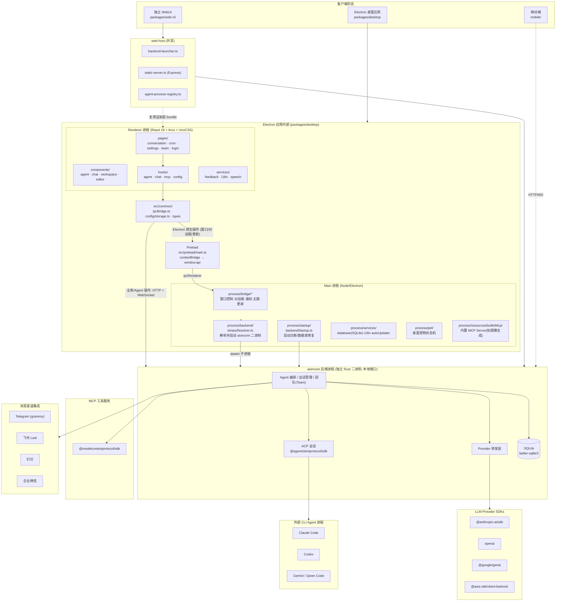
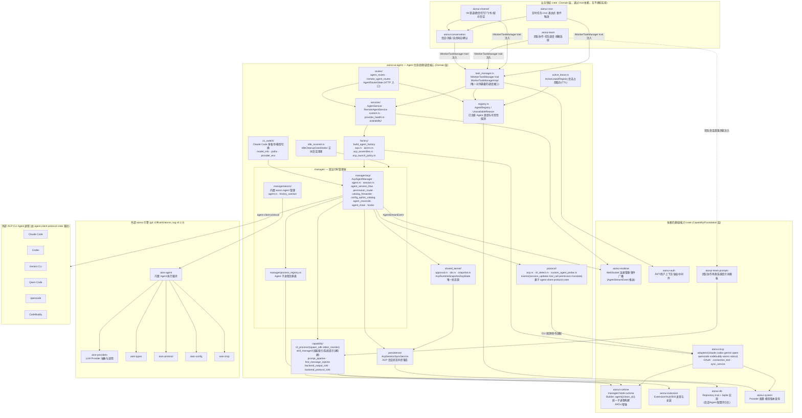

# AionUi 技术架构图

> 基于 `opensource/AionUi` 代码结构分析（Electron 桌面 Agent 协作平台）

## 1. 项目概述

AionUi 是一个跨平台（macOS / Windows / Linux，另有 WebUI / 移动端浏览器）的桌面 "Cowork" 应用，将命令行 AI 编码 Agent（Claude Code、Codex、Gemini/Qwen Code 等）或内置 Agent 引擎统一封装为聊天/Agent UI，支持多 Agent「团队」协作、定时任务（Cron）自动化，并可通过 IM 渠道（Telegram、飞书 Lark、钉钉、企业微信）远程接入。

Monorepo（bun workspaces）：
- `packages/desktop` — Electron 主应用
- `packages/web-cli` — 独立 WebUI 运行时（无 Electron）
- `packages/web-host` — Electron 与 web-cli 共用的 Web 服务宿主
- `packages/shared-scripts` — 构建/开发脚本
- `mobile/` — 配套移动端

## 2. 总体架构图



## 3. AionCore Agent 模块深度解析（基于 `opensource/AionCore` 源码）

上图中的 `AgentOrch` 节点在真实的 aioncore（Rust workspace，20+ crate，四层依赖：Composition → Domain → Capability → Foundation）中并非单一模块，而是以 `aionui-ai-agent` 为核心、向下依赖多个基础/能力 crate、向上被 `aionui-conversation`/`aionui-team`/`aionui-channel`/`aionui-cron` 通过 trait 注入使用的一整套子系统。依赖方向严格单向（下层不可依赖上层，禁止循环依赖），同层之间只能通过 trait 抽象交互。

### 3.1 Agent 模块依赖关系图



### 3.2 模块职责说明

| 模块 | 文件/子目录 | 职责 |
|---|---|---|
| **入口层** | `routes/agent.rs`、`routes/remote.rs`、`routes/state.rs` | 暴露 `agent_routes()`/`remote_agent_routes()`，仅做参数提取与响应封装，不含业务逻辑 |
| **调度接口** | `task_manager.rs` | 定义 `IWorkerTaskManager` trait 与其实现 `WorkerTaskManagerImpl`；这是**唯一**对 `aionui-conversation`/`aionui-team`/`aionui-channel`/`aionui-cron` 暴露的抽象——上层业务域完全不知道 Agent 具体以 ACP 还是 aionrs 方式运行，只通过该 trait 派发/查询任务，符合 ARCHITECTURE.md 中"同层通过 trait 抽象交互"的规则 |
| **业务服务** | `services/agent.rs`（`AgentService`）、`services/remote.rs`（`RemoteAgentService`）、`services/custom.rs`、`services/provider_health.rs`、`services/availability/` | 承载 Agent 创建、Provider 健康检查、自定义 Agent 接入、可用性探测等业务规则 |
| **注册表** | `registry.rs` | `AgentRegistry` 维护所有已注册/受支持的 Agent 类型及 `UnavailableReason`（如 CLI 未安装、鉴权失效） |
| **工厂** | `factory/` | `build_agent_factory` 根据 Agent 类型与配置，决定实例化 **ACP 路径**（`factory/acp.rs`、`acp_assembler.rs`、`acp_launch_policy.rs`，驱动外部 CLI）还是 **aionrs 路径**（`factory/aionrs.rs`，驱动内置引擎） |
| **双运行时管理器** | `manager/acp/*`（`AcpAgentManager`）与 `manager/aionrs/*` | 两条并行的 Agent 运行时实现：<br/>① **ACP 管理器**——管理外部 CLI Agent 子进程会话（`session.rs`）、会话生命周期流程（`agent_session_flow.rs`）、工具调用权限路由（`permission_router.rs`）、配置项目录同步（`catalog_forwarder.rs`/`config_option_catalog.rs`）、会话协调与关闭（`agent_reconcile.rs`/`agent_close.rs`）；<br/>② **aionrs 管理器**——驱动内置 Rust Agent 引擎（外部 `aion-agent` crate），并做历史消息清洗（`history_sanitize.rs`）；<br/>两者共用 `manager/process_registry.rs` 子进程注册表 |
| **协议层** | `protocol/` | 基于 `agent-client-protocol` crate 封装 ACP 协议细节：CLI 探测（`cli_detect.rs`）、自定义 Agent 探测（`custom_agent_probe.rs`）、事件转换（`events/translate.rs`）、会话更新/工具调用/权限事件（`events/session_updates.rs`、`tool_call.rs`、`permission.rs`） |
| **能力层** | `capability/` | Agent 运行所需的横切能力：子进程 stdio 管理（`cli_process/spawn_sdk.rs`、`stderr_monitor.rs`）、技能索引与系统提示词拼装（`skill_manager/`）、首条消息注入与提示词流水线（`first_message_injector.rs`、`prompt_pipeline.rs`）、后端输出/协议 sink（`backend_output_sink.rs`、`backend_protocol_sink.rs`） |
| **持久化** | `persistence/acp_session_sync.rs` | `AcpSessionSyncService` 将 ACP 会话状态（`session_config`）同步落库，支撑断线恢复/resume |
| **共享状态源** | `shared_kernel/` | `AcpRuntimeSnapshot`/`AcpState` 是会话运行期状态（含用户选择的 mode/model/config）的**唯一来源**；`AGENTS.md` 明确要求新增字段前必须先判断能否复用这里而不是给 `AcpAgentManager` 加字段，避免状态碎片化 |
| **租约与回收** | `active_lease.rs`、`idle_scanner.rs` | `ActiveLeaseRegistry` 管理会话占用租约（防止并发冲突），`IdleCleanupCoordinator` 定期清理空闲 Agent 会话 |
| **Claude Code 多账号** | `cc_switch/` | 管理 Claude Code CLI 的多模型/多账号配置切换（`model_info.rs`、`paths.rs`、`provider_env.rs`） |

### 3.3 关键依赖说明

- **`aionui-ai-agent` 依赖的基础 crate**：`aionui-mcp`（CLI Agent 适配器 `adapters/{claude,codex,gemini,qwen,opencode,codebuddy,aionrs,aionui}.rs`，以及 MCP OAuth/连通性测试）、`aionui-runtime`（所有子进程必须经 `Builder::agent()`/`Builder::clean_cli()` 统一构建，禁止直接使用 `tokio::process::Command`，并在启动时做 Node 运行时托管与 PATH 增强）、`aionui-extension`（技能/扩展发现）、`aionui-realtime`（`AgentStreamEvent` 通过 WebSocket 广播给前端）、`aionui-db`（会话/配置持久化）、`aionui-auth`（用户上下文）、`aionui-system`（Provider 配置与模型版本）、`aionui-team-prompts`（团队场景提示词模板）。
- **两条 Agent 执行路径**：
  1. **ACP 路径**：`agent-client-protocol` crate（`agent_client_protocol = "0.11.1"`）驱动外部 CLI Agent 进程（Claude Code / Codex / Gemini CLI / Qwen Code / opencode / CodeBuddy），协议细节由 `protocol/` 封装，工具调用经 `aionui-mcp` 中对应 CLI 的 adapter 转换命令行参数。
  2. **aionrs 路径**：内置引擎来自外部 Git 依赖 `iOfficeAI/aionrs`（`aion-agent`/`aion-providers`/`aion-types`/`aion-protocol`/`aion-config`/`aion-mcp`，锁定 tag `v0.2.3`），由 `manager/aionrs/` 驱动，是 README 中所称 "Aion CLI (aionrs)" 的具体实现，直接调用 LLM Provider（Anthropic/OpenAI/Google GenAI/Bedrock 等）。
- **上层消费方式**：`aionui-conversation`、`aionui-team`、`aionui-channel`、`aionui-cron` 均只依赖 `aionui-ai-agent` 暴露的 `IWorkerTaskManager` trait（而非具体实现），符合"同层交互只能通过 trait 抽象"的架构约束；`aionui-channel`、`aionui-cron` 还进一步依赖 `aionui-conversation` 来复用消息/会话模型，形成 `channel/cron → conversation → ai-agent` 的调用链。
- **零依赖上层**：`aionui-ai-agent` 不依赖 `aionui-app`（组合层）也不依赖 `aionui-conversation`/`aionui-team` 等同级或上级 domain crate，保证依赖方向单向、可独立测试（`features = ["test-support"]` 提供 `AgentInstance::Mock` 供上层集成测试注入桩实现，生产构建禁用）。

## 4. 关键设计要点

- **IPC → HTTP/WS 适配**：`src/common/adapter/ipcBridge.ts` 是关键抽象层。只有 Electron 原生操作（窗口控制、原生对话框、自动更新、深链接）走真正的 IPC（Preload → ipcRenderer → Main）；其余所有业务/Agent 相关调用（会话、Provider、Team、Assistant、MCP、ACP）都被路由为 HTTP REST + WebSocket，指向本地启动的 **aioncore** 后端进程。
- **aioncore 后端**：独立的 Rust 二进制（"Aion CLI / aionrs"），由 `process/backend/binaryResolver.ts` 定位（内置资源 → 系统 PATH），`process/startup/backendStartup.ts` 启动并获取端口。承担 Agent 编排、会话/Provider API、ACP 会话、Team、Assistant、SQLite 存储。
- **多端复用**：`web-host` 包同时被 Electron WebUI 模式与独立 `web-cli` 使用，通过 Express 提供静态渲染层 bundle + REST/WS API，实现「无头/远程」访问。
- **外部 Agent 驱动**：通过 ACP（Agent Client Protocol）驱动外部 CLI 工具（Claude Code、Codex、Gemini/Qwen Code）作为可插拔的 Agent 执行后端。
- **IM 渠道**：Telegram/Lark/DingTalk/WeCom 集成使得用户可在外部聊天软件中直接与 Agent 对话，配置与消息记录同样落地 SQLite。
- **持久化**：`process/services/database/` 管理 SQLite schema、迁移、损坏恢复（`recoverCorruptedDatabase.ts`）。

## 5. 数据流示例（一次对话请求）

```
用户在 Renderer 输入消息
  → pages/conversation → hooks/agent → common/adapter/ipcBridge.ts
  → HTTP POST /conversation (或 WS 建立流式连接)
  → aioncore: AgentOrch 接收请求
  → 根据配置路由至 ACP(外部 CLI Agent) 或内置引擎，调用 LLM Provider SDK
  → 如需工具调用，经 MCP SDK 调用 MCP Server（内置或外部）
  → 流式事件（token/tool-call/run-event）通过 WebSocket 推回 Renderer
  → 消息与状态持久化至 SQLite
```
