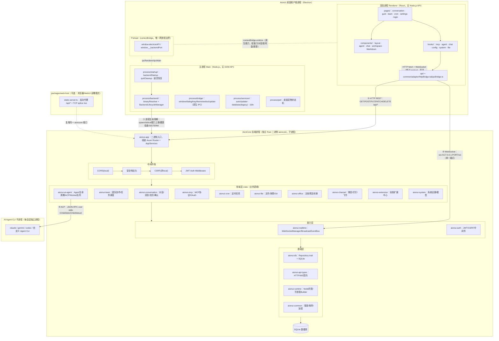
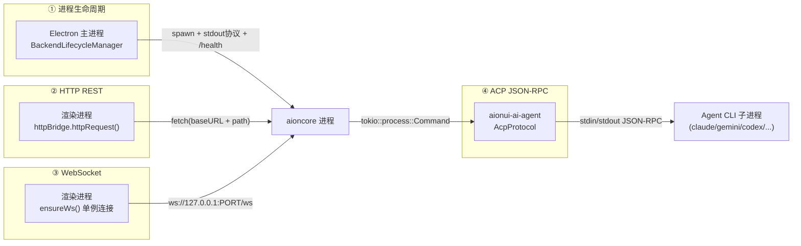
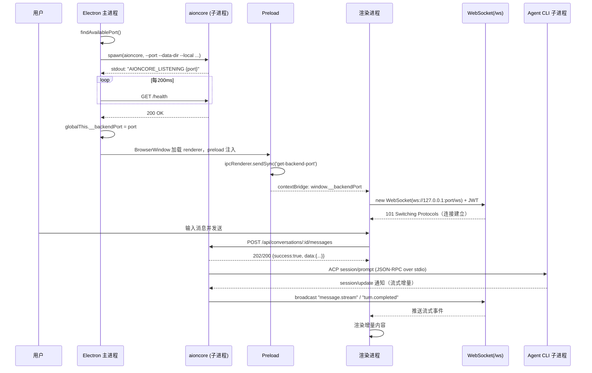
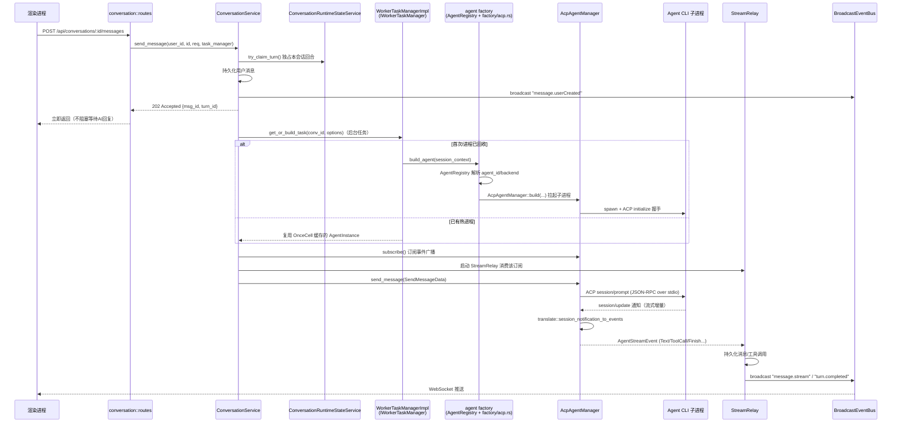

# AionUi 深度技术架构分析报告

> 分析对象：`opensource/AionUi`（Electron + React + TypeScript 桌面客户端）与 `opensource/AionCore`（Rust + Axum 后端服务）
> 分析重点：AionUi 各模块职责，以及 **AionUi 与 AionCore 之间的通信架构**
> 技术栈：AionUi = Electron 40 + React + TypeScript（Bun/monorepo）；AionCore = Rust 2024 + Axum 0.8 + Tokio + SQLite（Cargo workspace，20 个 crate）

---

## 0. 一句话结论

AionUi 是一个 **"胖客户端外壳 + 独立后端进程"** 的双进程桌面应用：

- **AionUi**（本仓库 `packages/desktop`）只负责 UI 渲染、Electron 原生能力（窗口/托盘/更新/桌面宠物/剪贴板/文件对话框）和**后端进程的生命周期管理**，几乎不持有业务状态。
- **AionCore** 是唯一的业务后端 —— 一个作为**子进程**随 AionUi 启动的独立 Rust 二进制（`aioncore`），通过本地回环端口对外提供 **HTTP REST + WebSocket** 服务，承载对话、Agent 编排、团队协作、MCP、文件系统、定时任务等全部业务逻辑与 SQLite 持久化。
- 两者之间存在 **三条物理通信链路**：
  1. **进程生命周期通道**（Electron 主进程 ⇄ aioncore 子进程）—— `child_process.spawn` + stdout 端口上报协议 + `/health` 轮询 + SIGTERM/SIGKILL 优雅关闭 + 崩溃自动重启；
  2. **HTTP REST**（渲染进程 → aioncore）—— 所有业务操作（增删改查、发送消息、Agent 管理……）；
  3. **单一 WebSocket `/ws`**（aioncore → 渲染进程，服务端主动推送）—— 流式消息、状态变更、文件监听等实时事件。
- 此外还存在**第四条链路**：AionCore 内部通过 **ACP（Agent Client Protocol，JSON-RPC over stdio）** 与真正执行任务的 AI Agent CLI（Claude Code / Gemini CLI / Codex 等）子进程通信，这是"大脑再调用大脑"的一层。
- 渲染进程**从不直接感知** aioncore 是否存在——`ipcBridge` 适配层（`httpBridge.ts`）把所有调用统一路由为 HTTP/WS 请求，对上层组件呈现与原生 Electron IPC 相同的 API 形状。
- AionUi 还可以脱离 Electron，以 **WebUI（`packages/web-host` / `packages/web-cli`）** 形态运行：静态资源 + 反向代理服务器复用同一个 aioncore 二进制，实现"同一份前端代码，桌面/浏览器双模式"。

---

## 1. 整体架构总览

---

## 2. AionUi 各模块职责

### 2.1 进程边界（Electron 三进程模型）

AionUi 严格区分三类代码，`AGENTS.md` 明确禁止跨越：

| 进程 | 路径 | 限制 | 核心职责 |
|------|------|------|----------|
| **主进程 Main** | `packages/desktop/src/process/` | 不能用 DOM API | 启动/管理 aioncore 子进程、窗口/托盘/菜单、原生对话框、自动更新、桌面宠物、深链接 |
| **渲染进程 Renderer** | `packages/desktop/src/renderer/` | 不能用 Node.js API | 页面 UI、通过 HTTP/WS 直连 aioncore 完成业务操作 |
| **预加载 Preload** | `packages/desktop/src/preload/` | 唯一跨进程边界 | `contextBridge` 暴露 `window.electronAPI`、同步注入 `__backendPort` |

### 2.2 主进程模块（`process/`）

- **`startup/`** —— 启动编排：`backendStartup.ts`（成功/失败/取消分支）、`architectureCompatibility.ts`（架构兼容性预检）、`backendStartupFailure.ts`（错误分类）、`recoverCorruptedDatabase.ts`、`quitCleanup.ts`。
- **`backend/`** —— `binaryResolver.ts` 按 `{platform}-{arch}` 在打包资源目录 `resources/bundled-aioncore/` 或系统 `PATH` 中定位 `aioncore` 可执行文件；`index.ts` 仅重导出。真正的生命周期状态机在 `@aionui/web-host` 包的 `BackendLifecycleManager` 中（详见 §3.1）。
- **`bridge/`** —— 保留为原生 IPC 的功能：窗口控制、原生文件对话框、系统托盘、主题缓存、自动更新、WebUI 启停生命周期、反馈日志收集。这些是 Electron 独有能力，**不会**路由给 aioncore。
- **`services/`** —— `autoUpdaterService`、遗留 SQLite 迁移（v26 一次性迁移用，之后交给 aioncore）、主进程 i18n。
- **`pet/`** —— 桌面宠物状态机（`petManager` / `petStateMachine` / `petIdleTicker`），独立 `BrowserWindow`。
- **`feedback/`** —— 日志收集压缩，供用户反馈上传。

### 2.3 渲染进程模块（`renderer/`）

- **`pages/`** —— 路由级功能：`conversation`（核心聊天/工具调用视图）、`guid`（新建任务引导/助手选择）、`team`（多 Agent 协作工作区）、`cron`（定时任务管理）、`settings`（Agent/外观/系统/工具/WebUI/扩展/技能子页）、`login`（WebUI 远程登录）。
- **`components/`** —— 跨页面复用 UI：`layout`（应用外壳）、`chat`（消息渲染/斜杠命令菜单）、`agent`、`workspace`、`Markdown`。
- **`hooks/`** —— 按领域拆分的 React Hook：`mcp`、`agent`、`chat`、`config`、`system`、`file`、`assistant`。
- **`api/` + `common/adapter/`** —— 与 aioncore 通信的核心适配层，详见第 3 节。
- **`pet/`** —— 桌面宠物独立渲染入口（`pet.html` / `pet-confirm.html` / `pet-hit.html`）。

### 2.4 跨进程共享（`common/`）

- **`chat/`** —— 对话领域纯逻辑：工具调用归一化、斜杠命令注册、审批流、图片生成、"打断提问"处理——主进程和渲染进程都可能引用。
- **`adapter/`** —— **通信核心**：`httpBridge.ts`（HTTP/WS 请求封装）、`ipcBridge.ts`（业务 API 全量声明，2000+ 行，每个领域一个 `export const xxx = {...}`）、`main.ts`（保留给原生 IPC 的部分）。
- **`platform/bridge.ts`** —— 原生 Electron IPC 的 `buildProvider`/`buildEmitter` 工厂，供仍需走 IPC 的原生能力使用。
- **`theme/`**、**`update/`**、**`config/`**、**`types/`** —— 跨进程共享的纯数据模型。

### 2.5 部署形态：桌面 vs WebUI

- **`packages/web-host`** —— 可复用的"启动 aioncore + 启动静态服务器"逻辑（`BackendLifecycleManager` 定义处），既被 Electron 主进程（桌面模式）调用，也被 `web-cli` 调用（纯 Node 部署模式），避免重复实现子进程生命周期管理。
- **`packages/web-cli`** —— 独立 CLI 入口（`bin/`），不依赖 Electron，直接以 Node 进程启动 aioncore + 静态服务器，用于服务器/容器化部署。
- **`packages/desktop`** 的 `--webui` 启动参数复用同一套 `startWebHost()`，让"桌面内置 WebUI 开关"与"独立 web-cli 部署"共享同一实现。

### 2.6 AionCore 后端分层（20 个 crate，四层架构）

| 层级 | Crate | 职责 |
|------|-------|------|
| **组装层** | `aionui-app` | 二进制入口，组装 `AppServices` → 各领域 `RouterState` → 完整 Axum Router + 中间件栈 |
| **领域层** | `aionui-conversation` `aionui-channel` `aionui-team` `aionui-cron` `aionui-file` `aionui-office` `aionui-system` `aionui-mcp` `aionui-ai-agent` `aionui-extension` `aionui-shell` `aionui-assistant` | 各自独立业务领域，路由前缀 `/api/{resource}`，彼此仅通过 trait 弱耦合（如 conversation 通过 `IWorkerTaskManager` trait 使用 ai-agent 能力） |
| **能力层** | `aionui-auth`（JWT/CSRF/中间件）、`aionui-realtime`（WebSocket 连接管理/事件广播） | 跨领域通用能力 |
| **基础层** | `aionui-common`（错误/枚举/加密）、`aionui-api-types`（HTTP/WS 契约唯一定义处）、`aionui-db`（Repository trait + SQLite）、`aionui-assets`（内嵌静态资源）、`aionui-runtime`（托管 Node 运行时/子进程 Builder） | 被几乎所有 crate 依赖 |

依赖方向严格向下：组装层 → 领域层 → 能力层 → 基础层，禁止反向依赖和循环依赖。每个领域 crate 内部统一遵循 `lib.rs`（导出）/ `routes.rs`（HTTP handler）/ `service.rs`（业务逻辑，不导入 axum）/ `state.rs`（依赖注入载体）四文件模式。

---

## 3. 与 AionCore 的通信架构（核心）

AionUi 与 AionCore 之间**不是**传统意义的"前端调后端 API"，而是"客户端应用管理并驱动一个本地后端服务进程"，因此通信分为界限清晰的四层：

### 3.1 第一层：进程生命周期通信（主进程 ⇄ aioncore 子进程）

由 `packages/web-host/src/backend-launcher.ts` 中的 **`BackendLifecycleManager`** 统一实现（桌面模式与 web-cli 模式共用同一份代码）：

**启动握手协议**：
1. 主进程通过 `findAvailablePort()` 探测一个可用且非浏览器禁用（`FETCH_FORBIDDEN_PORTS`，如 6667/6000 等）的本地端口。
2. `spawn(binaryPath, args)` 启动 `aioncore` 二进制，关键参数：`--port` `--data-dir` `--parent-pid`（父进程 PID，供 aioncore 侦测主进程存活）`--log-level` `--app-version` `--local`（本地模式，跳过 JWT/CSRF）。
3. **端口上报协议**：aioncore 通过 stdout 打印固定前缀行 `AIONCORE_LISTENING {"port": 12345}`（定义于 `aionui-app/src/commands/cmd_server.rs`），主进程监听 stdout 逐行解析，30 秒内未收到则判定 `listen_timeout` 失败。
4. **健康检查**：端口确认后，每 200ms 轮询 `GET http://127.0.0.1:{port}/health`，最长等待 30 秒；超时后可选"允许 pending 状态"（后台继续等待并触发 `onHealthTimeout` 回调，不阻塞窗口显示）。
5. 就绪后端口写入 `globalThis.__backendPort`（主进程）与 `window.__backendPort`（渲染进程，经 preload 同步 IPC 注入），成为后续所有 HTTP/WS 请求的 base URL 来源。

**关闭协议**：`SIGTERM` → 等待 5 秒（或进程 `exit` 事件）→ 超时则 `SIGKILL`；Windows 用 `taskkill /PID /T`（可选 `/F`）整树终止。应用退出时的 `stopBackend()` 会级联杀死 aioncore 派生的所有 Agent CLI 子进程（无需前端单独管理任务队列）。

**崩溃自愈**：非正常退出触发指数退避重启（`2^restartCount * 1000ms`），60 秒窗口内最多重启 3 次，超过后进入 `error` 终态并停止重试。

### 3.2 第二层：HTTP REST（渲染进程 → aioncore，业务操作主通道）

**入口**：`common/adapter/httpBridge.ts::httpRequest()`，`common/adapter/ipcBridge.ts` 中按领域声明了数百个端点（`shell` `assistants` `conversation` `mode`(providers) `acpConversation` `mcpService` `remoteAgent` `database` `fs` `fileSnapshot` `previewHistory` 等），每个都用 `httpGet/httpPost/httpPut/httpPatch/httpDelete` 工厂生成，**函数签名与原 Electron IPC 保持一致**，做到业务代码零改动迁移。

**Base URL 解析（区分三种运行环境）**：
- Electron 渲染进程：`http://127.0.0.1:${window.__backendPort}`（preload 同步注入）；
- Electron 主进程直调（如一次性迁移钩子）：读 `globalThis.__backendPort`；
- WebUI 浏览器模式：**同源相对路径**（空字符串 base），由 `web-host` 静态服务器反向代理到 aioncore；
- 三者都取不到时 fallback 到 `13400`，让请求以 `ECONNREFUSED` 明确失败，而不是静默指向错误端口。

**响应约定**：后端统一包裹 `{ success, data, message }`（成功）或 `{ success: false, error, code, details }`（失败）；`httpRequest` 自动拆包 `data` 字段返回给调用方，非 2xx 抛出携带 `status`/`code`/`backendMessage`/`details` 的 `BackendHttpError`，业务代码可按 `code`（如 `CONVERSATION_ARCHIVED`）分支处理。所有请求体/响应体在 `console.debug` 前先脱敏（`redactForLog`，正则匹配 `api_key|authorization|token|secret` 等字段替换为 `[REDACTED]`）。

**后端侧对应**：`aionui-app` 用 Axum `with_state()` 三段式依赖注入（`AppServices` → `build_module_states()` → 各领域 `RouterState`）组装路由；中间件栈由外到内为 `CORS(仅local) → 安全响应头 → CSRF(非local，双提交Cookie) → Auth中间件(按路由组选择性挂载)`；`local` 模式（桌面内嵌场景）跳过 JWT/CSRF，注入固定 `system_default_user`。

### 3.3 第三层：WebSocket（aioncore → 渲染进程，实时事件推送主通道）

**单一端点**：`ws://127.0.0.1:{port}/ws`（浏览器模式为 `wss?://{host}/ws`），**不按业务领域拆分连接**，所有事件复用同一条连接，靠消息体的 `name` 字段路由。

**客户端实现**（`httpBridge.ts` 内的 WS 单例，`ensureWs()`）：
- 消息格式：发送 `{ event, payload }`，接收兼容 `{ name, data }` / `{ event, payload }` 两种字段名（同时读取 `msg.name ?? msg.event`），按事件名分发给 `wsListeners` 中注册的回调集合；
- 断线重连：指数退避（1s → 最大 30s），并在重连成功时广播内部事件 `realtime.reconnected`，供业务层触发"重新拉取快照"；
- `wsEmitter<T>(eventName)` / `wsMappedEmitter<T>(eventName, transform)` 是 `ipcBridge.ts` 中声明式订阅的工厂，语义与原生 IPC 的 `bridge.buildEmitter` 完全一致，业务代码通过 `.on(callback)` 订阅、`.emit()` 恒为空操作（服务端主动推送，客户端不回推同名事件）。

**服务端实现**（`aionui-realtime` crate）：
- `ws_upgrade_handler`：从请求头（含 `Sec-WebSocket-Protocol` 回显，兼容浏览器无法自定义 header 的场景）提取 JWT token，校验失败发送 `realtime.error`（code `REALTIME_AUTH_MISSING`/`REALTIME_AUTH_EXPIRED`）并以 1008（Policy Violation）关闭；
- 校验通过后 `WebSocketManager.add_client()` 注册连接，拆分 `send_loop`（消费每连接 mpsc channel）与 `recv_loop`（解析入站 JSON，按 `name` 字段路由：`pong` 更新心跳时间戳，`subscribe-show-open` 内建处理原生文件选择对话框的 WS 桥接，其余交给可插拔的 `MessageRouter`）；
- `BroadcastEventBus`（`aionui-realtime::broadcaster`）供各领域 Service 层调用 `event_bus.broadcast()` 主动推送，事件命名规范为 `{domain}.{actionName}`（两级 camelCase，如 `conversation.listChanged` `cron.jobExecuted`），历史遗留的 kebab-case/三级命名保留兼容但不再新增。

**典型事件**（`ipcBridge.ts` 中声明）：`message.stream`（流式回复）、`message.userCreated`、`turn.completed`（含 runtime 状态归一化映射，兼容 snake_case/camelCase 双写）、`conversation.listChanged`、`confirmation.add/update/remove`（Agent 请求用户确认的工具调用）、`fileWatch.fileChanged`、`fileStream.contentUpdate`（Agent 写文件时实时推送内容）、`runtime.statusChanged`（托管运行时/工具下载进度）。

### 3.4 第四层：WebUI/浏览器远程模式的通信改造

`packages/web-host/src/static-server.ts` 实现了一个**纯 Node 原生 HTTP + 手写 TCP 分流**的反向代理（刻意不用 Express，理由见代码注释：bun 1.3 的 http-compat 层不能正确转发 `upgrade` 事件里的 socket 写入，因此外层监听器做成纯 TCP，绕开该问题）：
- 外层 `net.Server` peek 每个新连接的首行请求：匹配 `GET /ws` 或 `GET /api/stt/stream` → 直接 `net.connect` 拼接到 aioncore 端口（原始字节直通，含已读取的 peek 缓冲区重放）；
- 其余请求（含 `/api/*`、`/login`、`/logout`）→ 内部 loopback HTTP 服务器：`/api/*` 走 `http.request` 反向代理到 aioncore，其它路径走 `serve-handler` 提供 SPA 静态资源（`rewrites: [{source: '**', destination: '/index.html'}]`）；
- 这样浏览器端渲染进程**完全不需要知道 aioncore 端口**，`getBaseUrl()`/`getWsUrl()` 在检测到"无 `window.__backendPort`"时自动切换为同源相对路径。

### 3.5 第五层（延伸）：AionCore ⇄ AI Agent CLI 子进程

这是 AionUi 请求链路的终点，也是"Agent 真正干活"的地方，值得作为完整通信闭环的一部分说明：

- `aionui-ai-agent` crate 通过 `aionui-runtime::Builder::agent(program)` 启动具体的 Agent CLI（Claude Code / Gemini CLI / Codex / 自定义 ACP Agent），全部子进程统一设置 `kill_on_drop(true)` 并清除 `NODE_OPTIONS`/`CLAUDECODE` 等调试环境变量避免污染；
- 通信协议是 **ACP（Agent Client Protocol）**：`protocol/acp.rs` 基于 `agent-client-protocol` SDK，在子进程的 `ChildStdin`/`ChildStdout` 上建立 **JSON-RPC** 连接，SDK 在专用 tokio 任务上跑后台收发 actor，`session/prompt`、`session/cancel`、`session/setMode` 等方法可并发调用（`session/cancel` 能抢占正在进行的 `session/prompt`，因为二者只是共享连接上各自独立的 `send_request`）；
- Agent 侧的工具调用、流式增量、权限请求等经统一翻译层归一化为 `AgentStreamEvent`，再经 `aionui-conversation`/`aionui-ai-agent` 广播到 `aionui-realtime`，最终以 WS 事件（第 3.3 层）推送回渲染进程——即"Agent 的一步操作"要穿越 **CLI stdio → ACP JSON-RPC → 内部事件总线 → WebSocket → 渲染进程"四级中转**。
- 特别约束：ACP 工具输出清洗——图片类工具可能同时返回 `saved_path` 与内联 base64，翻译层会剥离大体积的 base64 只保留路径与 `result_omitted` 标记，防止把大二进制塞进 WebSocket/SQLite。

---

## 4. 关键时序：从启动到一次对话

---

## 5. 安全与鉴权（影响通信设计的关键约束）

| 机制 | 说明 |
|------|------|
| **local 模式** | 桌面内嵌场景默认开启：跳过 JWT 校验、跳过 CSRF、CORS 全开放、注入固定 `system_default_user`——因为客户端与后端在同一台机器、同一用户会话内，威胁模型不同于公网服务 |
| **JWT** | 非 local 模式（WebUI 远程访问）启用：HMAC-SHA256，24 小时有效期，`Authorization: Bearer` 或 `aionui-session` Cookie 双通道提取，支持黑名单（SHA-256 哈希 + DashMap） |
| **CSRF** | Double Submit Cookie：`aionui-csrf-token`（非 HttpOnly）与请求头 `x-csrf-token` 必须一致；`/login`、`/api/auth/qr-login` 豁免 |
| **WebSocket 鉴权** | 独立于 HTTP 中间件栈，`/ws` 路由不走标准 Auth Middleware，而是 `ws_upgrade_handler` 内联校验 token（支持从 `Sec-WebSocket-Protocol` 提取，兼容浏览器 WebSocket API 不能自定义 header 的限制） |
| **限流** | 登录 5 次失败/15 分钟；公开端点 60 次/分钟；敏感操作 20 次/分钟（按用户 ID，降级按 IP） |

---

## 7. AionCore 深度解读：从进程启动到一次对话的完整链路

本节基于对 `aionui-app`、`aionui-conversation`、`aionui-ai-agent`、`aionui-team`、`aionui-cron`、`aionui-mcp`、`aionui-extension`、`aionui-channel`、`aionui-db`、`aionui-auth`、`aionui-realtime` 及其余领域 crate 源码的逐一走查，补充第 2.6 节"分层总览"背后的**具体实现机制**。

### 7.1 服务组装与启动生命周期（`aionui-app`）

**CLI 参数**（`cli.rs`，clap derive，二进制名 `aioncore`）：

| 参数 | 说明 |
|------|------|
| `--host` / `--port` | 默认 `127.0.0.1:25808`；`--port 0` 表示由 OS 分配动态端口（AionUi 桌面模式即用此方式） |
| `--data-dir` | SQLite 与运行时数据根目录 |
| `--parent-pid <u32>` | **AionUi 主进程传入自身 PID**，用于第 7.1 节末尾的"父进程存活监控"优雅退出机制 |
| `--work-dir` / `--log-dir` / `--log-level` | 工作目录 / 日志目录 / 日志级别（回退顺序：CLI 参数 → `AIONUI_WORK_DIR` 环境变量 → `data-dir`） |
| `--app-version` | 默认取 `CARGO_PKG_VERSION`，用于扩展引擎兼容性判断 |
| `--local` | 跳过 JWT/CSRF，注入固定 `system_default_user`（对应第 5 节"local 模式"） |
| `--managed-resources-mode` | `bundled`（打包内置）\| `download`（首次运行时下载），默认 `download` |
| `--recover-corrupted-database` | 授权在检测到数据库损坏时执行备份+重建 |
| 子命令 | `capabilities` `config` `diagnose` `mcp-bridge` `mcp-team-stdio` `doctor` `prepare-managed-resources` —— 除 `doctor`/`prepare-managed-resources` 外均**不**初始化数据库/AppServices，是轻量级工具入口 |

**启动时序**（`main.rs` → `cmd_server.rs`）：

1. 解析 CLI → 按需 `aionui_runtime::init(data_dir)` → `unsafe { enhance_process_path() }`（**必须在任何线程创建前执行**，因 Rust 2024 要求 `env::set_var` 单线程语境）→ 构建多线程 tokio 运行时；
2. `bootstrap::init_environment`：初始化日志、解析 `work_dir`、构建 `AppConfig`；
3. `commands::bind_http_listener`：**先绑定 TCP 监听端口**，若端口 `0` 落在浏览器禁用端口上则重试（最多 50 次）；绑定成功后立即向 stdout 打印 `AIONCORE_LISTENING {"host":...,"port":...}` 并 flush —— 这是 AionUi 主进程能拿到端口号的**最早时机**；
4. `bootstrap::init_data_layer`：物化内置技能、迁移旧版数据库、执行 `aionui_db::init_database_staged_with_options`（尊重 `--recover-corrupted-database`）；
5. `AppServices::from_config(...)`（见下）；
6. `commands::run_server`：`user_repo.has_users()` 预检 → 组装完整 Router → `axum::serve(listener, router).with_graceful_shutdown(...)`。

> **关键细节**：`AIONCORE_LISTENING` 在第 3 步打印，而 `/health` 只有在第 6 步 `axum::serve` 真正开始接受连接后才可达——即"端口已上报"和"服务已就绪"之间存在一个时间窗口，这正是 AionUi 侧 `BackendLifecycleManager` 要同时实现"stdout 端口上报"与"`/health` 轮询"两段式握手的原因（见第 3.1 节）。

**`AppServices::from_config` 构建顺序**（`services.rs`，严格串行依赖）：
用户仓库 → JWT 密钥解析（env → DB → 随机生成并回写）→ 派生加密密钥 → Provider 仓库 + `BroadcastEventBus::new(256)` + MCP 仓库 → `AgentRegistry::new(...).hydrate()`（探测 `$PATH`/托管运行时中可用的 Agent CLI）→ `AcpSessionSyncService` → 对话/技能仓库与目录解析 → 解析自身可执行文件路径（供 ACP Agent 反向拉起 `mcp-bridge`/`mcp-team-stdio` 子命令使用）→ `build_agent_factory(...)` → `ActiveLeaseRegistry` + `WorkerTaskManagerImpl` → `ConversationRuntimeStateService` → `build_conversation_service(...)`。

**`build_module_states()`**（`router/state.rs`）按依赖顺序逐个构建各领域 `RouterState`：扩展/Hub/技能 → 助手（并引导助手存储）→ Cron（接入助手规则分发器）→ 渠道（返回 `ChannelOrchestratorComponents`，由调用方另起任务驱动）→ Agent 服务（Provider + 加密密钥 + Registry + 事件总线）→ 其余领域各自的 `build_*_state`；最后触发 `conversation.service.recover_stale_runtime_state_on_startup()` 清理异常退出遗留的运行时状态。

**路由与中间件装配**（`create_router_with_all_state`）：除 `/health`、`auth_routes`（`/login` 等）、`office_proxy_routes`（预览 iframe 内容）、`public_assets`、`/ws`（在 handler 内自行完成鉴权，见 3.3 节）外，其余全部领域路由组统一挂载 `auth_middleware`；随后按 `local` 标志决定是否跳过 `csrf_middleware`；最外层依次叠加 `security_headers_middleware` → `DefaultBodyLimit::max(10MB)` → 错误响应归一化中间件 → 访问日志；`local` 模式额外叠加全开放 `CorsLayer`。

**优雅退出**：`shutdown_signal` 用 `tokio::select!` 竞速三个信号源——`Ctrl+C`、Unix `SIGTERM`、以及**父进程存活监控**：Unix 下每 250ms 轮询 `libc::getppid()`，一旦当前父进程不再是启动时记录的 `--parent-pid`（即 AionUi 主进程已退出、自己被 init 收养），立即触发关闭；Windows 下用 `WaitForSingleObject` 阻塞等待父进程句柄。触发后依次执行：标记运行时"正在关闭" → `worker_task_manager.clear()`（5 秒超时，逐一终止所有 Agent CLI 子进程）→ 停止空闲扫描器 → 关闭数据库连接。**这解释了为什么 AionUi 主进程崩溃/被强杀时，aioncore 及其派生的所有 Agent CLI 子进程也能自愈退出**，无需主进程显式清理。

`process_report.rs` 定义了统一的**结构化 stderr 诊断行格式**（`CODE key=value ...: message`），供 `BootstrapError`/`CliBoundaryError` 等边界错误类型使用；`ExitKind` 把失败类别映射为进程退出码（`Internal`→1、`Config`→2、`Unavailable`→3）。这正是 AionUi 侧 `parseBackendBoundaryError()`（第 3.1 节提及的 `BOOTSTRAP_*`/`CLI_*` 正则匹配）能够精确解析启动失败原因的对端实现。

### 7.2 核心业务管道：一次对话的完整生命周期（`aionui-conversation` + `aionui-ai-agent`）

这是 AionCore 中最核心的业务链路，串联了 HTTP 层、任务管理、Agent 工厂、ACP 协议与 WebSocket 推送。

**关键实现细节**：

- **`ConversationService`**（`aionui-conversation/src/service.rs`）持有 `task_manager: Arc<dyn IWorkerTaskManager>` 作为通往 `aionui-ai-agent` 的唯一入口，以及 `runtime_state`（回合独占锁）、`broadcaster`、各类可选仓库（MCP/助手/Agent 元数据）。
- **`IWorkerTaskManager` 不是队列，而是"每会话一个任务槽"的单飞（single-flight）注册表**：`WorkerTaskManagerImpl` 内部是 `DashMap<conversation_id, Arc<OnceCell<ManagedAgentTask>>>`，`get_or_build_task` 用 `OnceCell::get_or_try_init` 保证并发请求（如 `/messages` 与 `/runtime/ensure` 同时打进来）只触发一次真实的子进程拉起，其余调用方共享同一个 `AgentInstance`。真正的"同一会话同一时刻只处理一条消息"约束由更上层的 `ConversationRuntimeStateService::try_claim_turn()` 保证，而非任务管理器本身。
- **Agent 类型决策链**：会话行的 `agent_id`/`backend` 字段 → `AgentRegistry`（进程内 `RwLock<HashMap>` 缓存的 `agent_metadata` 表，启动时 `hydrate()` 探测可用性）查出具体是 Claude Code / Gemini CLI / Codex / 自定义 CLI 中的哪一行 → `factory/acp.rs::build` 解析出真正的可执行命令与参数（区分"托管 ACP 工具"如 Claude/Gemini 与"通用 CLI 行"）→ `factory/acp_launch_policy.rs` 应用厂商专属启动策略（如 Codex 的 `shell_environment_policy` 配置、Claude 的 `cc_switch` 供应商环境注入）→ `factory/acp_assembler.rs` 组装不可变的 `AcpSessionParams`（含 MCP Server 注入，见 7.4 节）→ `AcpAgentManager::build` 真正 spawn 子进程并完成 ACP `initialize` 握手。
- **`AcpAgentManager`**（`manager/acp/agent.rs`，即 `AGENTS.md` 中要求"慎加字段"的那个大结构体，源码已完成重构：`AcpRuntimeSnapshot`/`AcpState` 已合并为单一 **`AcpSession`**，作为会话生命周期/模式/模型/配置的唯一事实来源）持有：不可变构建参数 `params`、`session: RwLock<AcpSession>`、`runtime: AgentRuntime`（状态/最近活跃时间/事件广播 channel）、`protocol: AcpProtocol`（SDK 连接句柄）、`permission_router`、`process: Arc<CliAgentProcess>`，并用 `session_lock: Mutex<()>` 串行化 new/load/send 等操作避免竞态。

**权限确认（Permission）全链路**（工具调用需要用户批准时）：

1. Agent CLI 通过 ACP 发出 `session/request_permission` JSON-RPC 请求；
2. `protocol/acp.rs` 的 SDK 回调捕获后包装成 `PermissionRequest{request, response_tx: oneshot}`，投递给 **`PermissionRouter`**（`manager/acp/permission_router.rs`）后台循环；
3. 除对团队内置 MCP 工具调用自动放行（`AUTO_APPROVE_MCP_SERVERS`）外，其余请求转换为 `Confirmation` + `AgentStreamEvent::AcpPermission`，以 `call_id` 为键存入 `pending_permissions`，并通过事件广播通道发出；
4. `StreamRelay` 将其包装为 `message.stream`（`type: "acp_permission"`）WebSocket 事件推给前端渲染确认弹窗；
5. 用户点击确认 → `POST /api/conversations/:id/confirmations/:callId/confirm` → `service.confirm()` 从 `task_manager` 取回 `AgentInstance` → `AcpAgentManager::confirm()` → `permission_router.confirm(call_id, option_id, ...)`；
6. `PermissionRouter` 取出待处理项，把 `PermissionDecision::Selected{option_id}` 送入之前暂存的 `oneshot::Sender`，唤醒仍阻塞在 `protocol/acp.rs` 中的响应逻辑，经 stdio 回复给 CLI，Agent 得以继续执行；同时后端广播 `confirmation.remove` 通知前端关闭弹窗。

**流式翻译层**：ACP 的 `session/update` 通知经 SDK 回调进入 `protocol::events::translate::session_notification_to_events`（`protocol/events/translate.rs`），把 `AgentMessageChunk`/`AgentThoughtChunk`/`ToolCall`/`Plan`/`CurrentModeUpdate` 等 SDK 变体统一映射为 serde 标签枚举 `AgentStreamEvent`（`Start`/`Text`/`Thinking`/`ToolCall`/`Plan`/`AcpPermission`/`Finish`/`Error`/`SessionAssigned` 等），推入 `AgentRuntime` 持有的广播 channel；`aionui-conversation` 的 `StreamRelay` 逐个消费、落库并转发为 WebSocket 事件，终止事件时额外发出 `turn.completed`。

**辅助机制**：`active_lease.rs`（`ActiveLeaseRegistry`，`DashMap<conversation_id, expires_at>`，90 秒 TTL）记录"前端正在盯着看哪个会话"，供空闲回收扫描器（`idle_scanner.rs`）判断——即使 Agent 已空闲一段时间，只要前端标签页仍打开（持续调用 `POST /active-lease` 续约），也不会被强制回收子进程，兼顾资源节省与用户体验。

### 7.3 团队协作与定时任务（`aionui-team` / `aionui-cron`）

**`aionui-team`**——多 Agent 协作的核心是**邮箱（Mailbox）而非直接互调**：`mailbox.rs` 把队友间通信建模为持久化的 `MailboxMessageRow`（`to_agent_id`/`from_agent_id`/`msg_type`/`content`/附件），每个 Agent 槽位在自己的回合开始前"收信"（`peek_unread` 拼入 prompt，成功后 `mark_read_batch`），团队广播、点对点私信、空闲通知都走这条统一通道，再经 `team.teammateMessage` WS 事件同步给前端。**每个团队成员槽位（slot）拥有独立的 `conversation_id`**，`aionui-team` 直接依赖 `aionui-ai-agent`（而非 `aionui-conversation`）为每个槽位挂载各自的 `AcpAgentManager`——本质上是"N 个相互隔离的 Agent 会话 + 一层邮箱协调层"，而非共享单一执行上下文。核心路由覆盖创建/增删改队友、群发/私聊消息、回合级取消/暂停（`runs/:id/cancel`、`agents/:slot/pause`）。

**`aionui-cron`**——用 `cron` crate（+ `chrono_tz`）解析表达式，`normalize_cron_expr` 把 5 段表达式自动补全为 6 段（含秒），后台是真正的 `tokio::spawn` 定时循环（`spawn_at_timer`/`spawn_every_timer`/`spawn_cron_timer`）。任务触发时（`executor.rs::execute`）**优先复用已绑定的活跃会话**（`find_active_cron_conversation`），只有找不到才新建；若目标会话当前正有回合在跑（`is_conversation_claimed`，复用 7.2 节的独占锁机制）则延后重试，避免与用户手动对话冲突；最终仍是调用 `aionui-ai-agent` 的 `send_message` 把提示词注入目标会话。事件命名上 `cron.job-created/updated/removed/executed` 沿用了历史 kebab-case（架构文档中标注的"遗留不一致"案例之一），与 `team.*` 系列的 `domain.camelCaseAction` 规范并存。

### 7.4 集成生态：MCP / Extension & Hub / Channel

**MCP（`aionui-mcp`）**：全局唯一的 `McpServer` 表（非按会话隔离），支持 `Stdio{command,args,env}` / `Http{url,headers}` / `Sse{url,headers}` 三种传输，`service.rs` 还会把 `"npx pkg@latest --flag"` 这类 shell 风格字符串自动拆分为 command+args。**接入会话的时机在 Agent 会话构建期**：`adapter.rs::build_session_mcp_servers()` 按目标 ACP 后端在 `initialize` 握手中声明的 `AcpMcpCapabilities` 过滤出受支持的 `enabled` Server，转换为 `AcpSessionMcpServer` 注入新会话（呼应 7.2 节 `factory/acp_assembler.rs` 的组装步骤），此外还会为图片生成能力合成一个内置 MCP Server。需要鉴权的 MCP Server 走标准 **OAuth 2.0 + PKCE**：RFC 8414 发现端点 → 本地 `127.0.0.1` 回调监听 → 拉起系统浏览器 → 换取 token 并持久化，access token 在过期前 5 分钟自动用 refresh token 刷新。

**Extension & Hub（`aionui-extension`）**：这里的"Skill"与 Claude Code 的 Skills 概念一致——带 `SKILL.md`（frontmatter 声明 name/description）的目录，来源优先级为 内置 → 自动注入内置 → 用户自定义（DB 追踪）→ Cron 专用；`materialize_skills_for_agent` 把解析出的技能路径**软链接**（而非拷贝）进 Agent CLI 的原生技能目录。"Extension"是更大粒度的功能包（可贡献主题/助手/ACP 适配器/MCP Server/技能/渠道插件/设置页等），"**Hub**"则是其上的市场/索引层（`HubIndexManager` 读取本地 `index.json` 并与 `ExtensionRegistry` 的实际安装状态合并，`HubInstaller` 负责安装/更新/卸载）——当前内置扩展从本地 bundle 安装，远程下载安装为预留能力。

**Channel（`aionui-channel`）**：支持 Telegram / 飞书(Lark) / 钉钉 / 微信（feature-gated）等平台，各自实现统一的 `ChannelPlugin` trait。**配对会话（Pairing）**：未授权用户获得一个 10 分钟有效期的 6 位随机验证码，管理员通过 `/api/channel/pairings/approve` 审批后写入授权用户表，全程以 `channel.pairing-requested`/`channel.user-authorized` 事件同步。**入站消息路由**：平台插件轮询/回调收到消息 → 统一封装为 `UnifiedIncomingMessage` → `ChannelOrchestrator` 消费 → `ActionExecutor` 校验授权/解析或创建会话 → `ChannelMessageService::send_to_agent`（按需创建会话、打标签、预热 Agent 任务）→ 返回 `AgentStreamEvent` 的广播订阅 → `ChannelStreamRelay` 把流式事件重新组装为平台消息（微信因不支持编辑消息，采用"缓冲后一次性发送"策略，其余平台走"边生成边编辑同一条消息"）→ 经 `ChannelSender` trait 回发到原平台。可以看到，Channel 场景下**渲染进程完全被绕开**，是 aioncore 内部"从外部消息触达 Agent 再把回复送回外部平台"的完整闭环，与桌面/WebUI 场景共享同一套 `aionui-conversation`/`aionui-ai-agent` 基础设施。

### 7.5 数据与安全基座（`aionui-db` / `aionui-auth` / `aionui-realtime` 内部实现）

**`aionui-db`**：`models/`（20 个领域行模型）+ `repository/`（trait 与 `Sqlite*` 实现成对出现）+ 24 个迁移文件（`001_initial_schema.sql` … `024_drop_unused_assistant_definition_fields.sql`，近期文件集中在 ACP Agent 能力配置、助手数据统一、Cron 去重，说明 Agent/助手子系统是当前最活跃的演进区域）。`Database` 用 `SqlitePool`，连接参数含 `busy_timeout(5000ms)`、`journal_mode(WAL)`、`max_connections(5)`（内存测试库退化为 `max_connections(1)` 且不启用 WAL）；启动时用跨进程文件锁（`fs2`）串行化迁移执行，并内置"疑似损坏 → 备份 → 重建"自愈路径（对应 `--recover-corrupted-database` 参数）；`ensure_system_user` 每次启动都会补种 `system_default_user` 行。以 `IConversationRepository` 为例，方法面覆盖会话 CRUD、游标分页列表、助手快照、消息读写/搜索、Artifact 管理——是全仓库中方法最多的一个 trait。

**`aionui-auth`**：JWT 基于 `jsonwebtoken` crate（HMAC-SHA256），`TokenPayload{user_id, username, iat, exp, iss:"aionui", aud:"aionui-webui"}`，校验前先查 SHA-256 哈希黑名单（`DashMap`）。密钥来源确认为"环境变量 → 数据库存量 → `getrandom` 生成 64 字节随机值并回写"三级回退。密码哈希为 `bcrypt::hash(cost=12)`，并叠加两层计时攻击防护：`verify_password_timed` 把校验耗时补齐到至少 50ms，`dummy_password_hash()` 在用户不存在时仍执行一次等量耗时的哈希比较，防止通过响应时间枚举用户名。`auth_middleware`：`local` 模式直接注入固定 `CurrentUser`；否则从 `Authorization: Bearer` 或 `aionui-session` Cookie 提取 token → `jwt_service.verify()` → 再查一次 `user_repo.find_by_id` 确认账号仍存在 → 注入 `CurrentUser` 到请求扩展，任一环节失败即返回 401。

**`aionui-realtime` 内部**：`WebSocketManager` 用 `DashMap<ConnectionId, ClientInfo>` 存储连接（`ClientInfo` = token + 最近心跳时间 + 发送端 channel）。**token 校验不止发生在连接建立时**——`start_heartbeat` 派生的后台循环每 30 秒（`HEARTBEAT_INTERVAL`）对每个连接重新调用一次 `token_validator`，若失败立即以 `REALTIME_AUTH_EXPIRED` 主动断开；若超过 60 秒（`HEARTBEAT_TIMEOUT`）未收到客户端 pong，同样主动断开并清理——即服务端会**主动踢掉过期/失联连接**，而非被动等待客户端重连。`BroadcastEventBus::broadcast()` 的实现是**无差别广播**（内部就是一个 `tokio::sync::broadcast::Sender`，所有连接共享同一订阅），本身不做按用户/按会话的过滤——这意味着"谁能看到这条事件"的裁剪职责被有意地留给了上层业务代码（构造事件内容时不包含无关用户不该看到的数据），而非通信基础设施层。

### 7.6 其余领域 crate 速览

- **`aionui-file`**：文件浏览/读写/复制/重命名/压缩/监听等基础操作（内置路径穿越防护 `path_safety.rs`），并提供一套完整的**基于 `git2` 的文件快照 API**（`init`/`compare`/`stage`/`discard`/`reset`/`branches`）——对没有 `.git` 的工作区会临时初始化一个 git 仓库/worktree 来复用 diff/回滚能力，这是"Agent 改代码前后可比对、可回滚"体验的底层实现。
- **`aionui-office`**：Excel/PPT/Word 预览转换主要**外包给独立 CLI 工具 `officecli`**（按需从 GitHub 或镜像站下载安装，经 `aionui_runtime::Builder::clean_cli` 调用），仅 Excel→JSON 直接用 Rust `calamine` 库实现；同时提供代理路由把浏览器对预览服务器的请求转发到 `officecli` 本地起的端口。
- **`aionui-system`**：设置、LLM Provider 管理（含协议自动探测、匿名试连、Bedrock 专用探测子模块）、版本检查、系统信息与诊断报告导出。
- **`aionui-shell`**：**名不副实**——并非通用命令执行，而是一组硬编码的、白名单化的系统集成动作（打开文件/在文件管理器中定位/仅允许 `http/https/mailto` 协议的外部链接跳转/用指定工具打开文件夹），底层通过 `ISystemOpener` 只调用固定的几个已知程序（`open -R`/`explorer`/`xdg-open`/`code`）；同一个 crate 还顺带承载了语音转文字（STT，含流式与 Deepgram/OpenAI 双 Provider 实现）。
- **`aionui-assistant`**：内置助手清单/规则/头像通过 `include_dir` 直接嵌入二进制（支持 `AIONUI_BUILTIN_ASSISTANTS_PATH` 磁盘覆盖用于 E2E 测试），运行时按"内置 + 用户自定义 + 扩展贡献"三源合并，叠加用户偏好/状态覆盖层后对外提供最终的助手视图。
- **`aionui-runtime`**：除已知的托管 Node 运行时与子进程 `Builder` 外，还包含独立的 `acp_tool_runtime/`（托管 ACP 工具下载）、`managed_resources.rs`（bundled/download 双模式切换）与 `shell_env.rs`（PATH 增强）。**所有托管资源下载都做 SHA-256 校验和校验**（`verify_archive_checksum`），失败会被归类为专门的 `checksum_mismatch` 失败类型，向上层（最终到 AionUi 的 `IRuntimeStatusEvent.failure_kind`）传递明确的失败原因而非泛化报错。

---

## 8. 小结：为什么这样设计

1. **后端与前端技术栈解耦**：Rust 后端可以独立于 Electron 版本演进（甚至复用给纯 Web 部署），前端只需知道"一个 HTTP+WS 服务在某个本地端口"。
2. **`httpBridge`/`ipcBridge` 的适配器模式**是这套架构的关键工程决策——用与原生 Electron IPC 完全一致的函数签名封装 HTTP/WS 调用，使得业务组件代码不用区分"这个能力是原生 IPC 还是走后端"，大幅降低了"从纯 Electron IPC 架构迁移到独立后端进程架构"的改造成本。
3. **进程生命周期管理独立于业务通信**（`BackendLifecycleManager` vs `httpBridge`），使得桌面 Electron 模式与 WebUI/CLI 模式可以共享同一套后端启动/健康检查/崩溃恢复逻辑，只是"谁来 spawn、谁来反向代理"不同。
4. **单一 WebSocket 端点 + 事件名路由**而非分渠道多连接，简化了鉴权（一次握手）与重连（一份状态机），代价是需要良好的事件命名规范（`domain.camelCaseAction`）来避免语义冲突。
5. **ACP 作为 AionCore 与具体 Agent CLI 之间的协议边界**，使得后端可以对接多种 Agent 实现（Claude Code / Gemini CLI / Codex / 自定义）而不需要为每种 CLI 写定制适配逻辑——JSON-RPC over stdio 是相对通用的进程间协议选择。
