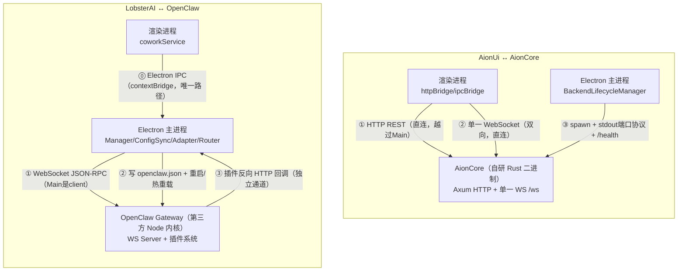
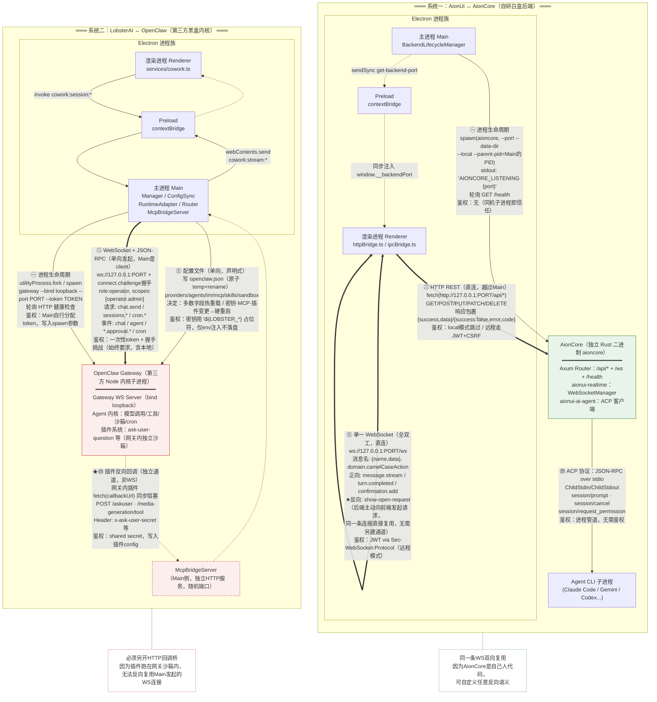
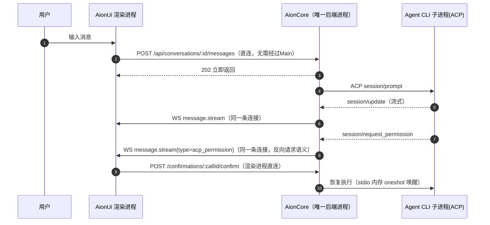
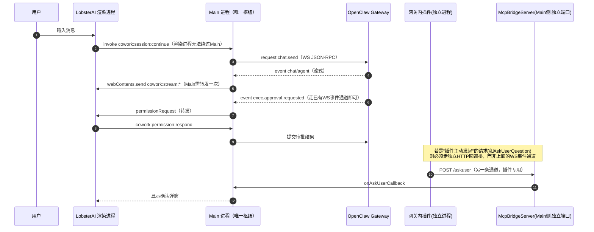

# AionUi↔AionCore 与 LobsterAI↔OpenClaw 通信策略深度对比报告

> 对比对象：`opensource/AionUi`（Electron + Rust/Axum 独立后端 `AionCore`）与 `opensource/LobsterAI`（Electron + 第三方 Agent 内核 `OpenClaw`）
> 对比重点：两者"外壳应用 ↔ Agent 执行后端"之间的**跨进程通信策略**——协议选型、端口发现、鉴权、配置生效、反向回调、崩溃自愈、版本治理
> 基础材料：本目录下 `AionUi-技术架构分析报告.md`、`LobsterAI-技术分析报告.md`（均已完成独立深度解读，本报告只做横向对比与补充分析，不重复已有细节）

---

## 0. 一句话结论

两者都是"**胖客户端外壳 + 独立子进程 Agent 后端**"的双进程（或多进程）架构，但底层哲学根本不同：

- **AionUi/AionCore**：后端是**自研、同源、白盒**的 Rust 服务，渲染进程被允许**直接**用 HTTP/WebSocket 跟它对话，前后端共享同一套 API 契约（`aionui-api-types`）。通信被压缩成**两条链路**——进程生命周期（spawn/健康检查）+ 业务通信（HTTP+单一 WS），因为"同一个团队维护两端代码"，可以随意在后端加端点、在前端加订阅，不需要额外的间接层。
- **LobsterAI/OpenClaw**：后端 OpenClaw 是**版本钉死、打补丁使用的第三方黑盒内核**，LobsterAI 团队不拥有其大部分实现。为了在不侵入内核源码的前提下驱动它、配置它、且让内核里的插件能"反向"触达桌面 UI，被迫拆分出**三条职责正交的通道**——WebSocket JSON-RPC（会话/调度）、配置文件+重启热重载（声明式配置面）、HTTP 回调桥（插件反向同步调用）；渲染进程则被 Main 进程彻底隔离，**从不知道 OpenClaw 的存在**。
- 一句话概括两者的分野：**AionCore 是"可以随便改的自己人"，所以通信可以做得直接、双向、单通道；OpenClaw 是"只能配置、不能改的外人"，所以通信必须做得声明式、间接、多通道、带凭证隔离。**

---

## 1. 两套架构总览与技术流程

### 1.1 总览示意（简版）

**结构性差异一眼可见**：AionUi 的渲染进程有**两条独立的直连通道**（HTTP+WS）绕过主进程直达后端；LobsterAI 的渲染进程**只有一条**通往 Main 的 IPC 通道，OpenClaw 对它完全不可见——多出来的"配置文件"和"反向 HTTP 回调"两条通道，都是 Main 进程与 OpenClaw 之间的私有协议，渲染层感知不到。

### 1.2 详细技术流程架构图（组件 / 协议 / 端口 / 鉴权全标注）

下图把每条通道的**协议、绑定地址、鉴权方式、典型方法/事件名**都标注出来，是理解两套体系"为什么长这样"的关键参考图。

**读图要点**：

- 图中 **`==>` 粗箭头**代表业务主通道（AionCore 侧是 HTTP+WS 双主通道；OpenClaw 侧唯一主通道是 WS JSON-RPC）；**细箭头**代表生命周期/配置类辅助通道；**虚线箭头**代表本报告 §3.1 重点分析的"反向回调"路径——两套系统对同一类需求给出了完全不同的解法（AionCore 复用双向 WS；OpenClaw 新开 HTTP 桥）。
- AionCore 一侧只有**一个后端进程**承载全部协议；OpenClaw 一侧因为插件运行在网关内部的独立沙箱语境，逻辑上要拆成"Gateway 核心"与"网关内插件"两个通信主体来看待，即使它们物理上是同一个 Node 进程。
- 鉴权强度标注也印证了 §3.3 的结论：AionCore 的进程生命周期通道（㊀）完全免鉴权，OpenClaw 即便是同机 spawn 的子进程，WS 连接（㊁）仍强制 token+challenge 握手。

---

## 2. 逐维度对比表

| 维度 | AionUi ↔ AionCore | LobsterAI ↔ OpenClaw |
|------|---------------------|------------------------|
| **后端性质** | 自研 Rust 服务（20 crate workspace，同一 monorepo 演进） | 第三方开源内核，`package.json` 钉死精确版本（如 `v2026.6.1`），vendor 进仓库 |
| **后端语言/运行时** | Rust + Tokio + Axum，独立编译二进制 `aioncore` | Node.js（`ELECTRON_RUN_AS_NODE=1` 或 `utilityProcess.fork`），与 Electron 主进程同语言族 |
| **主通信协议** | **HTTP REST**（业务操作）+ **单一 WebSocket**（服务端推送，双向） | **单一 WebSocket + JSON-RPC**（请求/响应 + 事件推送，一条连接打天下），无 REST |
| **渲染进程可达性** | 渲染进程**直接** `fetch`/`WebSocket` 连后端，Main 只负责生命周期 | 渲染进程**完全隔离**，全程走 Electron IPC 到 Main，Main 才是 Gateway 的唯一客户端 |
| **端口发现** | 后端自行 bind 端口后向 **stdout 打印** `AIONCORE_LISTENING {port}`，主进程解析文本协议 + 轮询 `/health` | Main 端 JS 代码**自行扫描空闲端口**（默认 18789，冲突 +80）后通过启动参数 `--port` **指派**给子进程，无需反向发现 |
| **鉴权机制** | `--local` 模式下**完全跳过**鉴权（信任同机同用户）；远程 WebUI 模式走 JWT+CSRF | **始终要求** token + `connect.challenge` 握手（`role:operator, scopes:[operator.admin]`），即使是桌面内嵌场景也不豁免 |
| **配置变更生效方式** | **运行时 HTTP 请求**直接改 DB/内存状态，多数即时生效，无需重启 | **重新生成整份 `openclaw.json`**（原子写），按变更类型判定"热重载"或"硬重启网关" |
| **密钥/敏感信息传递** | 请求体里直接传（HTTP 走本机回环，`local` 模式无鉴权即视为可信边界） | 配置文件里只写 `${LOBSTER_*}` **占位符**，真实值仅作为子进程**环境变量**注入，绝不落盘 |
| **反向回调（后端→前端的主动请求）** | 复用**同一条 WebSocket**：后端可对渲染进程发起 `show-open-request` 这类"反向请求"，前端处理后用同一连接回应（见 §3.1） | 需要**独立的 HTTP 回调服务器**（`McpBridgeServer`，随机端口 + shared secret），因为插件运行在 Gateway 子进程内，与 Main 之间的 WS 是"Main 是 client、Gateway 是 server"的单向请求关系，插件代码无法反向复用 |
| **崩溃自愈** | 指数退避重启（60s 窗口内最多 3 次），主进程侧 `BackendLifecycleManager` 统一实现，退出时级联杀死所有 Agent CLI 子进程 | 指数退避 `[3,5,10,20,30]s`，上限 5 次；额外有 `gateway-bundle.mjs` 单文件加速冷启动、安装资源自愈（`win-resources.tar`）等针对"第三方内核冷启动慢/易损坏"的专项工程 |
| **父子进程存活联动** | `--parent-pid` 传入 AionUi PID，AionCore 内部轮询 `getppid()`，父进程退出即自行优雅关闭 | 未见到同等的"父进程存活轮询"机制文档化；主要靠 Main 显式 `stopGateway()` 在退出钩子中关闭 |
| **业务状态归属** | **全部**业务状态（会话、消息、团队、定时任务）在 AionCore 的 SQLite；AionUi 前端无本地业务持久化 | **分裂两处**：LobsterAI 自己的 `lobsterai.sqlite`（会话/消息/IM 绑定/MCP 配置等产品语义）+ OpenClaw 自己的 `state/`（`cron/jobs.json`、workspace 文件等执行语义） |
| **Agent 执行细节可见性** | **白盒**：AionCore 自己实现 ACP 协议、自己 spawn Agent CLI 子进程、自己做流式事件翻译，全链路可读可改 | **黑盒**：OpenClaw 内部如何调用模型/执行工具完全不透明，LobsterAI 只能通过配置文件和插件 SDK 施加影响 |
| **版本演进方式** | 前后端同一 monorepo 同步发版，接口变更直接改代码 | 独立的"拉取对齐→版本作用域补丁→构建产物固化→运行期版本核对"四阶段流水线，补丁打不上就是强制信号要求人工介入 |
| **部署形态扩展** | 同一套 aioncore + HTTP/WS 协议可直接扩展成 WebUI（`web-host` 反向代理），前端代码零改动 | 未见到把 Gateway 直接暴露为独立 Web 服务的对等设计（Gateway 主要仍是桌面内嵌角色） |

---

## 3. 关键设计差异深度剖析

### 3.1 反向通信：同一条 WS 复用 vs 另起 HTTP 回调桥（最具代表性的差异）

两边都遇到过"**后端需要主动向前端发起请求并等待结果**"的场景，但解法截然相反，根源在于**通信拓扑的方向性**：

- **AionCore**：`aionui-realtime` 的单一 `/ws` 连接**天然双向**——`handler.rs` 里的 `subscribe-show-open` 就是一个例子：当需要弹出原生文件/目录选择框时，AionCore 直接在**已建立的同一条 WebSocket** 上向渲染进程发 `show-open-request` 事件（带 `id`），渲染进程的 `useDirectorySelection` hook 处理后，用**同一条连接**回发 `subscribe.callback-show-open<id>` 携带结果。整个"反向 RPC"不需要新开任何通道——因为 WS 本身就是全双工的，谁先建立连接不重要，之后双方都能主动发消息。
- **OpenClaw**：Main↔Gateway 的 WebSocket 连接语义是**单向请求-响应**（`GatewayClient` 由 Main 创建，`client.request(method, params)` 只能是 Main 发起、Gateway 应答；`onEvent` 只能是 Gateway 推、Main 收）。而 `ask-user-question`/`lobster-media-generation` 这些插件运行在 **Gateway 子进程内部**，完全不持有这条 WS 连接的"发起端"身份，无法反向调用 Main。于是只能**另起一个独立的 HTTP 服务器**（`McpBridgeServer`，绑定随机回环端口）挂在 Main 侧，插件用 `fetch(callbackUrl)` 同步阻塞等待结果，靠 `x-*-secret` 请求头做认证。

**根因**：AionCore 的 WS 是"一个连接、两端都能读写"的对等通道；OpenClaw 的插件运行在**第三方框架的插件沙箱**里，与 Main 之间隔着"Gateway 进程边界 + 插件 SDK 边界"两层，无法复用 Main 主动建立的连接身份，只能新开一条**方向相反**的通道来补足。这本质上是"自研后端可以为反向场景专门设计协议语义"与"第三方内核插件 SDK 只暴露了单向能力，只能在外部另建通道"的差异。

### 3.2 配置面：HTTP 直接改状态 vs 生成配置文件+决定重启

- AionCore 把"改配置"也建模成普通的 HTTP 端点（如 `PATCH /api/settings`、`PUT /api/providers/:id`），后端直接改 DB/内存并立即生效，因为**后端代码就是本方写的**，可以任意设计"哪些字段可以热更新、哪些字段必须重建资源"的粒度，粒度可以细到单个字段。
- OpenClaw 因为是黑盒，LobsterAI 无法在其内部注入"某个字段变了就热更新某个模块"的精细逻辑，只能退化到**声明式配置文件**这种最粗粒度的接口——`OpenClawConfigSync.sync()` 每次都是**重新渲染整份 `openclaw.json`**，然后靠"变更了哪些顶层 key"这种黑盒外部观察（`bindingsChanged`/`restartImpact`）来猜测需不需要重启网关。这是一种**必须绕过内部实现、只能通过外部契约（配置 schema + 重启行为）驱动黑盒系统**的通用模式，代价是"密钥变更/MCP 变更/插件变更"这类判定必须偏保守（宁可多重启也不敢默认热重载）。

### 3.3 鉴权哲学：信任同机 vs 始终握手

有意思的反差：AionCore 在桌面 `--local` 模式下**完全跳过鉴权**（"同一台机器、同一个 AionUi 拉起的子进程，天然可信"），而 OpenClaw 网关**即使被 Main 进程本地 spawn**，仍然要求完整的 `token + connect.challenge` 握手。可能的原因：

1. OpenClaw 是一个**通用 Agent 网关框架**，设计上要同时支持"被桌面 App 内嵌"和"作为独立远程 Agent 服务被多个 client 连接"等场景，鉴权是框架级别的**默认安全基线**，不因"当前是本地内嵌"而特殊豁免；
2. AionCore 是**为 AionUi 量身定制**的后端，`--local` 是专门为"桌面内嵌"场景开的口子，只有非 local（如 WebUI 远程访问）才启用完整鉴权——即 AionCore 按"部署形态"分层设计鉴权强度，OpenClaw 按"框架统一契约"从不区分。

这体现了"自建后端可以为特定宿主场景做信任降级优化"与"复用第三方通用内核必须接受其统一安全模型"的取舍差异。

### 3.4 业务语义的归属边界

- AionCore：会话、消息、团队协作、定时任务、MCP 配置、IM 渠道绑定等**全部业务语义与持久化**都在后端一侧，AionUi 前端是纯粹的"渲染 + 后端状态镜像"，没有自己的业务数据库。
- LobsterAI/OpenClaw：业务语义被**人为拆成两半**——LobsterAI 自己的 `lobsterai.sqlite` 存"产品认知的会话/消息/IM 绑定"，OpenClaw 自己的 `state/`（`cron/jobs.json`、`workspace-*/`）存"执行认知的调度任务/工作区文件"。这不是设计失误，而是黑盒内核**本身就有自己的一套状态管理**，LobsterAI 只能在外围维护一份"产品视角的影子记录"（如 `im_session_mappings` 把自己的会话 id 映射到 OpenClaw 的 `openclaw_session_key`），无法把两者合并成单一数据源——这也是接入第三方黑盒内核相比自研后端的**结构性代价**：状态天然是分裂的，需要额外的映射/同步逻辑维持一致性（`openclaw:runtime:*` 版本对齐、`sessions.subscribe` 生命周期同步等都是为此服务）。

### 3.5 版本治理：同源演进 vs 第三方供应链治理

- AionCore 与 AionUi 同属一个组织的 monorepo（虽是独立仓库但接口协同演进），API 契约变更是"改代码 + 改文档"级别的常规迭代。
- OpenClaw 被当作**外部供应链依赖**严格治理：`package.json.openclaw.version` 是唯一版本真源，构建期要"克隆精确 tag → 应用版本作用域 patch → 构建产物固化 → 运行期核对实际版本"，补丁打不上直接视为"上游变了，必须人工升级"的强信号。这一整套流水线在 AionCore 侧完全不需要——因为没有"别人的代码要不要升级"这个问题。

---

## 4. 时序结构对比：同一件事，两种拓扑

以"用户发消息 → 流式回复 → 期间触发一次工具权限确认"为例，两边的**参与者角色**和**通道方向**并排对比：

**结构性观察**：

1. AionUi 侧的每一步都是"渲染进程 ↔ 后端"的**两跳**（渲染进程直连），LobsterAI 侧是"渲染进程 ↔ Main ↔ Gateway"的**三跳**，Main 是永远绕不开的中转枢纽。
2. 值得注意：**"由 Gateway 内核自身发出的 `exec.approval.requested` 事件"** 可以直接复用 Main↔Gateway 既有的 WS 事件通道向上传递（因为这属于 OpenClaw 框架**原生支持**的双向事件语义）；但**"由 LobsterAI 自己开发、跑在网关插件沙箱里的 `AskUserQuestion`"** 却无法复用这条通道，必须新建 HTTP 回调桥——这进一步印证了 §3.1 的结论：**通道能不能双向复用，取决于该语义是"内核原生支持的双向契约"还是"外部方自己扩展、内核 SDK 未提供反向能力的插件代码"**，而不是简单地"WS 能不能双向"这么表面的问题。

---

## 5. 优劣势与适用场景

| | AionUi ↔ AionCore 模式 | LobsterAI ↔ OpenClaw 模式 |
|---|---|---|
| **优点** | · 渲染进程直连后端，少一跳转发延迟与序列化开销 · 前后端共享类型契约，改动同步、不易漂移 · 配置/状态变更多数即时生效，无需重启 · 同一套 HTTP/WS 协议可平滑扩展成 WebUI 远程部署 | · 渲染进程与执行内核强隔离，为"未来切换/新增 Agent 引擎"预留了清晰的抽象层（`CoworkEngineRouter`） · 内核作为可独立升级的第三方依赖，出问题时"降级到上一个 tag"是标准回滚手段 · 配置声明式、原子写、可审计；密钥全程只经环境变量，不落盘更彻底 · 三通道职责正交，出故障时定位范围更聚焦（是 WS 断了？配置没同步？回调桥认证失败？） |
| **代价** | · 渲染进程要自行处理网络层失败/重试（fetch 失败、后端重启期间的请求丢失） · `local` 模式下鉴权几乎为零，安全性依赖"同机同用户"这一假设 · 后端与前端是同一套代码演进节奏，若想替换成别的 Agent 内核，改造面会牵涉大量已耦合的 HTTP/WS 端点 | · 三条通道 + 补丁体系维护成本高，版本升级是一条有多个失败点的工程流水线 · 配置变更常需要判断"要不要重启"，衍生出"活跃任务时延迟重启"这类复杂状态机 · 状态天然分裂在两个持久化系统里，需要持续维护映射一致性 · 反向 HTTP 回调桥是额外攻击面，需要独立的 shared-secret 体系 |
| **更适合** | 团队完全掌控 Agent 执行细节、需要前后端协同快速迭代、且愿意让渲染层承担更多网络健壮性责任的自研场景 | 需要复用成熟、独立演进的第三方 Agent 框架，团队更看重"可替换性/可回滚性/内核变更风险隔离"胜过"迭代速度"的集成场景 |

---

## 6. 总结

AionUi/AionCore 与 LobsterAI/OpenClaw 都选择了"胖客户端 + 独立后端子进程"这一相同的顶层拓扑，但因为**后端的所有权归属不同**（自研 vs 第三方黑盒），衍生出两套几乎对称相反的通信哲学：

- AionCore 把尽可能多的能力**塞进单一双向 WebSocket + 直连 HTTP**，因为可以随意设计协议语义，代价是渲染进程需要更强的网络健壮性和较弱的默认安全边界；
- OpenClaw 把能力拆成**单向请求响应通道 + 声明式配置文件 + 独立反向回调桥**三条正交链路，因为无法改动内核内部实现，只能围绕其暴露的边界（插件 SDK、配置 schema、事件流）搭建集成层，代价是通道数量、状态一致性维护、版本治理流程都显著更重。

两种策略没有绝对优劣，而是**"后端是否可控"这一根本约束**在通信层面的自然投影——这也是评估任何"胖客户端 + Agent 执行后端"架构时，第一个该问出的问题：**这个后端是我们自己的代码，还是别人的黑盒？**

---

### 参考来源

- `AionUi-技术架构分析报告.md`（本目录，第 3、7 节）
- `LobsterAI-技术分析报告.md`（本目录，第 3、4、5、6 节）
- 一手源码交叉验证：`opensource/AionCore/crates/aionui-realtime/src/handler.rs`（`subscribe-show-open` 反向请求机制）、`opensource/AionCore/crates/aionui-app/src/{main.rs,cli.rs}`（`--local`/鉴权跳过条件）
