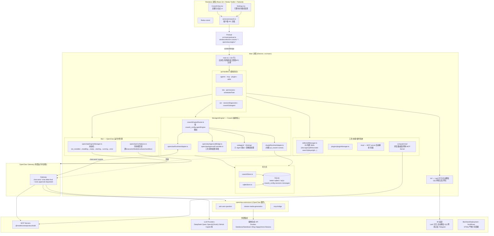

# LobsterAI 技术架构图

> 基于 `opensource/LobsterAI` 代码结构分析（网易有道 Electron 桌面 Agent，"全场景办公助手"）

## 1. 项目概述

LobsterAI 是一个跨平台（macOS/Windows）Electron 桌面 Agent，可操作本地文件、终端、浏览器、文档/表格/幻灯片、IM 渠道及定时任务。核心分层理念（来自 `docs/architecture-openclaw-gui-cowork.md`）：

- **Cowork** = 产品/会话层（会话、消息、权限、状态机）
- **OpenClaw** = 底层可插拔执行运行时/网关（内置 `yd_cowork` runner 的替代方案）
- **GUI** = Electron 渲染层，只与 Cowork 的标准协议对话，对底层执行引擎无感知

## 2. 总体架构图



## 3. OpenClaw Gateway 内部 Agent 模块深度解析（基于 `opensource/openclaw-2026.7.1` 源码）

LobsterAI 的 `OpenClawRuntimeAdapter` 所对接的 `Gateway` 并非黑盒，而是 OpenClaw 自身一整套 Agent 运行时。OpenClaw 是一个 pnpm monorepo（"Multi-channel AI gateway with extensible messaging integrations"），由 `src/`（应用主体，约 70 个子目录）、`packages/*`（可独立发布的核心库：`agent-core`、`llm-core`、`plugin-sdk`、`gateway-protocol`、`gateway-client`、`acp-core`、`model-catalog-core`、`memory-host-sdk` 等）、`extensions/*`（150+ 个独立版本化的插件包，如 `anthropic`、`amazon-bedrock`、`discord`、`feishu`、`acpx`、`codex`）三部分组成。Provider、Channel、Tool 全部以插件形式挂载到同一套 `PluginRuntime`。

### 3.1 OpenClaw Agent 运行时依赖关系图

```mermaid
graph TB
    subgraph LobsterSide["LobsterAI 侧"]
        OpenClawAdapter["openclawRuntimeAdapter.ts<br/>(LobsterAI 主进程)"]
    end

    subgraph GatewayEntry["src/gateway/ — RPC 入口"]
        ChatRPC["server-methods/chat.ts<br/>chat.send · chat.history · chat.abort"]
        GwProtocol["packages/gateway-protocol<br/>validateChatSendParams (RPC schema 校验)"]
        Boot["boot.ts<br/>网关生命周期启动"]
        Broadcast["server-broadcast.ts<br/>事件广播 (含 exec.approval.requested)"]
    end

    subgraph AutoReply["src/auto-reply/ — 消息分发"]
        Dispatch["dispatch.ts<br/>dispatchInboundMessage (消息归一化)"]
        ReplyDispatcher["reply/reply-dispatcher.ts<br/>ReplyDispatcher"]
        DispatchCfg["reply/dispatch-from-config.js<br/>dispatchReplyFromConfig"]
    end

    subgraph AgentOrch["src/agents/ — 单轮 Agent 编排"]
        AgentCommand["agent-command.ts<br/>会话/模型选择·投递·重试 (核心编排器)"]
        EmbeddedRunner["embedded-agent-runner/run.ts (+run/·runs.ts·run-state.ts)<br/>单次 Run 生命周期: 压缩·分道(lanes)·工具结果截断·超时兜底"]
        AgentRuntime["runtime/index.ts<br/>Agent extends CoreAgent<br/>装配 AgentCoreRuntimeDeps"]
        ModelCatalog["model-catalog*.ts · model-catalog-browse.ts<br/>Provider/模型选择解析"]
        BundleMcp["agent-bundle-mcp-tools.ts · agent-bundle-mcp-runtime.ts<br/>组装会话工具集"]
        AcpSpawn["acp-spawn.ts · acp-runtime-overlay.ts<br/>ACP 子代理会话装配"]
    end

    subgraph AgentCore["packages/agent-core — 通用 Agent 循环 (Provider 无关)"]
        AgentLoop["agent-loop.ts · agent.ts<br/>LLM 调用/工具调用通用循环"]
    end

    subgraph PluginSdkApp["src/plugin-sdk/ — 应用侧插件桥接层"]
        LlmBridge["llm.js<br/>completeSimple / streamSimple"]
        PluginEntry["plugin-entry.ts<br/>definePluginEntry"]
        AcpBackend["acp-runtime-backend.ts<br/>tryDispatchAcpReplyHook"]
        SqliteRuntime["sqlite-runtime.ts"]
    end

    subgraph PluginSystem["src/plugins/ — 插件运行时"]
        PluginTypes["types.ts<br/>OpenClawPluginApi / OpenClawPluginDefinition"]
        ApiBuilder["api-builder.ts<br/>buildPluginApi: registerTool/registerProvider/<br/>registerChannel/registerHook/registerService/..."]
        Registry["registry.ts · activation-planner.ts · activation-context.ts<br/>插件发现(bundled-plugin-scan)与激活"]
    end

    subgraph ProviderExt["extensions/{anthropic,amazon-bedrock,amazon-bedrock-mantle,codex,copilot,...}"]
        AnthropicExt["extensions/anthropic/index.ts<br/>registerAnthropicPlugin → providers:['anthropic']"]
        BedrockExt["extensions/amazon-bedrock(-mantle)"]
    end

    subgraph ProviderSdk["packages/plugin-sdk — Provider HTTP 抽象"]
        ProviderHttp["provider-http.ts · provider-entry.ts<br/>provider-stream-shared.ts"]
    end

    subgraph LLMCore["packages/llm-core<br/>Model/StreamFn 类型抽象"]
    end

    subgraph ToolMcp["src/tools/ · src/mcp/ — 工具与 MCP 桥接"]
        ToolDesc["tools/descriptors.ts · execution.ts<br/>availability.ts · planner.ts"]
        McpBridge["mcp/channel-bridge.ts · channel-server.ts<br/>把 OpenClaw 工具/渠道暴露为 MCP Server"]
        McpStdio["mcp/tools-stdio-server.ts<br/>MCP stdio server"]
        McpPluginBridge["mcp/plugin-tools-serve.ts<br/>plugin-tools-mcp-client<br/>插件注册工具接入 MCP"]
    end

    subgraph AcpxExt["extensions/acpx/ — ACP 外部 CLI Agent 桥接"]
        AcpxRuntime["register.runtime.ts<br/>createAcpxRuntimeService (api.registerService)"]
        AcpTranslator["src/acp/translator.ts<br/>ACP 事件 ↔ Cowork 事件转换<br/>(含 exec.approval.requested)"]
        AcpCore["packages/acp-core<br/>共享 ACP 协议类型"]
    end

    subgraph ExtCLI["外部 CLI Agent 进程"]
        ClaudeCode2["Claude Code"]
        Codex2["Codex"]
        GeminiCli["Gemini CLI"]
    end

    subgraph ChannelSystem["src/channels/ + extensions/{discord,feishu,irc,googlechat,...}"]
        ChannelShared["channels/ 共享基础设施<br/>allowlist·chat-type 归一化·会话绑定"]
    end

    subgraph Approval["审批/权限系统"]
        ExecApprovalRoute["gateway/server-methods/exec-approval.ts<br/>buildRequestedApprovalEvent"]
        ExecPolicy["infra/exec-approvals.ts<br/>allowlist/durable-approval 策略判定"]
        BashGateway["agents/bash-tools.exec-host-gateway.ts<br/>exec 工具接入网关"]
        ExecMgr["infra/exec-approval-manager.ts<br/>ExecApprovalManager 挂起请求登记"]
        ExecForward["infra/exec-approval-forwarder.ts<br/>exec-approval-channel-runtime.ts<br/>审批提示投递到渠道/iOS Push"]
    end

    subgraph Persistence["持久化 (SQLite)"]
        NodeSqlite["infra/node-sqlite.ts · kysely-node-sqlite.ts<br/>sqlite-wal.ts · sqlite-transaction.ts"]
        TaskStore["tasks/task-registry.store.sqlite.ts<br/>task-flow-registry.store.sqlite.ts"]
        PluginStateStore["plugin-state/plugin-state-store.sqlite.ts<br/>(openKeyedStore，供插件如 acpx 使用)"]
        SubagentStore["agents/subagent-registry.store.sqlite.ts<br/>auth-profiles/sqlite.ts"]
        SessionAccessor["config/sessions/session-accessor.ts<br/>loadTranscriptEvents · patchSessionEntry"]
        MemoryHost["packages/memory-host-sdk<br/>sqlite.ts · sqlite-vec.ts (向量记忆)"]
    end

    OpenClawAdapter -->|"chat.send (RPC)"| ChatRPC
    ChatRPC --> GwProtocol
    ChatRPC --> Dispatch --> ReplyDispatcher --> DispatchCfg --> AgentCommand
    Boot --> ChatRPC

    AgentCommand --> EmbeddedRunner --> AgentRuntime --> AgentLoop
    AgentRuntime --> LlmBridge --> ProviderSdk
    AgentCommand --> ModelCatalog --> LLMCore
    AgentLoop --> LLMCore
    EmbeddedRunner --> BundleMcp --> ToolDesc
    AgentCommand --> AcpSpawn --> AcpxExt

    PluginEntry --> PluginTypes
    ProviderExt -->|"definePluginEntry"| PluginEntry
    ProviderExt -->|"registerProvider"| ApiBuilder
    ApiBuilder --> PluginTypes
    Registry --> ApiBuilder
    ProviderSdk --> LLMCore
    AnthropicExt --> ProviderSdk
    BedrockExt --> ProviderSdk

    ToolDesc --> McpBridge
    McpBridge --> McpStdio
    McpPluginBridge --> ApiBuilder
    BundleMcp --> McpPluginBridge

    AcpxRuntime -->|"api.registerService"| ApiBuilder
    AcpxRuntime --> AcpTranslator --> AcpCore
    AcpTranslator -->|"驱动"| ExtCLI
    AcpBackend -->|"tryDispatchAcpReplyHook"| ReplyDispatcher
    AcpTranslator -->|"exec.approval.requested"| ExecApprovalRoute

    ChannelShared --> ApiBuilder
    ChannelSystem -->|"registerChannel"| ApiBuilder

    BashGateway --> ExecPolicy --> ExecMgr --> Broadcast
    ExecMgr --> ExecForward
    ExecApprovalRoute --> Broadcast
    Broadcast -->|"exec.approval.requested / chat delta·final"| OpenClawAdapter

    AgentCommand --> SessionAccessor
    EmbeddedRunner --> TaskStore
    AcpxRuntime --> PluginStateStore
    AgentRuntime --> SubagentStore
    SessionAccessor --> NodeSqlite
    TaskStore --> NodeSqlite
    PluginStateStore --> NodeSqlite
    SubagentStore --> NodeSqlite
    MemoryHost --> NodeSqlite
```



### 3.2 模块职责说明

| 模块 | 文件/子目录 | 职责 |
|---|---|---|
| **RPC 入口** | `src/gateway/server-methods/chat.ts` | 实现 `chat.send`/`chat.history`/`chat.abort`，经 `packages/gateway-protocol` 的 `validateChatSendParams` 校验；`boot.ts` 负责网关启动，`server-broadcast.ts` 负责事件广播（含 `exec.approval.requested`） |
| **消息分发** | `src/auto-reply/dispatch.ts`、`reply/reply-dispatcher.ts`、`reply/dispatch-from-config.js` | `dispatchInboundMessage` 归一化入站消息 → `ReplyDispatcher` → `dispatchReplyFromConfig`，最终调用 `agent-command.ts` |
| **单轮编排器** | `src/agents/agent-command.ts` | 整个 Agent 模块的**核心编排入口**：会话/模型选择、消息投递、失败重试 |
| **单次 Run 生命周期** | `src/agents/embedded-agent-runner/` (`run.ts`、`runs.ts`、`run-state.ts`) | 管理一次 Agent 运行的压缩（上下文裁剪）、并行分道（lanes）、工具结果截断、超时/降级兜底 |
| **Agent 运行时装配** | `src/agents/runtime/index.ts` | 构建 `Agent extends CoreAgent`，注入 `AgentCoreRuntimeDeps`，把 `src/plugin-sdk/llm.js` 的 `completeSimple`/`streamSimple` 接入通用 Agent 循环 |
| **通用 Agent 循环** | `packages/agent-core/src/agent-loop.ts`、`agent.ts` | Provider 无关的 LLM 调用/工具调用通用循环，是 `ClaudeRuntimeAdapter`（yd_cowork）与 `OpenClawRuntimeAdapter` 概念上对应的"内核" |
| **模型/Provider 选择** | `src/agents/model-catalog*.ts`、`model-catalog-browse.ts` | 解析 Provider 与模型目录，供 `agent-command.ts` 选型 |
| **会话工具集组装** | `agent-bundle-mcp-tools.ts`、`agent-bundle-mcp-runtime.ts` | 为一次会话组装可用工具（含插件注册工具、MCP 工具） |
| **Provider 插件** | `extensions/{anthropic,amazon-bedrock,amazon-bedrock-mantle,copilot,...}` | 每个 Provider 是独立插件包，经 `definePluginEntry`（`src/plugin-sdk/plugin-entry.ts`）注册，声明 `providers: [...]`、鉴权/CLI 后端、流式包装，底层用 `packages/plugin-sdk` 的 `provider-http.ts`/`provider-entry.ts`/`provider-stream-shared.ts` |
| **插件运行时** | `src/plugins/types.ts`（`OpenClawPluginApi`）、`api-builder.ts`（`buildPluginApi`）、`registry.ts`/`activation-planner.ts` | 统一的插件生命周期：注册 `registerTool`/`registerProvider`/`registerChannel`/`registerHook`/`registerGatewayMethod`/`registerService`/`registerCli`/`registerHttpRoute`；`bundled-plugin-scan.ts` 负责发现，`openclaw.plugin.json` 的 `onStartup` 控制激活 |
| **工具/MCP** | `src/tools/`（`descriptors.ts`/`execution.ts`/`availability.ts`/`planner.ts`）、`src/mcp/`（`channel-bridge.ts`/`channel-server.ts`/`tools-stdio-server.ts`/`plugin-tools-serve.ts`） | 通用工具描述/执行/可用性判定；将 OpenClaw 工具与渠道反向暴露为 MCP Server，也将插件注册的工具接入 MCP 客户端 |
| **ACP 外部 CLI Agent 桥接** | `extensions/acpx/`（`register.runtime.ts` → `createAcpxRuntimeService`）、`src/agents/acp-spawn.ts`、`acp-runtime-overlay.ts`、`src/acp/translator.ts`、`packages/acp-core` | 通过 Agent Client Protocol 驱动外部 CLI Agent（Claude Code / Codex / Gemini CLI）作为嵌入式子代理；`translator.ts` 将 ACP 事件转换为 OpenClaw 规范事件，也是 `exec.approval.requested` 的另一来源 |
| **渠道插件** | `src/channels/` + `extensions/{discord,feishu,irc,googlechat,...}` | 渠道与 Provider 复用同一套插件/注册表/激活管线，经 `api.registerChannel` 接入 |
| **审批系统** | `gateway/server-methods/exec-approval.ts`、`infra/exec-approvals.ts`、`agents/bash-tools.exec-host-gateway.ts`、`infra/exec-approval-manager.ts`、`infra/exec-approval-forwarder.ts` | Shell/exec 工具调用先经 `exec-approvals.ts` 做 allowlist/durable-approval 策略判定；需人工确认时 `ExecApprovalManager` 登记挂起请求，`server-broadcast.ts` 广播 `exec.approval.requested`，客户端解析后经 `handleApprovalResolve` 恢复执行 |
| **持久化** | `infra/node-sqlite.ts`/`kysely-node-sqlite.ts`/`sqlite-wal.ts`、`tasks/task-*-registry.store.sqlite.ts`、`plugin-state/plugin-state-store.sqlite.ts`、`agents/subagent-registry.store.sqlite.ts`、`config/sessions/session-accessor.ts`、`packages/memory-host-sdk`（向量记忆） | SQLite 承载任务/会话运行状态、插件级 KV 状态、子代理注册表、会话转录、向量记忆 |

### 3.3 与 LobsterAI 的对接关系

- LobsterAI 的 `openclawRuntimeAdapter.ts` 只对接 OpenClaw **Gateway 的 RPC 边界**（`chat.send` / `chat.history` / `chat.abort` + WebSocket/事件流），完全不感知上述内部模块——这与 AionUi 中 `IWorkerTaskManager` trait 对上层业务域屏蔽 ACP/aionrs 双运行时的设计思路一致：**上层产品只依赖一个稳定的协议边界，底层可插拔更换执行引擎**。
- LobsterAI 的 `openclawApprovalBridge.ts`/`openclawApprovalController.ts` 正是消费 OpenClaw `server-broadcast.ts` 广播的 `exec.approval.requested` 事件（该事件由 `bash-tools.exec-host-gateway.ts` 或 `acp/translator.ts` 两个源头之一产生）。
- LobsterAI 的 `openclaw-extensions/{ask-user-question, lobster-media-generation, mcp-bridge}` 正是以 OpenClaw **Provider/Tool 插件**的标准形态存在（`openclaw.plugin.json` + `definePluginEntry`），与内置的 `extensions/anthropic`、`extensions/acpx` 等插件在同一套 `src/plugins/` 插件运行时中被发现与激活，因此 LobsterAI 可以把自己的能力（媒体生成、用户追问、MCP 桥接）以插件方式"注入"到 OpenClaw Agent 循环中，而不需要修改 OpenClaw 本体。
- LobsterAI 的 `SKILLs/` 同步（`openClawSync.ts`）与 OpenClaw 的 `skills/` 目录（Markdown/工具技能包）是同一机制的两端实现，二者都作为运行期上下文提示词/工具描述注入 Agent 循环，而非代码模块。

## 4. 关键设计要点

- **双引擎路由**：`coworkEngineRouter.ts` 根据 `cowork_config.agentEngine` 将会话路由到两种执行引擎之一：
  - `ClaudeRuntimeAdapter`（内置 `yd_cowork` runner）
  - `OpenClawRuntimeAdapter`（外部 OpenClaw Gateway 进程，可插拔）
  两者都被适配为统一的 Cowork 规范事件流（`message` / `messageUpdate` / `permissionRequest` / `complete` / `error`），Renderer 层完全无感知底层引擎差异。
- **状态机化的运行时管理**：`openclawEngineManager.ts` 管理 OpenClaw Gateway 的生命周期（`not_installed → installing → ready → starting → running → error`），通过 `openclaw:engine:onProgress` 广播进度。
- **审批/权限流**：`openclawApprovalBridge.ts` / `openclawApprovalController.ts` 处理工具调用前的用户审批（`exec.approval.requested` 事件）。
- **双 IPC 通道族**：`cowork:*`（任务/会话业务）与 `openclaw:engine:*`（运行时生命周期）相互独立；切换引擎时会清空当前活跃会话，避免跨引擎上下文污染。
- **可插拔工具/技能体系**：
  - **OpenClaw 插件**（`openclaw-extensions/`）：ask-user-question、lobster-media-generation、mcp-bridge，各自通过 `openclaw.plugin.json` 声明。
  - **Skills**（`SKILLs/`，28 个）：docx/pptx/pdf/xlsx 处理、Playwright 浏览器自动化、Web 搜索、Seedance/Seedream 媒体生成、股票工具等，由 `skillManager.ts` 管理并同步给 OpenClaw（`openClawSync.ts`）。
  - **Kits**（Expert Kits）：能力组合打包，供 IPC/Renderer 层调用。
- **持久化**：`coworkStore.ts` / `sqliteStore.ts` 基于 SQLite（`better-sqlite3`，降级用 `sql.js`）存储会话、消息、配置。
- **IM 网关**：`src/main/im/` 统一封装飞书、钉钉、企业微信、QQ、网易云信（`nim-web-sdk-ng`）、Telegram 的消息收发与富媒体解析。

## 5. 数据流示例（会话启动，OpenClaw 路径）

```
用户在 CoworkView.tsx 输入
  → services/cowork.ts (renderer)
  → window.electron.cowork.* (preload/contextBridge)
  → ipcHandlers 中对应 handler (main.ts 注册)
  → OpenClawEngineManager.ensureOpenClawRunningForCowork()
  → CoworkStore.createSession() / addMessage() (SQLite 落库)
  → CoworkEngineRouter.startSession()
  → OpenClawRuntimeAdapter.startSession()
  → OpenClaw Gateway: chat.send
  → Gateway 发出 chat delta/final 及 exec.approval.requested 事件
  → Adapter 写回 CoworkStore，并转换为 Cowork 规范事件
  → Router → IPC → preload → cowork service → CoworkView (流式渲染)
```
