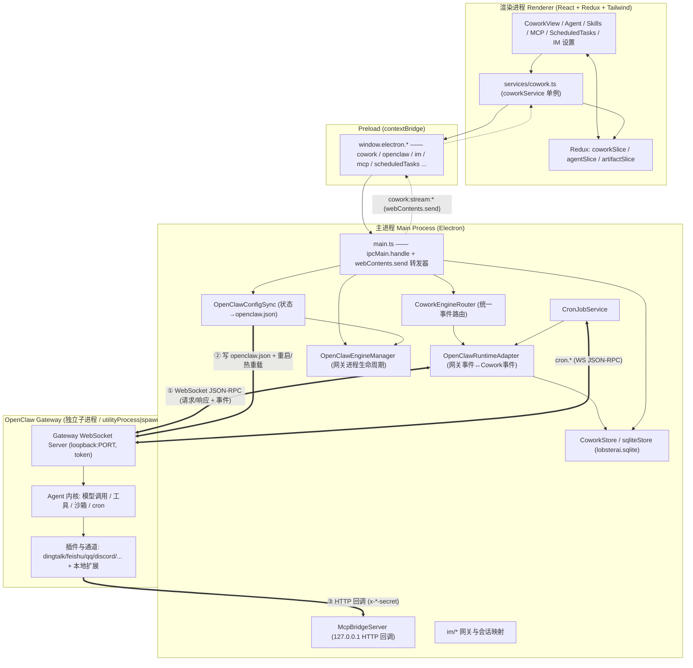
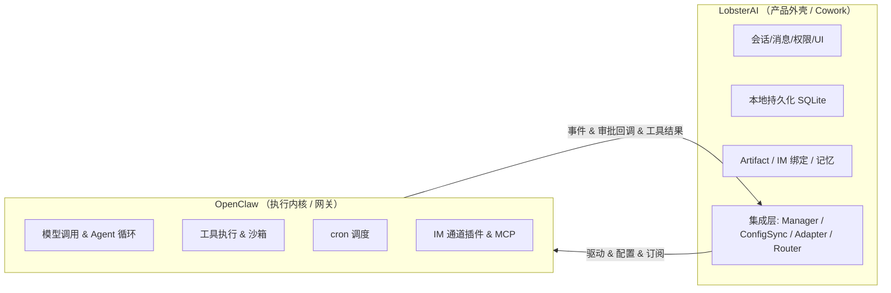
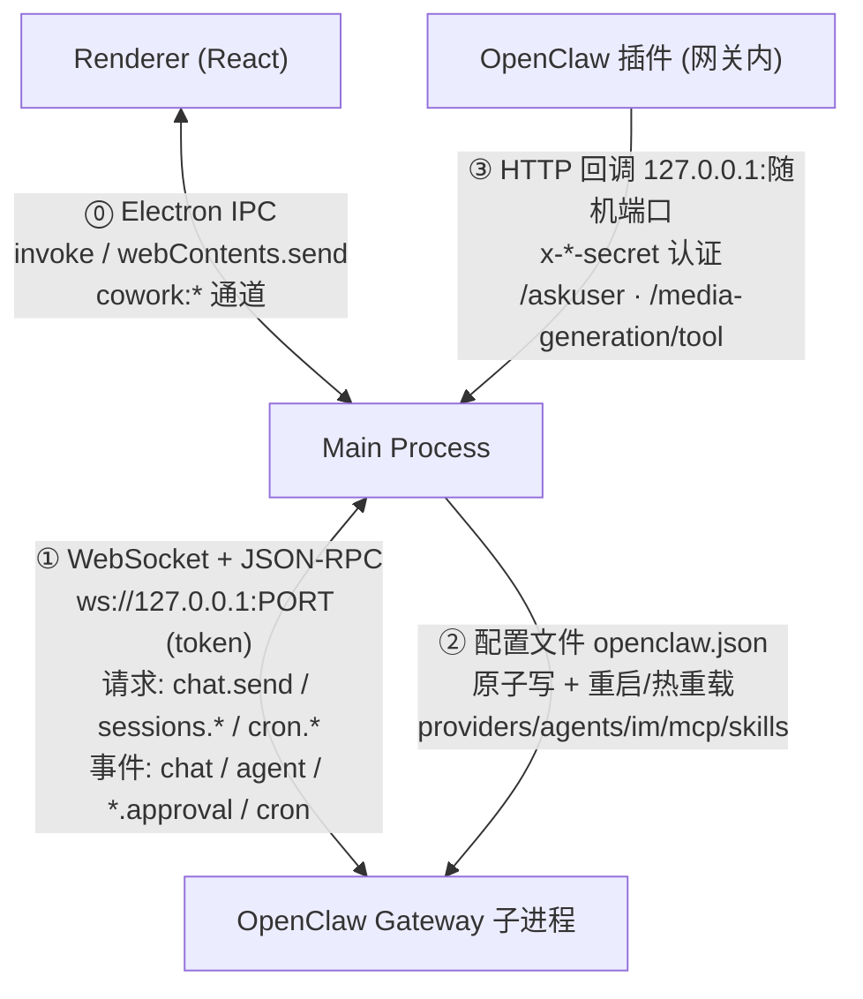
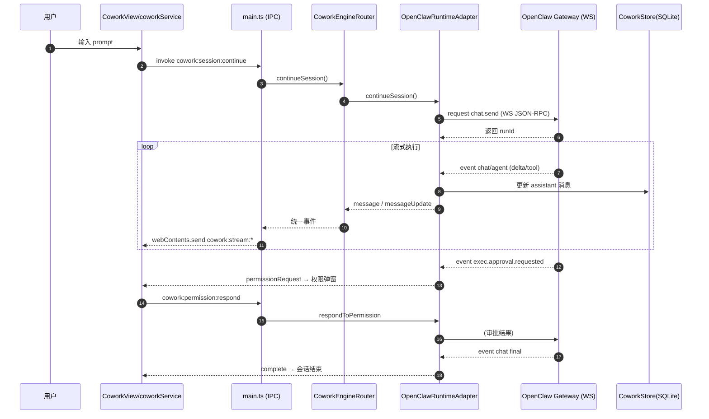
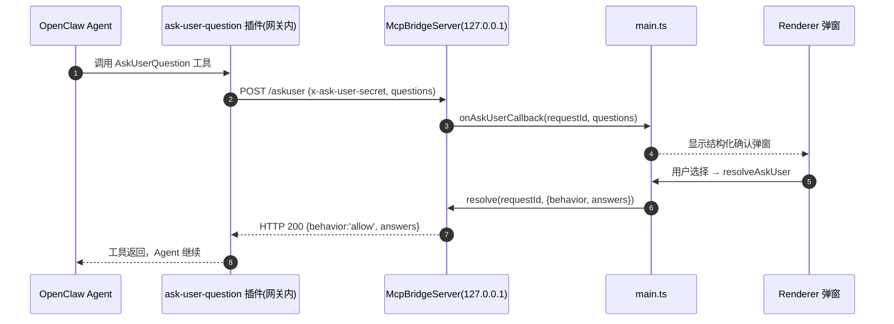
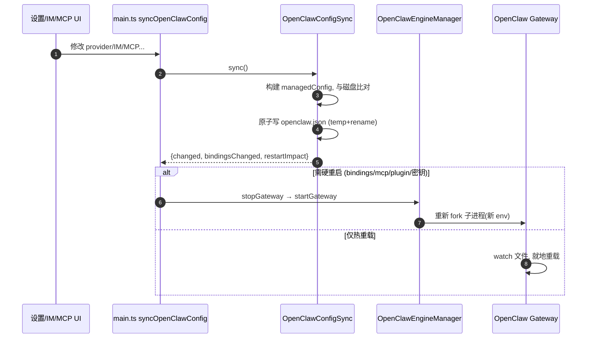

# LobsterAI 深度技术分析报告

> 分析对象：`opensource/LobsterAI`（NetEase Youdao 开源桌面级 Agent，Electron 40 + React 18 + TypeScript）
> 分析重点：各模块源码架构，以及 **LobsterAI 与 OpenClaw 的关系与通信方式**
> 版本基准：`package.json` 中固定 OpenClaw `v2026.6.1`

---

## 0. 一句话结论

LobsterAI 是一个 **"产品外壳（Cowork）+ 可插拔 Agent 运行时内核（OpenClaw）"** 的双层桌面应用：

- **Cowork** = LobsterAI 自己的产品/会话层，负责 UI、会话、消息、权限、本地持久化（SQLite）、Artifact、IM 绑定、上下文用量等——**承载业务语义**。
- **OpenClaw** = 唯一的 Agent 执行引擎/网关（Gateway），以**独立子进程**形式随应用打包运行，负责真正的模型调用、工具执行、沙箱、cron、IM 通道插件等——**承载执行能力**。
- 两者的通信是**三条物理链路**：
  1. **本地回环 WebSocket + JSON-RPC**（Main 进程 → OpenClaw Gateway，双向：请求/响应 + 事件推送）——**会话、chat、cron 的主通道**；
  2. **生成配置文件 `openclaw.json` + 网关重启/热重载**（Main → OpenClaw，配置面）——providers/agents/IM/MCP/skills/sandbox；
  3. **本地回环 HTTP 回调桥（McpBridgeServer）**（OpenClaw 插件 → Main 进程，反向回调）——AskUserQuestion 确认弹窗、媒体生成、MCP 桥接。
- 渲染进程从不直接接触 OpenClaw，全程走 **Electron IPC（`contextBridge`）→ Main 进程 → OpenClaw**。

> 历史命名提示：代码中 `cowork:*` IPC 通道、`claude_session_id` 列名等是历史兼容名。曾经存在的第二个引擎 `yd_cowork` **已被移除**，当前 `CoworkAgentEngine` 只有 `'openclaw'` 一个取值。

---

## 1. 整体架构分层



**三进程模型**：Renderer（沙箱化，无 Node）↔ Main（Node/Electron）↔ OpenClaw Gateway（Node，`ELECTRON_RUN_AS_NODE=1`）。

---

## 2. 各模块源码分析

### 2.1 主进程 · OpenClaw 集成核心（4 个关键文件）

| 文件 | 行数 | 职责 |
| --- | --- | --- |
| `src/main/libs/openclawEngineManager.ts` | ~1700 | 网关**子进程**的启动/停止/重启/健康检查、端口与 token、运行时定位、崩溃自愈、日志 |
| `src/main/libs/openclawConfigSync.ts` | ~3500 | 把 LobsterAI 全量状态**渲染成 `openclaw.json`**，并决定重启还是热重载 |
| `src/main/libs/agentEngine/openclawRuntimeAdapter.ts` | ~10500 | **WebSocket 网关客户端**；网关事件 ↔ Cowork 标准事件的双向翻译 |
| `src/main/libs/agentEngine/coworkEngineRouter.ts` | ~270 | Cowork 面向的统一 runtime 路由器（当前只路由到 openclaw） |

#### 2.1.1 OpenClawEngineManager —— 网关进程生命周期

- **运行时定位**（`resolveRuntimeMetadata`）：打包态取 `process.resourcesPath/cfmind`；开发态取 `vendor/openclaw-runtime/current`（软链/junction，`fs.realpathSync` 解引用）。
- **启动**（`doStartGateway`）：
  - 分配 loopback 端口（默认 `18789`，冲突则扫描 +80），生成一次性 `gateway-token`；
  - 注入大量环境变量：`OPENCLAW_HOME/STATE_DIR/CONFIG_PATH`、`OPENCLAW_GATEWAY_TOKEN/PORT`、`LOBSTER_MCP_BRIDGE_SECRET`、`SKILLS_ROOT`、代理、时区、V8 编译缓存等；
  - **平台差异**：Windows 用 `child_process.spawn(execPath, …, {ELECTRON_RUN_AS_NODE:1})`（避免 utilityProcess 的 ~5x 冷启动开销）；macOS/Linux 用 `utilityProcess.fork(...)`；
  - 启动参数：`gateway --bind loopback --port <port> --token <token> --verbose`；
  - `waitForGatewayReady` 轮询 HTTP 健康，超时 300s；
- **健壮性**：崩溃自动重启（退避 `[3,5,10,20,30]s`，上限 5 次）、`gateway-bundle.mjs` 单文件加速冷启动、Windows CJS launcher 包装 ESM、安装包资源自愈（从 `win-resources.tar` 恢复）。
- **对外连接信息**（`getGatewayConnectionInfo`）：`{ version, port, token, url: 'ws://127.0.0.1:<port>', clientEntryPath }`——这是通道①的连接凭证。

#### 2.1.2 OpenClawConfigSync —— 状态 → `openclaw.json`（通道②）

单个 `sync()` 方法构建一个 `managedConfig` 对象并原子写盘。渲染内容：

| 配置段 | 来源 | 说明 |
| --- | --- | --- |
| `models.providers.*` | Provider 注册表 | baseUrl / api 类型 / auth / models[]；**API key 用 `${LOBSTER_APIKEY_<PROVIDER>}` 占位符**，绝不落盘明文 |
| `agents.defaults` + per-agent | agents 表 | 非 main agent 有独立 workspace |
| `bindings[]` | im_config | `{agentId, match:{channel, accountId}}`，平台名映射到 OpenClaw 通道名 |
| `plugins.entries/allow/load.paths` | 内置+user_plugins | 严格 allowlist + 扩展加载路径 |
| `channels.*` | im_config | 各平台 accounts / allowFrom 门禁 |
| `mcp.servers` | mcp_servers 表 | `buildOpenClawMcpServers()`，stdio→`{command,args,env}` / http→`{url,headers}` |
| `skills.entries/load.extraDirs` | SkillManager | `extraDirs` 指向 `userData/SKILLs`，`watch:true` 热加载 |
| `sandbox.mode` | executionMode | `local→off` / `auto→non-main` / `sandbox→all` |
| workspace `AGENTS.md` | 系统提示+策略 | 写入 `<!-- LobsterAI managed -->` 受控段落 |
| `cron.*` | — | enabled/store/retention 等 |

**写入与生效**（关键设计）：
- 与磁盘旧值比对（忽略 `meta` 时间戳），有变更才 **临时文件 + rename 原子写**；
- 返回 `{changed, bindingsChanged, changedTopLevelKeys, restartImpact}`；
- `main.ts` 的 `_syncOpenClawConfigImpl` 判定 `needsHardRestart = 密钥变更 || bindings 变更 || mcp/plugin 变更 || …`：
  - **需要重启** → 断开 WS 客户端 → `stopGateway()` → `startGateway()`（有活跃任务时延迟）；
  - **不需要** → **"NO RESTART, hot-reload only"**，网关自行 watch 文件热重载；
- 所有 apply 通过 `openClawConfigApplyQueue` 串行化；
- **触发再同步**的 reason 众多：`startup / cowork-config-change / im-config-change / skills-changed / ensureRunning:mcpConfig / system-proxy-changed / token-refresh:* …`。

#### 2.1.3 OpenClawRuntimeAdapter —— WebSocket 网关客户端（通道①，核心）

这是整个通信的心脏。它**动态加载**网关自带的 `GatewayClient` 构造器（`clientEntryPath`），建立 WS 连接：

```ts
const client = new GatewayClient({
  url: connection.url,                 // ws://127.0.0.1:<port>
  token: connection.token,
  clientDisplayName: 'LobsterAI',
  mode: 'backend',
  caps: [OPENCLAW_GATEWAY_TOOL_EVENTS_CAP],
  role: 'operator',
  scopes: ['operator.admin'],
  onHelloOk: () => { /* 握手成功后才暴露 client，订阅事件 */ },
  onEvent: (event) => this.handleGatewayEvent(event),
  onClose: (...) => this.scheduleGatewayReconnect(),
});
client.start();
```

- **握手**：`connect.challenge` 预认证（v2026.4.5+），`onHelloOk` 才算就绪；内建自动重连；连接成功后 `client.request('sessions.subscribe')` 订阅会话生命周期事件。
- **请求方向（Main → Gateway，JSON-RPC 请求/响应）**：`client.request(method, params, {timeoutMs})`
  - 会话/对话：`chat.send`（提交 prompt，返回 runId）、`chat.history`、`chat.abort`
  - 会话管理：`sessions.subscribe` / `sessions.list` / `sessions.patch` / `sessions.compact` / `sessions.goal` / `sessions.delete`
  - 定时任务：`cron.add/update/remove/run/list/runs`（由 CronJobService 复用同一 client）
- **事件方向（Gateway → Main，推送帧 `{event, seq, payload}`）**，`handleGatewayEvent` 分发：

  | event | 处理 | 语义 |
  | --- | --- | --- |
  | `tick` | 更新心跳 | 保活（TickWatchdog 判活） |
  | `chat` | `handleChatEvent` | 流式 delta / final 文本 |
  | `agent` | `handleAgentEvent` | assistant 流、思考、工具调用 |
  | `sessions.changed` | 通道会话生命周期 | IM 会话发现/映射 |
  | `exec.approval.requested/resolved` | approvalController | **命令执行审批** → 转成 Cowork 权限请求 |
  | `plugin.approval.requested/resolved` | approvalController | **插件审批** |
  | `cron` | 调度投递 | 定时任务触发 |

- **翻译**：把上述网关事件转成 Cowork 标准事件（`message` / `messageUpdate` / `sessionStatus` / `permissionRequest` / `contextUsageUpdate` / `complete` / `error`），并写入 `CoworkStore`。

#### 2.1.4 CoworkEngineRouter —— 统一路由器

`implements CoworkRuntime`，把 `startSession/continueSession/submitSteer/stopSession/respondToPermission/...` 委托给底层 runtime（当前恒为 OpenClawRuntimeAdapter），并把 runtime 的事件**统一 re-emit** 给 `main.ts` 的转发器。它维护 `sessionEngine / requestEngine` 映射，为将来多引擎切换预留了抽象（引擎切换时清理活跃会话，避免上下文污染）。

### 2.2 主进程 · 其它域模块

- **`coworkStore.ts` / `sqliteStore.ts`**：`lobsterai.sqlite`（位于 `userData`），表包括 `cowork_sessions/messages/config`、`agents`、`im_config`、`im_session_mappings`、`mcp_servers`、`user_plugins`、`subagent_runs`、`scheduled_task_meta` 等。迁移多为 `PRAGMA table_info()` 即席检查。
- **`im/`**：见 §4。DingTalk/Feishu/QQ/Discord/WeCom/Telegram/POPO/Weixin/NetEase-Bee 均为 **OpenClaw 通道插件**（通过配置同步启用），入站消息在网关内处理；**仅 NIM** 有原生 `NimGateway`（NetEase IM SDK/WS 客户端）用于凭证/扫码/媒体，执行仍走 OpenClaw。会话映射存 `im_session_mappings`。
- **`scheduledTask/`**：`CronJobService` 通过网关 `cron.*` JSON-RPC 执行；本地仅存 `scheduled_task_meta`（来源/绑定元数据），任务定义与运行历史在 OpenClaw cron state（`<stateDir>/cron/jobs.json`）。
- **`mcp/`**：用户 MCP server 存 SQLite，**通过配置文件** `mcp.servers` 同步给 OpenClaw（非网关请求）；MCP 变更强制网关重启。
- **`skillManager.ts` / `skills/`**：28 个内置 skill（`SKILLs/skills.config.json`）；`skills.load.extraDirs`（`watch:true`）+ `skills.entries.<id>.enabled` 同步；反向读取网关 `skills.status` 标记插件提供的 skill。
- **`preload.ts`**：单一 `contextBridge.exposeInMainWorld('electron', {...})`；事件类方法注册 `ipcRenderer.on` 并**返回清理闭包**（`removeListener`）。方法组：`cowork / openclaw / im / mcp / kits / agents / scheduledTasks / artifact / auth / ...`。

### 2.3 渲染进程

- **`services/cowork.ts`（coworkService 单例）**：包装 `window.electron.cowork.*`，在 `init()→setupStreamListeners()` 中注册所有 `onStream*` 监听并把回调 dispatch 进 Redux。请求方法：`startSession/continueSession/stopSessionRuntime/submitSteer/runGoalCommand/loadSessions/...`。
- **Redux**：`coworkSlice`（`isStreaming`、`currentSession.messages`、`contextUsageBySessionId`、`pendingPermissions` 队列、`pendingSteers`…）、`agentSlice`、`artifactSlice`。
- **`App.tsx`**：顶层 `mainView` 五视图路由（`cowork/skills/scheduledTasks/kits/mcp`），初始化顺序 `configService → authService → coworkService.init()`。
- **组件**：`components/cowork`（主 UI、权限弹窗、思考/工具展示、上下文用量、fork、语音）、`agent`、`artifacts`（html/svg/mermaid/code/... 渲染器）、`im`、`skills`、`mcp`、`scheduledTasks`。

### 2.4 OpenClaw 扩展（LobsterAI 自研插件，运行在网关进程内）

位于 `openclaw-extensions/`，每个是 `type:module` TS 包，默认导出 `{id,name,configSchema.parse,register(api)}`，实现 `openclaw/plugin-sdk` 的 `OpenClawPluginApi`。**它们运行在网关子进程内，通过通道③ HTTP 回调 Main 进程**：

| 扩展 | 暴露工具 | 回调端点 | 认证头 |
| --- | --- | --- | --- |
| `ask-user-question` | `AskUserQuestion` | `POST /askuser` | `x-ask-user-secret` |
| `lobster-media-generation` | `lobsterai_image_generate` / `lobsterai_video_generate` | `POST /media-generation/tool` | `x-lobster-media-secret` |
| `mcp-bridge` | `mcp_<server>_<tool>`（动态） | `POST <callbackUrl>` | `x-mcp-bridge-secret` |

- 前两者用 **factory-gated** 注册（`sessionKey.ts` 判定仅桌面会话可见，IM 会话不暴露）；
- 视频生成在**网关内自适应轮询**（最长 10h），每次轮询再打回调桥；
- 三者的 `callbackUrl` 与 `secret` 由 `openclawConfigSync` 写入各插件 `entries.<id>.config`，secret 用 `${LOBSTER_MCP_BRIDGE_SECRET}` 占位符（网关 env 注入）。

---

## 3. LobsterAI 与 OpenClaw 的关系（核心）



**定位关系**：
- OpenClaw 是 LobsterAI 的**唯一 Agent 运行时**，被作为**版本固定（`v2026.6.1`）的第三方内核**克隆、打补丁、构建、打包进 `Resources/cfmind`。
- LobsterAI 对 OpenClaw 的定制遵循"**先改 LobsterAI 侧集成边界，无干净 hook 时才用 version-scoped patch**"的策略（`scripts/patches/<version>/`）。
- 边界清晰：**LobsterAI 拥有所有本地状态与 UI；OpenClaw 拥有执行**。凡是能在配置/适配层表达的都放在 LobsterAI 侧。
- 命名历史：`Cowork` 源自早期自研 Claude-Code 式助手；`yd_cowork` 第二引擎已删除，但 `cowork:*` 通道名、`claude_session_id` 列名等作为兼容名保留。

---

## 4. 通信方式（核心）

LobsterAI ↔ OpenClaw 之间共有 **3 条链路**，加上 Renderer↔Main 的 IPC，一共 4 类跨边界通信：



### ⓪ Renderer ↔ Main：Electron IPC（`contextBridge`）

- 请求/响应：`ipcRenderer.invoke('cowork:session:start' | 'cowork:session:continue' | ...)` → `ipcMain.handle`。
- 事件推送：Main 的 `bindCoworkRuntimeForwarder` 订阅 Router 事件，`win.webContents.send('cowork:stream:message' | 'cowork:stream:messageUpdate' | 'cowork:stream:permission' | 'cowork:stream:complete' | ...)`；Preload `onStream*` 回调 → service → Redux。
- 安全：`contextIsolation` 开、`nodeIntegration` 关、renderer 沙箱化，payload 经 `sanitizeCoworkMessageForIpc` 截断/脱敏。

### ① Main ↔ OpenClaw Gateway：**回环 WebSocket + JSON-RPC（主通道）**

- **传输**：`ws://127.0.0.1:<port>`，`bind loopback`（仅本机），一次性 `token` + `connect.challenge` 握手，`role:operator / scopes:[operator.admin]`。
- **请求（Main→GW）**：`client.request(method, params, {timeoutMs})`，方法名如 `chat.send`（发 prompt）、`chat.history`、`chat.abort`、`sessions.list/patch/compact/goal/delete/subscribe`、`cron.add/update/remove/run/list/runs`。
- **事件（GW→Main）**：帧结构 `{event, seq, payload}`，类型含 `tick / chat / agent / sessions.changed / exec.approval.requested|resolved / plugin.approval.requested|resolved / cron`。
- **可靠性**：`sessions.subscribe` 订阅；TickWatchdog 心跳判活；断线自动重连；关闭码 1009（MessageTooBig）特判；`chat.send` payload 上限 ~30MB。
- **谁用它**：`OpenClawRuntimeAdapter`（会话/chat）与 `CronJobService`（cron）**共享同一个 GatewayClient**（`getOpenClawGatewayClient: () => adapter.getGatewayClient()`）。

### ② Main → OpenClaw：**配置文件 + 重启/热重载（配置面）**

- `OpenClawConfigSync.sync()` 生成 `openclaw.json`（原子 temp+rename），承载 providers/models、agents、IM bindings/channels、plugins、mcp.servers、skills、sandbox、cron、workspace AGENTS.md。
- 生效策略：**大多数键热重载**（网关 watch 文件）；**bindings / mcp / plugin / 密钥变更 → 硬重启网关**。
- 密钥安全：所有敏感值以 `${LOBSTER_*}` 占位符写入配置，真实值仅作为**网关子进程环境变量**注入，不落盘。

### ③ OpenClaw 插件 → Main：**回环 HTTP 回调桥（反向通道）**

- Main 侧 `McpBridgeServer`：`http.Server` 绑 `127.0.0.1` **随机空闲端口**，端点 `POST /askuser`、`POST /media-generation/tool`。
- 认证：请求头 `x-mcp-bridge-secret` / `x-ask-user-secret` / `x-lobster-media-secret` 与 `crypto.randomUUID()` 生成的 `bridgeSecret` 比对（不符 401）。
- 用途：网关内插件需要"回到桌面 UI"时（弹确认框、跑媒体生成、代理 LobsterAI 托管的 MCP 工具）通过 `fetch(callbackUrl, ...)` 同步等待 Main 侧结果。
- 为何不用 WS 反向：插件运行在网关进程，与 Main 无共享 IPC；HTTP 回环是最简单的跨进程同步请求/响应方式。

> **总结**：会话与调度走 **WebSocket JSON-RPC**（低延迟、事件流）；配置走**文件+重启/热重载**（声明式、可审计、密钥隔离）；插件反向回调走**HTTP+shared-secret**（同步、简单）。三者职责正交。

---

## 5. 关键流程时序图

### 5.1 一次会话（用户在桌面发 prompt）



### 5.2 网关内插件回调（AskUserQuestion 确认弹窗，通道③）



### 5.3 配置变更生效（通道②）



---

## 6. OpenClaw 版本维护与运行时构建生命周期

OpenClaw 被当作**可复现构建的固定第三方内核**来治理，而非 vendored 源码。版本维护是一条 **"单一真源 → 构建期对齐 → 版本作用域补丁 → 产物固化 → 运行时核对"** 的流水线，分**构建期**（把某个精确 tag 变成可打包运行时）与**运行期**（核对实际跑的是哪个版本）两个阶段。核心原则：**声明式 + 幂等 + 强校验 + 对版本漂移敏感报错**。

### 6.1 单一版本真源：`package.json.openclaw`

```jsonc
"openclaw": {
  "version": "v2026.6.1",                       // ← 钉死的 git tag（唯一权威）
  "repo": "https://github.com/openclaw/openclaw.git",
  "plugins": [                                   // 每个通道插件各自钉精确版本
    { "id": "qqbot", "npm": "@openclaw/qqbot", "version": "2026.6.1" },
    { "id": "openclaw-nim-channel", "npm": "git+https://github.com/netease-im/openclaw-nim-channel.git#1.1.1", "optional": true },
    { "id": "moltbot-popo", "npm": "moltbot-popo", "version": "2.1.13", "registry": "https://npm.nie.netease.com", "optional": true }
  ]
}
```

主内核与每个插件都各自钉住精确版本（npm 版本号 / git ref `#1.1.1` / 可选私有 registry）。所有脚本从此处读版本；`AGENTS.md` 明确 `package.json` 是版本冲突时的最终裁决者。

```mermaid
flowchart LR
  P["package.json<br/>openclaw.version=v2026.6.1"] --> A["ensure-openclaw-version<br/>clone/fetch/checkout 精确 tag<br/>(OPENCLAW_SRC=../openclaw)"]
  A --> B["apply-openclaw-patches<br/>只应用 patches/v2026.6.1/*"]
  B --> C["run-build-openclaw-runtime<br/>→ vendor/openclaw-runtime/&lt;target&gt;/"]
  C --> D["sync-...-current<br/>current 软链/junction → &lt;target&gt;"]
  D --> E["bundle-openclaw-gateway<br/>esbuild → gateway-bundle.mjs"]
  E --> F["ensure-openclaw-plugins<br/>按 plugins[] 精确版本安装"]
  F --> G["sync-local-openclaw-extensions<br/>拷贝 openclaw-extensions/*"]
  G --> H["precompile-openclaw-extensions<br/>TS→JS 预编译"]
  H --> I["channel-deps + prune"]
  I --> J["electron-builder<br/>打包进 Resources/cfmind"]
```

### 6.2 构建期流水线（`openclaw:runtime:<target>`）



**① 拉取对齐 —— `scripts/ensure-openclaw-version.cjs`（幂等）**
- 从 `package.json` 读 `desiredVersion`，源码置于 `OPENCLAW_SRC`（默认 `../openclaw`）；
- 目录不存在 → `git clone --branch <tag> --depth 1`；已存在 → `git fetch --tags`（浅克隆自动 `--unshallow`）→ `git checkout <tag>`；
- **已在目标 tag 即跳过**（`git describe --tags --exact-match` 比对）；
- **tag 不存在直接 die**（`rev-parse --verify refs/tags/<tag>` 失败即报错，提示检查 `openclaw.version`）；
- checkout 前 `git checkout . && git clean -fd` **丢弃本地改动/未跟踪文件**（防止其它 LobsterAI 分支残留补丁污染）；本地开发 OpenClaw 时用 `OPENCLAW_SKIP_ENSURE=1` 绕过。

**② 版本作用域补丁 —— `scripts/apply-openclaw-patches.cjs`（幂等）**
- 补丁按版本目录隔离：`scripts/patches/<version>/*.patch`，**只应用当前钉住版本目录下的补丁**（现存 `v2026.3.2 / 4.5 / 4.8 / 4.14 / 6.1`，旧版本目录作为历史保留）；
- 打补丁前 `git reset HEAD . && git checkout . && git clean -fd` 回到干净 tag 态；
- 逐个 `git apply`，用 `--check --reverse` / `--check`（forward）**双向探测是否已应用**（可重复运行，CRLF 会先归一化）；
- 关键补丁配 **strong validator**：校验目标文件必须出现的 sentinel 代码片段（如 `packages/agent-core/src/agent.ts` 中的特定标识），缺失即 `exit 1`；
- 补丁打不上时明确报错：**"这通常意味着 OpenClaw 版本变了，请重新生成补丁"** —— 这是升级的强制信号。

**③ 产物固化 —— `run-build-openclaw-runtime.cjs` + `sync-openclaw-runtime-current.cjs`**
- 构建到 `vendor/openclaw-runtime/<target>/`（`mac-arm64/mac-x64/win-x64/win-arm64/linux-x64/linux-arm64`）；
- `current` 用**软链（mac/Linux）/ junction（Windows）** 指向 `<target>`，避免拷贝上万 node_modules 文件（近乎瞬时）；同时从 `gateway.asar` 抽取裸入口文件（Windows `utilityProcess.fork` 无法从 asar 内加载 ESM）；
- 打包时 `current` → `Resources/cfmind`。

**④ 插件版本对齐 —— `ensure-openclaw-plugins.cjs`**：按 `plugins[]` 各自精确版本安装，缓存于 `vendor/openclaw-plugins/{id}/` 再拷入 `current/extensions/{id}/`。

**⑤ 其它**：`gateway-bundle.mjs`（~1100 模块合一）把网关冷启动 80–100s 降到 ~2–12s；本地扩展/预编译/channel-deps/prune 见 §2.4；Windows 附带便携 Python，安装中断时首启从 `win-resources.tar` 自愈。环境覆盖：`OPENCLAW_SRC` / `OPENCLAW_SKIP_ENSURE=1` / `OPENCLAW_FORCE_BUILD=1`。

### 6.3 运行期版本核对 —— `openclawEngineManager.ts`

打包运行时**不再从 `package.json` 读版本**，而是从实际运行时目录反查：

```ts
const DEFAULT_OPENCLAW_VERSION = '2026.2.23';   // 兜底默认
// readRuntimeVersion() 依次尝试：
//   <runtime>/package.json → <runtime>/node_modules/openclaw/package.json → <runtime>/runtime-build-info.json
this.desiredVersion = runtime.version || DEFAULT_OPENCLAW_VERSION;
// 启动网关子进程时注入：
OPENCLAW_ENGINE_VERSION: runtime.version || DEFAULT_OPENCLAW_VERSION
```

运行时版本两大用途：
1. **状态展示**：进 `OpenClawEngineStatus.version`，UI/日志显示当前引擎版本；
2. **WS 客户端重建判定**：`OpenClawRuntimeAdapter` 缓存 `gatewayClientVersion`，当 `connection.version` 变化（运行时被替换/升级）时 `needsNewClient=true`，重建网关 WebSocket 客户端，保证客户端与网关版本对齐。

### 6.4 升级一个 OpenClaw 版本的动作

1. 改 `package.json` 的 `openclaw.version`（及相关 `plugins[].version`）；
2. 新建 `scripts/patches/<新版本>/`，迁移/重新生成补丁（旧补丁打不上会报错逼迫处理）；
3. 重跑 `npm run openclaw:runtime:host`（或对应平台 target），流水线自动 checkout 新 tag → 打新补丁 → 重建运行时 → 更新 `current`。

---

## 7. 数据模型（本地 SQLite `lobsterai.sqlite`）

| 表 | 用途 |
| --- | --- |
| `cowork_sessions` / `cowork_messages` / `cowork_session_capsules` | 本地会话/消息/上下文续接（`claude_session_id` 为历史列名） |
| `cowork_config` | 工作目录、执行模式、agentEngine、记忆等 |
| `agents` | 自定义/预置 agent（identity/system prompt/model/skillIds/工作目录…） |
| `im_config` / `im_session_mappings` | IM 配置 与 会话映射（`openclaw_session_key`↔conversation） |
| `mcp_servers` / `mcp_launch_resolutions` | MCP 配置 与 解析后的启动元数据 |
| `user_plugins` | 用户安装的 OpenClaw 插件与启用状态 |
| `subagent_runs` / `subagent_messages` | 子 agent 运行与历史 |
| `scheduled_task_meta` | OpenClaw cron 任务的本地来源/绑定元数据 |

**OpenClaw 运行时状态**独立存于 `userData/openclaw/state/`：`openclaw.json`（生成配置）、`workspace-main` / `workspace-<agentId>`（`AGENTS.md/MEMORY.md/USER.md/SOUL.md/IDENTITY.md`）、`cron/jobs.json`、`gateway-token`、`gateway-port.json`。

---

## 8. 架构要点小结

1. **双层可插拔**：Cowork 承载业务与状态，OpenClaw 承载执行；抽象层（Router/Adapter）让上层只消费 Cowork 标准事件，不感知底层内核。
2. **三通道正交通信**：WS JSON-RPC（会话/cron，实时）+ 配置文件（声明式、密钥隔离）+ HTTP 回调桥（插件反向、同步）。
3. **进程与安全隔离**：Renderer 沙箱无 Node；Gateway 独立子进程仅回环监听 + token；密钥全程占位符 + env 注入，不落盘。
4. **工程健壮性**：网关崩溃退避重启、bundle 加速冷启动、安装资源自愈、配置原子写 + 串行 apply + 精细重启/热重载判定。
5. **第三方内核治理**：固定版本、patch 优先在 LobsterAI 侧、version-scoped patch 兜底、构建流水线把源码→运行时→`Resources/cfmind`。

---

### 关键代码入口

- 网关生命周期：`src/main/libs/openclawEngineManager.ts`
- 配置同步：`src/main/libs/openclawConfigSync.ts`
- WS 客户端/事件翻译：`src/main/libs/agentEngine/openclawRuntimeAdapter.ts`
- 统一路由：`src/main/libs/agentEngine/coworkEngineRouter.ts`
- HTTP 回调桥：`src/main/libs/mcpBridgeServer.ts`（`src/main/mcp/mcpRuntime.ts` 持有 secret）
- IPC 转发：`src/main/main.ts`（`bindCoworkRuntimeForwarder` / `_syncOpenClawConfigImpl`）
- 渲染服务：`src/renderer/services/cowork.ts`；Preload：`src/main/preload.ts`
- cron：`src/scheduledTask/cronJobService.ts`
- 自研插件：`openclaw-extensions/{ask-user-question,lobster-media-generation,mcp-bridge}/`
