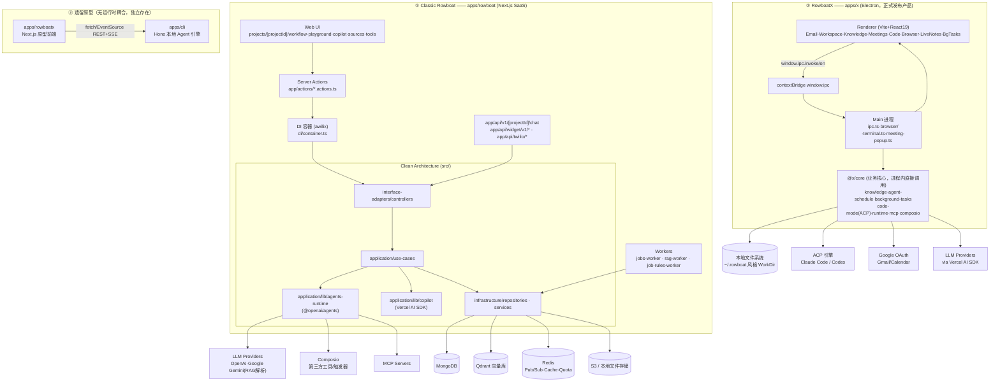
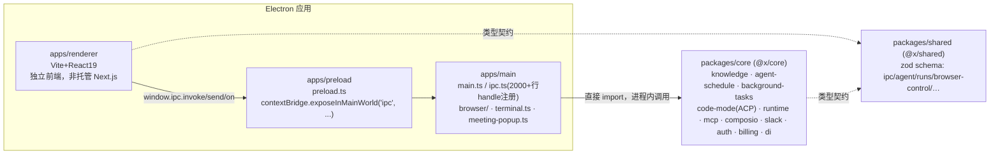
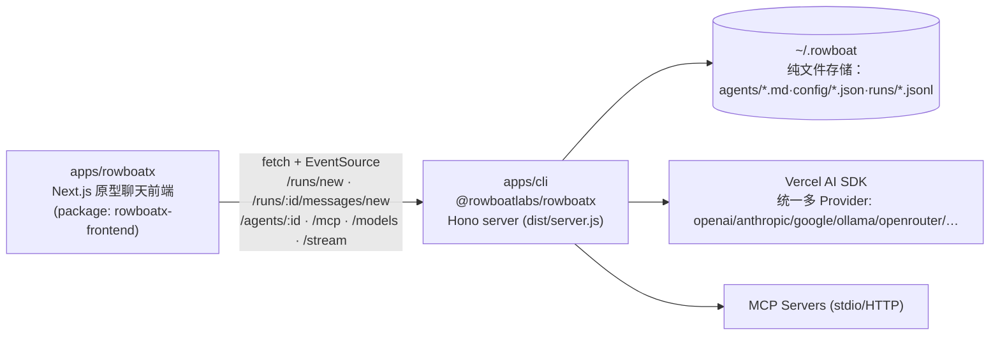

# Rowboat 技术架构图与深度解读

> 基于 `opensource/rowboat` 代码结构分析。该 monorepo 实际包含**两代、彼此独立的产品**：
> 1. **Classic Rowboat**（`apps/rowboat`）——多 Agent 工作流构建 SaaS 平台（Next.js Web 应用）
> 2. **RowboatX**（`apps/x` + `apps/rowboatx` + `apps/cli`）——桌面 "AI 同事" 应用，具备知识图谱、邮件、浏览器、会议记录、后台 Agent 等能力，其中 `apps/x` 是当前实际发布的产品，`apps/cli`/`apps/rowboatx` 是被搁置的早期原型架构

两者共享部分理念（多 Agent、MCP、工具调用）但代码完全独立，无运行时耦合。

---

## 1. 项目全景

```
opensource/rowboat/
├── apps/rowboat        # Classic Rowboat：Next.js SaaS，Clean Architecture，MongoDB+Qdrant+Redis
├── apps/x               # RowboatX 正式产品：Electron 桌面壳（main/renderer/preload/core/shared）
├── apps/rowboatx         # 【遗留原型】Next.js 聊天前端，对接 apps/cli 的 REST/SSE
├── apps/cli              # 【遗留原型】@rowboatlabs/rowboatx，本地 Hono Agent 引擎（CLI + Server）
├── apps/python-sdk       # Classic Rowboat 的 Python 客户端 SDK（薄封装 /api/v1/{projectId}/chat）
├── apps/docs              # 文档站
└── apps/experimental       # chat_widget / tools_webhook / simulation_runner 实验性子项目
```

## 2. 总体架构图



---

## 3. Classic Rowboat（`apps/rowboat`）深度解读

### 3.1 定位

一个多租户 SaaS：用户在 Web UI 中搭建"多 Agent 工作流"（Workflow：多个 Agent + 转接/流水线关系 + 工具 + RAG 数据源），可在 Playground 中调试，发布为 `liveWorkflow` 后通过 `/api/v1/{projectId}/chat`（REST + SSE）、可嵌入的 Chat Widget、Twilio 语音通道对外提供服务。内置 **Copilot**（会自己使用 AI 帮你搭建/编辑工作流的元 Agent）。

### 3.2 Clean Architecture 分层

`apps/rowboat/src` 严格四层：

| 层 | 目录 | 职责 |
|---|---|---|
| Entities | `src/entities/models/*.ts` | 纯 Zod schema，无框架依赖：`Project`、`Conversation`、`Turn`、`Job`、`DataSource`、`Copilot`、`ComposioTriggerDeployment`、`ApiKey`、`User` 等 |
| Application | `src/application/{use-cases,repositories,policies,services,lib,workers}` | 业务规则：一个操作一个 `*.use-case.ts` 类，构造函数注入接口依赖 |
| Interface Adapters | `src/interface-adapters/controllers/<domain>/*.controller.ts` | 薄适配层，Zod 校验请求，转调唯一一个 use-case |
| Infrastructure | `src/infrastructure/{repositories,mongodb,services,policies}` | MongoDB/Redis/S3 等具体实现 |

依赖注入：`apps/rowboat/di/container.ts` 用 **awilix**（`InjectionMode.PROXY`），数百个绑定按领域分组（projects/conversations/copilot/composio/jobs/…），所有 use-case/controller 构造函数用参数名解构方式接收依赖；`app/actions/*.actions.ts`（Server Actions）与独立 worker 脚本（`jobs-worker.ts`、`rag-worker.ts`）都从同一 `container` 里 resolve。

**请求全链路示例（创建 Project）**：
`Server Action` → `CreateProjectController`（Zod 校验）→ `CreateProjectUseCase.execute`（配额鉴权 → 套用模板生成 Workflow → 生成 `secret`）→ `MongodbProjectsRepository.create`（写入 `projects` 集合，`draftWorkflow`/`liveWorkflow` 各存一份）。

**对话轮次**：`RunConversationTurnUseCase` 取 `Conversation` → 鉴权（用户会话或 API Key）→ 配额/计费校验 → 调用 `application/lib/agents-runtime/agents.ts` 的 `streamResponse(...)` → 流式 `TurnEvent` 落库 `conversationsRepository.addTurn`。

### 3.3 Agents Runtime（多 Agent 执行引擎）

`src/application/lib/agents-runtime/agents.ts`（约 66KB）基于 **`@openai/agents` SDK**，通过 `@openai/agents-extensions` 的 `aisdk()` 适配器把 Vercel AI SDK 的模型对象接入（因此任意 OpenAI 兼容/自定义 `PROVIDER_BASE_URL` 模型都可用）。核心：

- 入口 `streamResponse(projectId, workflow, messages, usageTracker)`：根据 Workflow 构建 `agentConfig/toolConfig/promptConfig/pipelineConfig`，创建工具（`agent-tools.ts`），按 `USE_NATIVE_HANDOFFS` 开关走 legacy 转接工具或原生 SDK handoff。
- 手写栈式 `turnLoop`：对每个激活 Agent 调用 SDK 的 `run(agent, inputs, {stream:true, maxTurns})`，总转接次数上限 `MAXTURNITERATIONS=25`。
- `WorkflowPipeline`（顺序执行的 Agent 子流程）由 `pipeline-state-manager.ts` 的 `PipelineStateManager` 跟踪状态。
- RAG 工具 `createRagTool`：若 Agent 配置了 `ragDataSources` 则接入，查询时打 Qdrant `embeddings` 集合。
- MCP 工具：`app/lib/mcp.ts` 的 `getMcpClient` 优先 `StreamableHTTPClientTransport`，失败降级 `SSEClientTransport`；每次调用现连现断，无常驻连接池。
- Composio 工具：`config.isComposio` 分支直连 Composio SDK 执行第三方动作。

### 3.4 Copilot（工作流搭建助手）

与"执行工作流"的 Agents Runtime 完全独立，走 Vercel AI SDK（`generateObject`/`streamText`/`tool`，非 `@openai/agents`）。系统提示词由 `COPILOT_INSTRUCTIONS_MULTI_AGENT` + 55KB 的完整范例 `example_multi_agent_1.ts` + `zodToJsonSchema(Workflow)` 拼装而成，使模型理解并能直接输出/编辑 `Workflow` schema。支持在 `USE_COMPOSIO_TOOLS` 开启时联想真实第三方工具。采用"缓存 turn + SSE 轮询"模式（`create-copilot-cached-turn` → `app/api/copilot-stream-response/[streamId]`），绕开无服务器函数的执行时长限制。

### 3.5 数据 / RAG / 任务系统

- **MongoDB**：`app/lib/mongodb.ts` 提供共享 `db` 句柄；索引集中在 `src/infrastructure/mongodb/ensure-indexes.ts`。集合含 `projects`、`conversations`、`jobs`、`data_sources`、`data_source_docs`、`composio_trigger_deployments` 等；`jobs`/`data_source_docs` 通过 `findOneAndUpdate` 实现原子"轮询领取任务"队列（无需外部队列中间件）。
- **RAG**：独立长驻进程 `app/scripts/rag-worker.ts`（`while(true)` 轮询 Mongo，5s 空闲休眠）。管线：Firecrawl 爬取 / OpenAI or Gemini(`gemini-2.5-flash`) 解析文件 → LangChain `RecursiveCharacterTextSplitter`（1024/20）切块 → `embedMany`（默认 `text-embedding-3-small`）→ 写入 **Qdrant**（`embeddings` collection，向量维度默认 1536，`Dot` 距离）。
- **任务调度**：`JobRulesWorker` 轮询 `scheduled_job_rules`/`recurring_job_rules`（cron-parser 校验表达式）产生 `Job`；`JobsWorker` 双通道消费——订阅 Redis `new_jobs` 频道做低延迟触发 + 5s 兜底轮询——执行时驱动 `RunConversationTurnUseCase`。
- **Redis**：`ioredis`，无 BullMQ，手写 Pub/Sub（`RedisPubSubService`）+ 缓存（`RedisCacheService`）+ 配额策略（`RedisUsageQuotaPolicy`）。

### 3.6 集成能力

- **Composio**：`@composio/core` + 手写 REST 封装，管理第三方连接账号（OAuth 或自定义 API Key）、工具目录、**触发器部署**（如新邮件/新 Slack 消息 → Webhook → `handle-composio-webhook-request.use-case.ts`，可驱动新一轮任务/对话）。
- **文件存储**：`S3UploadsStorageService`（预签名 URL）与本地磁盘实现二选一。
- **Twilio 语音通道**：代码仍在但 `inbound_call` 路由当前被硬编码短路为 `501 Not implemented`——遗留功能已停用。
- **Chat Widget**：`apps/experimental/chat_widget` 内嵌 iframe，走 `app/api/widget/v1/*`（沿用较老的 `apiV1.Chat` schema）。
- **鉴权/计费**：Auth0，`USE_AUTH`/`USE_BILLING` 特性开关可选启用（自托管场景可全关，走 Guest 用户）；API Key 走独立配额消费路径。

### 3.7 前端结构

`app/projects/[projectId]/` 下按功能分路由：`workflow`（画布式多 Agent 编排器）、`playground`（调试聊天）、`copilot`（AI 搭建助手对话面板）、`sources`（RAG 数据源管理）、`tools`（MCP/Composio 工具配置）、`manage-triggers`（触发器部署管理）。`app/lib/prebuilt-cards/*.json` 提供开箱模板（客服、GitHub→Slack、面试排期等）。

---

## 4. RowboatX（`apps/x`）—— 正式发布的桌面产品

### 4.1 产品定位

"桌面 AI 同事"：把邮件、会议、Slack、对话历史索引为可回链的知识图谱（"Brain"），并内建邮件客户端、笔记、隔离浏览器、Code Mode（接入 Claude Code / Codex）、会议记录、后台 Agent（定时/事件触发，可联网、用浏览器、写代码）等工作面。

### 4.2 进程/模块划分

`apps/x` 是嵌套 pnpm workspace，构建顺序 `shared → core → {main, preload, renderer}`：



- **Main 进程**：单一 `BrowserWindow`，加载打包后的 `app://-/index.html` 或开发态 `http://localhost:5173`；`ipc.ts` 是巨大的 handler 注册表，把 `@x/core` 的服务能力桥接给 renderer；另有内嵌终端（node-pty）、会议弹窗（独立小窗口）、托盘、自动更新、深链、OAuth handler。
- **Preload**：只暴露一层通用 `invoke/send/on` 泛型 IPC（类型契约集中在 `@x/shared/src/ipc.ts`），而非几十个具名方法。
- **Renderer**：真正的产品 UI（Email/Workspace/Knowledge/Meetings/Code/Browser/LiveNotes/BgTasks 等视图），只通过 `window.ipc` 与主进程通信。
- **Core**：所有业务逻辑，main 进程内直接 `import` 调用（同进程，无 HTTP 跳转，无子进程 server）。

### 4.3 知识图谱（"Brain"）流水线

`packages/core/src/knowledge/build_graph.ts` 编排：

1. **同步**：`sync_gmail.ts`/`sync_calendar.ts`/`sync_fireflies.ts`（会议转写）/`sync_slack.ts`/Granola 等把外部数据写为本地 WorkDir 下的 Markdown 文件。
2. **变更检测**：`graph_state.ts` 用 mtime + SHA-256 混合缓存，只处理新增/变更文件。
3. **准入过滤**：邮件同步阶段先由 `classify_thread.ts` 打上 `knowledge: extract|skip` frontmatter；**"Email Reply Gate"**——用户从未回复过的冷邮件线程一律拦截创建笔记（因为交给 LLM 判断在测试中产生了 7/14 的误报笔记，属实测驱动的工程决策）。
4. **抽取**：`createNotesFromBatch`（`BATCH_SIZE=1`，刻意逐文件处理以防跨文件实体污染）用 `note_creation` Agent 生成/更新笔记，并注入"Owner Of This Memory"身份块，防止 Agent 把用户本人也当成一个实体记录。
5. **数据模型**：Obsidian 风格 Markdown 笔记，按 `People/Organizations/Projects/Topics` 分类存放，互相 wikilink 回链；每日"园丁"任务 `curateNotes()` 把活动记录≥8 条的笔记归纳压缩为按日期的关键事实，git 版本化（`version_history.ts`）。
6. **调度**：`init()` 每 15s 跑一次增量处理，每日跑一次整理，作为常驻服务循环。

### 4.4 后台 Agent 系统

两个相关但独立的子系统：

- `agent-schedule/`：用户自定义定时任务，支持 `cron`/`window`（cron 锚点+随机时间窗，用于"今天下午某时"这类语义）/`once` 三种调度，60s 轮询 + 可被唤醒立即触发。
- `background-tasks/`：README 中"事件或计划触发的后台 Agent"。每个任务是磁盘上的 `bg-tasks/<slug>/task.yaml`，15s 轮询到期任务，支持崩溃恢复（磁盘持久化退避/进行中状态）。Agent 运行有三种模式：**OUTPUT**（维护 `index.md`）、**ACTION**（执行副作用并记录）、**CODE MODE**（消息携带 `# Coding task` 时调用 `launch-code-task`，切到隔离 git worktree 全自动跑 Claude Code/Codex）。
- `code-mode/acp/`：实现 Agent Client Protocol，桥接原生分发的 `@anthropic-ai/claude-agent-sdk-<platform>` 与 `@agentclientprotocol/codex-acp` 二进制，管理隔离会话/worktree。

### 4.5 内建浏览器

不是基于 Playwright/CDP，而是直接用 Electron 的 `WebContentsView`（`apps/main/src/browser/view.ts`）：所有标签共享持久化分区 `persist:rowboat-browser`（Cookie/登录态跨重启保留）；伪装真实 Chrome UA（动态读取运行时 Chromium 版本，避免客户端提示不一致触发反爬）；DOM 自动化通过 `executeJavaScript` 注入脚本完成（点击/输入/滚动/读页面），而非 CDP 协议调用；集成 `electron-chrome-extensions` 支持真实 Chrome 扩展；`browser-skills/` 实现"网站特化自动化配方"匹配系统。

### 4.6 会议记录

- **环境感知式检测**，默认不主动录音：macOS 原生 Swift 助手 `mic-monitor.swift` 上报麦克风占用及具体应用（因为 Electron 子进程在采集时会遇到 `EBADF`，遂用原生辅助进程规避）；映射 Zoom/Teams/Webex→会议、Slack→huddle、FaceTime/WhatsApp→通话；与日历事件（±15min）合并识别，检测到后弹出"记录笔记？"确认窗口，用户确认才开始。
- **转写**：本地配置 Deepgram(STT)/ElevenLabs(TTS)，或登录态下代理走 Rowboat 自有网关。
- **总结**：`summarize_meeting.ts` 用 Vercel AI SDK 生成结构化 Markdown（含 Action items），高置信度时把"Speaker N"替换为真实姓名，随后转写记录作为一等公民文件源直接汇入知识图谱管线。

---

## 5. 遗留原型架构（`apps/rowboatx` + `apps/cli`）

代码库中同时保留着一套**未被 apps/x 依赖、彼此独立**的更早期方案：



- `apps/rowboatx` 是一个基本已废弃的原型（`README.md` 仍是 `create-next-app` 默认文本），通过 `window.config.apiBase` + 纯 `fetch`/`EventSource` 对接 `apps/cli` 的 REST+SSE 接口，与 `apps/x` renderer 的 `window.ipc` 方式完全不同。
- `apps/cli`（bin: `rowboatx`）是一个可独立运行的本地 Agent 引擎：Hono Server 暴露 `/runs/:id/messages/new`、`/runs/:id/permissions/authorize`、`GET /stream`（SSE）等；核心执行是 `agents/runtime.ts` 里的递归异步生成器 `streamAgent()`，包装 Vercel AI SDK 的 `streamText({stopWhen: stepCountIs(1)})` 做单步流式工具调用循环；awilix DI 容器很小（无租户概念）；**存储完全基于本地文件**（`~/.rowboat/agents/*.md`、`config/models.json`、`config/mcp.json`、`runs/*.jsonl` 事件日志重放重建状态），无数据库。
- 该目录下默认交互式 CLI 命令（`rowboatx` 无子命令）目前抛出 `Not implemented`，属于未完工代码；Gmail/Calendar 知识同步脚本用 `@google-cloud/local-auth` 做 OAuth，但硬编码 `process.cwd()` 路径，未接入主 DI/Server，同样像是被搁置的原型。
- 结论：`apps/cli`/`apps/rowboatx` 与 `apps/x` **没有任何 import/spawn 依赖关系**（`apps/x` 内对 `rowboatx` 的引用仅是同名 MCP server 配置项），是被替代的历史架构分支，仓库中并存但互不调用。

---

## 6. 辅助模块

- **`apps/python-sdk`**：极薄的 Python 客户端（`Client(host, projectId, apiKey)`），封装 `POST /api/v1/{projectId}/chat`，供第三方系统调用 Classic Rowboat 已发布的 Workflow。
- **`apps/experimental`**：`chat_widget`（可嵌入网站的聊天挂件，独立 Next.js 应用）、`tools_webhook`、`simulation_runner`（工作流仿真/回归测试用）。
- **`apps/docs`**：产品文档站。

---

## 7. 两代产品对比小结

| 维度 | Classic Rowboat（apps/rowboat） | RowboatX（apps/x） |
|---|---|---|
| 形态 | 多租户 Web SaaS | 单机 Electron 桌面应用 |
| 架构风格 | 严格 Clean Architecture + awilix DI | 领域目录（knowledge/agent-schedule/code-mode/…）+ 小型 DI |
| Agent 执行 | `@openai/agents` SDK，经 `aisdk()` 桥接多模型 | 自研 runtime，进程内直接调用 |
| 存储 | MongoDB + Qdrant + Redis + S3 | 本地文件（Markdown 知识库 + git 版本化）|
| 核心卖点 | 多 Agent 工作流搭建 + Copilot 自动搭建 | 知识图谱 + 邮件/浏览器/会议一体化 + 后台 Agent + Code Mode |
| 对外集成 | Composio（第三方 SaaS 工具+触发器）、MCP、Twilio(已禁用) | Google OAuth(Gmail/Calendar)、Slack、Composio、ACP(Claude Code/Codex)、原生浏览器自动化 |
