# Claude Code 深度技术架构流程图

> 基于 `opensource/claude-code-main/src` 源码逐模块深度剖析（~1900 文件 / 512K+ 行 TypeScript，Bun 运行时，React + Ink 终端 UI）。
> 所有关键路径均标注 `文件:行号`，可直接跳转源码。

---

## 目录

1. [顶层系统架构总览](#1-顶层系统架构总览)
2. [启动与入口分发流程](#2-启动与入口分发流程)
3. [核心 Agent 循环（query loop）](#3-核心-agent-循环query-loop)
4. [模型调用与流式处理](#4-模型调用与流式处理)
5. [工具系统抽象与执行编排](#5-工具系统抽象与执行编排)
6. [权限系统（两层设计）](#6-权限系统两层设计)
7. [上下文与 Token 管理（压缩机制）](#7-上下文与-token-管理压缩机制)
8. [Slash 命令系统](#8-slash-命令系统)
9. [外部服务层（MCP / Auth / LSP / GrowthBook）](#9-外部服务层mcp--auth--lsp--growthbook)
10. [多 Agent 编排（Coordinator / Swarm / Tasks）](#10-多-agent-编排coordinator--swarm--tasks)
11. [Skills 与 Plugins 系统](#11-skills-与-plugins-系统)
12. [记忆系统（三套）](#12-记忆系统三套)
13. [生命周期 Hooks 系统](#13-生命周期-hooks-系统)
14. [IDE Bridge / Remote / Server](#14-ide-bridge--remote--server)
15. [端到端一次对话完整时序](#15-端到端一次对话完整时序)
16. [关键文件索引](#16-关键文件索引)

---

## 1. 顶层系统架构总览

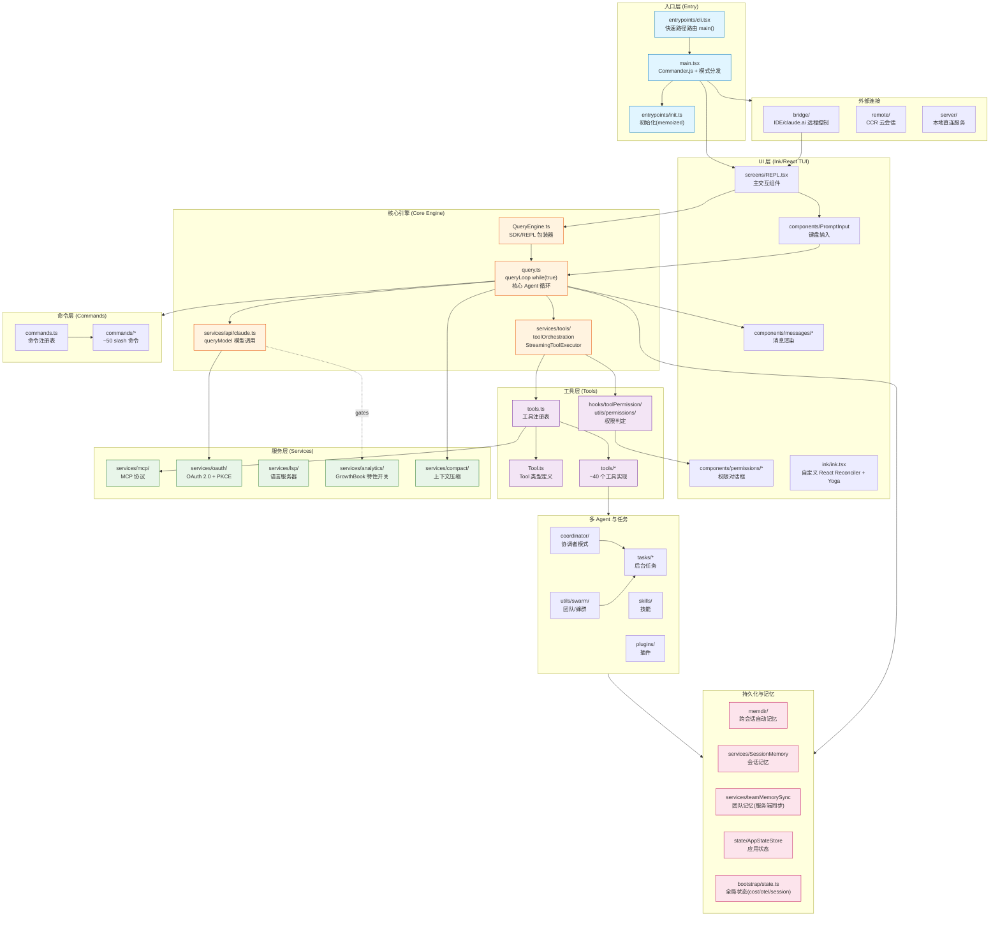

**技术栈**：Bun 运行时 · TypeScript(strict) · React + Ink(终端 React) · Commander.js(CLI 解析) · Zod v4(schema) · ripgrep(搜索) · MCP SDK + LSP · Anthropic SDK · OpenTelemetry + gRPC(遥测) · GrowthBook(特性开关) · OAuth 2.0/JWT/Keychain(认证)。

**两套"开关"机制**（贯穿全局）：
- `feature('X')`（来自 `bun:bundle`）：**构建期** 死代码消除宏（全库 196 处），按构建口味(external / ant)裁剪整段代码。
- **GrowthBook** 运行时标志：远程评估的按用户灰度开关，`getFeatureValue_CACHED_MAY_BE_STALE()`。

---

## 2. 启动与入口分发流程

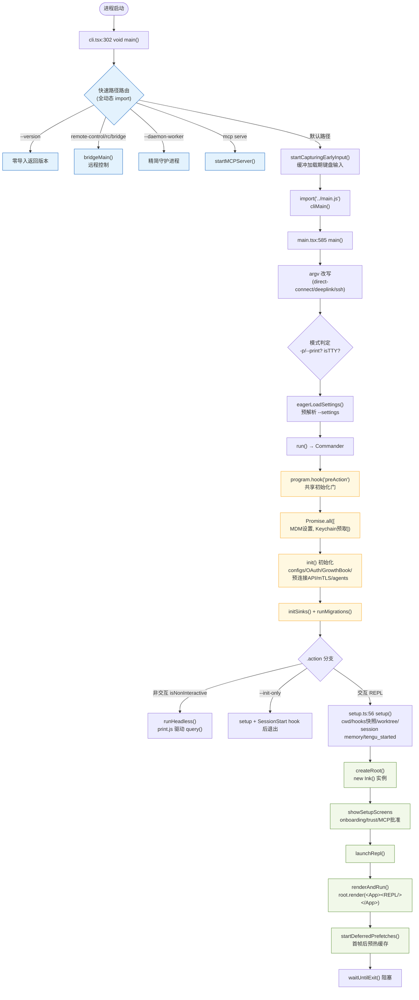

**启动优化三板斧**：
- **模块级并行预取**（`main.tsx:1-20`，在重导入前触发）：`startMdmRawRead()`（MDM 子进程，重叠 ~135ms 导入）、`startKeychainPrefetch()`（macOS 钥匙串双读并行，省 ~65ms）。在 `preAction` 处 join。
- **懒加载**：几乎每个屏幕/对话框都是动态 `import()`；OpenTelemetry(~400KB)、gRPC(~700KB) 延迟到实际使用。
- **API 预连接**：`preconnectAnthropicApi()` 在 init 阶段与后续 action 处理重叠 TLS 握手。

---

## 3. 核心 Agent 循环（query loop）

> `query.ts` 的 `queryLoop()` 是真正的 Agent 主循环（`query.ts:307` 的 `while(true)`）。`QueryEngine.ts` 只是 SDK/REPL 侧包装器，本身不含循环。

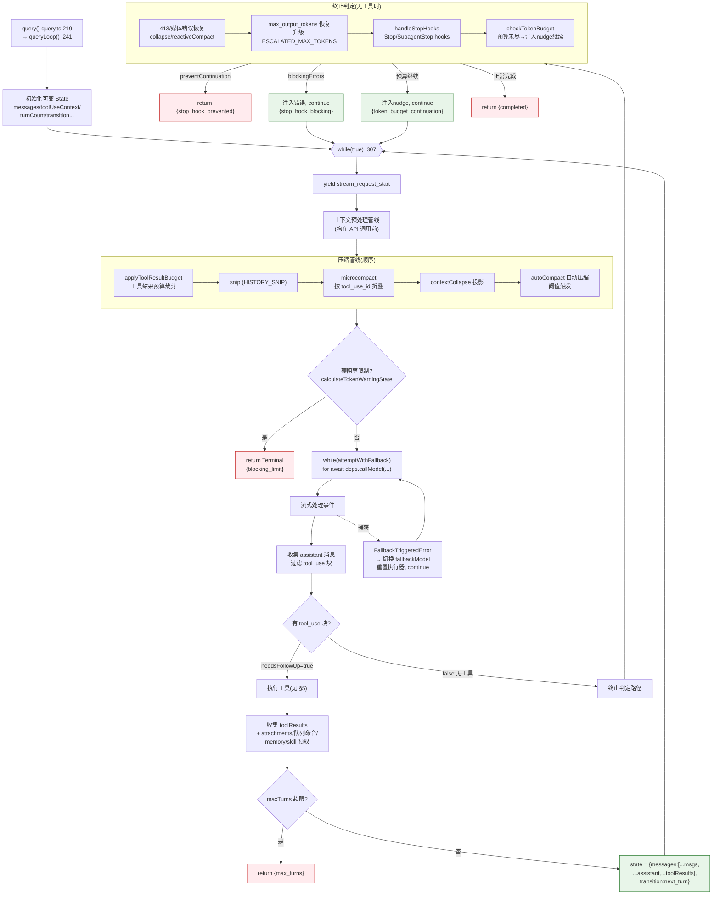

**循环关键点**：
- **工具检测靠 tool_use 块存在性**（非 `stop_reason`，注释 `query.ts:554` 指出后者不可靠）。
- **Terminal 终止原因**：`blocking_limit / image_error / model_error / aborted_streaming / prompt_too_long / completed / stop_hook_prevented / aborted_tools / hook_stopped / max_turns`。
- **Continue 续跑原因**：`collapse_drain_retry / reactive_compact_retry / max_output_tokens_escalate / max_output_tokens_recovery / stop_hook_blocking / token_budget_continuation / next_turn`。
- **Stop hook 可强制模型继续工作**：返回 `blockingErrors` 时注入并 continue。

---

## 4. 模型调用与流式处理

> `deps.callModel = queryModelWithStreaming`（`claude.ts:752`）→ `queryModel`（`claude.ts:1017`）。

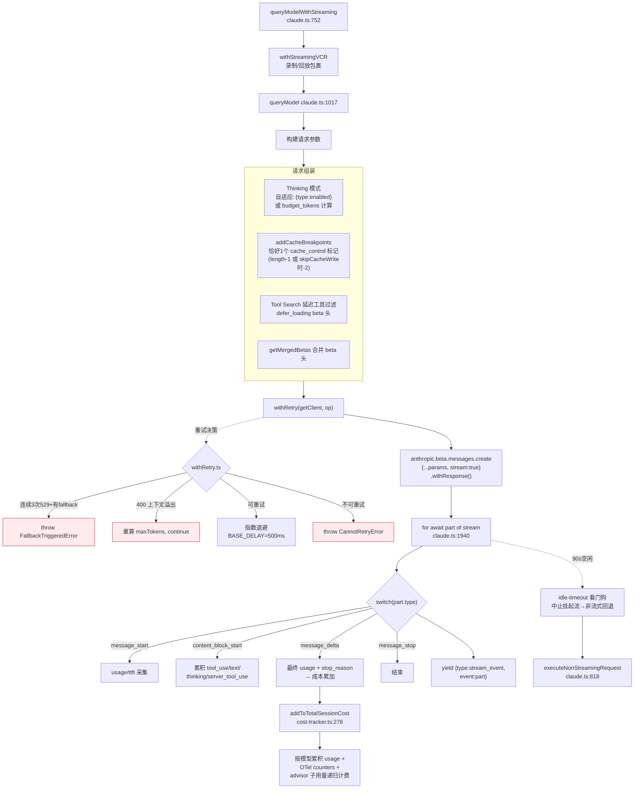

**要点**：
- **Thinking 模式**：开启时 `temperature` 强制为 1（API 要求）；关闭时才可自定义温度。
- **Prompt 缓存**：`skipCacheWrite`（fire-and-forget fork）时缓存标记放 `length-2`，共享父级缓存。
- **多 Provider**：`getAnthropicClient` 按 env 分支 Bedrock / Foundry(Azure) / Vertex / 第一方。

---

## 5. 工具系统抽象与执行编排

### 5.1 Tool 类型抽象（`Tool.ts`）

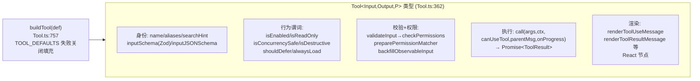

`buildTool` 默认值（fail-closed）：`isEnabled→true`、`isConcurrencySafe→false`、`isReadOnly→false`、`isDestructive→false`、`checkPermissions→{allow}`。

### 5.2 工具注册与组装

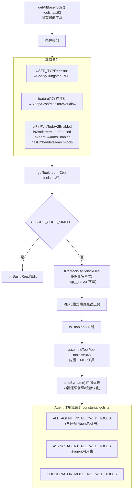

### 5.3 工具执行编排（两条路径）

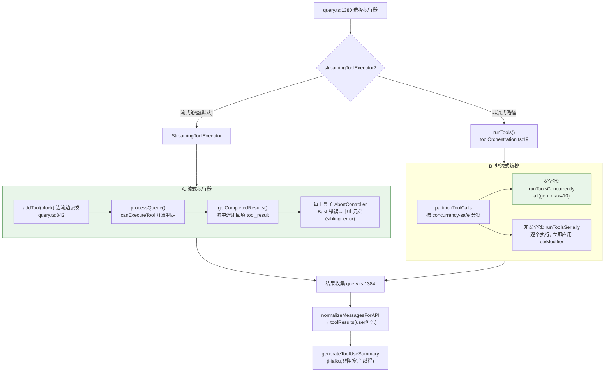

**并发模型**：连续的 **只读/并发安全** 工具组成一批并发执行（默认上限 10，env `CLAUDE_CODE_MAX_TOOL_USE_CONCURRENCY`）；**写/非安全** 工具串行执行且立即应用上下文修改。

### 5.4 单个工具执行内部流程（以 FileEdit 为例）

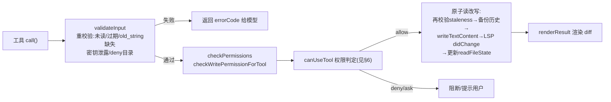

---

## 6. 权限系统（两层设计）

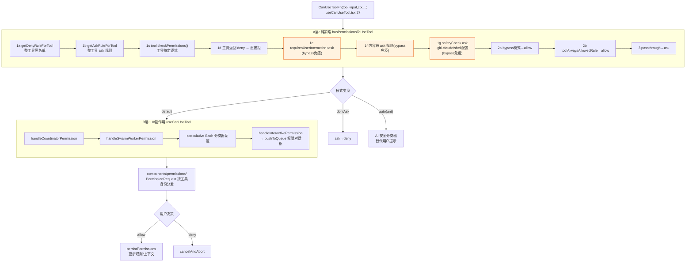

**权限模式**：

| 模式 | 效果 |
|---|---|
| `default` | 完整管线，`ask` 提示用户 |
| `plan` | 只读意图；若从 bypass 启动亦可放行 |
| `acceptEdits` | 编辑经工具 checkPermissions 快速放行 |
| `bypassPermissions` | 2a 全放行，除 1d/1e/1f/1g 免疫项 |
| `dontAsk` | `ask` → `deny` |
| `auto`(ant) | `ask` 走 AI 安全分类器而非用户 |

**规则来源分层**：`userSettings / projectSettings / localSettings / flagSettings / policySettings / cliArg / command / session`。Shell 命令按 AST 拆分匹配（`ls && git push` 会触发 `Bash(git *)` 规则）。

---

## 7. 上下文与 Token 管理（压缩机制）

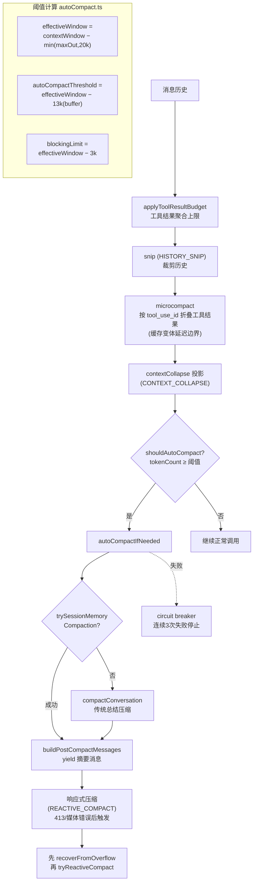

**核心概念**：`task_budget.remaining` 跨压缩边界追踪服务端可见预算（每次压缩减去触发点的最终上下文窗口）。**Token 预算**（`TOKEN_BUDGET`）：预算未尽且未见收益递减时注入 nudge 消息续跑。

---

## 8. Slash 命令系统

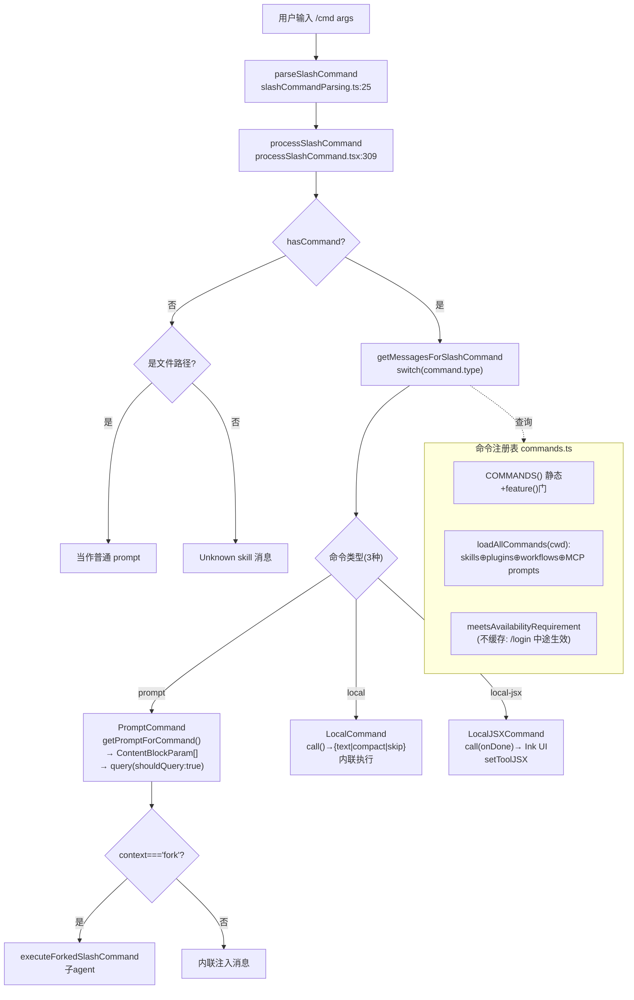

**命令三态**（区分核心）：`prompt`(转成查询/skills/MCP prompts) · `local`(内联返回文本/压缩) · `local-jsx`(渲染 Ink UI)。示例：`/compact`(local)、`/review`(prompt)、`/mcp`/`/config`/`/resume`/`/model`(local-jsx)。

---

## 9. 外部服务层（MCP / Auth / LSP / GrowthBook）

### 9.1 MCP 集成

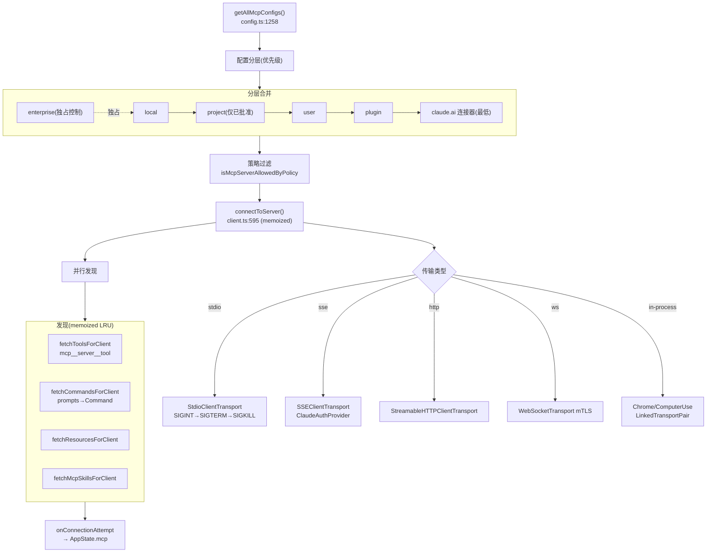

### 9.2 认证流程

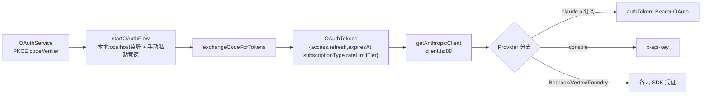

### 9.3 特性开关（双机制）
- **`feature('X')`**：构建期宏（`bun:bundle`）→ 整段死代码消除。
- **GrowthBook**：`getGrowthBookClient()`(memoized，**trust 建立后** 才带认证头)；`getFeatureValue_CACHED_MAY_BE_STALE()`(首选，非阻塞：env→config→内存→磁盘缓存→默认)。登录/登出时 `refreshGrowthBookAfterAuthChange()` 重建客户端。

**设置分层**（后覆盖前）：`userSettings < projectSettings < localSettings < flagSettings < policySettings`。**模型选择优先级**：`/model` 覆盖 > `--model` > `ANTHROPIC_MODEL` > `settings.model` > 订阅默认。

---

## 10. 多 Agent 编排（Coordinator / Swarm / Tasks）

> 两种正交的多 Agent 模型：**Coordinator/Worker**（单领导派发一次性异步 worker）与 **Swarm/Team**（持久化领导 + 命名长活 teammate 互相通信）。

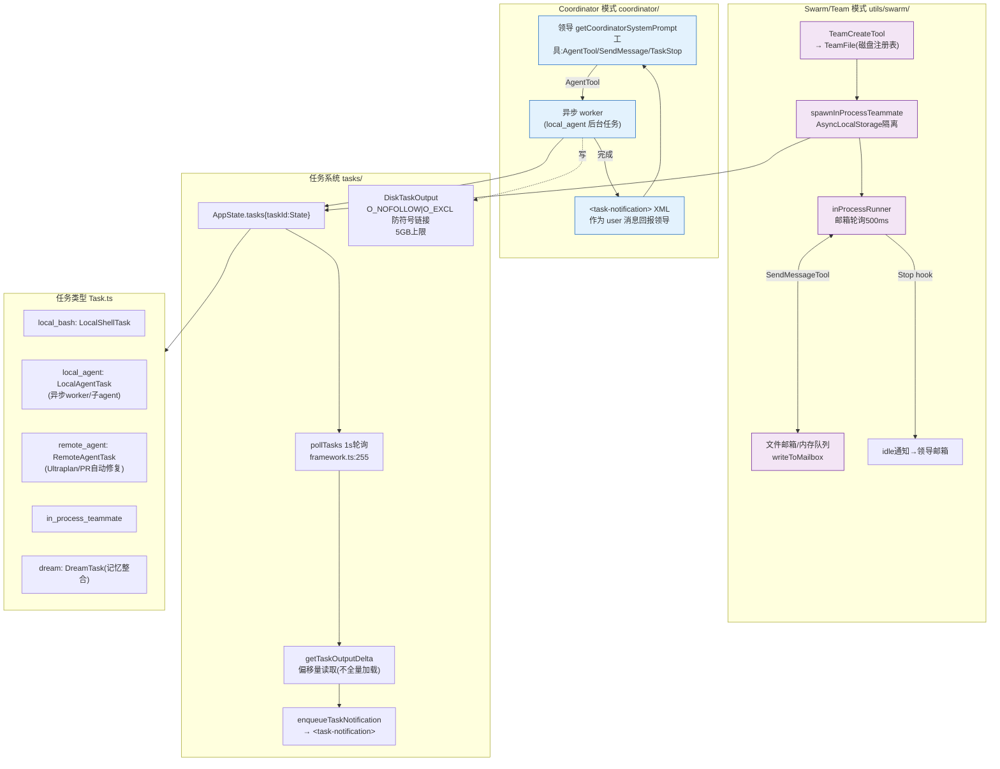

**AgentTool 递归**：`call()` → `runAgent()` 返回 Message 异步迭代器（嵌套 query 引擎回合）。子 agent 用受限工具集(`ASYNC_AGENT_ALLOWED_TOOLS`)，`createSubagentContext` 隔离(`setAppState` no-op)，`queryTracking={chainId,depth}` 追踪递归深度。非 ant 用户的 `AgentTool` 在禁用列表中防止无限递归。**自动后台化**：foreground agent 运行 120s 后自动翻转为 `isBackgrounded`。

---

## 11. Skills 与 Plugins 系统

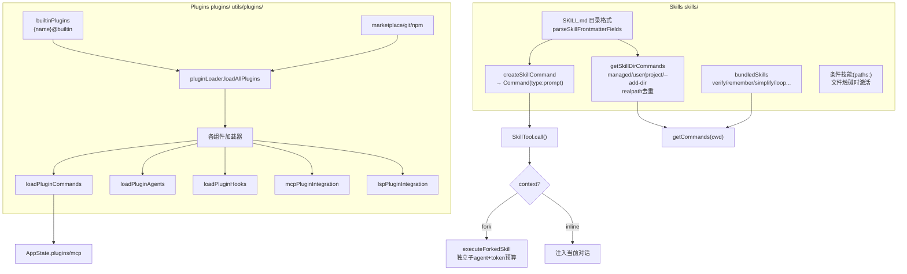

---

## 12. 记忆系统（三套）

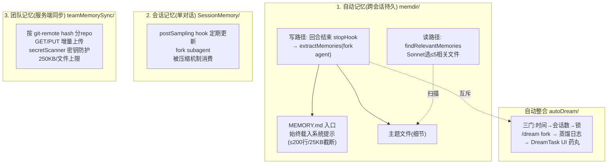

**关键设计**：主 agent 若本回合已写记忆，fork 提取器跳过该区间（互斥）。团队记忆 pull=服务端优先/key，push=仅变更 hash 增量(删除不传播)。

---

## 13. 生命周期 Hooks 系统

> 注意区分：**生命周期 Hooks**(`utils/hooks.ts` 设置驱动) vs **React Hooks**(`hooks/*.tsx` UI 状态) vs **编程式 Hooks**(`postSamplingHooks`)。

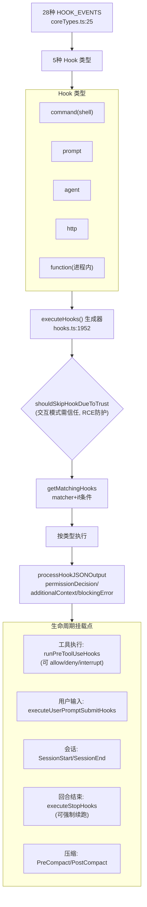

**关键事件**：`PreToolUse / PostToolUse / UserPromptSubmit / SessionStart / SessionEnd / Stop / SubagentStop / PreCompact / PostCompact / PermissionRequest / TeammateIdle / TaskCreated/Completed` 等。安全门：交互模式下**所有** hook 需工作区信任(防 RCE)。

---

## 14. IDE Bridge / Remote / Server

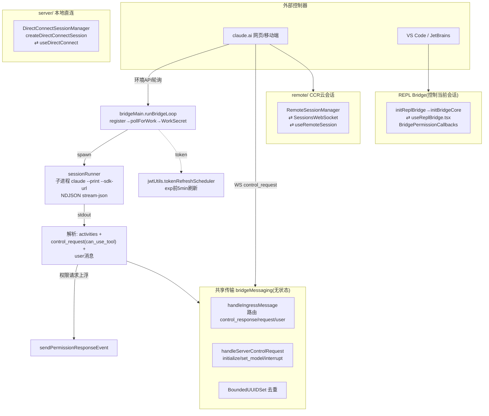

**三种远程传输**：`bridge/`(claude.ai/IDE 远程控制，spawn 子进程或附着 REPL) · `remote/`(CCR 云容器会话，WS 订阅) · `server/`(自托管本地直连，无 claude.ai 后端)。

---

## 15. 端到端一次对话完整时序

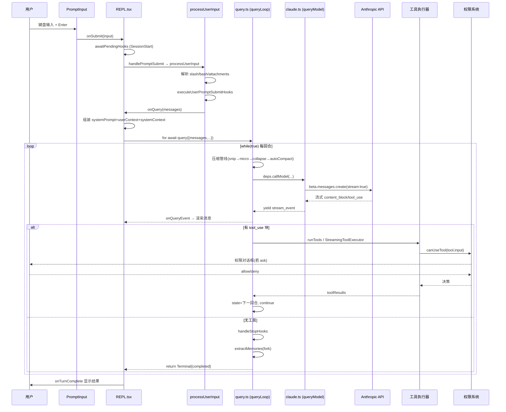

---

## 16. 关键文件索引

| 子系统 | 核心文件 |
|---|---|
| **入口/启动** | `entrypoints/cli.tsx` · `main.tsx`(`main`/`run`/`.action`) · `entrypoints/init.ts` · `setup.ts` |
| **全局状态** | `bootstrap/state.ts`(cost/otel/session) · `state/AppStateStore.ts`(AppState) |
| **核心循环** | `query.ts`(`queryLoop` while循环) · `QueryEngine.ts` · `query/{config,deps,stopHooks,tokenBudget}.ts` |
| **模型调用** | `services/api/claude.ts`(`queryModel`) · `services/api/withRetry.ts` · `cost-tracker.ts` |
| **工具系统** | `Tool.ts`(类型) · `tools.ts`(注册表) · `tools/*`(~40实现) · `services/tools/{toolOrchestration,StreamingToolExecutor}.ts` |
| **权限** | `utils/permissions/permissions.ts`(策略) · `hooks/useCanUseTool.tsx`(UI) · `hooks/toolPermission/PermissionContext.ts` · `constants/tools.ts`(agent作用域) |
| **压缩** | `services/compact/{autoCompact,compact,microCompact,reactiveCompact,sessionMemoryCompact}.ts` |
| **命令** | `commands.ts` · `types/command.ts` · `utils/processUserInput/{processSlashCommand,processUserInput}.tsx` |
| **MCP** | `services/mcp/{client,config,types}.ts` |
| **认证** | `services/oauth/{index,client}.ts` · `services/api/client.ts` · `utils/{http,auth}.ts` |
| **LSP** | `services/lsp/{config,LSPServerManager,manager}.ts` |
| **特性开关** | `services/analytics/growthbook.ts` · `bun:bundle` feature() |
| **设置/模型** | `utils/settings/{constants,settings}.ts` · `utils/model/model.ts` |
| **多 Agent** | `coordinator/coordinatorMode.ts` · `utils/swarm/{spawnInProcess,inProcessRunner,teamHelpers}.ts` · `tools/{AgentTool,TeamCreateTool,SendMessageTool}` |
| **任务** | `Task.ts` · `tasks/*` · `utils/task/{framework,diskOutput}.ts` |
| **Skills/Plugins** | `skills/{bundledSkills,loadSkillsDir}.ts` · `tools/SkillTool` · `plugins/builtinPlugins.ts` · `utils/plugins/pluginLoader.ts` |
| **记忆** | `memdir/{paths,findRelevantMemories}.ts` · `services/{extractMemories,SessionMemory,autoDream,teamMemorySync}` |
| **Hooks** | `utils/hooks.ts`(执行引擎) · `utils/hooks/*` · `entrypoints/sdk/coreTypes.ts`(事件) |
| **UI** | `screens/REPL.tsx` · `ink/ink.tsx` · `components/{messages,permissions,PromptInput}/*` |
| **Bridge/Remote** | `bridge/{bridgeMain,sessionRunner,replBridge,bridgeMessaging,jwtUtils}.ts` · `remote/RemoteSessionManager.ts` · `server/directConnectManager.ts` |
| **键盘/Vim** | `keybindings/{schema,resolver,match}.ts` · `vim/{types,transitions,operators}.ts` |

---

> 文档基于 6 份并行深度源码分析报告汇总（覆盖:入口启动 / 核心循环 / 工具权限 / 命令服务 / 多Agent技能插件 / Bridge远程UI）。所有 Mermaid 图可在支持 Mermaid 的 Markdown 查看器(如 VS Code + Markdown Preview Mermaid、Typora、GitHub)中渲染。
