# Hermes Agent 技术架构深度解读

> 对象：`opensource/hermes-agent`（Nous Research 出品的自我进化型 AI Agent）
> 方法：对 `run_agent.py`（AIAgent，1.6万行级）、`hermes_state.py`（SessionDB，7178 行）、`cli.py`（HermesCLI，1.6万行）、`gateway/run.py`（2.1万行）、`model_tools.py`、`toolsets.py`、`trajectory_compressor.py`、`agent/*`、`tools/environments/*`、`plugins/*`、`cron/*`、`acp_adapter/*`、`tui_gateway/*` 等核心模块的源码精读（含 file:line 级引用）。
> 结论先行：Hermes 的工程复杂度并不在"Agent 编排"本身，而集中在四条主线——**① 提示缓存（prompt cache）字节级稳定性不变量、② 弱模型/多供应商兼容性救援、③ 围绕 token 经济性的上下文与记忆分层、④ 单会话智能向多智能体/跨时间/自我改进的闭环扩展**。

---

## 0. 总览：Hermes 是什么

Hermes 是"唯一内建学习闭环"的开源 AI Agent：它从经验中创建技能（skill）、在使用中自我改进技能、周期性 nudge 自己沉淀知识、检索自己的历史会话、并跨会话构建对用户的深度画像。它不绑定笔记本电脑——可跑在 5 美元的 VPS、GPU 集群或近乎零成本闲置的 serverless 环境上，用户可从 Telegram 等平台远程驱动它在云端 VM 上工作。

### 0.1 七大能力支柱与对应模块

| 能力支柱 | 说明 | 核心模块 |
|---|---|---|
| 真正的终端界面 | 全功能 TUI：多行编辑、斜杠命令补全、会话历史、中断改向、流式工具输出 | `cli.py`、`ui-tui/`、`tui_gateway/` |
| 无处不在 | Telegram/Discord/Slack/WhatsApp/Signal/CLI 单一网关进程，语音转写、跨平台连续性 | `gateway/`、`gateway/platforms/` |
| 闭环学习 | Agent 自策展记忆 + 周期 nudge；复杂任务后自主建技能；技能使用中自改进；FTS5 会话检索 + LLM 摘要；Honcho 辩证式用户建模 | `agent/curator.py`、`agent/background_review.py`、`skills/`、`plugins/memory/` |
| 定时自动化 | 内建 cron 调度器，自然语言描述，投递到任意平台 | `cron/jobs.py`、`cron/scheduler.py` |
| 委派与并行 | 派生隔离子 Agent 并行工作流；写 Python 脚本经 RPC 调用工具，把多步流水线塌缩为零上下文成本的一轮 | `tools/delegate_tool.py`、`tools/code_execution_tool.py` |
| 运行在任何地方 | 六种终端后端：local/docker/ssh/singularity/modal/daytona；Daytona/Modal 提供 serverless 持久化 | `tools/environments/*` |
| 面向研究 | 批量轨迹生成、轨迹压缩，用于训练下一代工具调用模型 | `batch_runner.py`、`trajectory_compressor.py`、`mini_swe_runner.py` |

### 0.2 技术栈速览

- **语言/运行时**：Python 3.11（内核）+ TypeScript（Ink/React TUI、Electron 桌面、Docusaurus 站点）。
- **存储**：SQLite（会话 `state.db` + FTS5 全文检索 + trigram CJK 索引；Kanban board 独立 DB）。
- **UI**：Rich + prompt_toolkit（经典 CLI）、Ink 6 + React 19（现代 TUI）、xterm.js（浏览器 Dashboard PTY）。
- **模型接入**：`api_mode` 抽象（chat_completions / anthropic_messages / codex_responses / bedrock_converse / codex_app_server）+ 35 个供应商插件（openrouter/anthropic/nous/gemini/custom…），零锁定。
- **协议**：JSON-RPC（TUI 网关、ACP 编辑器集成、MCP 服务）、MCP（双向：既作服务器暴露自身，又作客户端接入外部）。
- **部署**：Docker（s6-overlay）、Nix flake、Homebrew、原生 Windows（MinGit + ConPTY）、Termux。

### 0.3 顶层目录结构（load-bearing 入口）

```
hermes-agent/
├── run_agent.py          # AIAgent 类 — 核心对话循环（薄转发壳 → agent/conversation_loop.py）
├── model_tools.py        # 工具编排：discover_builtin_tools()、handle_function_call()
├── toolsets.py           # 工具集定义、_HERMES_CORE_TOOLS 列表
├── cli.py                # HermesCLI 类 — 交互式 CLI 编排器
├── hermes_state.py       # SessionDB — SQLite 会话存储（FTS5 检索）
├── trajectory_compressor.py  # 离线训练数据压缩
├── batch_runner.py       # 并行批量轨迹生成
├── mcp_serve.py          # Hermes 作为 MCP 服务器
├── agent/                # Agent 内部（供应商适配、记忆、缓存、压缩、LSP、pet、transports…）
├── hermes_cli/           # CLI 子命令、setup 向导、插件加载器、皮肤引擎、命令注册表
├── tools/                # 工具实现（tools/registry.py 自动发现）
│   └── environments/     # 终端后端（local/docker/ssh/modal/daytona/singularity）
├── gateway/              # 消息网关 run.py + session.py + platforms/
│   └── platforms/        # 每平台一个适配器（telegram/discord/slack/whatsapp…）
├── plugins/              # 插件系统（memory / context_engine / model-providers / kanban…）
├── skills/ optional-skills/  # 内建技能 / 可选技能
├── ui-tui/               # Ink(React) 终端 UI（hermes --tui）
├── tui_gateway/          # TUI 的 Python JSON-RPC 后端
├── acp_adapter/          # ACP 服务器（VS Code / Zed / JetBrains 集成）
├── cron/                 # 调度器 jobs.py、scheduler.py
└── tests/                # Pytest 套件（约 1.7 万测试）
```

### 0.4 依赖链（导入方向）

```
tools/registry.py   (无依赖 — 被所有工具文件导入)
       ↑
tools/*.py          (每个在 import 时调用 registry.register())
       ↑
model_tools.py      (导入 tools/registry + 触发工具发现)
       ↑
run_agent.py, cli.py, batch_runner.py, environments/
```

---

## 总体架构流程图

下图是 Hermes 的**主数据流总图**：从任意入口（CLI/TUI/网关/ACP/Cron/Batch）汇聚到统一的 `AIAgent` 会话内核，内核在"提示缓存不变量"约束下组装上下文、调用模型、分发工具、治理长上下文，并把经验沉淀回技能/记忆闭环。

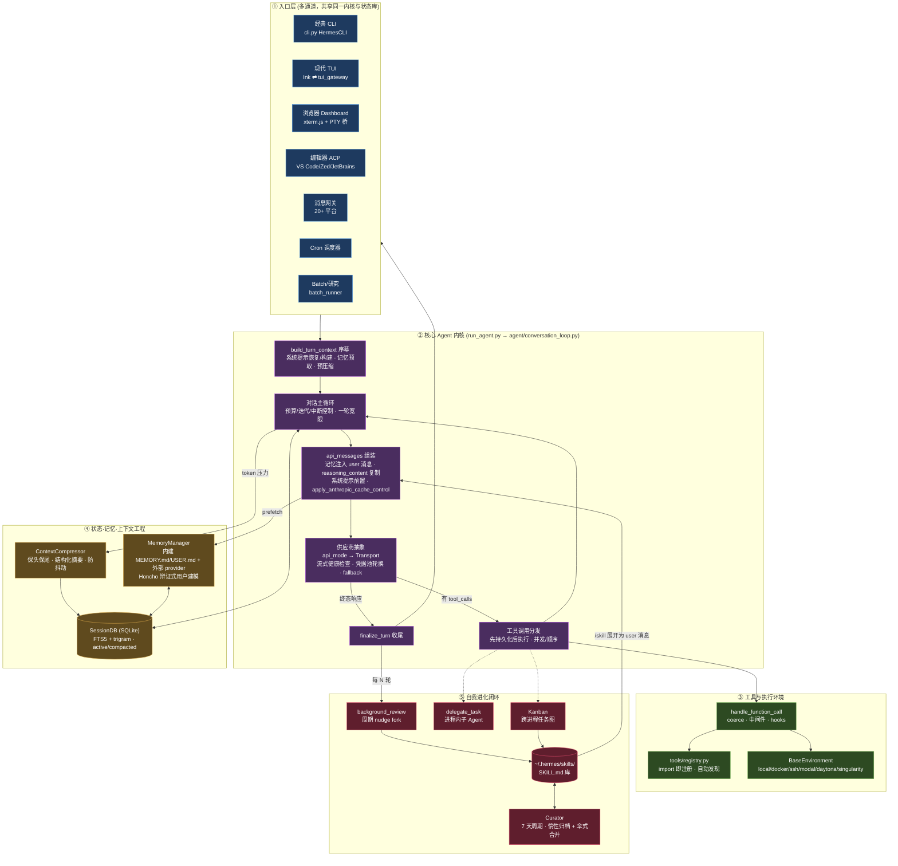

### 分层视图（每层职责与不变量）

| 层 | 职责 | 关键不变量 |
|---|---|---|
| ① 入口层 | 多通道接入，全部收敛到 `AIAgent` + 共享 `state.db` | 四条通道共用同一 SessionDB；语义一致靠复用真实 CLI/TUI 而非重写 |
| ② 核心内核 | 对话循环、预算/中断、供应商抽象、工具分发 | 系统提示每会话构建一次并逐字节回放；工具回合先持久化后执行 |
| ③ 工具/环境 | 自注册工具表 + 抽象执行后端 | registry 为最底层无依赖；spawn-per-call 统一命令执行模型 |
| ④ 状态/记忆 | 持久化、长上下文治理、跨会话用户建模 | 稳定画像进可缓存前缀、易变召回进消息体；压缩=软归档不删除 |
| ⑤ 学习闭环 | 经验→技能→复用→改进；单会话→多智能体 | 技能经 user 消息注入不破缓存；Curator 只归档不删除、只碰 agent 创建技能 |

---

## 一、核心 Agent 循环

本节剖析 Hermes Agent 的核心执行引擎：`AIAgent` 类（`run_agent.py:393`）及其对话主循环。整个 `run_agent.py` 已被"上帝文件解耦"（god-file decomposition）重构为一层**薄转发壳**——`AIAgent` 类保留了公共方法签名，而绝大多数逻辑被下沉到 `agent/` 子模块。真正的循环体位于 `agent/conversation_loop.py`（约 5800 行）。

### 1. AIAgent 类的职责与约 60 个构造参数

`AIAgent`（`run_agent.py:393-399`）是单次会话（session）内所有状态的宿主：它管理对话流、工具执行、响应处理、预算与回调。其 `__init__`（`run_agent.py:416-489`）本身**不做任何初始化**，而是纯转发给 `agent.agent_init.init_agent`（`run_agent.py:490-565`）。真正的属性装配发生在 `agent/agent_init.py:276` 的 `init_agent()`（逾 2000 行）。约 60 个构造参数按**关注点**分组：

- **(a) 凭据与路由**：`base_url`/`api_key`/`provider`/`api_mode`（`run_agent.py:418-421`）。`api_mode` 的解析在 `agent_init.py:452-483`：显式指定则尊重，否则由 provider/hostname 启发式推断（`api.anthropic.com`→`anthropic_messages`、`chatgpt.com/backend-api/codex`→`codex_responses`、`bedrock-runtime.*`→`bedrock_converse`，默认 `chat_completions`）。`credential_pool`（`run_agent.py:483`）凭据轮换池，装配前校验是否匹配当前 provider。`fallback_model`（`run_agent.py:482`）故障切换链。
- **(b) 会话与身份**：`session_id`/`parent_session_id`/`session_db`、`platform`/`user_id`/`chat_id`/`thread_id`/`gateway_session_key`（多端上下文标识）、`skip_context_files`/`load_soul_identity`/`skip_memory` 开关。
- **(c) 预算与迭代控制**：`max_iterations`（默认 90，父/子共享缺省）、`iteration_budget`（`IterationBudget` 线程安全 consume/refund 计数器）、`enabled_toolsets`/`disabled_toolsets`。
- **(d) 回调**（最密集的一组，`run_agent.py:446-461`）：工具生命周期（`tool_start/complete/progress/gen_callback`）、推理/思考（`thinking/reasoning/stream_delta_callback`）、交互与状态（`clarify/status/notice/event/reaction_callback`）。类内以 `_emit_status`/`_emit_warning`/`_emit_notice` 等**fail-open 发射器**包装，回调异常绝不打断循环。
- **(e) 检查点**：`checkpoints_enabled`、`checkpoint_max_snapshots`(20)、`checkpoint_max_total_size_mb`(500) — 文件级快照回滚。
- **(f) 推理**：`reasoning_config`（如 `{"effort":"none"}` 关思考）、`ephemeral_system_prompt`/`prefill_messages`（临时注入不落库）；派生 `_use_prompt_caching`、`_cache_ttl`（默认 `"5m"`）。

### 2. run_conversation()：对话主循环

`AIAgent.run_conversation`（`run_agent.py:5787`）委派给 `agent/conversation_loop.py:523`。

**(2.1) 回合序幕**：`build_turn_context`（`conversation_loop.py:576`）做 stdio 保护、用户消息消毒（surrogate 清理）、系统提示"恢复或重建"、崩溃恢复持久化、预压缩、`pre_llm_call` 插件钩子、外部记忆预取。若 `api_mode == "codex_app_server"`，整回合交给 Codex 子进程运行时并直接返回（`conversation_loop.py:634-641`）。

**(2.2) 迭代与预算控制**（`conversation_loop.py:643`）：
```python
while (api_call_count < agent.max_iterations and agent.iteration_budget.remaining > 0) or agent._budget_grace_call:
```
双重上限：本地 `api_call_count < max_iterations`（默认 90）**且** `IterationBudget.remaining > 0`。父 agent 上限来自 `max_iterations`，每个子 agent 有独立预算（`delegation.max_iterations`，默认 50）。**一轮宽限调用**：预算耗尽但 `_budget_grace_call=True` 时仍执行一轮，进入循环体后立即消费该标志置 False。**execute_code 退款**：某轮唯一工具集合为 `{"execute_code"}` 时 `iteration_budget.refund()`（廉价 RPC 式调用不吃预算）。

**(2.3) 中断处理**：每轮开头检查 `_interrupt_requested`；退避等待期以 0.2s 粒度轮询中断。`/steer` 排空机制（`conversation_loop.py:716-753`）在构建 api_messages **之前**把用户中途插入的 steer 文本注入到最后一条 `tool` 消息，使模型本轮即可见（注入 user 消息会破坏角色交替）。

**(2.4) OpenAI 风格消息格式与推理内容存储**：内部 `messages` → API 副本 `api_messages`。记忆/插件上下文**仅注入当前回合的 user 消息**（`idx == current_turn_user_idx`），原始 `messages` 从不被改动。**推理内容双轨存储**：内部以 `<think>` 标签嵌入 content 用于轨迹存储，但 Moonshot/DeepSeek/Kimi/MiMo 要求 assistant tool_calls 消息带独立 `reasoning_content` 字段——`_copy_reasoning_content_for_api` 据 `_needs_thinking_reasoning_pad()` 决定：强制回显的 provider 保留/升级（空串→单空格，因 DeepSeek V4 Pro 拒绝空串 #17341），严格 provider（Mistral/Cerebras/Groq）整字段剥离（否则 422）。系统提示以**单一 content 字符串**前置以保证跨回合字节稳定。tool_call arguments 用 `json.dumps(sort_keys=True)` 规范化利于 KV 缓存前缀匹配。

**(2.5) 预压缩闸门**：发请求前用 `estimate_request_tokens_rough`（含工具 schema）估算压力，`should_compress()` 触发且未处于失败冷却则 `_compress_context` 压缩、refund 迭代并 `continue`。

**(2.6) 工具调用分发流**：响应经 `_get_transport().normalize_response()` 归一为 `NormalizedResponse`。若有 `tool_calls`：校验工具名（幻觉修复 `_repair_tool_call`；未知工具最多重试 3 次回送错误让模型自纠）、校验 arguments JSON、`messages.append(assistant_msg)`、**先持久化再执行**（`_flush_messages_to_session_db`，保证破坏性工具重启后仍可恢复）、调 `_execute_tool_calls`。`_should_parallelize_tool_batch` 选择并发/顺序：只读工具总可并行，文件读写仅路径不重叠时并行。执行后用真实 `last_prompt_tokens` 决定是否压缩。**无 tool_calls = 终态响应**：此路径含大量弱模型救援（部分流恢复、post-tool 空响应 nudge、thinking-only prefill 续写、空响应重试≤3→fallback、`(empty)` 哨兵），以及 verify-on-stop / pre_verify 门（把待定答案存入 `_pending_verification_response` 清空 `final_response` 续走一轮）。

**(2.7) 收尾**：`agent/turn_finalizer.py` 的 `finalize_turn` 组装并返回结果 dict（`final_response`/`messages`/`api_calls`/`completed`/`failed`/`interrupted`）。

### 3. 供应商/API 抽象层

**(3.1) api_mode 与 Transport 注册表**：合法集合 `{chat_completions, codex_responses, anthropic_messages, bedrock_converse, codex_app_server}`。每模式对应一个 Transport 类，经 `register_transport`/`get_transport` 懒发现注册：

| api_mode | Transport | 适配模块 |
|---|---|---|
| `chat_completions` | `ChatCompletionsTransport` | `chat_completion_helpers.py` |
| `anthropic_messages` | `AnthropicTransport` | `anthropic_adapter.py` |
| `codex_responses` | `ResponsesApiTransport` | `codex_responses_adapter.py`+`codex_runtime.py` |
| `bedrock_converse` | `BedrockTransport` | `bedrock_adapter.py` |
| `codex_app_server` | 真 stdio/JSON-RPC 子进程 transport | `transports/codex_app_server*.py` |

Transport 是**格式转换+响应归一层，不含 HTTP 客户端/连接池/重试**（都留在 `AIAgent` 上）。归一化产物 `NormalizedResponse` 含 `content/tool_calls/finish_reason/reasoning/usage/provider_data`。

**(3.2) 流式与 _StreamErrorEvent**：`interruptible_streaming_api_call` **始终优先流式路径**（即便无消费者），因为流式提供细粒度健康检查（90s stale-stream 检测、read timeout）。流式增量解析工具调用是 load-bearing：函数名用**赋值而非 `+=`**（MiniMax 每 chunk 重发全名，拼接会得 `read_fileread_file`），arguments 用 `+=` 拼接；Ollama 对并行工具复用 index 0 靠 `id` 变化重定向。`_StreamErrorEvent`（`run_agent.py:354-391`）是合成异常：某些 Codex/xAI 后端发独立 `type=error` SSE 帧而非 HTTP 4xx，构造 **OpenAI-SDK 形状的 `.body`** 使错误分类器像真 API 错误一样解析，进入正常重试/fallback/凭据轮换路径。

**(3.3) 凭据池与限流恢复**：`CredentialPool` 冷却 TTL 按 HTTP 状态区分：401→300s（瞬态认证）、429→3600s（限流）。选择策略 `fill_first`（默认）/`round_robin`/`random`/`least_used`。`mark_exhausted_and_rotate` 优先惩罚真正 429 的那把 key，终态认证失败置 `STATUS_DEAD` 永不复用。单 key 池无法轮换——`_pool_may_recover_from_rate_limit` 要求 `len(entries())>1`，否则必须 fallback。另有 Nous Portal 跨会话熔断器 `nous_rate_guard.py`，区分"账户级配额耗尽"（应熔断）与"某上游模型瞬态限流"（应仅失败单请求）。

**(3.4) fallback_model**：`try_activate_fallback` 在链耗尽时武装冷却防跨回合风暴，跳过已知不可用/无网/解析到当前 provider 的条目，热替换 client/model/provider。每回合开头 `_restore_primary_runtime` 尝试恢复主 provider。

**(3.5) 供应商专属头**：OpenRouter→`build_or_headers`、RouterMint→伪装 UA 躲 Cloudflare 1010、Kimi→`User-Agent: claude-code/0.1.0`、Qwen Portal→`X-DashScope-CacheControl: enable`。**Nous 例外**：走 `extra_body['tags']` 产品归因而非 HTTP 头。

### 4. agent/ 子模块内部

- **transports/**：格式适配+归一，非网络层。`codex_app_server.py` 是唯一真 transport（同步 JSON-RPC over stdio 驱动 `codex app-server` 子进程）。
- **secret_sources/**：进程启动时从外部密钥管理器（Bitwarden `bws`、1Password `op read`）拉取 env 形状凭据。只读、同步、绝不抛错，优先级阶梯：预存 `.env`/shell 胜出 → mapped source 压过 bulk source。
- **lsp/**：仅在 git worktree 内启用，把真实语言服务器（pyright/gopls/rust-analyzer）作为子进程，在 `write_file`/`patch` 后做**增量诊断过滤**——只报该次编辑新引入的错误，经行位移重映射避免误判。
- **pet/**：纯显示层动画吉祥物（Petdex），**不加任何模型工具、不改系统提示/toolset、对提示缓存零影响**。
- **display.py / KawaiiSpinner**：工具执行期的线程动画 spinner，非 TTY 只打一行、prompt_toolkit 下静默、真 TTY 才 `\r` 覆写。
- **memory_manager.py**：唯一记忆集成点，内建 provider 恒首位 + 至多一个外部 provider。两条注入路径：静态系统提示文本（随缓存）+ 每回合召回上下文（`<memory-context>` 围栏注入 user 消息）。`StreamingContextScrubber` 防注入记忆泄漏进流式输出。

### 5. 每回合系统提示、上下文文件与记忆的组装

- **系统提示"恢复或重建"**：续会话时从 SessionDB 读回**上一回合逐字节相同**的系统提示直接复用以命中 Anthropic 缓存前缀；首回合或存储损坏则重建并落库。gateway 每回合新建 `AIAgent`，完全依赖这条 DB 往返维持前缀缓存。
- **上下文文件**（**首个命中者独占**）：`.hermes.md`/`HERMES.md`（向上走到 git root）> `AGENTS.md`（仅 cwd）> `CLAUDE.md`（仅 cwd）> `.cursorrules`；`SOUL.md` 独立且恒含。
- **每回合装配次序**：`effective_system = active_system_prompt (+ ephemeral)` → 前置为单条 system 消息 → 插入 `prefill_messages` → `apply_anthropic_cache_control` 注入缓存断点。记忆召回与插件上下文**只注入 user 消息**。

### 6. 关键设计模式、不变量与陷阱

- **(a) 转发壳模式**：`AIAgent` 几乎每方法都是"Forwarder — see agent.xxx"，实现上帝文件解耦同时保留向后兼容。
- **(b) 提示缓存不变量**（最 load-bearing 约束）：`prompt_caching.py` 实现 `system_and_3` 策略（最多 4 个 `cache_control` 断点 = 系统提示 + 最后 3 条非系统消息）。三大派生不变量：①系统提示每会话构建一次并逐字节回放；②记忆/插件上下文只注入 user 消息、绝不改系统前缀；③tool_call arguments 用 `sort_keys` 规范化保证跨回合字节稳定。
- **(c) 缓冲式重试状态**：重试/fallback 噪音缓冲，仅当所有重试+fallback 耗尽才刷给用户，成功恢复则静默丢弃。
- **(d) 消息序列不变量**：多处防御式修复角色交替（补/删孤儿 tool 结果、丢弃纯 thinking 回合避 Anthropic 400）；合成脚手架均标记为 synthetic 以在收尾时弹出、绝不持久化。
- **(e) 崩溃恢复不变量**：工具调用回合**先持久化再执行**。
- **(f) fail-open 原则**：所有回调/插件钩子/记忆/LSP/pet 侧路径均 try/except 吞异常。
- **(g) 主要陷阱**：单 key 凭据池遇 429 无法轮换必须 fallback；`reasoning_content` 跨 provider fallback 的 poisoned history；流式函数名 `+=` 导致名字翻倍；rough token 估算滞后需 pre-API 二次检查。

**核心发现**：该 agent 循环的复杂度几乎全部集中在**弱模型/供应商兼容性救援**与**提示缓存字节稳定性不变量**两大主题上，而非编排本身。

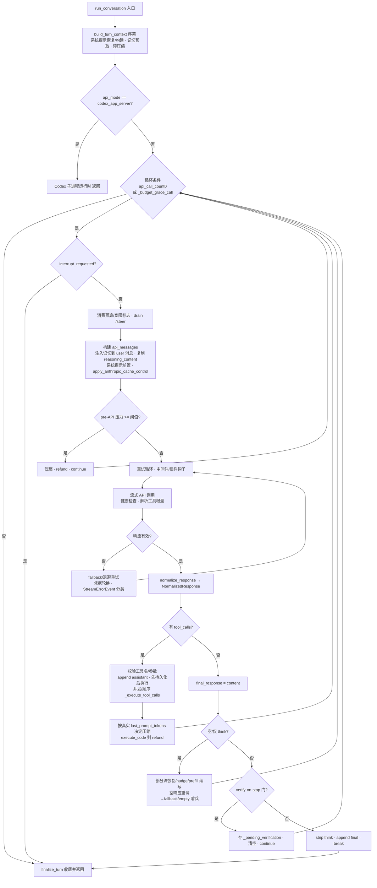

---

## 二、工具系统与执行环境

Hermes Agent 的工具系统采用"自注册表 + 薄编排层 + 抽象执行环境"三层架构：让每个工具文件成为唯一可信来源（self-registering），让 `model_tools.py` 退化为纯编排层，并把命令执行、文件操作抽象到一套可插拔后端（local/docker/ssh/modal/daytona/singularity）。

### 2.1 工具注册机制：导入即注册的自发现链

**依赖链与循环导入安全**：注册中心 `tools/registry.py` 处于依赖链最底层，刻意不 import `model_tools` 或任何 `tools/*.py`，从而打破循环依赖。每个工具文件在**模块级**（import 时）调用 `registry.register(...)` 声明自身 schema、handler、toolset 归属与可用性检查函数。

**自动发现**：`discover_builtin_tools()`（`tools/registry.py:67-84`）glob `tools/*.py`，对每个候选先做廉价文本预筛（同时含 `"registry"` 和 `"register"`），再用 `ast.parse` + `_is_registry_register_call()` 只检查**模块体语句**（排除只在函数内部调用 `registry.register()` 的辅助模块），通过筛选者 `importlib.import_module` 导入触发注册。`model_tools.py` 导入时立即执行 `discover_builtin_tools()` 与 `discover_plugins()`。**MCP 工具发现被刻意从模块级移除**（`discover_mcp_tools()` 内部有阻塞的 `future.result(timeout=120)`，曾导致 Discord/Telegram 心跳被冻结 120 秒 #16856）。

**ToolEntry 与注册安全语义**（`register()`，`tools/registry.py:365-457`）：
- **防影子覆盖**：已存在同名工具但归属不同 toolset 时默认**拒绝**注册，防止插件/MCP 意外覆盖内建工具。
- **MCP-to-MCP 例外**：两个都是 `mcp-*` toolset 时允许覆盖。
- **插件覆盖需运营方 opt-in**：`_plugin_owner_of(handler)` 绑定 `handler.__globals__["__name__"]`（而非调用点，防 lambda/线程洗白授权）；插件必须在 config 设 `allow_tool_override: true`，否则抛 `PermissionError`。
- `_generation` 单调递增计数器供上层 memoize 失效。

**check_fn 的 TTL 缓存与瞬态失败抑制**（`_check_fn_cached()`，`tools/registry.py:154-206`）：昂贵的外部探测（Docker daemon/Modal SDK/playwright）有 30 秒 TTL 缓存；**瞬态失败抑制**（#21658/#5304）——若在 60 秒宽限窗口内探测失败视为抖动，返回 last-good True 且不缓存失败，避免一次 `docker version` 超时就把整个 terminal+file toolset 从子 agent 上剥离。

### 2.2 Schema 生成、分发与 handle_function_call 调度

**Schema 生成两级缓存 + 动态改写**（`get_tool_definitions()`，`model_tools.py:279-354`）：模块级 memoize（仅 quiet_mode），cache key 含 `(frozenset(enabled), frozenset(disabled), registry._generation, cfg_fingerprint, HERMES_KANBAN_TASK…)`，返回浅拷贝防污染。`_compute_tool_definitions()` 把 enabled toolsets 展开为工具名集合，**disabled 始终作为最后减法步骤**（对平台捆绑包只减非核心增量，保留核心工具，#33924/#57315）。**运行时动态 schema 改写**：`execute_code` 按 `SANDBOX_ALLOWED_TOOLS & available` 重建；`browser_navigate` 在 web_search 不可用时剥离交叉引用防幻觉。**Tool Search 渐进式披露**：可延迟工具面（MCP + 插件非核心）超阈值（默认上下文窗 10%）时用 `tool_search/tool_describe/tool_call` 三桥接工具替换，`_HERMES_CORE_TOOLS` 永不延迟。

**handle_function_call 调度流水线**（`model_tools.py:1025-1352`）：
1. **参数类型强制转换** `coerce_tool_args()`：LLM 常把数字/布尔当字符串（`"42"`/`"true"`）、把数组写成裸标量，按 schema 安全 coercion（专为 DeepSeek/Qwen/GLM 输出漂移）。
2. **Tool Search 桥接分发**：`tool_call` 被解包为底层真实工具后递归调用，使所有 hook 看到真实工具名；**防越权纵深防御**：底层工具必须在会话作用域内的 deferrable catalog 中。
3. **中间件与 hook**：`apply_tool_request_middleware` → `_AGENT_LOOP_TOOLS`（`todo/memory/session_search/delegate_task` 由 agent 循环拦截）→ `resolve_pre_tool_block`（插件 block/approve）→ ACP/Zed 编辑审批（对 `write_file/patch` fail-closed）。
4. **实际执行**：`registry.dispatch()`，用 `time.monotonic()` 测 `duration_ms`。
5. **结果 hook**：`post_tool_call`（观察性）→ `transform_tool_result`。

**dispatch、结果规约与错误处理**：异步 handler 经 `_run_async()`（sync→async 桥接唯一真源，用持久事件循环避免 `asyncio.run()` 反复创建 loop 导致 "Event loop is closed"）。`_normalize_handler_result()`：正常结果是字符串，唯一结构化例外是多模态信封 `{"_multimodal": True, "content": [...]}`。**统一错误格式**：`_sanitize_tool_error()` 剥离结构性框架 token（`</tool_call>`、CDATA、markdown fence）并截断 2000 字符——纵深防御防模型读取这些 token 被误导角色混淆。工具结果最终作为 `role=tool` 消息 content 回注上下文。

### 2.3 Toolset 概念与分发

`toolsets.py` 的 `TOOLSETS` dict 定义工具分组/别名系统，含 `description`/`tools`/`includes`（组合其他 toolset）。`resolve_toolset()` 递归展开带环检测。**核心工具列表** `_HERMES_CORE_TOOLS`（`toolsets.py:31-80`）是所有 CLI 和消息平台共享的单一真源（web/terminal/file/vision/skills/browser/tts/todo/memory/session_search/clarify/execute_code/delegate_task/cronjob/kanban/computer_use），改一处同步所有平台。`hermes-webhook` 刻意受限为 `_HERMES_WEBHOOK_SAFE_TOOLS`（仅 web/vision/clarify，防不可信第三方内容触发本地执行）。**posture toolset**（如 `coding`）由会话自动选择。`toolset_distributions.py` 与运行时无关，专用于**数据生成批处理**——把 toolset 名映射到选中概率，`sample_toolsets_from_distribution()` 对每个 toolset 独立掷骰以产生工具组合多样性。

### 2.4 执行环境抽象：统一 spawn-per-call 模型

`tools/environments/base.py` 的 `BaseEnvironment(ABC)` 采用**统一 spawn-per-call 模型**：每条命令 spawn 一个全新 `bash -c` 进程；会话快照（env vars/functions/aliases）init 时捕获一次、每条命令前重新 source；CWD 通过 stdout 标记（远程）或临时文件（本地）持久化。子类只需实现 `_run_bash()` 与 `cleanup()`。

基类统一逻辑：`init_session()` 用 `bash -l` 捕获环境到快照文件（原子写 `snap.tmp.$BASHPID` 再 `mv -f`，`$BASHPID` 保证并发子 shell 唯一 #38249）；`_wait_for_process()` 基于 `select()` 的**非阻塞 drain**（而非 `for line in proc.stdout`，解决后台孙进程继承 stdout 管道致 readline 永久阻塞 #8340），处理 UTF-8 增量解码、10 秒 activity 回调、interrupt 轮询、timeout。

**后端层级**：

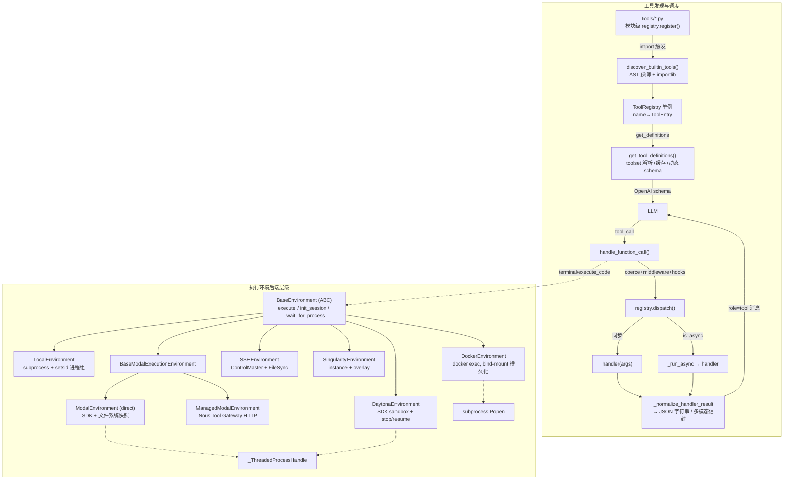

**各后端要点**：
- **LocalEnvironment**：`os.setsid` 独立进程组，`_kill_process()` 杀整组防孤儿。**环境变量消毒是核心安全面**：`_HERMES_PROVIDER_ENV_BLOCKLIST` 从注册表派生所有 provider key，`_ALWAYS_STRIP_KEYS` 无条件剥离 Tier-1 密钥（bot token/GitHub/Modal token）；通用 AWS 凭证刻意可继承（本地终端是用户可信 shell）。
- **DockerEnvironment**：`docker run -d ... sleep infinity` 长寿命容器 + `docker exec`。硬化：`--cap-drop ALL` 按需 add、`--security-opt no-new-privileges`、nosuid tmpfs、`--pids-limit`。持久化 bind-mount `~/.hermes/sandboxes/`；跨进程复用按 label attach，`docker_network=false` 校验 NetworkMode 防复用绕过 egress 锁定。
- **SSHEnvironment**：**ControlMaster** 复用连接；无 bind-mount 故 **FileSyncManager** 用 SHA-256 增量同步，bulk upload 用 `tar c | ssh tar x` 单 TCP 流。
- **ModalEnvironment / DaytonaEnvironment（serverless 休眠）**：`cleanup()` 先 sync_back 再 `snapshot_filesystem()`/`stop()`，下次 `Image.from_id()`/`get(name).start()` 恢复——环境闲置时休眠、按需唤醒，成本近零。**ManagedModalEnvironment** 走 Nous Tool Gateway HTTP API 不需本地 Modal 凭证。

### 2.5 重点工具与安全

- **terminal**：schema 支持 `background/timeout/workdir/pty/notify_on_complete/watch_patterns`；`background+notify_on_complete` 是长任务推荐模式；PTY 模式仅 local/ssh，用于交互 CLI。
- **execute_code**：让 LLM 写 Python 脚本经 **RPC 编程式调用工具**，减少 LLM 往返。本地用 Unix domain socket（Windows 回退 TCP），远程用文件式 RPC；RPC 请求用 `HERMES_RPC_TOKEN` + `secrets.compare_digest` 鉴权。
- **delegate_task/computer_use/browser 族**：见后文与专章。

**陷阱**：**`_last_resolved_tool_names` 进程全局**（`model_tools.py:221`）在并发多会话 gateway 下被"最后写入者"覆盖——已部分缓解（`handle_function_call` 优先用 caller 传入的 `enabled_tools`，仅 None 时回退全局），但作为进程全局仍是脆弱设计（注释标为"backward compat"）。

---

## 三、状态、记忆与上下文工程

Hermes 在"状态持久化 → 上下文压缩 → 跨会话记忆 → 用户建模闭环"这条链路上做了非常工程化的分层。本章按数据流自底向上剖析。

### 3.1 SessionDB：SQLite 会话存储与 FTS5 全文检索

`hermes_state.py`（7178 行，单一核心类 `SessionDB:937`）是持久化中枢，刻意**不依赖任何 LLM**——纯存储与检索层，摘要与生成留给上层。

**Schema**（`SCHEMA_SQL`，`:713-862`）核心表：
- **`sessions`**（主键 `id TEXT`）：会话元数据，含多平台路由列（`source/user_id/session_key/chat_id/thread_id`）、`system_prompt`、自引用外键 `parent_session_id`（压缩/分支血缘）、token 计数与账单列、压缩状态列（`compression_failure_cooldown_until`/`compression_fallback_streak`）、`rewind_count`/`archived`。
- **`messages`**（外键 `session_id`）：除 `role/content/tool_calls/tool_name` 外，两个关键状态位——**`active DEFAULT 1`** 与 **`compacted DEFAULT 0`**，是"非破坏性压缩"和"回退/撤销"的基础。
- **`session_model_usage`**：逐模型成本/token 归因（`ON DELETE CASCADE`）。
- **`compression_locks`**：应用级压缩咨询锁（区别于 SQLite 文件锁）。

**FTS5 全文索引**用两张虚拟表：`messages_fts`（unicode61，contentless/inline 风格，三个触发器维护，索引 `content||tool_name||tool_calls`，工具参数也可搜）与 `messages_fts_trigram`（trigram 分词，产生重叠 3-byte 序列以支持中文/泰文等子串匹配）。检索入口 `search_messages`（`:4830-5149`）天然跨会话，默认 `ORDER BY rank`（bm25），用 `snippet()` 生成高亮片段，**默认过滤 `(active=1 OR compacted=1)`**——被回退的行隐藏但压缩归档行仍可搜（#38763，历史不丢）；≥3 CJK 字符且 trigram 可用时走 trigram 表。**跨会话搜索本身不含 LLM 摘要**——摘要发生在调用方消费这些片段时。

**并发与锁**（SQLite 关键工程）：`threading.Lock` 保护所有读；写走 `_execute_write` 在锁内显式 `BEGIN IMMEDIATE` 抢占 WAL 写锁，失败带随机抖动重试（`_WRITE_MAX_RETRIES=15`，20-150ms），故意用 `timeout=1.0` 绕开 SQLite 内建 30s busy handler。`journal_mode=WAL`，在 NFS/SMB/FUSE 不兼容文件系统回退 DELETE（但磁盘头已是 WAL 绝不降级）。每 50 次写 `wal_checkpoint(TRUNCATE)`，每 1000 次 `optimize_fts`。

**迁移与自愈**：`SCHEMA_VERSION=21` 但用 `schema_version` 表而非 `PRAGMA user_version`。主机制是**声明式列对账**：`_reconcile_columns` 用 `PRAGMA table_info` 对比 DDL 期望列 `ALTER TABLE ADD COLUMN` 补齐——让加列与版本号解耦。损坏自愈 `repair_state_db_schema` 用 FTS5 `'rebuild'` 与 `writable_schema` 手术修复。

### 3.2 轨迹压缩：离线训练压缩 vs 运行期上下文治理

Hermes 有**两套压缩**，共享设计哲学（保护首尾、只压中段、用一条摘要替换），但用途实现不同。

**离线训练压缩**（`trajectory_compressor.py`，见第七章）保护首轮（system/first human/first gpt/first tool）与末尾 N 轮，只压中段；**边界对齐**（`_snap_boundary`）保证压缩边界永不落在 tool 回合上（否则切断 tool_call/tool_response 对留下孤儿标记污染训练数据）。

**运行期上下文引擎** `ContextEngine` ABC（`agent/context_engine.py:32`）定义生命周期 `on_session_start → update_from_response(usage) → should_compress() → compress() → on_session_end`，**同一时刻只有一个引擎激活**（config `context.engine`，默认 `"compressor"`）。内建 `ContextCompressor`（`agent/context_compressor.py:711`）参数 `threshold_percent=0.50`、`protect_first_n=3`、`protect_last_n=20`。触发有**小上下文地板**（<512K 窗口只升不降抬到 0.75，因小窗易被系统提示+工具 schema 这块 20-30K 不可压缩地板顶爆）。压缩三阶段：Phase1 廉价预清理（把旧工具结果替换成一行摘要）→ Phase2 定边界（头部保护 + 尾部 token 预算）→ Phase3 结构化摘要（固定模板，含多语言约束/凭据脱敏/**时间锚定**——把"给 John 发邮件"改写成"已于 YYYY-MM-DD 发出"防恢复会话时重复执行）。

**防抖动是最精妙处**：`update_from_response` 用 provider 真实 prompt 数判定压缩"有效性"（是否降到阈值下），而非"消息列表是否变短"（因系统提示+50 工具 schema 是不可压缩地板）；连续 2 次无效或 2 次退化兜底则暂停自动压缩提示 `/new`，避免"假死"在无限压缩循环。auth/网络失败**一律 ABORT** 保留会话原样（而非占位摘要毁中段 #29559）。

**会话切分与旋转**（`conversation_compression.compress_context`）两模式：**就地压缩（新默认）**保持同一 session_id，`archive_and_compact` 把压缩前轮次软归档（active=0, compacted=1，仍可搜可恢复）；**旋转（legacy）** fork 新 session_id 以 `parent_session_id` 建续接子会话（子行创建失败回滚父 id 防幽灵会话 #33906）。两模式压缩前都先 `commit_memory_session` 触发记忆抽取。

### 3.3 记忆插件体系：MemoryProvider 与辩证式用户建模

**内建 vs 外部两层**，由 `MemoryManager`（`agent/memory_manager.py:353`）统一编排，**强制至多一个外部 provider**。内建 agent-curated 记忆（`tools/memory_tool.py`）：`MEMORY.md`（agent 观察：环境事实/项目惯例/工具怪癖，2200 字符上限）与 `USER.md`（用户偏好/沟通风格，1375 字符上限）。**冻结快照模式**：会话开始作为快照注入系统提示，会话中 `memory` 工具写入立即落盘但不改系统提示（保住整会话前缀缓存），下次会话开始才刷新快照。

**MemoryProvider ABC**（`agent/memory_provider.py:43`）必须实现 `name/is_available()/initialize()/get_tool_schemas()`；核心默认实现 `system_prompt_block()/prefetch(query)/sync_turn()`；可选钩子 `on_session_end`（会话边界抽取）/`on_session_switch`/`on_pre_compress`（压缩前贡献洞察）/`on_delegation`/`on_memory_write`（镜像内建记忆写入）。发现是**目录扫描**（`plugins/memory/<name>/`）。`MemoryManager` 用**单 worker 守护线程池**串行化每个 provider 的写（防某阻塞 provider 拖住 agent）。

**Honcho 辩证式（dialectic）用户建模**是"跨会话用户模型"最典型实现：用户被建模为 Honcho **peer**，核心是辩证端点 `peer.chat()`——在 Honcho 后端对目标 peer 的完整表征跑一个 LLM。会话初始化用固定 query 预热（"Summarize what you know about this user…"），按 `dialectic_cadence` 周期刷新，把综合答案作为权威上下文逐轮注入——一个由每次会话观测持续刷新的用户模型。内建记忆的 user-profile 写入经 `on_memory_write` 镜像成 Honcho conclusion（两层连接点）。其它 provider：mem0（服务端 LLM 事实抽取 + 熔断器）、holographic（全本地零依赖，SQLite+FTS5+信任评分+HRR 全息检索）、hindsight（知识图谱）、supermemory/byterover/openviking/retaindb。

### 3.4 上下文注入：三层系统提示

`build_system_prompt_parts`（`system_prompt.py:145`）：`stable`（身份/技能/环境，永不变）+ `context`（AGENTS.md/.cursorrules + caller system_message）+ `volatile`（内建记忆快照 + 用户画像 + 外部 provider block + 时间戳）。**关键不变量**：会话期内绝不重渲染系统提示任何部分，volatile 层会话开始冻结一次并缓存到 `_cached_system_prompt`——让上游 prompt cache 跨轮保持"热"。外部 provider 实时召回**不进系统提示**，每轮由 `prefetch_all` 注入为 `<memory-context>` 用户侧消息——稳定画像进可缓存前缀、易变召回进消息体，是缓存友好与新鲜度的折中。

### 3.5 闭环学习：跨会话构建用户模型

两条协作路径：① **内建自省循环**（`agent/background_review.py`）由**轮次计数 nudge** 触发（`_turns_since_memory >= _memory_nudge_interval`，默认 10 轮），fork 一个受限于 memory+skill 工具的子 agent，重放会话快照自问"有什么记忆/技能该保存或更新？"，写入直达内建存储，主对话与 prompt 缓存不受影响。② **外部 provider 用户建模**三路喂养：每轮 `sync_turn` 写原始对话、内建记忆写入经 `on_memory_write` 镜像、会话末 `on_session_end` 抽取。

### 3.6 状态/记忆数据流图与 ER 草图

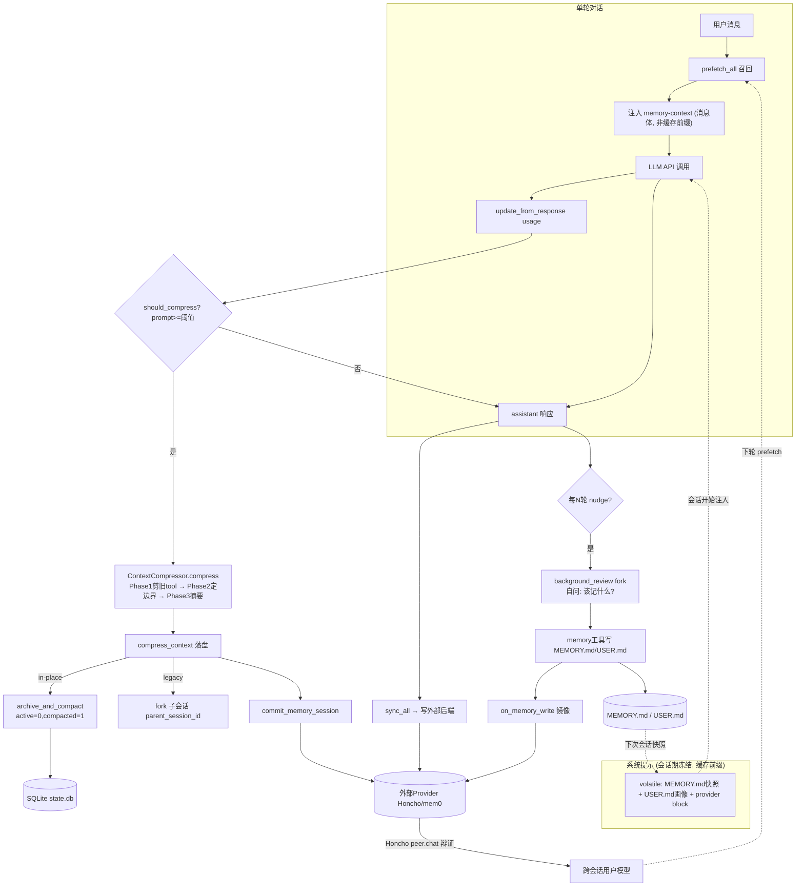

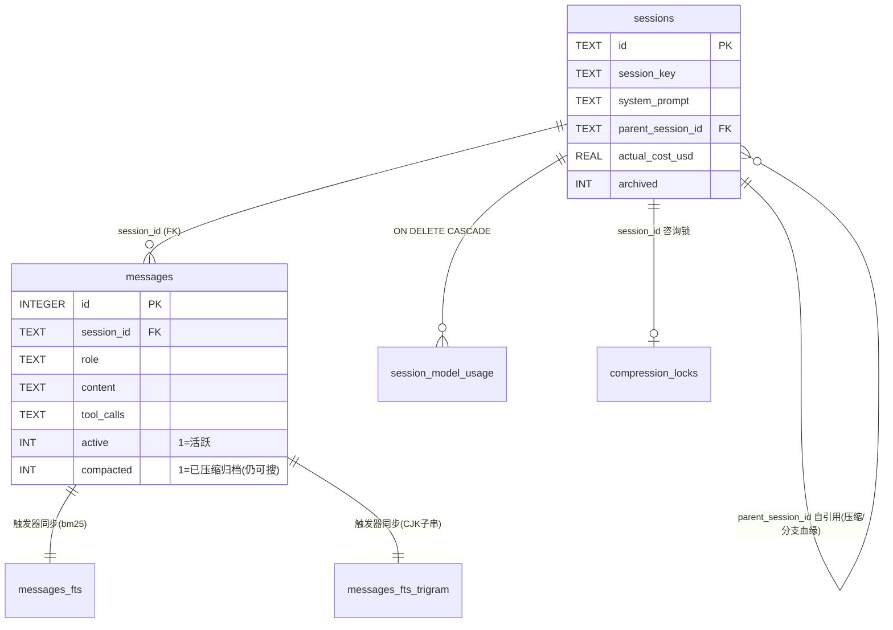

**陷阱与防御**：不可压缩地板导致假死（改判 prompt 而非条数 + 双计数熔断）；切断 tool_call 对（边界吸附）；摘要失败毁上下文（ABORT 保留原会话）；WAL 网络文件系统损坏（检测回退 DELETE）；注入记忆被回显泄露（`<memory-context>` 围栏 + StreamingContextScrubber）。

---

## 四、用户界面层：CLI / TUI / ACP

Hermes 暴露四条并行交互通道——经典 **CLI**（prompt_toolkit 全屏 REPL）、现代 **TUI**（Node/Ink 前端 + Python 网关后端）、浏览器 **Dashboard**（PTY 桥把真实 TUI 嵌进 xterm.js）、面向编辑器的 **ACP** 适配器。四者共享同一 Agent 内核、同一份斜杠命令注册表、同一套数据驱动皮肤引擎。

### 4.1 CLI 架构：HermesCLI 编排器

`class HermesCLI(CLIAgentSetupMixin, CLICommandsMixin)`（`cli.py:3677`）通过**混入模式**拆分职责。渲染层是 **Rich + prompt_toolkit 双引擎**：Rich 负责富文本（Markdown/面板/横幅），prompt_toolkit 负责全屏固定输入区 TUI（输入框/状态栏/spinner/补全菜单/审批弹层）。冲突点在于 prompt_toolkit 的 `patch_stdout` 用 `StdoutProxy` 包裹 `sys.stdout`，为此引入 `ChatConsole` 适配器与 `_cprint`（经 `run_in_terminal` 把后台线程输出安全注入 UI）。

**配置加载** `load_cli_config()`（`cli.py:360`）优先级链：`~/.hermes/config.yaml` > `./cli-config.yaml` > 内建 defaults；env 最高，`HERMES_IGNORE_USER_CONFIG=1` 跳过用户配置。

**KawaiiSpinner**（`agent/display.py:1039`）是核心"思考中"动画，**完全数据驱动**——向当前皮肤索取 `spinner.waiting_faces/thinking_faces/thinking_verbs`，缺省回退硬编码。它能感知环境：非 TTY 退化单行日志、检测到 `StdoutProxy` 则完全静默（TUI 另有 `_spinner_text` widget，避免双重绘制撕裂）。

**皮肤/主题引擎**（`hermes_cli/skin_engine.py`）是 UI 视觉一致性的**单一数据源**：冻结数据类 `SkinConfig`（colors 30+ 语义色键、spinner、branding、tool_prefix、banner_logo），内建皮肤 `_BUILTIN_SKINS`（default/ares/mono/slate/daylight/poseidon…），**新增主题无需改一行渲染代码**。`load_skin(name)` 优先查 `~/.hermes/skins/{name}.yaml`——用户只需丢一个 YAML 造新皮肤。`get_prompt_toolkit_style_overrides()` 把皮肤色映射成 prompt_toolkit `Style` 字典，`/skin` 即时刷新活动 UI 无需重建 app。

### 4.2 斜杠命令注册表：单一数据源的扇出

**权威定义**集中在 `hermes_cli/commands.py` 的 `COMMAND_REGISTRY: list[CommandDef]`。`CommandDef`（冻结数据类）含 `name/description/category/aliases/args_hint/subcommands` 及三个跨渠道能力门控标志 `cli_only`/`gateway_only`/`gateway_config_gate`（配置点为真时覆盖 cli_only）。`resolve_command(name)` 依赖 `_COMMAND_LOOKUP`（name+alias→CommandDef），大小写不敏感、自动剥离 `/`、别名与规范名等价。

**全渠道扇出**（印证单一数据源）：CLI `process_command()`、TUI 网关 `commands.catalog/command.dispatch` RPC、消息平台适配器菜单生成（`telegram_menu_commands()`/Slack builders）、网关权限门控（`gateway/slash_access.py`）、自动补全（`SlashCommandCompleter`）——**新增别名只需在 commands.py 改一行**，所有渠道自动继承。

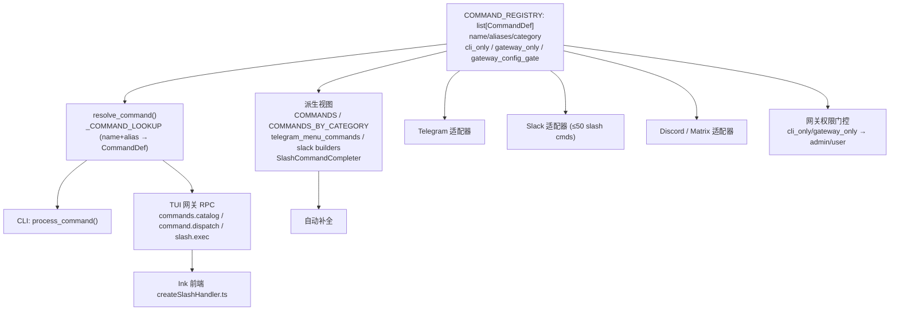

### 4.3 TUI 进程模型：Node(Ink) ⇄ Python(tui_gateway)

前后端分离：**Node/Ink 负责渲染，Python 网关持有一切状态**。

**前端**（Ink 6 + React 19，`ui-tui/`）：`GatewayClient`（`gatewayClient.ts`）`spawn(python, ['-m','tui_gateway.entry'])` 拉起 Python 网关；**换行分隔 JSON-RPC 2.0（NDJSON）** over stdio（读侧逐行 `JSON.parse`，写侧 `JSON.stringify+'\n'`）；备用 WebSocket 传输供桌面/远程 attach。

**后端**（`tui_gateway/server.py`，1.4 万行）：表驱动 `_methods` 字典 + `@method` 装饰器，共 **118 个 RPC 方法**。`dispatch()` 分两执行道：内联道（reader 线程同步）与线程池道（`_LONG_HANDLERS` 慢方法如 `slash.exec/session.resume` 卸载到 ThreadPoolExecutor，避免阻塞 stdin reader 致 `approval.respond` 积压）。统一发射器 `_emit(event, sid, payload)` 把 `AIAgent` 回调映射为事件（`message.delta/tool.start/status.update/approval.request/skin.changed`）。`Transport` Protocol + `bind_transport` ContextVar 让同一 `dispatch` 同时服务 stdio(Ink)、WebSocket(桌面/Web)、TeeTransport(Dashboard 镜像)。**归属划分**：权威会话表 `_sessions` 持有 `agent/slash_worker/transport/cwd`，Node 从不持有会话/工具状态。

**斜杠命令流（后端 `_SlashWorker`）**：默认子进程路径——`_SlashWorker` 为每个 TUI 会话孵化一个常驻 `HermesCLI` 子进程（`start_new_session=True` 独立进程组防 MCP 孤儿清扫误杀父进程），对每条命令调 `cli.process_command(cmd)` 并捕获 Rich 输出去色返回。**这样一条斜杠命令的执行本质是隔离的 HermesCLI 跑同一套 process_command——CLI 与 TUI 命令语义天然一致。**

### 4.4 Dashboard 经 PTY 桥嵌入真实 TUI

浏览器 `/chat` **不重新实现 TUI**，而是把真实 `hermes --tui` 塞进伪终端，经 WebSocket 把 ANSI 字节流到 **xterm.js**。`PtyBridge`（`hermes_cli/pty_bridge.py`）基于 `ptyprocess`（POSIX-only，原生 Windows 由 `win_pty_bridge.py` ConPTY 对等）：`read()` 用 `select`+`os.read` 非阻塞字节读，`resize()` 经 `TIOCSWINSZ` 并把维度钳制 `[1,2000]×[1,1000]`（防 WSL2 `columns=131072` 破值触发 `struct.error`），`close()` 按 `SIGHUP→SIGTERM→SIGKILL` 逐级对进程组收割。WS 端点 `/api/pty` 用 `?token=` 查询参数认证（浏览器无法在 WS 升级设 Authorization 头），`\x1b[RESIZE:...]` 转义被本地消费转 `bridge.resize()`。收益：**浏览器复用同一 `hermes --tui`**，slash 弹层/模型选择器/皮肤引擎/审批提示全部零成本继承。

### 4.5 ACP 适配器：编辑器集成

**ACP（Agent Client Protocol）** 让 VS Code/Zed/JetBrains 以标准 JSON-RPC 驱动外部 Agent。`acp_adapter/entry.py`（`hermes-acp`）把日志导向 stderr 保留 stdout 给 JSON-RPC，`HermesACPAgent` 实现 `initialize/authenticate/new_session/load_session/fork_session/prompt/cancel`。`SessionManager` 把每个 ACP 会话映射到真实 `AIAgent` 并持久化到**共享 `~/.hermes/state.db`**——**四条通道共用同一状态库**，会话跨进程重启存活且可被 CLI/TUI 检索。事件流回编辑器：`tool.started`→`ToolCallStart`、todo 结果→ACP 原生 `AgentPlanUpdate`。权限模型把 Hermes 危险命令批准桥接成 ACP `PermissionOption`（allow_once/session/always/deny），`edit_approval.py` 做执行前编辑审批（写文件/patch → `EditProposal` 含 diff，Zed/VS Code 应用改动前弹 diff 确认）。

### 4.6 进程与传输模型图

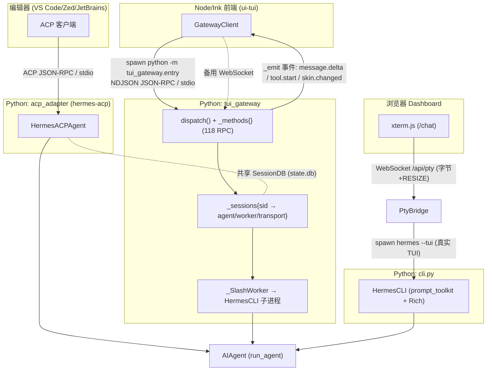

**设计模式与陷阱**：表驱动注册表/单一数据源贯穿全层（命令/RPC 方法/皮肤）；数据驱动主题化；**进程隔离下的内核复用**（`_SlashWorker`/PTY 桥都孵化真实 HermesCLI 而非重写逻辑）；传输抽象。陷阱：**stdout 神圣性**（网关/worker/ACP 必须把日志导向 stderr，stdout 被 JSON-RPC/PTY 独占）；prompt_toolkit↔Rich 阻抗；PTY 平台性（POSIX-only + 终端尺寸破值钳制）；进程组与孤儿（`start_new_session=True`）；双执行道竞态（`slash.exec` 误留内联道会阻塞 reader 致 TUI 冻结）。

---

## 五、消息网关与多平台接入

Hermes 的多平台接入层是 Agent 对外的统一门户：**一个常驻网关进程同时服务 20+ 消息平台**（Telegram/Discord/Slack/WhatsApp/Signal/Matrix/Email/飞书/企业微信/IRC/API Server/Webhook…），把各平台异构协议归一化成一份 `MessageEvent`，喂给同一套 `AIAgent`，再把流式回复按平台能力投递回去。

### 5.1 网关进程模型与编排

**单进程多平台**：入口 `gateway/run.py:main()`（`:21130`）用 `asyncio.run(start_gateway(config))` 拉起唯一事件循环，所有平台适配器都是其上的协程/任务，共享进程内状态（会话存储/cron/MCP/kanban watcher）。核心编排类 `class GatewayRunner(GatewayAuthorizationMixin, GatewayKanbanWatchersMixin, GatewaySlashCommandsMixin)`（`:2803`）——授权/看板通知/斜杠命令三大横切能力经 Mixin 组合。

**适配器工厂** `_create_adapter`（`:8747`）采用"注册表优先、内建兜底"：先查 `platform_registry.is_registered()`（插件平台走 `create_adapter()`），找不到才落内建 `if/elif`。若插件"已注册但实例化失败"**直接返回 None 而不回退内建**（避免静默降级）。

**平台注册表与懒加载**（`gateway/platform_registry.py`）：`PlatformEntry`（`:39`）是富元数据 dataclass（`adapter_factory/check_fn/validate_config/max_message_length/cron_deliver_env_var/standalone_sender_fn`）。最重要优化是 **deferred loading**（`register_deferred`）：平台适配器 import 期加载沉重 SDK（`discord.py`/`slack_bolt`/`lark_oapi`），若发现阶段全部 eager import 会给每次 `hermes` 调用增数秒延迟，故只注册零参 loader，真正 import 推迟到首次查找该平台时。

**会话映射**：`SessionSource`（`gateway/session.py:148`）描述"消息从哪来"（`platform/chat_id/chat_type/user_id/thread_id/scope_id/profile`）。由它推导确定性 `gateway_session_key`（`build_session_key`，`:871`）：DM `{ns}:telegram:dm:{chat_id}`（无 chat_id 回退 user_id，**防多用户 DM 塌缩进同一 session 造成历史串台**）；群/频道 `{ns}:platform:chat_type:chat_id[:thread_id][:user_id]`（线程内默认共享）。`SessionSource.profile` 参与命名空间，支持多 profile 隔离。

### 5.2 平台适配器接口（BasePlatformAdapter）

所有适配器继承 `gateway/platforms/base.py:BasePlatformAdapter(ABC)`（`:2276`）。核心归一化结构：`MessageEvent`（`:1738`，含 `text/message_type/source/media_urls`（本地文件路径供 vision 读取）/`auto_skill`/`channel_prompt`（每频道临时系统提示永不落盘）/`internal`（系统合成事件绕过授权））、`SendResult`（`:1877`，含 `error_kind/retryable/retry_after`（尊重 Telegram FloodWait）/`continuation_message_ids`）。**必须实现** `connect/disconnect/send/get_chat_info`；**可选交互 UX**（默认降级纯文本）`send_clarify/send_exec_approval/send_slash_confirm/send_model_picker`，按钮回调 id 跨适配器统一（`cl:<id>:<idx>`/`appr:<id>:<choice>`）。

**附件与语音转写**：base.py 提供共享媒体缓存漏斗（`cache_image/audio/video_from_bytes/url`）——入站媒体先落地 `~/.hermes/cache/`（平台 URL 临时且本地路径才能被 vision/STT 消费），VOICE 走 STT（Whisper）转写。两道安全护栏：`validate_inbound_media_size`（128 MiB 上限防 OOM）与 `_ssrf_redirect_guard`（每次重定向重校验防 302→169.254.169.254 SSRF）。

**具体适配器差异**：Telegram（`MAX_MESSAGE_LENGTH=4096`，长度单位是 **UTF-16 code unit** 而非 codepoint，因 emoji/CJK Ext-B 占 2 单元）；Slack（39000 上限，用 `ContextVar _slash_user_id` 防同频道并发 `/hermes` 串台）；Discord（2000 上限，`_resolve_channel_skills/prompt` 频道级绑定注入 `auto_skill`/`channel_prompt`）。WhatsApp 用 `WhatsAppBehaviorMixin` 被 Baileys 桥与 Meta Cloud API 共同继承。

### 5.3 消息流与"两道消息护栏"

入站流水线（`handle_message`，`:4608`）：适配器解析 → `build_source()` → `MessageEvent` → 快速返回、后台派发。`coerce_plaintext_gateway_command` 把 DM 纯文本管理短语（"restart gateway"）改写成 `/restart`（避免从运行中 agent 内部触发自重启卡 draining）。

**两道护栏**（任务核心）：
- **护栏一：active-session 并发锁**。同 session_key 已有在跑 handler 时，普通后续消息排进 `_pending_messages`，但**斜杠/控制命令绝不能被排队**——`should_bypass_active_session(cmd)`（`commands.py:388`）对任何可解析斜杠命令返回 True：`/stop /new /reset` 走 `_dispatch_active_session_command`（取消在飞行 agent + 有序 drain），`/approve /deny /status /background /restart` 走直接 inline dispatch。进入前先 `_heal_stale_session_lock` 自愈 owner task 已死的僵尸锁（#11016）。
- **护栏二：pending 队列命令丢弃安全网 + clarify 拦截绕过**。安全网丢弃任何漏进 pending 队列的命令文本（否则 mid-run `/model` 既打断 agent 又被丢弃产生 0 字回复 #5057/#6252）；当 agent 阻塞在 `clarify_tool`（`Event.wait`）时下一条非命令消息必须直达 clarify resolver 而非排队（否则死锁丢答案 PR#4926）。

**审批模式**：`_approval_notify_sync` 优先用适配器富交互 `send_exec_approval`，否则回退纯文本；用户点 Approve/Deny → 回调 `appr:<id>:<choice>` → `resolve_gateway_approval` 解开阻塞。**内部事件绕过授权**：`internal=True` 跳过用户授权、不计入 scale-to-zero 时钟、不触发插件钩子。

### 5.4 斜杠命令、后台通知、中继、投递与集成

- **斜杠命令**：`GATEWAY_KNOWN_COMMANDS`（registry 派生 frozenset，含配置门控命令）、`gateway_help_lines()`（过滤 CLI-only/未开门控）。
- **后台进程通知**：`display.background_process_notifications` 模式 `all/result/error/off`，完成后以 `internal=True` 事件重入网关绕过授权。
- **投递路由**：`DeliveryTarget.parse()` 解析 `origin`（回原会话）/`local`/`telegram:123456`/`platform:chat:thread`；`DeadTargetRegistry` 跳过已确认不可达目标避免对已删频道反复重试。
- **中继连接器（Relay，实验性）**：`RelayAdapter` 是单个 `BasePlatformAdapter` 子类，握手时从连接器收 `CapabilityDescriptor` 告知 fronting 哪个平台。`delivered_via_upstream_relay` 是 **wire 不可见**的信任信号（刻意排除出 `to_dict/from_dict` 防跨线伪造），授权以此 flag 而非 `platform` 判定上游信任。
- **Cron 多平台投递**：`cron_deliver_env_var`（让 scheduler 无需硬编码即认此平台为合法 `deliver=` 目标）与 **`standalone_sender_fn`**（不依赖在跑网关的 async 发送协程，cron 与网关不同进程时开临时连接发送）。
- **Profile 令牌锁** `acquire_scoped_lock`（`gateway/status.py:986`）：机器本地 scope+identity 锁防多个本地网关（不同 profile）复用同一外部身份（如同一 Telegram bot token 被两个 profile 同时轮询互抢 update），用 pid 存活 + start_time 比对判定 stale 并抢占。

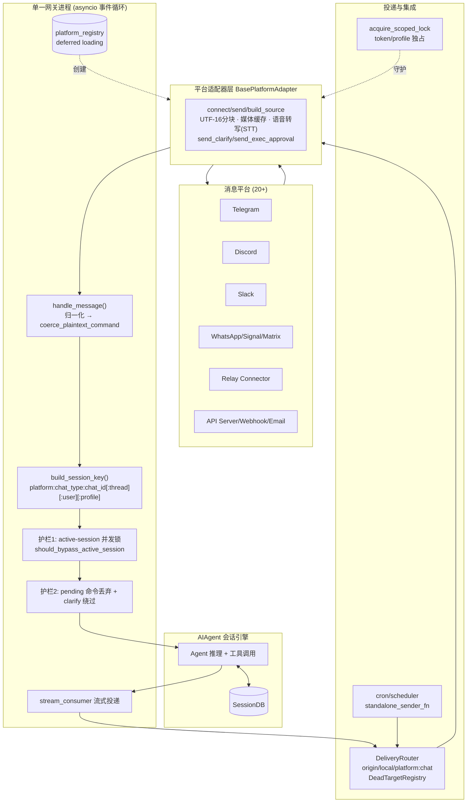

**安全与陷阱**：入站 128 MiB 上限 + SSRF 防护；出站 `validate_media_delivery_path` 硬 denylist（`/etc /proc ~/.ssh ~/.aws` 及 `.env/auth.json/mcp-tokens/`）防提示注入把凭据当附件外泄；MEDIA 标签只扫本轮 producer-tool 结果防示例 `MEDIA:/path` 被当真投递（#16721）；命令排队即错（必须 bypass）；僵尸 session 锁需 on-entry 自愈；clarify/approve 死锁需直达 resolver；Telegram 必须按 UTF-16 计数（`len()` 会低估 emoji 文本致超限）。

---

## 六、自我进化学习闭环：技能 / 策展 / 委派 / 定时 / 看板

这是 Hermes 区别于普通 CLI Agent 的标志性能力：Agent 不只"执行任务"，而是把每次会话经验沉淀为可复用**技能（Skill）**，由后台**策展器（Curator）**维护技能库生命周期，通过**委派/定时/看板**三条通道把单会话智能扩展为多智能体、跨时间、可自改进的系统。

### 6.1 技能系统（Skills）

技能是一个**目录包**（兼容 `agentskills.io` 标准）：`SKILL.md`（YAML frontmatter + Markdown 正文）+ `references/`（知识库）+ `templates/` + `scripts/` + `assets/`。frontmatter 字段：`name/description/version/platforms/license/author/metadata.hermes.{tags,category,related_skills,config}`。**关键设计——`description` 60 字符硬限**：系统提示中的技能索引把 description 截断到 60 字符且每会话都加载，超出部分静默截断、永不参与路由——把 token 成本与可发现性直接绑定。

**发现与加载** `scan_skill_commands()`（`agent/skill_commands.py:320-387`）扫描 `~/.hermes/skills/` 为每个 SKILL.md 生成 `/skill-name` 斜杠命令，过滤链：跳过 `.git/.hub/.archive` → 平台过滤 → 运行时环境过滤 → 用户 disabled 配置 → 名称归一化为连字符 slug（兼容 Telegram 命令名）。

**技能斜杠命令作为 USER 消息注入（保护 prompt 缓存）**——最精巧的设计。用户输入 `/skill-name <指令>` 时 Hermes **不改动系统提示**，而是把整段技能正文展开成一条 **user 消息**注入对话（`build_skill_invocation_message`）。动机（注释 `:405-417`）：技能按名调用不需进系统提示，保持系统提示缓存不变就保住跨 reload 前缀缓存，`/reload-skills` 零缓存重置成本。展开消息含激活声明、技能正文（模板变量替换）、skill 目录绝对路径、skill config、支撑文件清单、用户指令。**记忆污染防护**：`extract_user_instruction_from_skill_message()` 用**字节级一致标记**从展开消息精确回收用户指令（否则记忆系统会存下整个技能正文而非用户真实提问）。**堆叠调用** `/skill-a /skill-b`（最多 5 个前导技能）。每次调用/预载 `bump_use()` 记录活动信号。

### 6.2 策展器（Curator）

`agent/curator.py`（2016 行）是**后台技能维护编排器**，用辅助模型运行、**从不触碰主会话 prompt 缓存**。四条铁律：只碰 agent 创建的技能；从不自动删除——只归档（可恢复）；pinned 豁免所有自动迁移；用辅助 client。

**触发**：非 cron、由**空闲触发**（会话启动钩子 `maybe_run_curator`）。门控：enabled + 未 paused + `last_run_at` 早于 `interval_hours`（默认 **7 天**）+ `min_idle_hours`（默认 2h）。首次运行故意不跑（种下时钟延后一周期，避免 `hermes update` 后第一个 tick 就动技能库）。

**两段式流水线**：
- **第一段——确定性惰性剪枝（纯函数无 LLM）** `apply_automatic_transitions()`：按派生活动时间戳迁移 active/stale/archived。pinned 与被任意 cron job 引用的技能视同 pinned 永不迁移；**never-used 宽限地板**（`use_count==0` 是"证据缺失"而非"陈旧证据"，年龄不足 `stale_after_days`（30 天）一律不动）；超 `archive_after_days`（90 天）→ 归档；重新被用 → 复活。
- **第二段——LLM 伞式合并**（**默认 OFF**，需显式开启避免辅助模型成本）：fork 一个 `AIAgent` 跑 `CURATOR_REVIEW_PROMPT`。核心哲学：技能库目标是**类级指令与经验知识的库**；数百个各记一个会话具体 bug 的窄技能是库的**失败**；一个带标注子节的宽伞技能比五个窄兄弟更可发现（Agent 靠 description 匹配而非精确名）。识别前缀簇（hermes-config-* 等），对每簇选/建伞技能。硬规则：不碰 bundled/hub/external/pinned/`PROTECTED_BUILTIN_SKILLS`（仅 `plan`）/cron 引用。

**遥测与 provenance**（`tools/skill_usage.py`）：sidecar JSON `~/.hermes/skills/.usage.json`（不入 frontmatter，避免污染用户内容），原子写 + 跨进程文件锁，字段 `created_by/use_count/view_count/patch_count/last_*_at/state/pinned/archived_at`。provenance 三源：`hub`（读 `.hub/lock.json`）、`bundled`（读 `.bundled_manifest`）、`agent`。归档是 `mv` 到 `.archive/`（可 `restore_skill`），剪枝内建时写 `.curator_suppressed` 使 `hermes update` 重播时保持归档。

### 6.3 委派（delegate_task）

`tools/delegate_tool.py`（3514 行）派生隔离子 `AIAgent`，父只看到最终摘要、看不到中间工具调用。**leaf vs orchestrator**：`leaf`（默认）**不能再委派**（`delegate_task/clarify/memory/send_message/execute_code/cronjob` 被剥离）；`orchestrator` 保留 `delegation` 但仅当全局开关开且深度未耗尽。常量：`max_concurrent_children=3`、`MAX_DEPTH=1`（扁平）、`DEFAULT_MAX_ITERATIONS=50`、摘要上限 24000 字符。**后台委派队列**（`async_delegation.py`）：持久守护 `ThreadPoolExecutor`，立即返回句柄，完成时把事件压入 `completion_queue`，CLI/gateway 空闲时轮询并另起一轮 turn（保持角色交替与 prompt 缓存）；durable 状态存 `state.db` 支持崩溃恢复；满载时**拒绝而非排队**回退同步执行。子代隔离：`ephemeral_system_prompt`、`skip_context_files/skip_memory`、工具集与父取交集（子代不可获得父没有的工具），成本上卷进父。**陷阱**：后台工作非持久（`/new`/进程退出即丢）；子代危险命令审批默认自动拒绝；摘要是自报告需验证。

### 6.4 定时调度器（Cron）

`cron/jobs.py` + `cron/scheduler.py`，存储 per-profile 锚定。Job 模型（`create_job` 构造字典）：`id`（12-hex 不可变）/`prompt`/`skills[]`/`model/provider`（+ `*_snapshot` 漂移守卫）/`schedule`/`repeat`/`deliver`/`workdir`/`context_from`（任务链），持久化 `~/.hermes/cron/jobs.json`（原子写 chmod 0600）。**tick 循环** `tick()` 每 **60s** 由 gateway 后台线程调用：取文件锁 → `get_due_jobs()` → **锁内** `advance_next_run()`（at-most-once）→ fire-and-forget 派发到线程池，`_running_job_ids` 去重。**调度格式**：`once/interval/cron`——`every 30m/2h/1d`、5+ 字段 croniter、ISO 时间戳一次性。

> **事实校准**：AGENTS.md 文档称 cron 有"3 分钟硬中断"，但源码显示实际是**默认 600s/10 分钟非活动看门狗**（`HERMES_CRON_TIMEOUT`，0=无限，`scheduler.py:3137`），每 5s 轮询 `agent.get_activity_summary()`，触发时 `agent.interrupt()` 抛 `TimeoutError`——是非活动看门狗而非 wall-clock 硬杀。另有预运行脚本超时默认 3600s。

**catchup/宽限**：`_compute_grace_seconds` = 半周期，钳制 120s–7200s；停机后错过的循环槽被折叠但仍立即触发一次（防永久延迟 #33315）；一次性任务固定 120s。**tick 锁** `fcntl.flock` on `.tick.lock`。**skip_memory=True**（cron 系统提示会污染用户表征）。**多平台投递** `_resolve_delivery_targets`：`local/origin/platform:chat_id[:thread]/all`。**策展器集成**：`referenced_skill_names()` 保护 job 引用的技能不被归档，`rewrite_skill_refs()` 合并后就地改写 job `skills`。

### 6.5 看板（Kanban）多智能体工作队列

`tools/kanban_tools.py` + `hermes_cli/kanban_db.py`。8 个工具（`kanban_show/create/complete/block/heartbeat/comment/link` + orchestrator-only `kanban_list/unblock`），门控 `_check_kanban_mode`：仅当 `HERMES_KANBAN_TASK` 存在（dispatcher 派生的 worker）或 profile 工具集含 `kanban`（orchestrator）时开放。状态机 `triage/todo/scheduled/ready/running/blocked/review/done/archived`。

**双层隔离**：**board = 硬隔离**（每个 board 独立 SQLite DB，CAS/锁/workspace/日志全部 per-board，worker 三重注入 board 到环境）；**tenant = 软隔离**（同 DB 内 `tasks.tenant` 列，仅命名空间）。**dispatcher 循环**（默认 60s）每 tick：回收僵尸 → 释放 stale claims（TTL 15min）→ 检测崩溃 worker → 超时 SIGTERM → `recompute_ready`（parents 全 done 的 todo→ready）→ 遍历 ready（`ORDER BY priority DESC, created_at ASC`，受 `max_spawn` 活跃并发上限约束）→ `claim_task` 原子 CAS ready→running → `spawn_fn`。**failure_limit=2** 自动阻断：连续非成功达阈值熔断 running/ready→blocked（协议违规/系统性错误强制 `failure_limit=1` 立即熔断）。**worker 模型**：fire-and-forget 启动 `hermes -p <assignee> chat -q "work kanban task <id>"` 子进程，注入 `HERMES_KANBAN_TASK`，运行时 heartbeat 每 60s 续 claim，完成时自调 `kanban_complete/block`。

**与委派的关系**：Kanban **不用** `delegate_task`，而是**以持久任务图替代进程内子智能体**——orchestrator 调 `kanban_create` 写子卡，dispatcher 下一 tick 拾取并 spawn 独立进程。`kanban_swarm.py` 写固定拓扑：planning root（兼黑板）→ 并行 specialist → verifier（fan-in）→ synthesizer。

### 6.6 闭环学习：经验 → 技能 → 改进

闭环驱动力是**周期性 nudge**（`_memory_nudge_interval=10`、`_skill_nudge_interval=10`）：`turn_finalizer.py` 在"本轮工具迭代数 ≥ skill_nudge_interval"且 `skill_manage` 在工具集内时，**响应交付后**派生后台复查（不与用户任务争抢模型注意力），fork 共享父 session_id 与缓存系统提示（命中同一前缀缓存成本极低）。复查提示 `_SKILL_REVIEW_PROMPT` 的世界观：**要主动**——多数会话至少产出一次技能更新，什么都不做的 pass 是错失的学习机会。触发信号：用户纠正风格/语气/格式（"stop doing X"是一等技能信号）、涌现非平凡技巧、加载的技能被证明有误。**负面清单**：不捕获环境依赖失败、不捕获"某工具不可用"的负面断言（会硬化成数月后自我引用的拒绝）。**`/learn`** 把用户描述的任何东西蒸馏为遵循 HARDLINE 标准的 SKILL.md。**Curator** 是闭环的"垃圾回收+重构器"：单会话 background_review 只做"加/改"，Curator 在 7 天周期做"合并伞化+惰性归档"防技能库退化成"一会话一窄技能"的长平表。

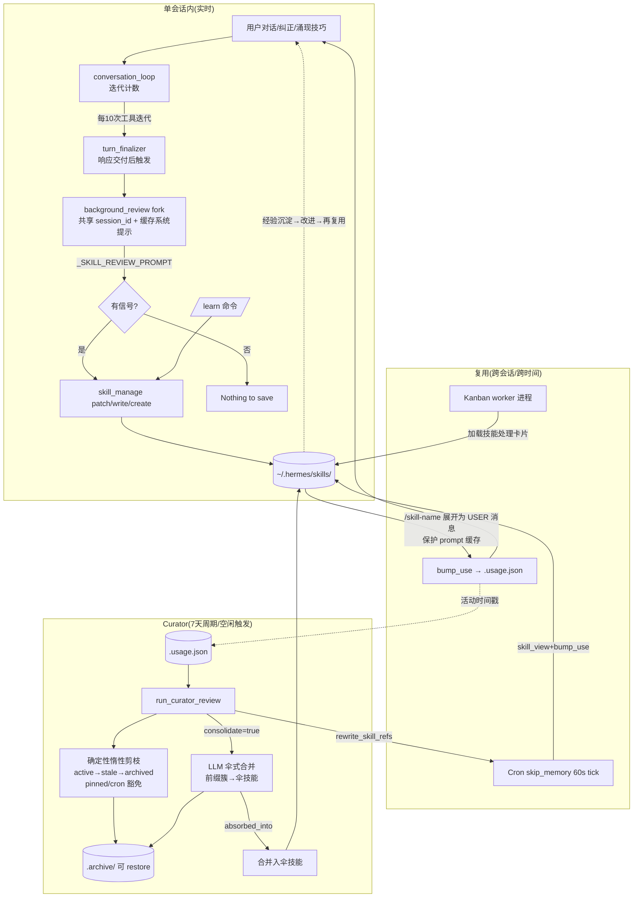

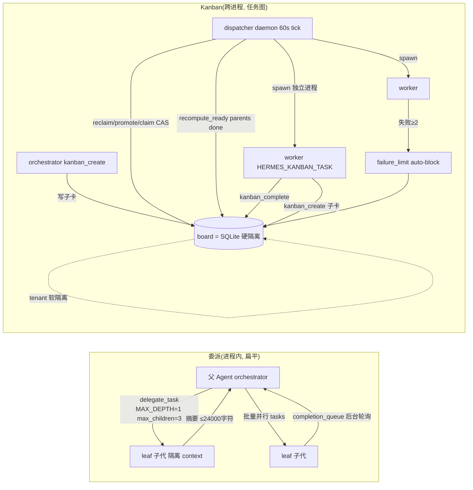

---

## 七、研究与训练基础设施：批量生成 / 轨迹压缩 / MCP / 模型供应商

Hermes 同时是 Nous Research 训练**下一代工具调用模型**的数据工厂。整条链路自洽：同一份 `from/value` 轨迹格式贯穿采集、压缩、发布 HuggingFace、再回流训练。

### 7.1 批量轨迹生成：batch_runner.py

数据生成流水线入口，把 JSONL 数据集（每行一个 prompt）扇出到多进程并行跑 Agent，转成训练格式落盘。`BatchRunner`（`:527`）输出 `data/<run_name>/`（`checkpoint.json`/`statistics.json`/`trajectories.jsonl`）。**并行模型**：`multiprocessing.Pool`（CPU/IO 隔离 + 每 worker 独立 provider 客户端），**批间并行、批内串行**。每条 prompt 处理体现研究导向：按行覆盖容器镜像（数据集行可携带 `image`/`cwd`，先 `docker pull` 探活避免浪费 token）、**工具集分布采样**（`sample_toolsets_from_distribution` 产生工具组合多样性）、任务隔离（`task_id` 独立沙箱）、纯净轨迹（`skip_context_files/skip_memory=True` 不让 SOUL.md/记忆污染训练数据；`ephemeral_system_prompt` 执行期注入但不写入轨迹）。

**训练格式与质检**：轨迹转成 ShareGPT 风格 `from/value`（`<tool_call>`/`<tool_response>` XML 包裹），落盘前两道研究级质检：**推理覆盖率过滤**（任何回合都没有 `<REASONING_SCRATCHPAD>`/`reasoning` 的样本整体丢弃，保证带思维链）、**工具统计归一化**（`_normalize_tool_stats` 用 `ALL_POSSIBLE_TOOLS` 补齐零计数，防 HuggingFace Arrow/Parquet schema 不一致）。**容错**：断点续跑用**内容匹配**（按 human 消息文本去重）而非索引，原子检查点，最终合并并过滤幻觉工具名损坏条目。

### 7.2 SWE 执行工装：mini_swe_runner.py

轻量 SWE-bench 风格 harness，产出**与 batch_runner 完全兼容**的轨迹。只暴露一个 `terminal` 工具，环境工厂复用内置 `LocalEnvironment/DockerEnvironment/ModalEnvironment`。`_convert_to_hermes_format` 把内部 OpenAI 格式改写成 Hermes `from/value` 轨迹（系统消息内联 `<tools>` 定义、reasoning 包进 `<think>`），逐字节兼容 batch_runner，可直接喂 `trajectory_compressor.py`。

### 7.3 面向训练的轨迹压缩

`trajectory_compressor.py` 作为**训练数据后处理器**：把长轨迹塞进训练 token 预算同时保留训练信号。`CompressionConfig` 默认用 `moonshotai/Kimi-K2-Thinking` 分词器精确计数，`from_yaml` 让策略声明式配置纳入版本管理。算法"保头保尾、只压中段"。**边界对齐**（`_snap_boundary`/`_is_boundary_clean`）保证边界永不落在 tool 回合上（否则孤儿标记污染训练轨迹）——这是训练角度独有的严谨。摘要用廉价快模生成、`[CONTEXT SUMMARY]:` 前缀，压缩后系统消息追加告示**让训练出的模型学会：上下文出现摘要是正常的**。规模化用 `asyncio.Semaphore(50)` 并发，超时样本直接剔除。**数据回流闭环**：`scripts/sample_and_compress.py` 从 `NousResearch/*` HuggingFace 数据集下载、采样（`seed=42`）、再压缩——即"batch/mini-swe 采集 → 上传 HF → 采样+压缩 → SFT 训练"完整数据工厂。

### 7.4 MCP 服务：双向

**Hermes 作为 MCP 服务器**（`mcp_serve.py`）：`hermes mcp serve` 启动 stdio MCP 服务器，用 `FastMCP` 注册 10 个工具（`conversations_list/conversation_get/messages_read/attachments_fetch/events_poll/events_wait/messages_send/channels_list/permissions_list_open/permissions_respond`），让任何 MCP 客户端（Claude Code/Cursor/Codex）操作 Hermes 跨平台会话。底层 `EventBridge` 用后台线程轮询 `state.db` mtime 替代 WebSocket（200ms 轮询几乎免费）。**Hermes 作为 MCP 客户端**（`optional-mcps/`，Nous 审核目录）：`manifest_version: 1` 声明三种传输/认证形态——linear（http + OAuth 2.1 + DCR，本地无需安装）、n8n（stdio + api_key，默认只启用只读工具）、unreal-engine（http + none，本机连接）。

### 7.5 模型供应商抽象：无锁定

设计哲学：**每个供应商只声明一次**为一个 `ProviderProfile`（`providers/base.py:41`），认证/传输 kwargs/模型列举/运行期路由/健康检查都从这份 profile 读取。profile 声明身份（`name/api_mode/aliases`）、认证端点（`env_vars/base_url/auth_type`：api_key/oauth_device_code/oauth_external/copilot/aws_sdk）、请求级 quirk（`fixed_temperature/default_max_tokens`），复杂供应商通过覆写钩子表达差异（`build_extra_body/build_api_kwargs_extras/get_max_tokens/fetch_models`）。

**插件式发现，用户可覆盖**：profile 住在 `plugins/model-providers/<name>/`，`providers/__init__.py` 首次访问时惰性扫描仓库自带 + 用户 `$HERMES_HOME/plugins/`，**同名后注册者覆盖**（last-writer-wins）——第三方无需改仓库代码即可替换任何内置 profile。仓库当前带 35 个供应商插件（openrouter/anthropic/gmi/nous/gemini/bedrock/vertex/deepseek/xai/ollama/custom…）。

**`api_mode` 是抽象枢纽**：一个字段决定传输后端。运行期路由 `runtime_provider.py::_resolve_runtime_from_pool_entry` 按 provider 决定 `api_mode`/`base_url`（`openai-codex/xai-oauth→codex_responses`、`anthropic/minimax-oauth→anthropic_messages`、`azure-foundry` 按模型族推断），对未知端点用 `_detect_api_mode_for_url` 从 URL 反推。**防污染**：opencode-zen 等双 mode 供应商每次从当前有效模型重新派生 api_mode，避免上一会话 mode 因 `/model` 切换泄漏。这套机制让用户用同一条 `hermes model` 命令在 Nous Portal/OpenRouter/原生 OpenAI-Anthropic/Bedrock/本地 Ollama-vLLM 间自由切换而 Agent 循环代码零改动——即"无锁定"的工程实现。

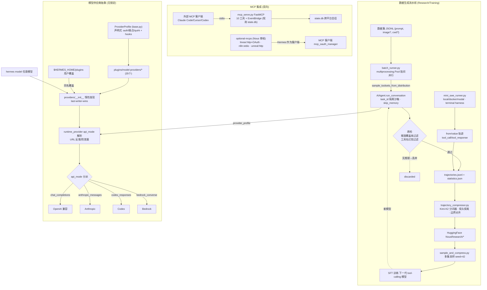

---

## 八、贯穿全局的设计哲学与横切主题

把七个子系统合起来看，Hermes 的架构由几条反复出现的"第一性原则"驱动：

### 8.1 提示缓存（Prompt Cache）字节级稳定性——最 load-bearing 的约束

这是理解整个代码库"为什么这样切"的钥匙。Anthropic/vLLM/llama.cpp 的前缀缓存要求上下文前缀逐字节稳定，缓存失效意味着成本剧增。由此派生出一整套跨模块的不变量：

- **系统提示每会话构建一次、逐字节回放**（gateway 每回合新建 `AIAgent` 却靠 SessionDB 往返维持前缀缓存）。
- **稳定的进可缓存前缀、易变的进消息体**：三层系统提示中 volatile 层会话开始冻结；记忆召回、技能调用、插件上下文**一律注入 user 消息**而非改系统提示。
- **技能斜杠命令作为 USER 消息展开**（而非改系统提示），使 `/reload-skills` 零缓存重置成本。
- **内建记忆冻结快照模式**：`memory` 工具写入立即落盘但不改系统提示。
- **tool_call arguments 用 `sort_keys` 规范化 JSON**，压缩摘要放会话中段而非前缀。
- 上下文压缩是唯一被允许改动历史上下文的时机。

### 8.2 弱模型/多供应商兼容性救援——复杂度的真正来源

Agent 循环的绝大部分代码不是"编排"，而是抹平上百种模型/供应商的行为差异：空响应救援（部分流恢复/nudge/prefill 续写/`(empty)` 哨兵）、跨 provider `reasoning_content` 字段的保留/剥离/pad、流式工具增量的名字翻倍防护、幻觉工具名修复、截断 JSON 检测、凭据池限流轮换、fallback 链热切换、`_StreamErrorEvent` 合成异常统一错误路径。

### 8.3 单一数据源 + 自注册/自发现

反复出现的模式：`tools/registry.py`（import 即注册）、`COMMAND_REGISTRY`（斜杠命令扇出到 CLI/网关/Telegram/Slack/补全）、`_HERMES_CORE_TOOLS`（改一处同步所有平台）、`ProviderProfile`（供应商声明一次）、`_BUILTIN_SKINS`（皮肤纯数据）、TUI 网关 `@method` 装饰器、平台 `PlatformEntry` 注册表。新增一个命令/工具/供应商/主题都是"改一处数据"，所有下游自动继承。

### 8.4 进程隔离下的内核复用

TUI 的 `_SlashWorker`、Dashboard 的 PTY 桥都不重写逻辑，而是**孵化真实的 `HermesCLI`/`hermes --tui`** 并捕获其 I/O；ACP、Cron、Batch、Kanban worker 全部复用同一 `AIAgent` 与共享 `state.db`。四条 UI 通道 + Cron + Kanban 共用一个状态库，保证跨界面语义一致、会话可跨进程检索。

### 8.5 非破坏性 + 可恢复 + fail-open

`messages.active`/`compacted` 两位布尔让压缩=软归档、rewind=可恢复；Curator 只归档不删除（`.archive/` + `restore_skill`）；工具回合先持久化后执行；所有回调/插件钩子/记忆/LSP 侧路径 try/except 吞异常"绝不打断 agent 循环"。

### 8.6 Profile 多实例与安全纵深

`get_hermes_home()` 统一 profile 感知路径；`acquire_scoped_lock` 防同 token 多进程争抢；环境变量多层消毒（Tier-1 无条件剥离 + 动态密钥模式匹配）；出站媒体 denylist 防凭据外泄；webhook toolset 最小权限防注入；execute_code RPC token 鉴权 + 子进程环境 scrub；工具错误剥离框架 token 防角色混淆。

### 8.7 插件化扩展面（不改核心）

统一的 `register(ctx)` 生命周期钩子（`pre/post_tool_call`、`pre/post_llm_call`、`on_session_start/end`）+ 多套目录扫描发现系统（通用插件 / memory-provider / model-provider / context-engine / platform）。政策明确：插件 MUST NOT 修改核心文件；新记忆后端/第三方产品集成必须作为独立插件仓发布。

---

## 九、总结

Hermes Agent 是一个把"研究实验平台"与"生产级个人 AI 助理"合二为一的系统。其架构价值不在于任何单一炫技点，而在于**用一套自洽的工程不变量把七个复杂子系统黏合成一个可缓存、可恢复、可扩展、无供应商锁定的整体**：

1. **核心内核**（`run_agent.py`）——薄转发壳 + 5800 行对话循环，复杂度集中在缓存不变量与弱模型救援。
2. **工具与环境**——自注册表 + 六种可插拔执行后端（含 serverless 休眠）。
3. **状态与记忆**——SQLite/FTS5 持久化 + 双套压缩 + 分层记忆 + Honcho 辩证式用户建模。
4. **UI 层**——CLI/TUI/Dashboard/ACP 四通道复用同一内核与状态库。
5. **消息网关**——单进程 20+ 平台，归一化 `MessageEvent` + 两道消息护栏。
6. **学习闭环**——技能/策展/委派/定时/看板，把单会话智能扩展为自我进化的多智能体系统。
7. **研究基础设施**——批量轨迹生成 + 训练压缩 + 双向 MCP + 无锁定供应商抽象，形成"采集→压缩→训练→回流"的数据工厂。

**一处需要提醒的文档与代码不一致**：`AGENTS.md` 称 cron 有"3 分钟硬中断"，但源码显示实际是默认 **600 秒（10 分钟）非活动看门狗**（`scheduler.py:3137` 附近，`HERMES_CRON_TIMEOUT`）——若以此文档做运维假设需按代码为准。

> 本报告基于对上述模块的源码精读（含 file:line 级引用），所有引用均可在 `opensource/hermes-agent/` 下直接核对。因代码库处于高速演进（近期 commit 涉及 Windows coreutils、vLLM output-cap、reasoning 渲染等），个别行号可能随版本漂移，但架构主线与不变量稳定。

