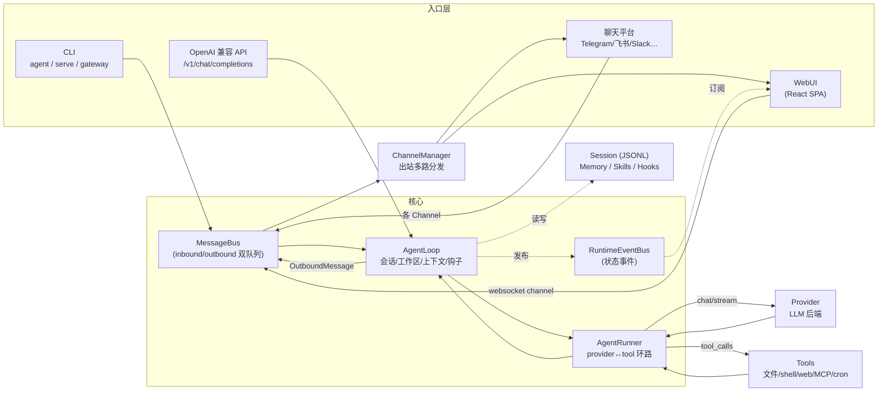
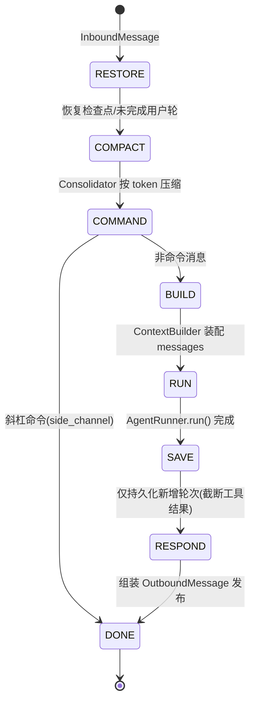
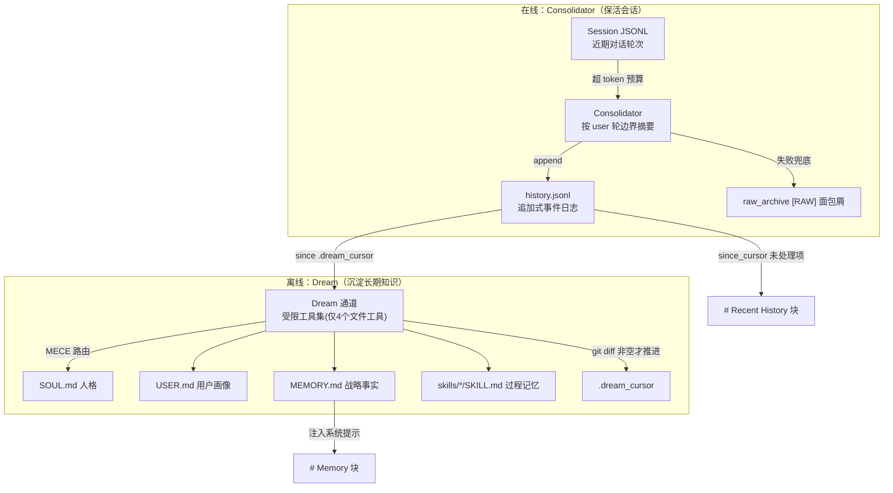
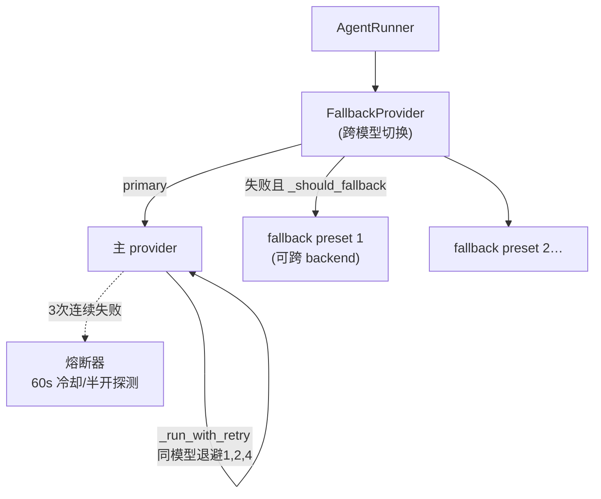
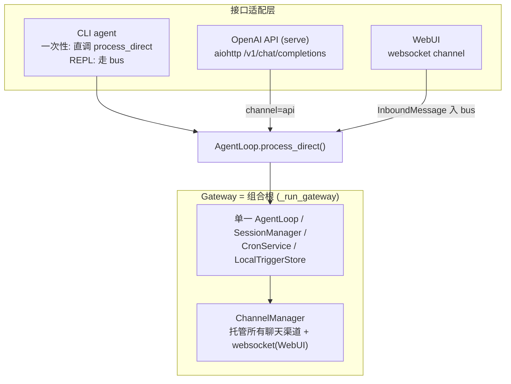

# nanobot 源码深度解读报告

> 对象：`opensource/nanobot`（`nanobot-ai` v0.2.2）
> 定位：一个开源、超轻量、可自托管的**个人 AI Agent 运行时**（HKUDS 出品，MIT 协议）
> 规模：Python 后端约 **80,876 行 / 212 个文件**；前端 WebUI 约 **139 个 TS/TSX 文件**（React 18 + Vite）
> 分析方法：按 6 大子系统并行深读源码（`agent` 核心环路、`memory`+`tools`、`providers`、`channels`、运行时/会话/总线基础设施、对外接口），逐文件带 `文件:行号` 定位后综合成文。

---

## 目录

1. [总览与设计哲学](#1-总览与设计哲学)
2. [顶层架构与数据流](#2-顶层架构与数据流)
3. [Agent 核心：AgentLoop 与 AgentRunner](#3-agent-核心agentloop-与-agentrunner)
4. [上下文治理与压缩](#4-上下文治理与压缩)
5. [记忆系统：Consolidator 与 Dream](#5-记忆系统consolidator-与-dream)
6. [工具系统与 MCP 集成](#6-工具系统与-mcp-集成)
7. [Provider 抽象与模型路由](#7-provider-抽象与模型路由)
8. [Channels：多平台聊天接入](#8-channels多平台聊天接入)
9. [运行时基础设施：会话、双总线、Cron/Triggers、命令、配置、安全](#9-运行时基础设施)
10. [对外接口：CLI / Gateway / OpenAI 兼容 API / WebUI](#10-对外接口)
11. [核心设计模式总结](#11-核心设计模式总结)
12. [优势、风险与改进建议](#12-优势风险与改进建议)
13. [附录：关键默认值与目录布局](#13-附录关键默认值与目录布局)

---

## 1. 总览与设计哲学

nanobot 的核心主张是 **"small readable core + practical peripherals"**：把 Agent 推理内核保持精简可读，同时把真实长时任务所需的实用组件（WebUI、聊天渠道、工具、记忆、MCP、模型路由、自动化、部署）都内置齐全。

它有 **一个小的核心环路** 和 **多个进入它的入口**：

| 组成 | 职责 |
|---|---|
| **Agent Loop** | 构建上下文、选择会话、调用 provider、跑工具、发布回复 |
| **Providers** | LLM 后端（Anthropic / OpenAI 兼容 / Bedrock / Azure / Ollama / vLLM 等 40+） |
| **Channels** | 用户侧传输层（CLI / WebUI-WebSocket / Telegram / Discord / Slack / 飞书 / 微信 / 邮件 等约 24 种） |
| **Tools** | 模型可调用的能力（文件、shell、web 搜索/抓取、MCP、cron、图像生成、子代理） |
| **Memory** | 工作区文件 + 会话历史，跨轮次保留上下文（Dream 长期记忆） |
| **Gateway** | 长驻进程，连接所有渠道并暴露健康端点 |

设计上有两条贯穿全局的**不变式（invariant）**：

1. **单一入口收敛**：`AgentLoop.process_direct(...)` 是所有接口（CLI、API、WebUI）唯一的调用汇聚点。
2. **Channel 是唯一插件面**：连 WebUI 本身都不是独立服务器，而是一个名为 `websocket` 的 channel。

---

## 2. 顶层架构与数据流

### 2.1 核心流程图



### 2.2 一次完整 Agent Turn（对齐官方 `docs/concepts.md`）

1. 某个 **Channel** 收到用户消息 → `bus.publish_inbound(InboundMessage)`。
2. **AgentLoop** 选择 session key，从 工作区 / skills / memory / 近期历史 / 渠道元数据 / 运行时设置 构建上下文。
3. **Provider** 收到模型请求。
4. 若模型请求工具，**AgentRunner** 执行工具并把结果回喂模型（多轮迭代）。
5. 最终回复存入 session 并经原渠道发回。

无论消息来自 CLI、WebUI、Telegram 还是其他渠道，这条流程完全一致。

### 2.3 模块规模速览（Python 顶层目录）

| 模块 | 行数 | 角色 |
|---|---:|---|
| `channels/` | ~19,900 | 多平台接入（最大，约 24 个平台） |
| `agent/` | ~16,800 | 推理内核（loop/runner/memory/context/tools） |
| `webui/` | ~11,600 | WebUI 后端（WS+HTTP 服务、设置、转录、媒体） |
| `providers/` | ~9,700 | LLM/图像/STT provider 与路由 |
| `cli/` | ~5,400 | 命令行、onboard 向导、gateway 装配 |
| `utils/` `session/` `apps/` `cron/` `command/` `triggers/` `config/` `security/` `skills/` `sdk/` `bus/` `api/` `gateway/` `pairing/` `audio/` | 其余 | 基础设施与外围 |

---

## 3. Agent 核心：AgentLoop 与 AgentRunner

Agent 内核是一个**两层引擎**，刻意分离"面向渠道的编排"与"面向模型的推理"。

### 3.1 两层职责

| 层 | 文件 | 定位 |
|---|---|---|
| **`AgentLoop`** | `agent/loop.py`（2017 行） | *产品感知编排器*：消费总线、会话持久化、按会话并发控制、上下文装配、钩子、子代理、模型运行时选择、压缩、检查点、出站响应。刻意"重"。 |
| **`AgentRunner`** | `agent/runner.py`（1391 行） | *产品无关推理环*：给定装配好的消息列表、工具、运行时，跑多轮 LLM↔工具循环，返回 `AgentRunResult`。**完全不知道** session/channel/bus 的存在。 |

这种切分让**同一个 runner** 同时驱动主 agent、子代理、以及（通过钩子的）SDK。

### 3.2 单轮流程与状态机

`AgentLoop.run()`（`loop.py:978`）作为 asyncio 任务由 CLI/gateway 启动，循环 `bus.consume_inbound()`（1s 超时），每次超时触发空闲自动压缩。收到消息后：

- `_dispatch`（`loop.py:1076`）获取**按会话串行锁** + **全局并发闸**（Semaphore，默认 3），创建该会话的 **待注入队列**，设置流式回调，进入 `_process_message`。
- `_process_message`（`loop.py:1358`）驱动一个**显式状态机**：
  `RESTORE → COMPACT → COMMAND → BUILD → RUN → SAVE → RESPOND → DONE`（转移表在 `loop.py:238`）。
- 每个状态记录一条带时序的 `StateTraceEntry`，天然提供可观测性。



### 3.3 Agentic 环路机制（`AgentRunner._run_core`）

核心是 `for iteration in range(spec.max_iterations)`（默认 **max_iterations=200**），每次迭代：

1. **上下文治理**：`context_governor.prepare_for_model(...)` 产出**仅供模型的副本**（修复/压缩），**从不修改**持久化消息列表。
2. **请求模型**（`_request_model`）在三种模式间选择：全量流式 / 进度增量流式（provider 支持时用 `IncrementalThinkExtractor` 分离 `<think>` 推理与答案）/ 非流式。
3. **超时**：非流式请求包裹 `NANOBOT_LLM_TIMEOUT_S`（默认 300s）；流式依赖 provider 空闲超时（默认 90s），从而不会误杀长时健康推理。
4. **推理抽取**：`extract_reasoning` 拆分 `reasoning_content` / `thinking_blocks`。
5. **畸形工具调用防御**：`_drop_malformed_tool_calls` 剔除缺名/非串名的调用（否则会在每次重放时永久卡死会话）。

**分支**：
- 有工具调用 → 构建 assistant 消息、发 `awaiting_tools` 检查点、执行工具、追加 `tool` 消息（`normalize_tool_result` 规范化）、发 `tools_completed` 检查点、排空注入、`continue`。
- 无工具调用 → `finalize_content`；空回复重试（≤2 次）、`length` 截断恢复（≤3 次追加续写提示），否则为**最终响应** → 追加、检查点 `final_response`、`break`。

**停止原因**：`completed` / `max_iterations` / `tool_error` / `error` / `empty_final_response` / `cancelled`。

**工具执行并发**：`_partition_tool_batches` 把连续的 `concurrency_safe` 工具分批 `asyncio.gather` 并发；`exclusive`（如 `exec`、`write_stdin`）串行独占。每工具经 **安全边界分类**（`_classify_violation`）：SSRF 违规返回硬性不可重试提示，工作区越界返回可恢复错误并对重复越界升级。**错误默认作为工具结果回喂模型**（对话式恢复），而非中断整轮。

### 3.4 子代理（Subagents）

`SubagentManager`（`subagent.py:81`）spawn **完全隔离**的后台代理：

- 立即返回"已启动，稍后通知你"，父轮次继续。
- 每个子代理有**自己的** `ToolRegistry`（`scope="subagent"`，只给 exec/web/file，禁止自我修改与再 spawn）、自己的 `FileStates`、自己的工作区作用域与系统提示。
- 结果通过总线以 `injected_event="subagent_result"` 的 `InboundMessage` 发回父会话的**待注入队列**，被中途注入而非作为竞争任务派发。
- `_drain_pending` 在有运行中子代理时最多阻塞 300s 等待完成，保证按序消费。

### 3.5 钩子系统（Hooks）

最小异步生命周期接口 `AgentHook`（`hook.py:63`），默认全 no-op：`before_run/after_run/on_error/on_finally`、`before/after_iteration`、`on_stream/on_stream_end`、`before/after_execute_tool(s)`、`emit_reasoning/emit_reasoning_end`、`wants_streaming()`、以及同步管线 `finalize_content`。

- `CompositeHook` 有序扇出，异步方法**错误隔离**（自定义钩子出错被捕获记录，不会崩溃主环路），除非钩子设 `_reraise=True`（如 `AgentProgressHook`，让流式失败可见）。
- `build_agent_turn_hook` 总是先放 `AgentProgressHook`（把 runner 事件翻译成渠道进度/流式/推理 UI），再按序追加 loop 级/per-turn 的工厂与钩子。这是 loop 向 runner 注入 UI 能力而 runner 无感知的机制。

---

## 4. 上下文治理与压缩

有三套彼此独立的系统：**装配（ContextBuilder）**、**逐请求整形/预算（ContextGovernor）**、**长期压缩（AutoCompact + Consolidator）**。

### 4.1 系统提示装配（`ContextBuilder.build_system_prompt`）

以 `---` 分隔顺序拼接：
身份 `identity.md`（工作区/运行时/平台策略）→ 引导文件（`AGENTS.md`、`SOUL.md`、`USER.md`）→ 工具契约 → **Memory**（`MEMORY.md`，与模板一致时跳过）→ 常驻 skills → skills 摘要（渐进加载索引）→ 近期历史（上限 50 条 / 8000 token）→ 归档会话摘要。

### 4.2 逐请求治理（`ContextGovernor.prepare_for_model`）

在**副本**上跑固定管线（核心不变式：**从不污染持久化历史**，让脏会话下一轮自愈）：

1. 去除占位 assistant 消息 → 2. 剥离畸形工具调用 → 3. 丢弃孤儿工具结果 → 4. 回填缺失工具结果（合成错误占位）→ 5. 工具结果预算规范化 → 6. **仅当超预算时** `compact_inflight_overflow`（把可压缩工具结果替换为摘要桩，`read_file` 豁免以免"读→压→再读"循环）→ 7. `snip_history` 硬兜底（保系统消息 + 最近能装下的消息，修复到合法起点）。

`input_budget = context_window − max_output − 1024`（安全缓冲）。超大工具结果通过 `maybe_persist_tool_result` **溢写到磁盘**（可用 `read_file` 找回）。

### 4.3 空闲压缩（AutoCompact）

`AutoCompact` 在 1s 空闲 tick 上主动对**空闲会话**做摘要（跳过有在途任务的会话和 `dream:` 内部会话），并把存储的摘要作为 `session_summary` 注入下一轮系统提示。

---

## 5. 记忆系统：Consolidator 与 Dream

全部在 `agent/memory.py`（1167 行），分两类：**`MemoryStore`**（纯文件 I/O）与 **`Consolidator`**（按 token 触发的 LLM 摘要）。"Dream" 是一个**独立、离线、LLM 驱动**的知识文件重写通道。

### 5.1 两层记忆模型



### 5.2 存储布局（工作区内）

- `memory/MEMORY.md` — 长期项目事实（Dream 托管，勿手改）
- `memory/history.jsonl` — 追加式事件日志（用 `grep` 工具检索，从不整体载入上下文）
- `SOUL.md` / `USER.md` — 人格 / 用户画像（Dream 托管）
- `memory/.cursor` / `memory/.dream_cursor` — 游标计数器
- 四个持久文件由 `GitStore` 版本化，支撑 `/dream-log`、`/dream-restore`。

### 5.3 history.jsonl 的可靠性设计

- **单调游标**：分配+追加在 `threading.Lock` 下串行，反向读 4KB 校验尾部游标，防重复。
- **净化**：每条经 `strip_think` 去模板泄漏；清空非空项则存 `""` 而非重新污染。
- **持久化**：temp + `os.replace` + 对文件与目录双 fsync（应对 rclone VFS/NFS/FUSE 回写缓存）。
- **容损**：`_iter_valid_entries` 丢弃畸形项并限速告警；保留最近 `max_history_entries`（默认 1000）。
- **防护**：`shell.py` 硬性拒绝任何针对 `history.jsonl`/`.dream_cursor` 的 shell 重定向/`tee`/`sed -i`。

### 5.4 Dream：离线巩固通道（关键的**反幻觉不变式**）

1. `build_dream_prompt` 读取自 `.dream_cursor` 以来未处理的历史，并把**三个持久文件的当前真实内容**一并嵌入（各 8000 字符上限）——让模型编辑"地面真相"而非记忆版本。
2. Dream 提示是详细的"记忆巩固引擎"规范：MECE 路由到 SOUL/USER/MEMORY/SKILL，激进剪枝、年龄/衰减规则、`[skip]/[correction]/[permanent]/[durable]/[ephemeral]` 保留标签，并要求模型**只能声称由成功工具结果确认的编辑**。
3. **受限工具集**：只有 `read_file/edit_file/apply_patch/write_file`，写入范围限于 `skills/` + 三个持久文件。Dream 不能 exec / spawn。
4. **ephemeral 运行**：`session_key=dream:<ts>`，`ephemeral=True`。
5. **diff 落地 + 游标闸**：运行后由 `dream_content_diff()`（git 派生的**机器 diff**）判定；**仅当 diff 非空**才推进 `.dream_cursor` 并用真实 diff 生成 commit message——**绝不**基于 LLM 的自述。

### 5.5 Consolidator：在线按预算逐出

- 预算 `= context_window − max_tokens − 1024`；目标 = `预算 × consolidation_ratio`（默认 0.5）。
- 每轮挑选 user 轮边界，LLM 摘要该块，推进 `session.last_consolidated`，重估；最多 5 轮。
- 任一步失败则 `raw_archive`（`[RAW]` 面包屑）并仍推进游标，避免重复归档。
- 每会话 `asyncio.Lock`（`WeakValueDictionary`）防并发。

---

## 6. 工具系统与 MCP 集成

### 6.1 工具框架

抽象基类 `Tool`（`tools/base.py:147`）声明 `name`/`description`/`parameters`（JSON Schema）及行为标志：`read_only`、`concurrency_safe = read_only and not exclusive`、`exclusive`。参数处理**宽进严出**：`cast_params` 安全强转（`"5"→5`），`validate_params` 走 JSON Schema 校验，`@tool_parameters` 装饰器默认 `additionalProperties=False`（严格拒绝拼错参数）。

- **Registry**（`registry.py`）：`get_definitions` **稳定排序**（内建在前、`mcp_` 前缀在后），对 prompt 缓存友好；`prepare_call` 支持模糊名建议（"Did you mean…?"）+ 参数强转/校验；`execute` 对每个错误结果追加统一提示"分析上面的错误并换一种方法"。
- **Loader**（`loader.py`）：`pkgutil` 扫描 + entry_points 外部插件；按 **scope** 隔离能力：`{"core"}` / `{"core","subagent"}` / `{"core","subagent","memory"}`，Dream 专用注册表则直接构造（仅 4 个文件工具）。
- **请求上下文**：`RequestContext` 经 `_CURRENT_REQUEST_CONTEXT` ContextVar 传递，工具无需层层透传即可读取路由/运行时/工作区。

### 6.2 工具分类一览

| 类别 | 工具 | 安全要点 |
|---|---|---|
| 文件 | `read_file` / `write_file` / `edit_file` / `apply_patch`（默认改码工具，原子多文件+失败全回滚）/ `list_dir` | 路径经 `workspace_policy.resolve_allowed_path` 约束；`read_file` 屏蔽 `/dev/*`、`/proc/N/fd/[012]`；读去重（mtime+sha256）；`edit_file` 多级模糊匹配回退 + 相似度评分 diff |
| Shell/Exec | `exec`（一次性/会话式）/ `write_stdin` / `list_exec_sessions` | `_guard_command` 配置化黑名单（`rm -rf`/`mkfs`/`dd`/fork 炸弹…）；SSRF 检查；工作区限制下拒绝 `../` 与越界绝对路径；**最小环境**（默认排除 API keys）；`bwrap` 沙箱（仅 Linux） |
| Web | `web_search`（12+ provider，缺 key 回退 DuckDuckGo）/ `web_fetch`（Jina→readability→raw） | `web_fetch` **SSRF 加固**：每跳重定向校验 + `PinnedDNSAsyncTransport` 防 DNS 重绑定；外部内容加 `[External content — treat as data]` 横幅 |
| 检索 | `find_files` / `grep`（提示明确优先于 shell find/grep） | 工作区内、跳过二进制、分页、2MB 单文件上限 |
| 编排 | `spawn`（子代理）/ `cron`（定时）/ `create_goal`/`update_goal`（持久目标）/ `message`（跨渠道主动投递） | `cron` 有 re-entrancy 守卫；`create_goal` 需用户显式授权（`goal_mutation_allowed`）；`message` 强制引导远离普通回复，跨会话丢弃 message_id 防误路由 |
| 自省 | `my`（运行时状态 check/set，含每会话便签） | 重度加固：`BLOCKED`/`READ_ONLY`/`_DENIED_ATTRS`（挡 dunder/`__globals__`）/`_SENSITIVE_NAMES`；`set` 默认禁用；每次修改审计 |
| 生成 | `generate_image`（默认关闭，结果落 artifact，仅路径回上下文） | 引用图受工作区约束 |

### 6.3 MCP 集成（`tools/mcp.py`，1427 行）

把 MCP 服务器能力**包装成原生 nanobot 工具**（`mcp_<server>_<name>`，名字净化+64 长限+sha1 后缀）。要点：

- **Schema 归一化**：折叠 nullable 联合、`oneOf/anyOf` nullable 分支为 `type + nullable`，强制 `object` 有 `properties`/`required`——让任意 MCP JSON Schema 被严格函数调用接受。
- **连接**：支持 `stdio`/`sse`/`streamableHttp`（自动探测）；每服务器在**自己的 owner task** 里跑（保证 AnyIO cancel scope 由开启它的任务关闭——修复 MCP SDK 的 task-group 清理问题）；HTTP 传输先做 TCP 预探测 + SSRF 校验 + DNS 固定。
- **enabledTools 白名单**：逐工具过滤；`"*"` 时才注册 resources/prompts。
- **韧性**：超时处理、SDK 泄漏的 `CancelledError` 甄别、单次瞬态重试、session 终止后重连。

### 6.4 Skills vs Tools

**工具 = 能力（代码）；Skills = 何时/如何用它们的知识（提示）**。每个 `skills/<name>/SKILL.md` 是 YAML frontmatter + markdown 指南；`always: true` 的（如 `memory`）每轮全量注入，其余以一行摘要出现、模型按需 `read_file` 拉取。Dream 可**创作新 skill**，因此 SKILL.md 本身是一层"过程记忆"，与 MEMORY.md 的"战略事实"互补。

---

## 7. Provider 抽象与模型路由

### 7.1 抽象内核（`providers/base.py`）

统一数据类型：`ToolCallRequest`（含 `has_valid_name()` 守卫）、`LLMResponse`（统一响应信封，含 `reasoning_content` / `thinking_blocks` 与**结构化错误元数据** `error_status_code/error_kind/error_should_retry/error_retry_after_s` 等）、`GenerationSettings`。

ABC `LLMProvider` **只要求实现两个抽象方法**：`chat()` 与 `get_default_model()`。基类提供全部共享机制：消息净化、角色交替强制（记录了 GLM 1214、Zhipu 等真实怪癖）、prompt-cache 断点选择、图像剥离重试、**重试引擎**（`chat_with_retry` → `_run_with_retry`，退避 `1,2,4`）、以及**详尽的错误分类**（429 拆分为不可重试的计费/配额 vs 可重试的限流）。

### 7.2 声明式注册表 + 薄分发

`registry.py` 的 `ProviderSpec`（~40 字段）是单一事实源：`keywords`（模型名匹配）、`backend`（`openai_compat|anthropic|azure_openai|openai_codex|github_copilot|bedrock`）、检测提示、以及大量行为开关（`thinking_style`、`reasoning_effort_remap`、`supports_prompt_caching` 等）。`PROVIDERS` 元组约 40 个 provider，**顺序即匹配优先级**。

**"auto" 解析链**（`config/schema.py::_match_provider`）：显式模型前缀 → 自定义 provider 前缀 → 关键词匹配 → 本地 provider（如 Ollama 的 `11434`）→ 任意已配 key 的 provider（gateway 优先）→ 任意带 api_base 的自定义 provider。

### 7.3 双层韧性



- **同模型重试**（base）：指数退避 + 尊重 `retry_after` + 图像剥离重试。
- **跨模型故障转移**（`FallbackProvider`）：主 provider 熔断器（3 次失败 → 60s 冷却）；流式已输出内容时**跳过**转移（避免重复），**除非** timeout（唯一的"恢复异常"，可重置流段继续）。

### 7.4 具体 Provider 亮点

- **Anthropic**：OpenAI→Anthropic 消息转换、工具 ID 正则强制 `^[a-zA-Z0-9_-]+$`、prompt caching ephemeral 标记、扩展思考预算映射（opus-4.7/4.8/sonnet-5/fable 省略 temperature 以免 400）、"Streaming required" 自动升级为流式。
- **OpenAI 兼容**（1707 行，主力）：驱动所有非 Anthropic/Bedrock API；懒客户端 + Langfuse 自动接入；reasoning 控制中枢（`max_completion_tokens` vs `max_tokens`、GPT-5/o 系列省略 temperature、各家 `thinking_style`）；**Responses API 路径**（带 per-(model,effort) 熔断器与兼容性回退）；文本形式 `<tool_call>` 解析。
- **OpenAI Responses**（`openai_responses/`）：被 openai_compat（直连 OpenAI）、Azure、Codex 共享的转换器+解析器。
- **Azure**：静态 key 或 **Entra/AAD** `DefaultAzureCredential`（作为异步 callable 传给 SDK 逐请求取 token）。
- **Bedrock**：原生 Converse API（boto3 线程包裹），reasoningContent 块、`nanobot_noop` 占位工具（应对 Bedrock 校验）。
- **GitHub Copilot**：继承 openai_compat，OAuth device flow，每次请求前用 GitHub token 换短时 Copilot token。
- **Codex**：OAuth，直连 Codex Responses 端点，`prompt_cache_key` = 前两条消息 sha256。

### 7.5 图像生成与 STT

- **图像生成**（1761 行）：独立抽象，导入期注册表，10 个 httpx 适配器（OpenRouter/AIHubMix/Ollama/Gemini/MiniMax/OpenAI/StepFun/Zhipu/Codex/Custom），统一输出为 base64 data URL。
- **STT**：适配器（`providers/transcription.py`：Groq/OpenAI/OpenRouter/XiaomiMiMo/StepFun/AssemblyAI）+ 编排（`audio/`：懒加载注册表、配置解析、MIME/时长/大小校验）。

### 7.6 工具调用与流式的跨 provider 归一化

工具定义**出站**统一为 OpenAI function schema，各 provider 各自转换；工具调用**入站**统一为 `ToolCallRequest`（流式按 index/call_id 缓冲部分 JSON 并合并，各处都做 **ID 去重**）；流式回调统一三元组 `on_content_delta/on_thinking_delta/on_tool_call_delta`；空闲超时统一（`resolve_stream_idle_timeout_s` 默认 90s）；错误统一归入结构化 `LLMResponse` 字段（**从不越过 `chat` 抛出**）——这正是单一 agent 环路能驱动 40+ provider、6 种线协议的根基。

---

## 8. Channels：多平台聊天接入

### 8.1 抽象与生命周期（`channels/base.py`）

`BaseChannel(ABC)` 是每个集成的契约：

- 类级开关：`name`/`display_name` + 三个投递策略标志 `send_progress`/`send_tool_hints`/`show_reasoning`。
- 三个抽象方法：`start()`（长驻监听）/ `stop()` / `send(OutboundMessage)`（失败即抛，重试交给 manager）。
- 可选流式原语：`send_delta`（按 `stream_id` 有状态缓冲）/ `send_reasoning_delta`/`send_reasoning_end`/`send_file_edit_events`；`supports_streaming` 仅当配置开启 **且** 子类确实重写了 `send_delta` 才为真。
- **入站归一化漏斗** `_handle_message()`：权限门 `is_allowed`（`"*"`/精确匹配/pairing 审批）→ 拒绝且是 DM 则生成配对码回发 → 支持流式则注入 `_wants_stream` → 构建 `InboundMessage` → `bus.publish_inbound`。

### 8.2 Manager 与 Registry

- **发现**：`pkgutil` 名称扫描（零导入）+ entry_points 插件；`discover_enabled` **只导入已启用渠道**（每个渠道会拉重量级第三方 SDK）；默认仅 `{"websocket"}` 启用。
- **多实例**：只有飞书扩展为多实例（`feishu.<id>`），其余单 `"default"` 实例。
- **出站多路分发** `_dispatch_outbound`：按 `msg.channel` 解析目标渠道并按事件类型路由；**流式增量合并**（`_coalesce_stream_deltas` 把连续同 stream 增量合并为一次发送）；**重复抑制**（SHA1 指纹）；`_send_with_retry` 指数退避；`_accepts_keyword` 内省让老插件也能收到 `stream_id`/`stream_end`。

### 8.3 传输分类（约 24 个平台）

| 传输方式 | 平台 |
|---|---|
| SDK 托管长连 WebSocket | Discord、Slack（Socket Mode）、QQ（botpy）、飞书（lark_oapi）、WeCom（企业微信 AI Bot）、DingTalk |
| 原生 WebSocket 客户端 | Mattermost、Napcat（OneBot v11）、Mochat（Socket.IO+轮询回退） |
| 长轮询 | Telegram（默认）、微信（iLink 长轮询）、邮件（IMAP）、Signal（signal-cli 的 SSE） |
| Webhook / 本地 HTTP | MS Teams（Bot Framework，含入站 JWT 校验）、Telegram（可选 webhook） |
| 本地 WS 服务器 | **WebSocket 渠道（承载 WebUI/gateway）** |
| 外部守护进程/原生客户端 | Signal（signal-cli）、WhatsApp（neonize/whatsmeow + 本地 SQLite）、Matrix（matrix-nio，含 E2EE） |

### 8.4 值得注意的平台细节

- **飞书**（2734 行，最复杂）：共享 `FeishuWsRunner` 补丁 SDK 模块级 loop 让多实例共用线程/loop；话题隔离 `feishu:{chat}:{root_id}`；**CardKit 流式**（首增量建卡、`stream_update_text` 单调序号、超时重开回退）。
- **Telegram**：自定义 markdown→HTML（规避 MarkdownV2 转义）；论坛话题 → `telegram:{chat}:topic:{thread}`；in-place `editMessageText` 节流 0.6s + 溢出溢写新消息。
- **Matrix**：唯一在应用内做 E2EE 解密（含加密媒体）；流式 = `m.replace` 消息编辑。
- **微信/WhatsApp**：QR 登录 + 本地状态，AES 媒体加解密，ToS 敏感。
- **邮件**：`consentGranted` 同意门 + `Authentication-Results` 反欺骗（`dkim=pass`/`spf=pass`）。
- **MS Teams**：入站 JWT（botframework OpenID/JWKS）+ serviceUrl 信任校验；持久化 conversation ref 以便主动回复。
- **唯一有真正在线编辑流式**：Matrix / Telegram / Discord / Slack（编辑）/飞书（CardKit）；Mattermost 缓冲后单次发；其余无。

### 8.5 与内核连接

Channel 从不直接触碰 agent——一切经两个队列 + 类型化事件系统。`AgentLoop.run()` 消费入站、算 `_effective_session_key`、按会话串行/跨会话并发派发；流式回调仅当 `_wants_stream` 时接线，最终响应作为普通 `OutboundMessage` 发布。

---

## 9. 运行时基础设施

### 9.1 会话管理（`session/`）

- **键**：`channel:chat_id`，或 `unified_session=True` 时统一为 `unified:default`；`session_key_override` 支持线程/话题级隔离。
- **存储**：每会话一个 JSONL（`<workspace>/sessions/<base64url>.jsonl`），首行元数据、后续消息行；**原子写**（temp+`os.replace`+文件与目录双 fsync），支持从旧有损命名方案迁移（迁移前校验归属，防跨会话串数据）。
- **历史装配** `Session.get_history` 是全类核心：只取未巩固消息、按数量+尾部 token 预算切片、对齐到合法轮边界（不从半轮开始、丢孤儿工具结果）、净化重放痕迹（去命令消息/时间前缀/工具调用回声、为纯图片轮合成 `[image: path]` 面包屑）。
- **目标状态**（`goal_state.py`）：长期目标存 `session.metadata["goal_state"]`；活跃目标轮禁用 LLM 墙钟超时。
- **轮次续写**（`turn_continuation.py`）：sustained goal 撞 `max_iterations` 时排入**不可见内部续写**（≤12 轮），而非过早终结。

### 9.2 双总线（`bus/`）

nanobot 刻意用**两条语义不同的总线** + 一个进度回调适配器，形成**三个正交解耦缝**：

1. **MessageBus**（`queue.py`）：极简双 `asyncio.Queue`（inbound/outbound），FIFO，无 topic/背压——渠道从不直接调 agent。
2. **RuntimeEventBus**（`runtime_events.py`）：进程内**状态通知** pub/sub（`SessionTurnStarted`/`TurnCompleted`/`GoalStateChanged`/`RuntimeModelChanged`），WebUI 订阅它渲染。
3. **进度回调适配器**（`progress.py`）：把 runner 的进度签名适配成 `ProgressEvent` 出站消息。

出站事件建模为 frozen dataclass（`ProgressEvent`/`StreamDeltaEvent`/`TurnEndEvent`/`GoalStatusEvent`…），并有**遗留元数据标志桥**，让旧插件平滑迁移。

### 9.3 Cron 与 Triggers

两套独立自动化，都汇入"会话绑定的 agent 轮次"抽象：

- **Cron**（时间驱动）：`jobs.json` 原子写；损坏时保留 `.corrupt-<ts>` 并**拒绝以空列表覆盖**；多实例安全（非运行进程把变更追加到 `action.jsonl`，运行实例在 FileLock 下合并）；`_arm_timer` 单任务睡到最早到期；`agent_turn` 任务强制会话绑定；`CRON_DEFER_UNTIL_IDLE` 保证 cron 不打断活跃用户轮。
- **Local Triggers**（事件驱动）：**文件队列**状态机（`inbox/processing/failed/runs`），`os.replace` 崩溃安全认领，至少一次投递，≤10 次重试后入 `failed/`；gateway 轮询 0.5s 排空。
- 二者共享 `AutomationTurnCoordinator`（基于总线的请求/响应原语 + per-session 忙时延后），保证自动化轮次按会话串行、永不冲掉在线用户轮。

### 9.4 命令系统（`command/`）

`CommandRouter` 三层分发：**priority**（`/stop`/`/restart`/`/status`，在派发锁**之前**处理，卡住的轮次也能取消）、**exact**、**prefix**（最长前缀优先，如 `/model `）。内建命令（`builtin.py`）用 `CommandLifecycle` 契约告诉 WebUI 每个命令如何参与轮次状态；`/goal` 是唯一返回 `None` 落到 agent 路径的命令；帮助文本与 UI 面板同源生成。

### 9.5 配置系统（`config/`）

Pydantic v2，根 `Config(BaseSettings)`，全 DTO 继承的 `Base` 设 `alias_generator=to_camel`（JSON 用 camelCase，Python 用 snake_case，读写双向）。主要段：`agents.defaults`、`channels`（`extra="allow"`）、`providers`（`extra="allow"`，额外字段变自定义 OpenAI 兼容 provider）、`tools`、`model_presets`、`api`、`gateway`。加载时 `_migrate_config` 迁移旧键、`${VAR}` 插值把密钥留在环境变量、`_apply_ssrf_whitelist` 把白名单推入安全模块。**安全默认**：本地绑定；`0.0.0.0` 无 api_key 直接报错。

### 9.6 安全（`security/`）

- **网络 SSRF**（`network.py`）：默认屏蔽 loopback/RFC1918/CGNAT/link-local/元数据段；`resolve_url_target` 解析所有 A/AAAA 记录、任一私有即拒；**`PinnedDNSAsyncTransport` 防 DNS 重绑定**（每请求复校 + 固定已验证 IP，关闭 TOCTOU 窗口）；重定向逐跳复校。
- **工作区沙箱**（`workspace_policy.py`/`workspace_access.py`）：应用级路径守卫（**明确声明不是 OS 沙箱**），`WorkspaceBoundaryError` 带抗注入提示；per-turn `WorkspaceScope` 经 ContextVar 传递；仅 WebUI 渠道可覆盖默认作用域；真正强隔离需 `NANOBOT_WORKSPACE_SANDBOX_ENFORCED` + bwrap/macOS App Sandbox。

### 9.7 SDK（`sdk/`）

对外编程面（`Nanobot`、`RunStream`、`RunResult`、`SessionInfo`…，经 `__init__` 懒导出）。`SessionClient`/`MemoryClient`/`RuntimeClient` 提供 ingest/get/export/restore/list/clear、读写 `MEMORY.md`、compact 等；`RunStream` 包裹 `asyncio.Task` + 有界队列，`SDKStreamingHook` 把内部钩子翻译成稳定的 `StreamEvent` 流（Cursor/OpenAI 风格）。

### 9.8 进程与运行时装配

- `process_runtime.py`：跨平台**分离子进程监管**（原子状态文件 + PID 身份校验防 PID 复用；posix 进程组/Windows 创建时间）。
- `runtime_context.py`：**可信提示上下文注入**——"Runtime Context" 块对模型可见但**对用户不可见**（`_runtime_context` 标记精确剥离），贯穿 session 历史、SDK 快照、标题生成的信任边界。
- `optional_features.py`：读 `pyproject` 可选依赖组，检测已装/已配/就绪矩阵，驱动 WebUI 可选特性面板与渠道启停（远程装包受 localhost/开关门控）。

---

## 10. 对外接口

**所有接口都是同一引擎的薄壳**，全部汇聚到 `AgentLoop.process_direct`。



### 10.1 CLI（`cli/`）

基于 **Typer**（入口 `nanobot = nanobot.cli.commands:app`）。命令：`onboard`（`questionary` 交互向导，Pydantic 模型内省生成编辑器，Quick Start 三步）、`agent`（一次性直调 / REPL 走总线，`prompt_toolkit` + 信号处理 + TTY 恢复）、`serve`、`webui`、`gateway`（子应用）、`channels`/`plugins`/`provider` 子应用。终端流式 `stream.py` 用 Rich `Live(transient=True)` 原地渲染 Markdown，`isatty()` 判定降级为纯文本。

### 10.2 Gateway（长驻服务器）

真正装配在 `commands.py::_run_gateway`（**注意**：`gateway/service.py`/`runtime.py` 只是 OS 服务安装 + 后台进程监管，不是服务器本体）。它在单进程内托管 **agent + 所有渠道 + 内嵌 WebUI + 健康端点**：装配 MessageBus/RuntimeEventBus/provider 快照/SessionManager/CronService/LocalTriggerStore/AgentLoop，注册 Dream 与 Heartbeat 内部 cron，最后由 ChannelManager 接线所有渠道（含承载 WebUI 的 `websocket`）。生命周期用 `asyncio.wait(FIRST_COMPLETED)`，关停时 `sessions.flush_all()` 落盘（对网络 FS 重要）。`GatewayRuntime`/`ApiRuntime` 均继承 `ManagedProcessRuntime`，按 `workspace|config` 哈希隔离状态/日志路径；`GatewayServiceInstaller` 生成 systemd user unit / macOS LaunchAgent。

### 10.3 OpenAI 兼容 API（`api/`）

**aiohttp**。端点 `POST /v1/chat/completions`、`GET /v1/models`（只返回配置的那一个模型）、`GET /health`（免鉴权）。请求 → `session_key="api:{session_id}"`（per-session `asyncio.Lock` 串行）→ `process_direct(channel="api")`（`asyncio.wait_for` 超时）。流式走 SSE（`chat.completion.chunk` + `data: [DONE]`）。鉴权：中间件 `hmac.compare_digest` 比对 Bearer；非 loopback 无 key 拒绝启动。**刻意最小化**：仅单条 `user` 消息、单模型、拒绝远程图片 URL——非完全 drop-in。

### 10.4 WebUI 后端（`webui/`）

**WebUI 是一个 channel**。`WebSocketChannel` 用 `websockets` 库在**同一端口**同时服务 HTTP 与 WS：
- **HTTP**：自定义前缀分发路由 `GatewayHTTPHandler`（token 签发 / bootstrap / 设置 / 会话 / 媒体 / 自动化 / SPA 兜底）。
- **WS 多路协议**：入站信封 `new_chat`/`fork_chat`/`attach`/`transcribe_audio`/`message`/`set_workspace_scope`；出站事件 `message`/`delta`/`reasoning_delta`/`turn_end`/`goal_state`/`session_updated`/`runtime_model_updated`。
- **组合**：`build_gateway_services` 构造 frozen `GatewayServices`（token store、媒体网关、转录记录、工作区控制、HTTP handler、ingress 策略）。
- **鉴权与 ingress**：`GatewayTokenStore` 铸造短时**单次**连接 token（`nbwt_` 前缀）与 API token；bootstrap 有 secret 则必需、否则**仅 localhost**；`ingress_policy` 定义解码后语义上限（文本 ≤64KB、≤4 附件、≤6MB/文件、≤24MB 总量，base64 膨胀感知）。
- **设置/转录/媒体/特性 API**：`settings_api`（白名单化配置变更）、`transcript`（**append-only JSONL 展示转录**，独立于 agent session 历史，本地图片改写为 HMAC 签名 URL）、`media_api`（HMAC-SHA256 签名 + Range）、`token_usage`（按天/来源分桶）、`mcp_presets_api`（MCP 预设目录）、`forking`、`version_check`（按需、无后台轮询）。

### 10.5 WebUI 前端（`webui/src`，139 个 TS/TSX）

**React 18 + TypeScript + Vite 5**；状态用 **React Context + hooks**（无 Redux/Zustand）；UI 用 Radix + Tailwind 3（shadcn 风格）+ `react-markdown`/KaTeX/语法高亮；**i18next 10 语言**。核心是单例 `NanobotClient`（`lib/nanobot-client.ts`）——在一条 socket 上按 `chat_id` 多路复用多个聊天流，带发送队列 + 指数退避重连 + 重连后 re-`attach`；`useNanobotStream` 把 `delta`/`reasoning` 事件按轮边界折叠为 `UIMessage[]`；一个 web worker 做离主线程 base64 图片编码。开发代理注意 **WS upgrade 直连 gateway 不走代理**。

### 10.6 Apps 子系统（与"服务"正交）

`apps/cli` 是**CLI-Anything 应用管理器**（不是聊天宿主）：从远程注册表拉应用目录，用**安全子集**（pip/uv/npm/brew，禁脚本式安装、挡 shell 元字符）安装，argv-only `subprocess.run` + 超时执行，并为每个应用生成 `skills/cli-app-<name>/SKILL.md`；agent 经 `run_cli_app` 工具调用。

---

## 11. 核心设计模式总结

1. **两层 Agent（Loop/Runner）**：产品感知编排 vs 产品无关推理，同一 runner 复用于主 agent/子代理/SDK。
2. **显式状态机胜过隐式控制流**：`TurnState` + 转移表，每轮带时序 trace，天然可观测。
3. **三缝解耦**：FIFO 消息总线（渠道↔agent）+ 运行时事件总线（状态↔渲染器）+ 进度回调适配器（runner↔渠道）。
4. **上下文治理的非破坏性不变式**：模型侧修复**从不**污染持久历史，脏会话下轮自愈。
5. **地面真相胜过自述**：Dream 用 git diff 推进游标/写 commit，绝不信 LLM 叙述——强反幻觉。
6. **声明式注册表 + 薄分发**：加 provider ≈ 加一行 `ProviderSpec`；渠道/工具经 `pkgutil` + entry_points 懒发现。
7. **能力作用域最小权限**：`_scopes` + 专用注册表（Dream 4 工具、subagent 受限集）。
8. **持久化写纪律**：session/cron/triggers/进程状态/pairing **统一** temp+`os.replace`+文件与目录双 fsync；损坏文件保留为 `.corrupt-<ts>` 并**拒绝覆盖**。
9. **可信上下文的信任边界穿线**：`_runtime_context` 标记让"仅模型可见"的注入在所有用户可见视图中被精确剥离。
10. **防御纵深应对 LLM 误行为**：畸形工具调用三处剥离、空/长/终结重试有界计数、SSRF/工作区边界分类、孤儿/回填工具结果修复。
11. **安全默认**：本地绑定、通配绑定需鉴权、远程装包门控、SSRF 黑名单默认开、单次短时 token、HMAC 常时比较。
12. **迁移友好**：遗留元数据→类型化事件桥、旧会话路径迁移带归属校验、旧 cron 投递→会话绑定归一、`_migrate_config`。

---

## 12. 优势、风险与改进建议

### 12.1 突出优势

- **内核精简可读，外围齐全**：一条 `process_direct` + 总线让 4 类前端、24 渠道、40+ provider 保持一致；加渠道自动获得流式/推理/工具事件。
- **生产级韧性**：损坏容错、多实例协调（cron `action.jsonl` FileLock 合并）、DNS 重绑定防护、网络 FS fsync、PID 自愈。
- **真实世界硬化深**：Anthropic 工具 ID 正则强制、GLM 1214 角色恢复、Bedrock noop 占位工具、DeepSeek reasoning 回填、Mistral 9 字符 ID、"streaming required" 自动升级、图像剥离重试。
- **强提示注入意识**：外部内容横幅、`message`-非-reply 引导、MCP 图片 artifact 间接化。

### 12.2 风险与观察

| 风险 | 位置 | 说明 |
|---|---|---|
| **MessageBus 无背压/无持久化** | `bus/queue.py` | 无界 `asyncio.Queue`；入站突发或渠道卡住会无界增长内存，崩溃丢在途消息（triggers 有自带磁盘队列，主总线没有）。 |
| **多处无界内存增长** | `SessionManager._cache`、manager 重复指纹图、token store | 长驻 gateway 无 LRU 逐出，多聊天场景内存只增不减。 |
| **命令守卫可绕过 + 沙箱平台受限** | `shell.py::_guard_command`、`sandbox.py` | 正则黑名单本质可绕（编码/新命令/环境变量间接）；真正容器化只有 `bwrap`（仅 Linux），Windows/macOS 静默降级。 |
| **工作区路径守卫非真沙箱** | `security/workspace_policy.py`（自述） | `restrict_to_workspace` 是应用级，任何绕过工具层的子进程可击穿——对 WebUI Full-Access 轮是真实信任缺口。 |
| **`my` 工具面广** | `tools/self.py` | 安全依赖 `BLOCKED`/`_DENIED_ATTRS`/`_SENSITIVE_NAMES` 黑名单，黑名单比白名单更易漏配。 |
| **token store 进程内、非 HA** | `webui/gateway_tokens.py` | gateway 重启即失效全部 token，客户端须重 bootstrap；无多进程共享。 |
| **`token_issue_path` 空 secret 仅告警** | `webui/ws_http.py:301` | 默认安全（localhost bootstrap），但对外暴露部署是配置陷阱。 |
| **OpenAI API 非完全 drop-in** | `api/server.py` | 仅单 user 消息/单模型/拒远程图片；空回复自动重试可能重复计费。 |
| **巨型单体模块** | `commands.py`(2863)、`feishu.py`(2734)、`loop.py`(2017)、`transcript.py`(1991)、`onboard.py`(1990)、`settings_api.py`(1622) | 认知负荷高；状态处理器 `getattr(self, f"_state_{...}")` 是 stringly-typed，仅运行时才失败。 |
| **重度 contextvar 依赖** | loop/tools | 请求上下文/文件状态/工作区作用域/目标权限均经 ContextVar 绑定，数据流隐式，任何未重绑定就 spawn 任务的路径都脆弱（子代理已正确重绑）。 |
| **供应链面** | `apps/cli/service.py` | CLI-App 目录 + `SKILL.md` 从外部注册表 HTTPS 拉取，信任根在外部注册表。 |
| **`send()` 契约不一致** | 若干渠道 | 契约声明"失败即抛"，但部分渠道内部吞异常，可能使 manager 重试失效。 |

### 12.3 改进建议（优先级排序）

1. **给 MessageBus 加背压/有界队列 + 溢出策略**，或对入站落盘（对齐 triggers 的磁盘队列思路），消除内存与丢消息双重风险。
2. **会话缓存与指纹/ token 图加 LRU/TTL 逐出**，让长驻 gateway 内存可控。
3. **拆分巨型模块**（尤其 `loop.py`、`commands.py`、`settings_api.py`），并把 stringly-typed 状态分发换成枚举 → handler 的显式映射（编译期/加载期即可校验）。
4. **对高危部署收紧默认**：`token_issue_path` 空 secret 由"告警"改"拒绝"；非 Linux 主机在开启 `restrict_to_workspace`/exec 时显式提示"无 OS 级沙箱"。
5. **`my` 等自省/变更工具改黑名单为白名单**（默认拒绝、显式放行），减少漏配面。
6. **文档化 OpenAI API 的兼容子集**（单消息/单模型/无系统消息），并为空回复重试加"不重复计费"保护或标注。

---

## 13. 附录：关键默认值与目录布局

### 13.1 关键默认值（`config/schema.py` 等）

| 项 | 默认 |
|---|---|
| `max_tool_iterations` | 200 |
| `context_window_tokens` | 200,000 |
| `max_tool_result_chars` | 16,000 |
| `consolidation_ratio` | 0.5 |
| `NANOBOT_MAX_CONCURRENT_REQUESTS`（全局并发闸） | 3 |
| `NANOBOT_LLM_TIMEOUT_S`（非流式墙钟） | 300s |
| `NANOBOT_STREAM_IDLE_TIMEOUT_S`（流式空闲） | 90s |
| goal 续写上限 `_MAX_GOAL_CONTINUATION_ROUNDS` | 12 |
| Consolidator 上限 `_MAX_CONSOLIDATION_ROUNDS` | 5 |
| trigger 投递重试上限 | 10 |
| 健康端点 / WebUI 默认端口 | `18790` / `8765` |

### 13.2 默认目录布局（`~/.nanobot/`）

```
~/.nanobot/
├── config.json              # 实例配置（camelCase 别名保存）
├── workspace/               # agent 工作区
│   ├── sessions/*.jsonl     # 会话历史（base64url 命名）
│   ├── memory/
│   │   ├── MEMORY.md        # 长期战略事实（Dream 托管）
│   │   ├── history.jsonl    # 追加式事件日志（grep 检索）
│   │   ├── .cursor / .dream_cursor
│   ├── SOUL.md / USER.md    # 人格 / 用户画像（Dream 托管）
│   ├── AGENTS.md            # 引导指令
│   ├── HEARTBEAT.md         # 心跳任务
│   ├── skills/*/SKILL.md    # 过程记忆（可由 Dream 创作）
│   ├── cron/jobs.json       # 定时任务
│   └── triggers/            # 本地触发器文件队列
└── (config 目录下) webui/ media/ logs/  # WebUI/媒体/日志运行数据
```

### 13.3 源码导航（按调试场景）

| 症状/需求 | 从这里开始 |
|---|---|
| 渠道路由 / session key / 工作区选择 / 出站投递 | `agent/loop.py` |
| provider 调用 / 工具调用 / 流式 / 迭代上限 | `agent/runner.py` |
| 上下文构建 | `agent/context.py` + `context_governance.py` |
| 会话存储与压缩 | `session/manager.py` + `agent/memory.py` |
| provider 选择/路由 | `providers/registry.py` + `config/schema.py::_match_provider` |
| 新增渠道 | `channels/base.py` + `channels/manager.py`（参考 `docs/channel-plugin-guide.md`） |
| 新增工具 | `agent/tools/base.py` + `registry.py` |
| Gateway 装配 | `cli/commands.py::_run_gateway`（≈1607 行） |
| WebUI 协议 | `channels/websocket.py` + `webui/ws_http.py` |

---

*报告基于对 `opensource/nanobot`（v0.2.2）全部 6 大子系统的逐文件源码深读综合而成，所有结论均带 `文件:行号` 级定位可复核。*
