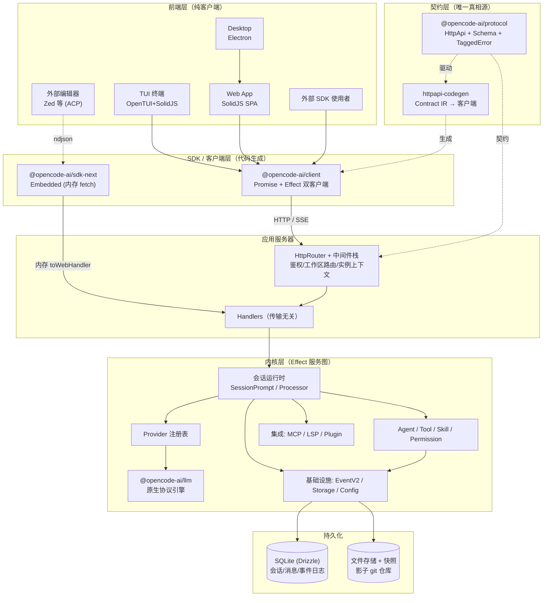
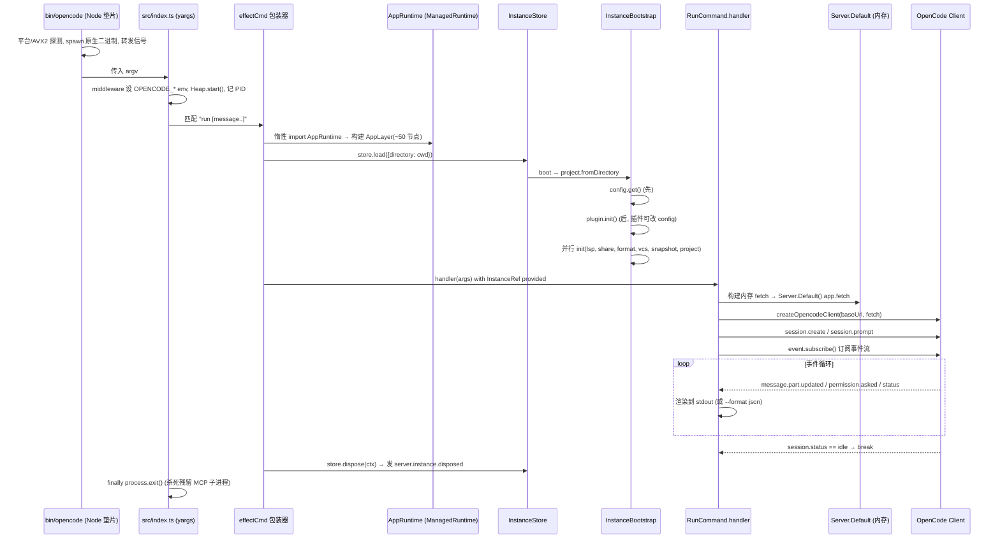
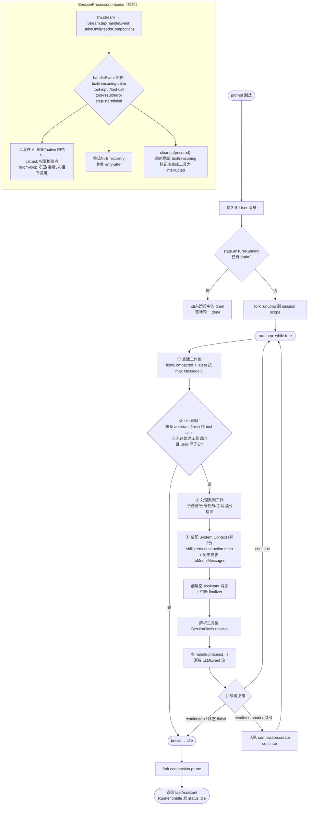
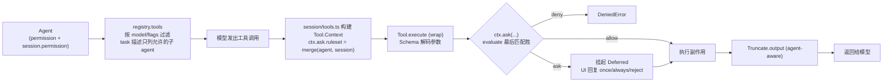
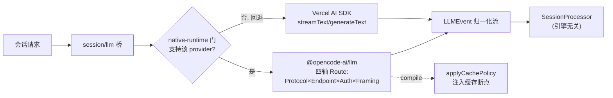
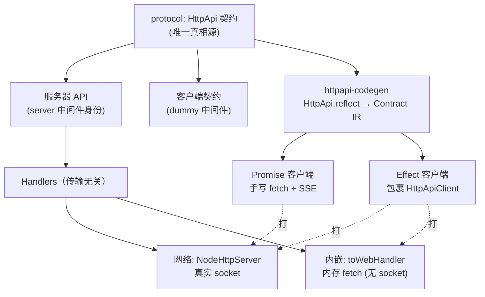
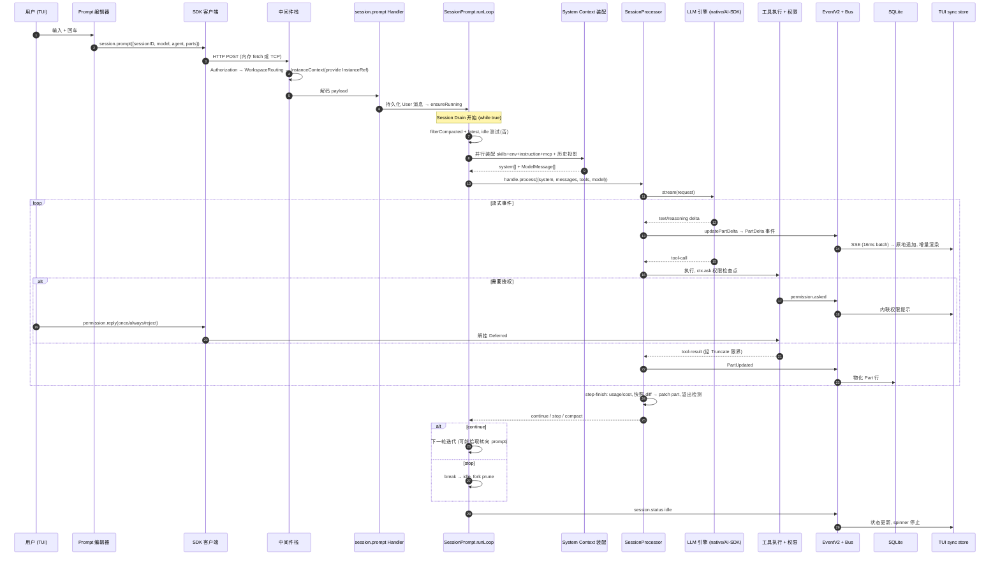

# opencode 深度技术架构解读报告

> 分析对象：`opensource/opencode`（The open source AI coding agent）
> 分析方法：对 34 个包、约 2438 个 TypeScript 源文件按 8 大模块簇并行深度通读源码后综合
> 版本快照：仓库 `dev` 分支（`packages/opencode` 为主应用包）
> 报告日期：2026-07-15

---

## 目录

1. [执行摘要：一句话架构](#1-执行摘要一句话架构)
2. [Monorepo 包拓扑与分层](#2-monorepo-包拓扑与分层)
3. [六大设计基石](#3-六大设计基石)
4. [启动与命令层](#4-启动与命令层)
5. [会话运行时核心（系统心脏）](#5-会话运行时核心系统心脏)
6. [Agent / Tool / Skill / Permission 子系统](#6-agent--tool--skill--permission-子系统)
7. [Provider / LLM 双引擎与协议适配](#7-provider--llm-双引擎与协议适配)
8. [Server / HTTP API / SDK / Client 边界](#8-server--http-api--sdk--client-边界)
9. [集成面：MCP / Plugin / LSP / IDE / ACP](#9-集成面mcp--plugin--lsp--ide--acp)
10. [基础设施：事件总线 / 存储 / 配置 / Effect 运行时](#10-基础设施事件总线--存储--配置--effect-运行时)
11. [TUI 与其它前端](#11-tui-与其它前端)
12. [端到端全链路数据流](#12-端到端全链路数据流)
13. [关键设计模式总结](#13-关键设计模式总结)
14. [对自研 Agent CLI 的架构启示](#14-对自研-agent-cli-的架构启示)

---

## 1. 执行摘要：一句话架构

**opencode 是一个"契约优先、Effect 驱动、多租户单进程、以 HTTP API 为唯一内核边界"的 AI 编码 Agent。** 它把"智能体运行时"做成了一个可以内嵌（in-memory）也可以联网（TCP）的服务器，所有前端（终端 TUI、Web 应用、桌面 Electron、外部编辑器 ACP、SDK 使用者）都只是这个服务器的**客户端**，通过一份从 `HttpApi` 契约自动生成的 SDK 与之通信。

三条最重要的架构事实：

1. **一切皆 Effect 服务**：整个代码库构建在 Effect-TS 之上，服务是 `Context.Service` 类，用自研 `LayerNode` 依赖图装配，进程级单例与项目级（per-instance）状态通过 `InstanceRef` 引用 + `InstanceState`（ScopedCache）区分。
2. **前后端通过生成的 SDK 解耦**：唯一权威契约是 `packages/protocol` 中的 Effect Platform `HttpApi`，它同时驱动"运行时路由/校验"、"OpenAPI 文档"、"Promise + Effect 双客户端代码生成"三件事。同一套 Handler 既服务真实 socket，也服务内存 `toWebHandler`（Embedded OpenCode）。
3. **会话运行时是事件溯源的**：新一代 `EventV2` 引擎把耐久事件（durable events）以"单写者、按聚合全序"的方式落到 SQLite，前端通过 SSE 流做重放（replay）+ 追尾（tail），并有一座桥把新事件回灌到旧的 `GlobalBus`（Node EventEmitter）以兼容历史消费者。

---

## 2. Monorepo 包拓扑与分层

opencode 是一个 Bun workspace monorepo，34 个包按"契约 → 内核 → 应用 → 前端"分层。核心依赖箭头是**严格单向**的：`protocol` 被 `server`/`client`/应用引用，但 `client/effect` **永不** import Core 或 Server。

### 2.1 包清单（按角色）

| 分层 | 包 | 职责 |
|---|---|---|
| **契约层** | `@opencode-ai/protocol` | 权威 HttpApi 契约：分组、端点、Schema、TaggedError、中间件"身份"。仅依赖 `schema` + `effect` |
| | `@opencode-ai/schema` | 共享数据 Schema + 事件清单（event-manifest） |
| **内核层** | `@opencode-ai/core`（33k LOC） | 领域服务：会话运行时（session/）、工具（tool/）、Provider、目录/Git、事件溯源引擎、Drizzle SQLite schema、system-context |
| | `@opencode-ai/llm`（9.5k LOC） | 独立的、Schema 优先的**原生协议引擎**（四轴 Route 模型） |
| | `@opencode-ai/server`（1.7k LOC） | 可复用服务器包：从 protocol 构建具体 Api，提供 Handler 实现 + 中间件 Layer、CORS、鉴权、可内嵌路由工厂 |
| **应用层** | `opencode`（75k LOC，主包） | CLI 外壳 + 完整应用服务器 + 会话编排（session/prompt.ts）+ 各集成面（mcp/plugin/lsp/ide/acp）|
| | `@opencode-ai/plugin` | 公开插件契约（server 插件 + TUI 插件） |
| | `@opencode-ai/sdk-next` | **Embedded OpenCode**：内存 `HttpRouter.toWebHandler` 作为 fetch，被 Effect 客户端包裹 |
| | `@opencode-ai/client` | 生成的 Promise + Effect 网络客户端（根导出 = Promise；`/effect` 导出 = Effect） |
| | `@opencode-ai/httpapi-codegen` | 从 HttpApi 反射出 Contract IR 并发射 Promise/Effect 客户端 |
| **前端层** | `@opencode-ai/tui`（5.9k LOC） | 终端 UI（OpenTUI + SolidJS） |
| | `@opencode-ai/app`（44k LOC） | 浏览器端 SolidJS Web 应用（GUI 客户端） |
| | `@opencode-ai/desktop` | Electron 桌面壳（渲染进程直接挂载 `app`） |
| | `@opencode-ai/web` | Astro + Starlight 营销/文档站 |
| | `@opencode-ai/session-ui` / `@opencode-ai/ui` | 浏览器端会话渲染组件库 / 底层设计系统 |
| **周边** | `codemode` / `http-recorder` / `slack` / `enterprise` / `identity` / `function` / `stats` / `console` | 代码执行沙箱、HTTP 录制回放、Slack 集成、企业版、身份、云函数等 |

### 2.2 分层架构图



---

## 3. 六大设计基石

在深入各模块前，先理解贯穿全局的六个架构决策，它们解释了"为什么代码长这样"。

### 3.1 Effect-TS 作为"应用操作系统"

整个应用运行在 Effect 之上：**类型化依赖注入、类型化错误、结构化并发与取消、资源作用域（finalizer）、统一异步模型**。每个模块遵循统一惯用法（见 `AGENTS.md`）：

```ts
// 模块即服务：一个 Interface + 一个 Service 类 + 一个 layer + 一个 node + 自命名再导出
export interface Interface { ... }
export class Service extends Context.Service<Service, Interface>()("@opencode/Foo") {}
export const layer = Layer.effect(Service, ...)
export * as Foo from "./foo"
```

刻意**禁用 `export namespace`**（破坏 tree-shaking、非标准 ESM），改用"平铺导出 + 文件底部 `export * as` 投影"。

### 3.2 LayerNode：自研的类型化依赖图

`packages/core/src/effect/layer-node.ts` 在 Effect `Layer` 之上构建了一个**有向依赖图**：每个 `Node` 绑定 `{service, layer, deps}`，`make()` 会在类型层面校验 layer 所需服务被声明的 deps 覆盖（`CheckDependencies`）；`compile` 拓扑遍历（**带环检测**），用 `Layer.provide` 折叠依赖，并对共享节点做记忆化（memoMap）。整个 App 就是**一张声明式的图**（约 50~60 个节点）。

`tags`/`hoist` 支持**标签作用域提升**——用 `global` vs `location` 标签区分"进程级单例"（如 `Database`、`EventV2`）与"每个项目目录一份"的服务（如 `Config`、`Snapshot`、`Worktree`）。

### 3.3 多租户：一个进程服务多个项目目录

opencode 服务器可同时服务多个项目目录。因此大多数服务是**per-instance**的：

- `InstanceRef` / `WorkspaceRef` 是 Effect `Context.Reference`，携带当前 `InstanceContext`（directory / worktree / project）。
- `attach()` 从当前 fiber 读取这些引用并重新 provide，使得后台 fork 的工作也保留其实例身份。
- `InstanceState` 是 per-instance 状态原语：一个按 directory 键控的 `ScopedCache`，每个服务拿到隔离的、惰性初始化的、可释放的状态。
- 请求进来时，`InstanceContextMiddleware` 读取工作区路由上下文，`store.load({directory})`，把 `InstanceRef`/`WorkspaceRef` provide 给该请求的 handler effect。

### 3.4 契约优先：一份 HttpApi 驱动三件事

`packages/protocol` 用 Effect Platform 的 `HttpApi`/`HttpApiGroup`/`HttpApiEndpoint`/`Schema` 声明端点。这**一份声明**同时驱动：
- **运行时**：路由、请求解码/响应编码、校验；
- **OpenAPI**：`/doc` 与 `/openapi.json` 规格；
- **SDK 代码生成**：`HttpApi.reflect` → Contract IR → 发射客户端。

关键手法是**中间件键注入**：protocol 只拥有中间件的**位置**，具体中间件"身份"（`Context.Key`）由调用方注入，从而使内核服务身份不泄漏进契约。同一份 protocol 因此产出三个不同的 API 实例（服务器版、客户端契约版、应用版）。

### 3.5 事件溯源 + 双总线兼容桥

新一代 `EventV2`（`packages/core/src/event.ts`）是一个 **SQLite 支撑的、单写者、按聚合全序**的耐久事件日志：`commitDurableEvent` 在一个不可中断的 DB 事务里读取聚合当前 `seq`，强制 `seq = latest+1`，做幂等检查，运行投影器（projector），最后写入 `EventTable`。同时存在旧的 `GlobalBus`（Node EventEmitter），`event-v2-bridge.ts` 把每个 EventV2 payload **回灌**到 GlobalBus，保证历史消费者（SDK、旧 Bus 订阅）继续工作。

### 3.6 System Context：把"上下文装配"抽象成一等公民

`packages/opencode/CONTEXT.md` 用一套精心定义的领域语言描述了"系统上下文"如何被装配：**Context Source**（独立可观测的类型化上下文值）、**Context Epoch**（一次不可变的缓存基线跨度）、**Baseline System Context**、**Mid-Conversation System Message**（把变化的上下文源作为耐久的时序指令告知模型）、**Safe Provider-Turn Boundary**（在 provider 调用前安全地纳入上下文变化）。这套语言是 opencode 相对其它 Agent 最"讲究"的地方——它把提示词/上下文管理当成有版本、有缓存基线、有增量更新语义的状态机，而非简单的字符串拼接。

> 说明：CONTEXT.md 描述的是设计意图与目标术语（"System Context / Context Epoch / Session Drain / Provider Turn"），部分术语在当前源码里尚未逐字落地，但每个概念都能映射到具体实现（详见第 5 节的概念→代码对照表）。

---

## 4. 启动与命令层

### 4.1 职责

进程入口与命令分发面，刻意做得很薄：真正的工作都在内存 HTTP 服务器 + SDK 客户端之后，CLI handler 大多只是编排服务器并把事件流回终端。

### 4.2 关键文件

| 路径 | 作用 |
|---|---|
| `bin/opencode` | Node 垫片：平台/架构/AVX2 探测，spawn 原生二进制，转发信号 |
| `src/index.ts` | 真正 CLI 入口：构建 yargs 解析器，注册 ~24 个命令 |
| `src/effect/app-runtime.ts` | 定义 `AppLayer`（整张 DI 图）与 `AppRuntime`（进程级 `ManagedRuntime`）|
| `src/cli/effect-cmd.ts` | `effectCmd()` 工厂：把 handler 体包成 Effect，管理实例加载/释放 |
| `src/project/instance-store.ts` | `InstanceStore`：目录键控的实例缓存，load/reload/dispose |
| `src/project/bootstrap.ts` | 实例引导：config → plugins → 并行初始化各服务 |
| `src/cli/cmd/run.ts` | `run` 命令（含 `--mini`）：一次性 / 交互本地 / 远程 attach 分发 |
| `src/cli/cmd/tui.ts` | 默认 `$0` 命令：spawn TUI worker + 渲染器 |
| `src/cli/cmd/serve.ts` | `serve`：无头 HTTP 服务器 |
| `src/cli/cmd/acp.ts` | `acp`：stdin/stdout 上的 Agent Client Protocol |

### 4.3 启动时序（`opencode run "..."`）



### 4.4 运行模式仲裁

一个二进制、多种运行模式，由匹配到的命令/标志决定：

| 模式 | 触发 | 传输 |
|---|---|---|
| **TUI（默认）** | 无子命令 → `$0` | spawn Worker 线程跑服务器，TUI 通过 RPC 隧道的 `fetch`/`EventSource` 走内存传输（`http://opencode.internal`），或 `--port` 时走真实 HTTP |
| **一次性 run** | `run "..."` | 内存 `Server.Default().app.fetch` + SDK 客户端，订阅事件流，idle 即退出 |
| **`--mini`** | `run --mini` | 内存服务器 + 精简行式渲染器 |
| **远程 attach** | `run --attach <url>` | 不加载本地实例，SDK 打到远程服务器（带 `ServerAuth` 头） |
| **无头 serve** | `serve` | `Server.listen(opts)` 绑真实端口，`Effect.never` 保活，请求按 `x-opencode-directory` 头惰性加载实例 |
| **ACP** | `acp` | 起本地服务器，stdin/stdout 上桥接 Agent Client Protocol |

枢纽抽象：`Server.Default()` 是一个 `lazy()` 单例内存 app，其 `.app.fetch` 无需 socket 即可服务 HTTP API；`Server.listen(opts)` 绑真实端口。**各模式的差异仅在于打内存 fetch 还是打监听端口。**

---

## 5. 会话运行时核心（系统心脏）

会话运行时把一次用户 prompt 变成一段持久化的、流式的、会用工具的 Agent 对话。领域被拆成：`Session` = 存储/CRUD，`SessionPrompt` = 编排，`SessionProcessor` = 单轮 provider turn，`LLM` = 传输。

### 5.1 概念 → 代码 对照表

| 概念（CONTEXT.md 术语） | 具体实现 |
|---|---|
| **Session Drain（会话排空）** | `SessionPrompt.runLoop` —— `while(true)` 循环，跑 provider turn 直到无待处理工作后 idle |
| **Provider Turn（一次模型调用）** | 一次循环迭代 → 一条 `Assistant` 消息：`processor.create(...)` + `handle.process(...)` |
| **Prompt Promotion（输入提升）** | `createUserMessage` —— 把 `PromptInput`（文本/文件/agent/子任务片段）降解为持久化的 `User` 消息 |
| **System Context** | 每轮迭代构建的 `system: string[]` 数组，作为 system 消息前置 |
| **Context Source** | System Context 的贡献者：`SystemPrompt.provider/environment/skills/mcp`、`Instruction.system`（AGENTS.md/CLAUDE.md）、`SessionReminders.apply` |
| **Context Epoch** | 压缩边界。`filterCompacted` 只投影最近一次完成压缩摘要之后 + 保留尾部的消息 |
| **compaction（压缩）** | `SessionCompaction`：摘要头部、保留近期尾部、可自动续写 |
| **History projection** | `MessageV2.toModelMessagesEffect` —— parts → AI-SDK `ModelMessage[]` |
| **Run handle / 并发** | `Runner` 状态机（`Idle`/`Running`/`Shell`/`ShellThenRun`）背后是 `SessionRunState` |

### 5.2 主循环：一次 Session Drain 逐步拆解

入口 `SessionPrompt.prompt` → 持久化用户消息 → `loop` → `state.ensureRunning(...)` → `runLoop`。关键点：`loop` 从不内联跑 `runLoop`，而是交给 Runner；若已有 drain 在跑，第二个调用者只是**等待同一个 run**——这正是"转向（steering）"的实现基础。



### 5.3 上下文装配与 Epoch 管理

**System Context 分层**（`llm/request.ts` 最终顺序）：`[agent.prompt 或 SystemPrompt.provider(model)] + input.system[] + user.system`。`SystemPrompt.provider` 按模型 id 选基础提示词文件——Claude→`anthropic.txt`，gpt-4/o1/o3→`beast.txt`，gemini→`gemini.txt` 等。`input.system[]` 携带 `<env>` 块（cwd/worktree/git/平台/日期/模型 id）、指令文件、MCP 指令、skills。

**溢出数学**（`overflow.ts`）：`usable = limit.input - reserved`（reserved 默认 `min(20000, maxOutputTokens)`）。两个触发点：轮内被动（processor 设 `needsCompaction`，用 `takeUntil` 停流）与循环顶部主动（对上一完成轮）。

**压缩/Epoch**（`compaction.ts`）：`process` 计算 `select` = 待摘要头部 + `tail_start_id` 保留尾部（默认保留最后 2 轮、受 `preserve_recent_tokens` 预算约束），跑一轮摘要 assistant turn（媒体剥离、工具输出截断到 2000 字符）。`filterCompacted` 把历史重排成 `[压缩-user, 摘要, …保留尾部…, 续写]`，让模型看到"先摘要后尾部"。**Prune** 会擦除超过 `PRUNE_PROTECT=40k` token 的旧工具输出（`skill` 输出受保护），压缩后的输出渲染为 `"[Old tool result content cleared]"`。

### 5.4 并发与中断模型

单会话单飞（single-flight）由 `Runner` 状态机保证，状态：`Idle | Running | Shell | ShellThenRun`。

- **`ensureRunning(work)`**：Idle 则 fork；已 Running 则**返回在飞 run 的 awaitDone** 而非启动第二个 fiber。这是**转向/队列 prompt** 的核心——第二个 prompt 仍持久化其消息，但加入运行中的 drain；drain 下一轮重读历史即可发现新消息。
- **Shell 交织**：仅允许从 Idle 启动；运行中请求变成 `ShellThenRun`。
- **中断/取消**：`prompt.cancel` → `runner.cancel` 中断 fiber 并让 `done` deferred 失败；`awaitDone` 捕获后跑 `onInterrupt = lastAssistant(sessionID)`，使调用者仍拿到一致消息。取消级联到后台作业（含子会话子任务）。
- **fiber 级 finalizer** 保证一致性：`finalizeInterruptedAssistant` 盖 AbortError + 完成时间；`processor.cleanup` 结算悬挂工具片段。

### 5.5 持久化：事件溯源式写入

写入**通过事件桥事件溯源**，而非领域代码直写表。`session.updateMessage`/`updatePart` 发布 `MessageUpdated`/`PartUpdated` 事件，订阅者物化 `MessageTable`/`PartTable` 行。流式文本用 `updatePartDelta` → `PartDelta` 事件做增量 UI。读走 Drizzle/SQLite：`MessageV2.page` 用键集分页（cursor = `{id,time}` base64url）。ID 是单调 ULID，故排序与 `latest` 的 max-id 推导即使在 `filterCompacted` 重排后仍安全。

### 5.6 值得学习的设计模式

- **两种归一化运行时，一条事件流**：native/AI-SDK gate 汇聚到 `@opencode-ai/llm` 的 `LLMEvent`，使 `processor.handleEvent` 传输无关。
- **Handle/闭包对象作为 turn API**：`processor.create` 返回捕获可变 `ProcessorContext` 的 `Handle`。
- **Effect ⇄ Promise 桥接工具**：`EffectBridge` 让 AI-SDK 的 `execute(async …)` 回调运行 Effect 程序。
- **投影 ≠ 存储**：历史以富 parts 存储，按需投影成 provider 形状的消息，逐 provider 处理怪癖。
- **完成检测的纵深防御**：容忍带 tool-calls 的 stop、孤儿中断工具、content-filter finish，每种都有显式分支，会话永不静默卡死或空转。

---

## 6. Agent / Tool / Skill / Permission 子系统

### 6.1 Agent 系统

Agent `Info` 是 Effect `Schema.Struct`，关键字段：`mode: "subagent"|"primary"|"all"`、`permission: Ruleset`（**能力边界**）、可选 `model`/`variant`/`prompt`/`options`。

内置 Agent（`agent.ts`）：`build`（默认主 agent）、`plan`（拒绝所有 edit、拒绝 `task.general`）、`general`（子 agent，通用并行）、`explore`（只读：`*:deny` 后再放行 grep/glob/read 等）、`compaction`/`title`/`summary`（隐藏，内部用）。

权限默认：base ruleset `*:allow`，但 `doom_loop`/`question`/`plan_enter`/`plan_exit` 受门控，`external_directory` 策略 `*:ask` + 白名单，`.env` 读强制 `ask`。最终权限 = `merge(defaults, agent-specific, user)`，**后列规则胜出**，故用户配置永远覆盖内置。

### 6.2 Tool 系统

`Tool.Def` 核心契约：`{id, description, parameters(Effect Schema), execute(args, ctx), formatValidationError?}`。`Tool.Context` 给每个工具：`sessionID`/`messageID`/`agent`/`abort`/`callID`/`metadata(...)`（流式 UI 更新）与 **`ask(...)`**（权限门）。

`wrap()` 做**参数校验 + 输出限界**：parameters Schema 解码器每工具编译一次；失败变 `InvalidArgumentsError`；`execute` 后经 `Truncate.output(..., agent)` 截断（超限则全文写盘、返回头尾预览 + 提示，提示 agent-aware：若有 `task` 工具则建议委派给 explore 子 agent 处理落盘文件；文件 7 天后自动清理）。

内置工具（每个一句话）：`bash`（shell，tree-sitter 解析命令做结构化权限分析）、`read`（含图片/PDF base64 附件、LSP 预热）、`write`/`edit`（9 级渐进模糊替换 + Levenshtein 锚点匹配）/`apply_patch`（GPT 系）、`glob`/`grep`（ripgrep，封顶 100）、`webfetch`/`websearch`、`task`（起子 agent 会话）、`todowrite`、`question`、`skill`、`plan_exit`、`lsp`（实验）、`code-mode/execute`（实验）、`invalid`（占位）。

`registry.tools(model, agent, permission)` 是**每请求过滤器**：按模型选 edit 变体（GPT 用 `apply_patch`，其它用 `edit`+`write`）；触发 `tool.definition` 插件钩子；**`task` 描述动态增补**——只列出该 agent 实际被允许 spawn 的子 agent。

### 6.3 `task` 子 agent 工具（可重入会话）

`task` 工具是"把会话循环当工具用"的精妙实现：检查自身 `task` 权限 → 解析目标 agent → **派生受限子会话权限**（只继承父会话的 `external_directory` 与 `deny` 规则，强制拒绝 `todowrite`/`task` 除非子 agent 显式放行）→ 创建 `parentID = ctx.sessionID` 的子会话 → 通过 `ctx.extra.promptOps` **重新进入会话 prompt 循环**驱动嵌套 LLM 对话 → 结果包成 `<task .../>` XML。后台模式（标志门控）启 `BackgroundJob`，完成时向父会话注入合成结果消息。

### 6.4 Skill 系统（Claude Code 兼容的渐进披露）

Skill `Info = {name, description?, location, content}`，从 `SKILL.md` 前置元数据 + 正文解析。发现顺序：`~/.claude/skills` 与 `~/.agents/skills`（全局）→ 项目级 `.claude`/`.agents`（向上走）→ opencode 配置目录 → 额外路径/远程 URL（下载缓存）。

**披露机制**：Skill 在 system prompt 里只列 name/description/location（不含正文）；模型调 `skill` 工具传 `{name}`；执行时 **`ctx.ask({permission:"skill", ...})` 权限门控**加载正文，返回 `<skill_content>` + 兄弟资源文件列表。`Skill.available(agent)` 按权限过滤，agent 可被限定到 skill 子集。

### 6.5 Permission 系统

规则 = `{permission, pattern, action: "allow"|"deny"|"ask"}`。Ruleset 是有序数组；`evaluate` 扁平化后返回**最后一条**匹配的规则（**last-match-wins**），无匹配默认 `ask`。这就是 `merge(defaults, agentSpecific, user)` 让用户配置覆盖一切的原因。

请求/响应流：`ask(input)` 对每个 pattern `evaluate`——任一 `deny` 立即 `DeniedError`；全 `allow` 静默解决；否则建 `Deferred`、发 `permission.asked` 事件、**挂起工具的 Effect** 等回复。`reply` 支持 `once`/`always`/`reject`（reject 级联拒绝同会话其它待处理请求；always 追加到 approved 并重估其它待处理请求）。

### 6.6 四者互联



---

## 7. Provider / LLM 双引擎与协议适配

**最重要的架构事实：两个 LLM 引擎并存于一条事件流之后。** opencode 正在从 Vercel AI SDK 迁移到自研协议库，两者都吐 `LLMEvent`，使会话处理器引擎无关。

### 7.1 会话面 Provider 注册表（`provider/provider.ts`）

运行时注册表是分层合并（后覆盖前）：**catalog 种子（models.dev）→ 插件 provider 钩子 → 配置 provider → env 密钥 → 存储 API 密钥 → 插件 auth loader → 内置 `custom(dep)` loader（anthropic/openai/bedrock/copilot… 大开关）→ 过滤（启用/禁用/白黑名单/变体合并）**。

`Model` 是运行时规范记录，`api.npm` 字段是**关键**——它命名将加载的 AI SDK 包（`@ai-sdk/anthropic` 等）。`getLanguage(model)` 是实例化接缝：`resolveSDK` 解析 baseURL（`${VAR}` 替换）、注入 apiKey/headers、按 `{providerID, npm, options}` 哈希记忆化 SDK；provider 惰性代码分割（`BUNDLED_PROVIDERS` 动态 import），未打包的按需 `Npm.add` 安装。

### 7.2 模型目录（models.dev）

从 `https://models.dev/api.json` 拉取，缓存到 `cache/models.json`（5 分钟 TTL + 跨进程 Flock 锁），解析顺序：磁盘缓存 → **编译期内嵌快照 `OPENCODE_MODELS_DEV`** → 实时拉取。内嵌快照意味着离线/首启也能工作。后台每 60 分钟刷新。

**三路分区**（CONTEXT.md 的核心区分）：
- **Capabilities**（不可变模型事实）：temperature/reasoning/attachment/toolcall/input/output/interleaved——**门控**哪些请求字段合法。
- **Generation Controls**（可移植、provider 中立）：temperature/topP/topK/maxOutputTokens 等小闭集，last-write-wins 跨 route→model→request 合并。
- **Model Request Options**（provider 专属不透明包）：reasoningEffort/thinking/promptCacheKey/textVerbosity 等，按 SDK 键控。

**推理"变体（variants）"**系统把用户可选的 effort 级别（low/high/max/xhigh）暴露成每 provider+model 预烘焙的 Model Request Option 包。

### 7.3 LLM 包的四轴 Route 模型（`packages/llm`）

一个 **Route** 组合四个正交部件：
- **Protocol**（语义线协议）：`body.schema`（native body 的 Effect Schema）、`body.from(LLMRequest)`（降解）、`stream.event`（帧 schema）、`stream.step`（event→`LLMEvent` 状态机）。
- **Endpoint**（URL 构造）、**Auth**（每请求签名）、**Framing**（字节→帧，共享 `Framing.sse`；Bedrock 用二进制 event-stream）。

**收益**：DeepSeek/TogetherAI/Cerebras/Fireworks 全部逐字复用 `OpenAIChat.protocol`，每个 provider 部署是 5~15 行 `Route.make` 而非 300 行克隆。已发协议：anthropic-messages、bedrock-converse、gemini、openai-chat、openai-compatible-chat、openai-responses。

**Anthropic 协议作为参考实现**展示了每个适配器关注点：降解、工具调用（区分本地 `tool_use` 与 provider 执行的 `server_tool_use`）、推理/thinking（携带 `signature`）、usage（非重叠 token 桶求和）、**Native Continuation Metadata**（thinking 签名、server-tool 块类型存进 caller-writable 的 `providerMetadata`）、时序 system 更新（仅 `claude-opus-4-8` 原生支持，其它降级为 `<system-update>` 包裹的 user 消息）。

**缓存策略**（`cache-policy.ts`）：`applyCachePolicy` 在编译期、build body 前注入 `CacheHint`，默认 `"auto"` 标记最后的 tool/system/user 三个尾部断点，Anthropic body 强制 ≤4 断点上限。

### 7.4 会话 → LLM 桥（`session/llm/`）

`native-runtime.ts` 是运行时门：native 仅支持 openai/opencode/anthropic 在特定 npm 包 + API 密钥 + 无 OAuth 时，否则返回 `{type:"unsupported", reason}` 让调用者回退到 AI SDK。它桥接一轮 provider turn：流 `LLMClient.stream`，对每个非 provider 执行的 `tool-call` 经 `ToolRuntime.dispatch` 分派（opencode 拥有的执行包成 native `Tool`），结果经 `FiberSet`+`Queue` 递回流。

### 7.5 鉴权/凭证

- **本地凭证库**：`auth.json`（mode `0o600`），三形态：Oauth/Api/WellKnown。
- **GitHub Copilot**：OAuth device flow（RFC-8628 slow_down/pending 处理），`auth.loader` 返回自定义 `fetch` 每请求重读 token、按 body 形状推 `x-initiator`/`Copilot-Vision-Request`。
- **OpenAI Codex/ChatGPT**：OAuth authorization-code + PKCE（loopback:1455，S256），从 JWT 提取 account id。
- **OpenCode 托管账户**（"opencode zen"）：device-code 登录，SQLite token 行，**提前 5 分钟单飞刷新**（`Cache` 按 account id 合并并发刷新）。



---

## 8. Server / HTTP API / SDK / Client 边界

这是内核 Effect 服务图与所有进程外/内嵌消费者之间的**类型化接缝**。

### 8.1 HttpApi 契约

用 Effect Platform（v4 beta）`HttpApi` + `Schema`。权威装配在 `packages/protocol/src/api.ts`：`makeApiFromGroup` 构建 `HttpApi.make("server")` 并 `.add` 每个分组，附加全局中间件 `Authorization` + `SchemaErrorMiddleware`。**中间件键注入**使同一契约产出三个 API 实例（服务器/客户端契约/应用）。

端点声明形状：method + operationId + path + `{query, params, payload, success, error}` Schema。SSE 端点用 `HttpApiSchema.StreamSse`。公开错误是带 `httpApiStatus` 注解的 `Schema.TaggedErrorClass`（如 `SessionNotFoundError`→404）。

### 8.2 服务器运行时

每个 API 经 `HttpApiBuilder.layer(...)` 变成路由 layer。`createRoutes` 合并所有路由并 provide **全局传输中间件栈 + 整张服务图**，顺序重要：`errorLayer, compressionLayer, corsVaryFix, fenceLayer, cors(...)`，然后 app 节点构建器，最后 `Observability.layer` **必须最后 provide**（否则 eagerly-fork 的 fiber 会捕获 Effect 默认 stdout logger 破坏 TUI）。

中间件两层：
- **路由传输中间件**（raw、全局）：`errorLayer`（仅 defect，转 500 带随机 `ref`）、compression、cors、`disposeMiddleware`（两阶段请求生命周期，handler 标记实例待释放/重载，响应刷出后不可中断地执行）。
- **HttpApiMiddleware**（类型化、端点契约）：`Authorization`（HTTP Basic）、`InstanceContextMiddleware`（每请求"我在哪个项目"）、`WorkspaceRoutingMiddleware`（最复杂——计算 `RequestPlan`：Local/Remote/Missing/Invalid，可**反向代理**到远程工作区含 WebSocket 升级）、`SessionLocationMiddleware`（按 sessionID 查目录/工作区）。

### 8.3 两种事件流

| | `events.subscribe()` (`/api/event`) | `sessions.events()` (`/api/session/:id/event`) |
|---|---|---|
| 范围 | 整个实例（按 directory/workspace 过滤） | 单会话 |
| 耐久性 | 仅实时、无重放 | 耐久、从聚合 `seq` 重放 |
| Cursor | 无（heartbeat + connected + disposed 控制帧） | `?after=<seq>` |
| 支撑 | `EventV2Bridge.listen` 队列 | 事件溯源耐久日志 |
| 终止于 | `server.instance.disposed` | 客户端断开 |

两者都**在响应 body fiber 启动前预注册监听器**，消除连接竞态窗口。

### 8.4 SDK 代码生成与客户端

`compile(api)` 用 `HttpApi.reflect` 走查 API 产出规范化 **Contract IR**（Contract → Group[] → Endpoint[]）。三个发射器：
- **`emitPromise`** → 零框架 Promise 客户端，手写 `fetch` + **手写 SSE 解析器**（`\r\n` 归一、1MiB 缓冲上限、`data:` 行合并），根导出。
- **`emitEffectImported`** → opencode 实际用的 Effect 客户端，**import 权威 `ClientApi`** 包裹 `HttpApiClient`，`/effect` 导出。

`@opencode-ai/client` 导出：`.` = Promise 客户端（零框架依赖），`./effect` = Effect 客户端（`effect` 为可选 peer dep）。

### 8.5 网络 vs 内嵌：一套 Handler，两种传输

Handler 组**传输无关**。同一 `handlers` layer 被 provide 三处：网络 TCP（`HttpRouter.serve` on NodeHttpServer）、可内嵌工厂（`toWebHandler`）、**内嵌内存**（`sdk-next` 的 `OpenCode.create()`——`HttpRouter.toWebHandler` 直接当 `fetch`，打 `http://opencode.local`，无端口无网络）。差异仅在鉴权配置层（真实密码 vs `Option.none()`）与是否有 socket。**契约 + Handler 只写一次，codegen + 内存 toWebHandler 让客户端对"进程内还是走网络"无感。**



---

## 9. 集成面：MCP / Plugin / LSP / IDE / ACP

### 9.1 MCP（opencode 作为 MCP 客户端）

配置来自 `cfg.mcp`，两种传输：`local`（stdio，spawn 命令 + `StdioClientTransport`）、`remote`（HTTP，**先试 StreamableHTTP 再回退 SSE**，默认开 OAuth）。连接生命周期用 `Effect.acquireUseRelease` + 30s 超时；finalizer 关闭所有客户端并对 stdio 服务器**杀整棵后代进程树**（`pgrep -P`）。

工具**命名空间化**（`sanitize(client)_sanitize(name)`）；转换成 AI-SDK 工具在**消费方** `session/tools.ts` 完成，保持 MCP 服务免于工具循环关注点。Prompts 变**斜杠命令**；Resources 暴露为三个合成工具（list/read）；每服务器 `getInstructions()` 缓存并随工具列表注入。OAuth 全流程（2.0 + PKCE + 动态客户端注册 + loopback 回调）。

### 9.2 插件系统（两个面共用一个加载器）

**Server 插件** = `(input, options) => Promise<Hooks>`。`PluginInput` 提供绑定本地服务器的 `OpencodeClient`、project/directory/worktree、Bun `$` shell。**钩子点**：`config`、`event`、`tool`（注册新工具，zod 形状）、`auth`（声明 provider + OAuth/API 方法 + `loader` 返回请求选项如自定义 fetch）、`provider`、`chat.message/params/headers`、`permission.ask`、`tool.execute.before/after`、`tool.definition`、`shell.env`、`experimental.*`。

`Plugin.trigger(name, input, output)` 顺序跑每个钩子让其原地改 `output`。**内部插件**（Codex/Copilot/GitLab/Poe/Cloudflare/Azure/…）直接 import 而非从 npm。外部插件经 `resolve → load → attempt` 分阶段加载（精确报错），因 **Bun 缓存失败的动态 import** 而对 file 插件重试一次。

**TUI 插件** = `(api, options, meta) => Promise<void>`，`TuiPluginApi` 是巨大 UI 面：keymap/命令注册、路由、对话框、**槽位（slots）**（往命名宿主区域注入 Solid JSX）、toast、主题、KV 存储、只读响应式 `state`。

### 9.3 LSP 集成

`LSPServer.Info = {id, extensions[], root(file,ctx), spawn(root,ctx,flags)}`。内置涵盖 typescript/deno/vue/eslint/gopls/pyright/rust/clangd 等十余种。**根检测** `NearestRoot` 向上走找标记文件；**spawn** 经 `which`/`Npm.which` 解析二进制（按需安装）；每文件客户端解析去重（in-flight `spawning` map + `broken` set）。

诊断**同时支持 push 和 pull**并按文件合并去重，延迟优先合并（针对真实服务器行为调优，如 TS 首开激进 push 的 seeding）。**消费方**：`tool/write.ts`/`edit.ts` 写后 `touchFile` + `diagnostics()`，把 error 级诊断追加进工具输出让模型自纠；`tool/lsp.ts` 暴露 goToDefinition/findReferences/hover 等操作。

### 9.4 IDE 集成

极简（55 行）：探测宿主 IDE（VS Code/Cursor/Windsurf/VSCodium）并安装伴生扩展 `sst-dev.opencode`。更深的编辑器↔agent 驱动由 ACP 承担。

### 9.5 ACP（Agent Client Protocol）

让外部编辑器（Zed 等）把 opencode 当子进程驱动。opencode 扮演协议的 **Agent 侧**：起本地 HTTP 服务器 + SDK 客户端，把 stdin/stdout 包成 ndjson，构造 `AgentSideConnection`。方法：initialize/newSession/loadSession/prompt/cancel 等，每个转发给 Effect 的 `ACPService`。`event.ts` 打开 SDK 全局事件流并把 opencode bus 事件翻译成 ACP `sessionUpdate`（agent_message_chunk/tool 更新/permission）。**ACP 不重实现 agent——它起正常 opencode 服务器并经 SDK 代理**，在 ACP JSON-RPC 与 opencode 事件/part 模型间转换。

### 9.6 格式化器

写时格式化：~30 内置（prettier/biome/gofmt/rustfmt/ruff/…），每个 `enabled(context)` 上下文探测可用性（PATH 二进制 + 项目标记如 `package.json`/`biome.json`）。`tool/write.ts`/`edit.ts`/`apply_patch.ts` 写后立即 `format.file(...)`，格式化在 LSP 诊断收集**之前**跑。

---

## 10. 基础设施：事件总线 / 存储 / 配置 / Effect 运行时

### 10.1 事件总线（双系统 + 桥）

- **GlobalBus**（旧）：单个全局 `EventEmitter`，`GlobalEvent` 携带 `directory`/`project`/`workspace` 路由元数据，自动盖升序事件 ID。是 HTTP/SSE 与 TUI worker 的扇出点。
- **EventV2**（新，事件溯源）：SQLite 支撑的耐久 pub/sub。`publish`（durable 则事务提交）、`subscribe`（每类型 PubSub）、`durable({aggregateID, after})`（重放历史行再追尾）、`project`（提交时事务性运行投影器）、`replay`/`claim`。**单写者、按聚合全序**，owner-ID 检查支持多设备重放安全。
- **桥**（`event-v2-bridge.ts`）：override `publish` 附加当前实例 Location，注册 `listen` 把每个 EventV2 payload 回灌 GlobalBus（durable 事件额外发一个 sync payload）——向后兼容机制。
- **事件清单/版本化**：`event-manifest` 分层汇总 ~25 模块的事件 schema，事件以**版本化类型串**存储，清单是 schema+版本兼容的唯一真相源。

### 10.2 存储（双层）

- **SQLite（主，Drizzle）—— 系统记录源**：`Global.Path.data` 下按安装通道命名的库文件，`OPENCODE_DB` 可覆盖（支持 `:memory:`）。Pragma：WAL、synchronous=NORMAL、busy_timeout、外键 ON。驱动 `@opencode-ai/effect-sqlite-node` 包 Node 内置 `node:sqlite`，**单许可信号量串行化**所有访问（一连接、互斥语句/事务）。表：Session/Message/Part（data 存 JSON）、Todo、Project/ProjectDirectory、**EventSequence/Event（唯一索引 `(aggregate_id, seq)`）**、SessionShare、Workspace。自定义 Drizzle 列类型归一跨平台路径。
- **文件 JSON 存储（旧/辅助）**：`Global.Path.data/storage` 下 key→JSON 文件，per-file 读写锁，Immer 式 read-modify-write，编号迁移把旧布局搬到新扁平布局。

### 10.3 配置系统

Schema 是 `ConfigV1.Info`（Effect Schema，非 zod），JSONC 解析 + 顶层严格未知键拒绝，`{env:VAR}`/`{file:path}` 替换。**发现与优先级**（后覆盖前，`instructions` 数组做并集）：远程 well-known → 全局 config → `OPENCODE_CONFIG` → 项目 config（向上走）→ `.opencode` 目录 → `OPENCODE_CONFIG_CONTENT` → 活跃组织/console → **托管配置（企业 MDM，覆盖一切）**。写入用 `jsonc-parser` 保留 JSONC 格式。每个 config 目录触发后台 `npm install @opencode-ai/plugin`。

### 10.4 Effect 运行时

已在第 3 节详述：LayerNode 类型化 DI 图、`AppRuntime`（~50 节点组成的 `ManagedRuntime` + 共享 memoMap）、`InstanceRef`/`WorkspaceRef` + `attach()` 上下文传播、`InstanceState`（ScopedCache）per-instance 状态、`effect/bridge.ts` Effect↔Promise 桥（保留 workspace ALS）、类型化 TaggedError + `orDie`、`runner.ts` 手写并发状态机。

### 10.5 快照 / 分享 / 同步 / 后台 / 控制面

- **快照**：per-project **影子 git 仓库**（`--git-dir/--work-tree` 指向 `Global.Path.data/snapshot/...`，绝不碰用户真 `.git`），`track()` 创建快照 commit → 返回 hash，支撑 `SessionRevert` 回滚文件 + prune 消息。
- **分享**：会话分享到 opencode 远程服务，队列化 payload，`OPENCODE_DISABLE_SHARE` 门控。
- **同步**：`sync/README.md` 是整个 EventV2 事件溯源模型的设计文档（单写者全序 + 投影器 + 回灌 Bus 兼容）。
- **后台**：background-job 注册表（start/wait/promote/cancel），支持后台子 agent 提升。
- **控制面**：可插拔**工作区适配器**抽象（local 目录 / remote URL+headers），云/远程工作区层（实验）。

---

## 11. TUI 与其它前端

### 11.1 TUI 框架：OpenTUI + SolidJS

终端 UI 是**真正跑在终端里的 SolidJS 响应式应用**，非行式打印器。依赖 `@opentui/core`（C/Zig 支撑的终端渲染器）+ `@opentui/solid`（SolidJS reconciler，提供 `<box>`/`<text>`/`<scrollbox>`/`<markdown>`/`<code>`/`<diff>` 宿主元素）+ `@opentui/keymap`。入口 `run`（`app.tsx`）acquire 渲染器（`targetFps:60`、kitty 键盘、鼠标）、构建 keymap、`render(() => <30层provider树>, renderer)`、阻塞在 `Deferred` 直到 `"destroy"`。

### 11.2 状态管理三层

1. **服务器镜像 store**（`sync.tsx`）：单个大 `createStore` 持有所有服务器同步态（provider/agent/session/message/part/permission/…），更新用 `produce`/`reconcile` + **二分插入**保持 ID 有序（流式性能关键）。
2. **本地/会话 UI 态**（`local.tsx`）。
3. **临时 per-view 信号**（多经 KV 持久化）。

### 11.3 服务器通信

TUI 是**纯 HTTP 服务器客户端**，绝不碰内核。经 `createOpencodeClient` 从 `@opencode-ai/sdk/v2`。事件流两模式：注入的 `EventSource`（默认本地 worker 传输）或内建 SSE（指数退避重连）。**事件批处理**（16ms 窗口 + Solid `batch`）把一串流 delta 合并成一次渲染——**令牌流丝滑的关键**。`message.part.delta` 走 `produce` 原地追加，不替换整个 part。乐观更新：权限 auto 模式立即回复、prompt 提交先清 store 再导航。

### 11.4 交互模型

- **Prompt 输入**（`prompt/index.tsx`）：基于 OpenTUI `TextareaRenderable`，extmark 追踪文件提及/agent 标签/粘贴占位；normal vs shell 模式；自动补全（文件/agent/命令/斜杠命令）。
- **键绑定**：`@opentui/keymap` + 自定义**模式栈**（dialog 压模式）、leader 键、命令即数据 + 响应式绑定。
- **权限提示**：内联在消息列表下方（替换 prompt），edit 显示 `<diff>` 视图，三段流（permission/always/reject）。
- **流式渲染**：`<scrollbox stickyScroll stickyStart="bottom">` + `<For>`，part 经 `<Dynamic>` 映射到 text/tool/reasoning 组件，文本走 `<markdown streaming={true}>` 增量重渲。

### 11.5 其它前端

- **`app`**（44k LOC）：浏览器端 SolidJS Web 应用（GUI 客户端），经 SDK 连服务器，用 `session-ui` 渲染会话。
- **`desktop`**：Electron 壳，渲染进程直接挂载 `app`（Web 应用 + 原生菜单/自动更新/WSL 服务器发现）。
- **`web`**：Astro + Starlight 文档/营销站，嵌少量 Solid island。
- **`session-ui`**：浏览器端共享会话渲染组件库（流式 markdown/Shiki、diff、KaTeX），被 app 与 web 共用——TUI session 路由的浏览器版。
- **`ui`**：底层设计系统/原语库（Kobalte 组件、图标、主题、i18n、音频）。

---

## 12. 端到端全链路数据流

把所有模块串起来，追踪**一次 TUI 里的用户 prompt** 从按键到落盘再流回屏幕的完整生命周期：



**关键跨模块协作点**：
1. **传输无感**：同一 `session.prompt` 无论走 TUI 内存 worker 还是远程 TCP，路径一致。
2. **上下文即状态机**：System Context 每轮按 Safe Provider-Turn Boundary 惰性重估，压缩开启新 Epoch。
3. **权限即挂起的 fiber**：`ctx.ask` 挂起工具 Effect 等 UI 回复，非阻塞线程。
4. **事件溯源 + 双流**：耐久事件落 SQLite 供重放，实时流经 SSE + 16ms 批处理驱动丝滑渲染。
5. **单飞 + 转向**：第二个 prompt 加入运行中的 drain，下轮迭代自然拾取。

---

## 13. 关键设计模式总结

| 模式 | 说明 | 出处 |
|---|---|---|
| **模块即服务** | 每文件 = Interface + Service 类 + layer + node + `export * as` 投影；禁 `namespace` | 全局惯用法 |
| **LayerNode 类型化 DI 图** | 环检测 + 标签作用域提升（global vs location）+ 节点替换（测试/版本） | `core/effect/layer-node.ts` |
| **多租户 per-instance 状态** | `InstanceRef` 引用 + `InstanceState`（ScopedCache 按目录）+ `attach()` 传播 | `effect/*` |
| **契约优先，一份 HttpApi 驱动三件事** | 运行时路由 + OpenAPI + SDK codegen；中间件键注入解耦 | `protocol/`, `httpapi-codegen/` |
| **一套 Handler 两种传输** | 网络 socket 与内存 `toWebHandler`（Embedded）共用 handler，客户端无感 | `sdk-next/`, `server/` |
| **事件溯源 + 兼容桥** | 单写者按聚合全序耐久日志 + 回灌旧 Bus | `core/event.ts`, `event-v2-bridge.ts` |
| **两引擎一事件流** | native 协议引擎与 AI SDK 都吐 `LLMEvent`，处理器引擎无关，逐 provider 迁移 | `session/llm/`, `packages/llm/` |
| **四轴 Route 分解** | Protocol×Endpoint×Auth×Framing，新 provider 是 5~15 行配置 | `packages/llm/route/` |
| **能力门控 + 三路选项分区** | Capabilities（门控）/ Generation Controls（可移植）/ Model Request Options（provider 专属） | `provider/transform.ts` |
| **last-match-wins 分层权限** | 单一 `evaluate` 原语驱动 agent 作用域、子 agent 派生、工具可见性、skill 门控 | `permission/index.ts` |
| **能力门贴近副作用** | 权限在工具内部经 `ctx.ask` 请求，而非中央派发器 | `tool/tool.ts` |
| **可重入会话即工具** | `task` 工具经 `promptOps` 驱动嵌套 LLM 循环，子 agent/后台作业无需特判内核 | `tool/task.ts` |
| **投影 ≠ 存储** | 富 parts 存储，按需投影成 provider 形状，逐 provider 处理怪癖 | `session/message-v2.ts` |
| **上下文 Epoch 与压缩** | 缓存基线跨度 + 摘要头保留尾 + 增量 Mid-Conversation 消息 | `session/compaction.ts`, `CONTEXT.md` |
| **单飞状态机 + 转向** | 4 态 Runner 编码 busy/steer/shell-then-run，无临时锁 | `effect/runner.ts` |
| **影子 git 快照 + git worktree 隔离** | 复用 git 管道而非自研 VFS | `snapshot/`, `worktree/` |
| **协议适配器复用内核** | ACP/插件都起正常服务器经 SDK 代理，不重实现 agent | `acp/`, `plugin/` |
| **零依赖 Promise 客户端 + 可选 Effect 客户端** | 同一 IR 发射，手写 fetch/SSE 无框架 | `client/` |
| **前端即服务器态投影** | TUI/Web 无客户端领域态，全是 sync store 投影 + 16ms 批处理 | `tui/context/sync.tsx` |

---

## 14. 对自研 Agent CLI 的架构启示

结合本仓库 `uAgentCLI` 的产品定位，opencode 的以下决策特别值得借鉴或警惕：

**值得借鉴：**

1. **把内核做成"可内嵌也可联网"的 HTTP 服务器 + 生成的 SDK。** 这是 opencode 最高价值的架构杠杆：TUI、Web、桌面、外部编辑器、SDK 使用者全部复用同一套 handler，只是传输不同。前端与内核彻底解耦，且契约变更由 codegen 保证一致。若 uAgentCLI 计划多前端（终端 + 未来 Web/IDE），应尽早确立"契约优先 + 一套 handler 多传输"。
2. **会话运行时做成事件溯源 + 双流。** 耐久事件落库供重放，实时流经 SSE 驱动 UI，天然支持断线重连、多设备、审计。比"直接改 UI 状态"健壮得多。
3. **权限即挂起的 fiber + last-match-wins ruleset。** 单一 `evaluate` 原语覆盖 agent 作用域、子 agent 派生、工具可见性、skill 门控，配置永远最后合并覆盖内置——简洁且可组合。
4. **上下文管理当状态机而非字符串拼接。** System Context / Context Epoch / Mid-Conversation Message 的抽象让 provider 缓存基线、增量更新、压缩语义都有明确边界，是长会话稳定性的关键。
5. **LLM 层双引擎 + 四轴 Route + 三路选项分区。** 把"provider 怪癖"隔离在配置化的 Route 里，一个协议修复惠及所有复用者；能力门控使非法字段永不发出。
6. **可重入会话即工具（`task`）。** 子 agent、后台作业无需特判内核，直接复用会话循环——极大简化多 agent 编排。

**需要权衡/警惕：**

- **Effect-TS 的学习曲线与心智负担**：整个代码库的类型化 DI、Layer、fiber、TaggedError 一致而强大，但对团队要求高，调试栈更深。若团队不熟悉，可先借鉴其**架构分层与契约边界**，而未必全盘照搬 Effect。
- **双系统并存的迁移债**：opencode 同时有 GlobalBus/EventV2、AI-SDK/native LLM、v1/v2 schema——这是活跃演进的产物，靠桥接兼容。自研时应尽量一次到位，避免长期维护两套。
- **单连接串行化 SQLite** 用简单性换并发，对单机 CLI 合适，但若走多租户高并发服务端需重新评估。

---

## 附录：核心文件索引

| 领域 | 关键文件 |
|---|---|
| 入口/引导 | `packages/opencode/src/{index.ts, node.ts}`, `cli/effect-cmd.ts`, `effect/app-runtime.ts`, `project/{instance-store,bootstrap}.ts` |
| 会话运行时 | `packages/core/src/session/*`, `packages/opencode/src/session/{prompt,processor,llm,message-v2,compaction}.ts` |
| Agent/工具/权限 | `packages/opencode/src/{agent/agent.ts, tool/*, skill/index.ts, permission/index.ts}` |
| Provider/LLM | `packages/opencode/src/provider/{provider,transform,auth}.ts`, `packages/llm/src/{route,protocols,cache-policy}.ts`, `packages/core/src/models-dev.ts` |
| Server/SDK | `packages/protocol/src/{api,groups/*,errors}.ts`, `packages/opencode/src/server/*`, `packages/httpapi-codegen/src/index.ts`, `packages/{client,sdk-next}/src/*` |
| 集成面 | `packages/opencode/src/{mcp,plugin,lsp,ide,acp,format}/*`, `packages/plugin/src/*` |
| 基础设施 | `packages/core/src/{event.ts, effect/layer-node.ts, database/database.ts}`, `packages/opencode/src/{bus/global.ts, event-v2-bridge.ts, storage/*, config/*}` |
| TUI/前端 | `packages/tui/src/{app.tsx, context/{sdk,sync,theme}.tsx, routes/session/index.tsx, keymap.tsx}`, `packages/{app,desktop,web,session-ui,ui}` |

---

*本报告基于对 opencode 源码的系统性通读综合而成，所有结论均可回溯到具体文件与代码位置。*
