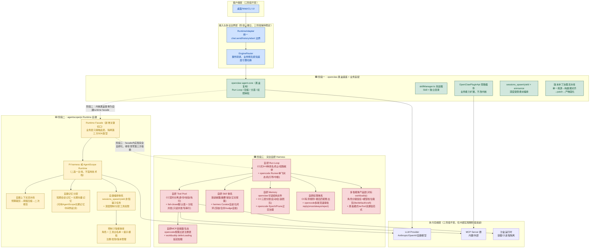
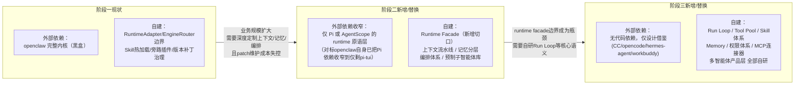

# uAgentCLI 技术架构设计方案（三阶段演进路线）

> 本文基于对 hermes-agent、nanobot、openclaw、LobsterAI、agentscope、pi、workbuddy、Claude Code、opencode 等项目的架构调研，以及《Agent平台通用技术架构图.md》归纳的十大模块通用框架，对用户提出的三阶段技术迭代思路给出综合架构设计方案。

---

## 一、结论先行

**三个阶段不是三选一的备选方案，而是同一条技术资产曲线上的三个里程碑**：阶段一验证业务场景与商业模式、阶段二把"运行时能力"收归自研、阶段三把"整个 Harness"收归自研。三者的关键差异不是"做不做智能体"，而是**对 Run Loop / 上下文管理 / 记忆 / 编排这几个模块的控制粒度**逐级下沉。

核心建议：

1. **不要把三个阶段当成三次推倒重来**。真正决定能否平滑演进的，是从阶段一开始就在"业务层"和"引擎层"之间维护一条**唯一稳定协议边界**（参考 LobsterAI 的 `OpenClawRuntimeAdapter` / AionUi 的 `IWorkerTaskManager` 模式）。只要这条边界稳定，阶段二/三替换引擎内部实现时，业务层（会话管理、权限UI、Skill市场、渠道接入）代码可以基本不动。
2. **阶段一的底座建议直接选 openclaw**，而非 hermes-agent 或 nanobot：LobsterAI 已经跑通"外壳+可插拔内核"的商业化路径，且 openclaw 本身已完成从"依赖 Pi SDK"到"内部化 `agent-core`"的演进，证明它本身就是"阶段一到阶段二"演进的活案例，选它意味着复用别人已经踩过的坑。
3. **阶段二的核心不是"agentscope 还是 pi"的二选一，而是提前规划 runtime facade**。参照 openclaw 自身的演进路径：即使阶段二直接依赖第三方 runtime 包，也要在自己代码里放一层 `runtime facade`，为阶段三"内部化/替换"预留切口，避免临到阶段三才发现到处都是对第三方 SDK 类型的硬编码依赖。
4. **阶段三不是重新发明轮子，而是把阶段一、二里已经验证过的模块逐个"收编"为自研**：工具池抄 Claude Code 的契约设计，技能体系抄 hermes-agent 的自我进化闭环，记忆体系融合 openclaw（可读结构）+ Claude Code（三层分层）+ opencode（上下文侧治理）。这三块在阶段一、二的调研中已经分别验证过，阶段三的工作量本质是"标准化 + 深度定制"，不是从零设计。

---

## 二、十大模块 × 三阶段能力矩阵

以《Agent平台通用技术架构图.md》的十大模块为基准，标注每个阶段对该模块的**控制粒度**与**建议动作**：

| 模块 | 阶段一（openclaw底座 + 业务适配） | 阶段二（agentscope/pi runtime 自建） | 阶段三（完全自研Harness） |
|---|---|---|---|
| ① Run Loop | 黑盒复用 openclaw `agent-core`，只做事件转译（Adapter+Router） | 基于 Pi harness 的 config/snapshot 状态模型自建 loop，或复用 AgentScope 的 ReAct 循环 | 自研，落地 CC 的"9+6种具名终止/续跑枚举"+ opencode 的 Runner 单飞状态机 |
| ② Tools | 走 `OpenClawPluginApi` 旁路插件注册，不碰内核 | 用 AgentScope `Toolkit` 或 Pi 的 tool 原语，自建风险分级元数据 | 自研，抄 CC 的 `Tool<Input,Output,P>` 契约分离 + fail-closed 默认值 + 分批并发执行 |
| ③ 技能池 | `skillManager.ts` 式热加载，Skill=独立目录 | 在 runtime 之上自建技能索引/权限门控 | 抄 CC/opencode 的渐进披露 + hermes-agent 的 Curator 自进化闭环（惰性剪枝+伞式合并+nudge自省） |
| ④ 上下文管理 | 依赖内核默认压缩策略，只能调配置 | 自研三段式流水线（裁剪→压缩→二次修剪），阈值自行标定 | 抄 CC 五阶段压缩管线+双阈值缓冲算法，融合 opencode 的 Context Epoch/Prune |
| ⑤ 记忆管理 | 内核自带的 workspace 结构化文件（AGENTS.md/MEMORY.md），够用但不可深度定制 | 引入 AgentScope `middleware/_longterm_memory` 或自建向量记忆分层 | 三方融合：openclaw 的人类可读结构文件 + CC 的三层分层写读（自动/会话/团队）+ opencode 的 Epoch/Prune 正交治理 |
| ⑥ 心跳/主动触发 | 依赖内核自带 cron，能力有限 | 自建 Trigger Engine（五个参考项目共同空白，必须自研） | 同左，工程化落地，参考 AionCore `aionui-cron`/CC 轮询增量读取范式 |
| ⑦ 渠道管理 | 复用内核多渠道网关能力 | 自建渠道-Provider统一注册表 | 抄 CC Bridge/Remote/Server 传输无关 Handler + `BoundedUUIDSet` 去重 |
| ⑧ 沙盒技术 | 依赖内核 `executionMode` 分级 | 自建进程级隔离+策略拦截 | 抄 CC/opencode 的 AST 级 shell 权限分析，容器级隔离仍需另行调研（业界通用空白） |
| ⑨ 权限/安全 | 依赖内核审批分级机制，业务层做旁路事件转发 | 自建权限系统（AgentScope `permission/` 可作起点） | 抄 CC 的"有序数组+最后匹配胜出"规则合并 + opencode 的 `reply(once\|always\|reject)` 多端竞速审批 |
| ⑩ 编排体系（新增，对应用户描述的核心诉求） | openclaw 的深度受限委派（`maxSpawnDepth`+分层工具权限），改配置不改内核 | 自建 `sessions_spawn/yield`+announce 式非阻塞子任务编排 | 自研预制子智能体库（角色+工具白名单+提示模板），支持编排者/leaf worker 分层权限 |

---

## 三、各阶段详细方案

### 3.1 阶段一：openclaw 底座 + 业务编排/Skill适配（对标 LobsterAI）

**目标**：数周到数月内完成MVP上线，验证业务场景，不追求底层可控性。

**关键决策**：
- 底座选 **openclaw**，不选 hermes-agent（偏个人助理/研究场景，Python强绑定训练基础设施，工程复杂度不匹配SaaS化诉求）或 nanobot（过轻，缺企业级治理能力）。
- 严格遵循 LobsterAI 验证过的边界原则：**业务层只对接内核的 RPC/事件边界，不感知内部实现**。落地为：
  - `RuntimeAdapter` 层（对标 `OpenClawRuntimeAdapter`）：统一 `chat.send/history/abort` 类边界；
  - `EngineRouter` 层（对标 `CoworkEngineRouter`）：内核事件转译为业务标准事件，为未来切换/共存多引擎留口子；
  - 业务 Skill/插件一律走 `OpenClawPluginApi` 标准旁路挂载，禁止改内核源码；
  - 内核版本升级走"单一真源→构建期对齐→版本补丁(patch)→产物固化"流水线，避免升级失控。
- 编排能力使用 openclaw 原生的 `sessions_spawn`/`sessions_yield`/announce 机制，配置 `maxSpawnDepth` 与工具权限分层，不需要现在就自建编排框架。

**退出信号（何时该转阶段二）**：业务方要求非标准的上下文压缩策略、深度定制的企业级记忆（多租户隔离、结构化知识图谱），或复杂多智能体协作图（审批链、多角色协商）——这些是 openclaw 内核边界之内无法通过 patch 经济地解决的需求。

### 3.2 阶段二：agentscope/pi Runtime 自建 + 预制子智能体（对标 openclaw 自身的演进路径）

**目标**：把"运行时"层面的核心能力（上下文、会话、记忆、工具）收归自研，获得阶段一无法提供的可控性，同时避免过早进入完全自研 Harness 的高投入。

**关键决策**：
- **技术栈优先，而非纯能力优先**：若 uAgentCLI 主线是 TS/Node（更贴近CLI产品形态），优先选 **Pi**（`pi-agent-core`）作为 runtime 内核，复用其 harness 状态模型（config/turn snapshot分离）、session JSONL存储、compaction分层设计；若服务化/多租户诉求更重、团队 Python 栈更强，优先选 **AgentScope**，直接复用其 Session 服务、权限系统(`permission/`)、多沙箱 workspace(`workspace/`)。
- **不建议同一产品内技术栈级混用两套 runtime**；更合理的做法是选一条主线，借鉴另一条的模块设计（例如用 Pi 做主线，但参照 AgentScope 的权限/事件系统模型自建对应能力）。
- **从第一天起规划 runtime facade**：即便直接依赖 agentscope/pi 的包，也要仿照 openclaw 的 `src/agents/runtime/` facade 模式，让上层业务代码只接触稳定 facade，不直接 import 第三方 runtime 类型。这是保证阶段二平滑走向阶段三"内部化/自研"的关键工程纪律，openclaw 自身已经用这条路径把 Pi SDK 依赖收窄到只剩 `pi-tui` 一项。
- 需要重点自研的模块：
  1. 编排体系：非阻塞子任务派生（`sessions_spawn`）+ 等待原语（`sessions_yield`）+ 结果回传（announce），深度限制+分层工具权限（orchestrator vs leaf worker）；
  2. 预制子智能体库：以"角色+工具白名单+系统提示模板"为最小单元，建立注册/发现/版本管理机制；
  3. 上下文管理三段式流水线：预算裁剪→阈值触发压缩→二次修剪，阈值参数需按自身模型 context window 与业务场景重新标定；
  4. 记忆分层：短期会话记忆 vs 长期/向量记忆分离存储，写入路径与压缩互斥、检索限定 top-k 注入（AgentScope 的 `middleware/_longterm_memory` 可作起点）；
  5. 若选 Pi 为主线：需自建多租户/多会话服务化封装（仿 AgentScope 的 `app/_router`、`app/_service`、`permission/`）。

**退出信号**：当自建的 runtime facade 之下，第三方 runtime 包的边界开始成为瓶颈（例如需要深度定制 Run Loop 的终止/续跑语义、需要与内部工具池/权限体系做超出 facade 能力的深度耦合），说明该把 runtime 收归完全自研。

### 3.3 阶段三：完全自研 Harness（对标 workbuddy，工具池抄CC，技能抄hermes，记忆融合三方）

**目标**：终局形态，完全自主可控，深度对接内部生态，无第三方 harness 版本节奏风险。

**核心模块与参考对象**：

| 模块 | 参考对象 | 落地要点 |
|---|---|---|
| Run Loop | Claude Code + opencode | 具名终止/续跑枚举（不靠模型字段猜）；单飞执行器+同一运行中drain实现"引导/中断"，而非取消重启 |
| Tool Pool | Claude Code | `Tool<Input,Output,P>` 契约分离（身份/行为谓词/校验/执行四段）；`buildTool` 默认值 fail-closed；只读/并发安全工具批量并发(上限约10)，写/危险工具串行；两层权限模型（策略层+UI/副作用层） |
| Skill 体系 | hermes-agent + CC/opencode | 渐进披露（系统提示只放摘要，正文按需加载+权限门控）+ hermes 的自我进化闭环：后台 Curator（只碰agent创建/只归档不删/pinned豁免/用辅助模型）+ 惰性剪枝（active/stale/archived）+ 轮次计数nudge触发后台自省沉淀新技能 |
| Memory | openclaw + Claude Code + opencode 三方融合 | 结构层用 openclaw 的人类可读分文件身份/画像文件（便于调试与用户信任）；分层/写读流程用 CC 的三层架构（自动记忆memdir+会话记忆+团队记忆，写路径fork独立agent、读路径小模型选≤5篇、写入与压缩互斥）；上下文侧的压缩/修剪边界用 opencode 的 Context Epoch + Prune 机制做正交治理——记忆负责"要不要长期记住"，Epoch/Prune 负责"当前窗口该丢什么"，二者不冲突 |
| MCP连接器/生态 | opencode + workbuddy | 每请求过滤注册表（按model/agent/permission筛选可见工具）+ workbuddy 的 `deferLoading` 延迟加载思路，控制常驻上下文成本 |
| 多智能体产品设计 | workbuddy | 分级信任+精准过滤：按角色裁剪工具集与模型档位（lite/default/craft成本分级）；asTool函数调用 vs 黑板模式（共享TaskList状态）两种正交通信范式；SubAgent中间推理默认不可见，只有摘要经消息机制进入主上下文，防止上下文膨胀 |

**代价与风险**：Run Loop/压缩算法/权限模型/记忆分层均需从零验证，研发周期长；业界 harness（CC/opencode/pi/hermes）仍在快速演进，需持续跟踪防止自研方案过时。建议自研过程中保留"业界最佳实践雷达"机制（定期重新对齐调研），而不是一次性设计后固化。

---

## 四、阶段间迁移与资产复用策略

避免每个阶段推倒重来的关键工程纪律：

1. **业务层与引擎层的协议边界从阶段一起就要稳定**。会话管理、权限UI、Skill市场、渠道接入等业务代码只依赖这层协议，三个阶段替换引擎实现时业务代码基本不用大改。
2. **阶段二起步即规划 runtime facade**，为阶段三"内部化/自研替换"预留切口，避免业务代码直接耦合第三方 SDK 类型。
3. **Skill/工具/记忆的数据格式尽量在阶段一就贴近终局设计**（如 Skill 用独立目录+SKILL.md 格式、记忆用结构化 Markdown+可选向量索引），即使阶段一/二阶段这些能力是内核提供的黑盒实现，只要存储格式与业务约定的接口稳定，阶段三替换底层实现时可以做数据迁移脚本，而不是要求用户/业务方重新配置。
4. **编排体系的抽象（角色+工具白名单+深度/并发上限）三阶段保持一致**，openclaw 的 `sessions_spawn/yield`+权限分层模型已经是可以直接沿用到阶段二、三的产品级抽象，无需每阶段重新设计编排语义。

---

## 五、里程碑建议

| 阶段 | 建议投入周期 | 关键验收标准 |
|---|---|---|
| 阶段一 | 数周至1-2个月 | 核心业务场景MVP上线；RuntimeAdapter/EngineRouter边界稳定；Skill热加载与权限旁路机制跑通 |
| 阶段二 | 视阶段一暴露的深度定制需求触发，非固定排期 | Runtime facade落地；预制子智能体库+编排体系自研完成；上下文/记忆自定义能力达到阶段一无法满足的水平 |
| 阶段三 | 视阶段二runtime facade瓶颈触发，非固定排期 | Run Loop/Tool Pool/Skill/Memory/MCP连接器全部自研完成并通过CC式的fail-closed安全基线验证；具备持续跟踪业界harness最佳实践的机制 |

**是否可以跳过阶段一或阶段二直接做阶段三**：如果团队已有充足的 harness 自研经验、且业务需求从一开始就明确需要深度定制（例如强合规审批链、企业级多租户记忆隔离），可以压缩甚至跳过阶段一直接进入阶段二/三，但仍建议保留"业务层-引擎层协议边界"这一条工程纪律，因为它与选择哪条演进路径无关，是任何阶段都需要的架构底线。

---

## 六、整体技术架构图（分阶段建设标注）

### 6.1 分层架构图：各模块所属阶段与建设方式

> 颜色含义：🟩 阶段一（黑盒复用/边界适配）　🟨 阶段二（自建runtime能力）　🟥 阶段三（完全自研）　🟦 三阶段保持稳定不变

**读图要点**：
- `Adapter`/`Router`（🟦蓝色）是唯一贯穿三个阶段不变的协议边界，业务层（会话管理、权限UI、Skill市场、渠道接入，图中未展开）只依赖这一层，因此三个阶段的引擎替换对业务层是透明的。
- 阶段一（🟩绿）的所有能力都在 openclaw 黑盒内核内部，业务层通过 `Adapter/Router` 边界 + 旁路插件扩展，**不改内核代码**。
- 阶段二（🟨黄）引入 `Runtime Facade` 作为新的关键切口：即使底层仍依赖 Pi/AgentScope 的第三方包，业务与上层模块也只通过 facade 接触它，为阶段三的"内部化"预留退路。
- 阶段三（🟥红）中 `P3Loop` 直接承接 `P2Facade` 的位置，意味着 facade 背后的实现从"调用第三方 runtime 包"演进为"完全自研代码"，对外接口保持稳定，`Adapter/Router` 到业务层完全无感知。

### 6.2 阶段演进时序图：第三方依赖收窄 + 自建能力扩张

**读图要点**：每进入下一阶段，"外部依赖"只收窄不扩张，"自建能力"只累加不推倒——阶段二的 Runtime Facade、编排体系、预制子智能体库在阶段三会被直接沿用或原地升级为自研实现，不是重新设计；这与 openclaw 自身从依赖 Pi SDK 到内部化 `agent-core`、只保留 `pi-tui` 一项第三方依赖的真实演进路径完全一致，是本方案三阶段迁移策略可信度的直接佐证。
