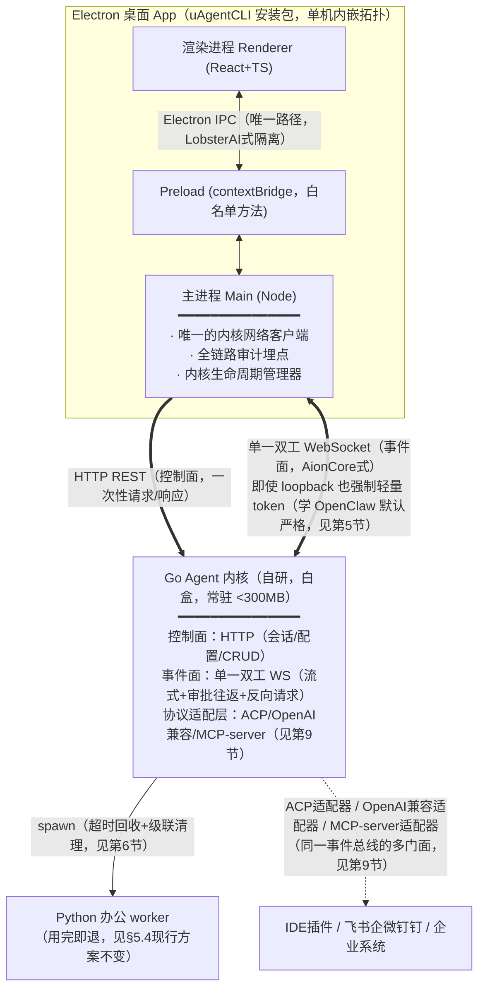
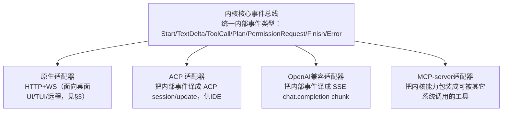

# uAgentCLI 技术框架设计指导方案
### ——基于 AionUi↔AionCore 与 LobsterAI↔OpenClaw 通信架构对比的启示

> 输入材料：`AionUi-技术架构分析报告.md`、`LobsterAI-技术分析报告.md`、`AionUi与LobsterAI通信策略深度对比报告.md`（本目录，均已逐源码核实）+ `uAgentCLI技术产品方案.md`（v0.4，本目录，现行方案）
> 本文目的：把两款参考产品在"胖客户端 + 独立 Agent 后端"这一相同拓扑下走出的两条不同技术路线，**映射到 uAgentCLI 当前方案（Electron+React 桌面 UI ⇄ Go 内核 ⇄ Python 办公 worker）的具体设计决策上**，给出可执行的取舍建议——哪些该抄 AionCore、哪些该抄 OpenClaw、哪些两边都不该照抄。
> 定位：**指导方案**，不是最终架构文档；结论需与 `uAgentCLI技术产品方案.md` §11（协议接口层/技术栈）对照评审后落地，本文第 13 节给出逐条对照的修订建议。

---

## 0. 核心判断（一句话结论）

**uAgentCLI 的 Go 内核和 Python 办公 worker 都是自研代码——这决定了 uAgentCLI 在"该学 AionCore 还是该学 OpenClaw"这个问题上，绝大多数场景下答案是 AionCore，而不是 OpenClaw。** OpenClaw 那一整套"配置文件声明式生效 + 独立反向 HTTP 回调桥 + 版本钉死补丁流水线"，本质上是"团队不拥有后端源码"这一约束逼出来的工程代价，uAgentCLI 不需要背负这份代价。

但 uAgentCLI 有一个 AionUi 没有的强约束——**政企/信创合规场景**：数据不出内网、全链路审计、分级审批。这意味着在"渲染进程能不能直连后端"这一具体问题上，uAgentCLI **反而应该学 LobsterAI 的隔离姿态**（渲染进程永远只经 Main 中转，不直连内核），而不是学 AionUi 的"渲染进程直连后端"——不是因为内核不可控，而是因为**合规场景需要一个统一的审计埋点与信任边界收敛点**，Main 进程正好承担这个角色。

**结论落成一句架构口诀**：

> **渲染层的隔离姿态学 LobsterAI，内核层的通信协议学 AionCore，绝大多数 OpenClaw 特有的复杂度（配置文件双态判定、独立反向回调桥、第三方版本治理流水线）都不需要照抄。**

---

## 1. 先定位：uAgentCLI 到底更像谁？

沿用对比报告 §6 提出的判断准则——"这个后端是我们自己的代码，还是别人的黑盒？"——逐条核对 uAgentCLI 现行方案：

| 判断项 | AionCore（自研白盒） | OpenClaw（第三方黑盒） | uAgentCLI（Go 内核 + Python worker） |
|---|---|---|---|
| 源码归属 | 自研，同 monorepo 演进 | 第三方开源，`package.json` 钉版本 vendor 进仓库 | **自研**（`uAgentCLI技术产品方案.md` §11.5 明确 `kernel-python`/未来 `kernel-go` 是自己的工程结构） |
| 能否随意加协议端点 | 能 | 不能，只能通过配置 schema/插件 SDK 间接影响 | **能**——Go 内核和 Python worker 的接口都是自己设计的 |
| 是否需要"打补丁"机制 | 不需要 | 需要（`scripts/patches/<version>/`） | **不需要** |
| 是否有独立版本升级流水线风险 | 无 | 有（clone tag→patch→build→版本核对） | **无**（内核随 uAgentCLI 自身发版） |

**结论**：uAgentCLI 的内核层通信设计应以 **AionCore 为主要参照系**，OpenClaw 的三通道拆分方案不构成参照价值——那是"黑盒集成"问题的解，uAgentCLI 面对的不是这个问题。

但下一节会说明，**渲染进程↔Main 这一层**恰恰是例外，uAgentCLI 应该反过来参考 LobsterAI。

---

## 2. 核心建议一：进程拓扑——渲染层隔离学 LobsterAI，内核通信学 AionCore（混合模型）

`uAgentCLI技术产品方案.md` §11.2 目前的表述是：

> "`renderer`(React) 只与 `main` 经 Electron IPC 通信，不直连内核（安全边界）"

这个决策**方向是对的**，本指导方案予以确认并加固理由：AionUi 让渲染进程直连 AionCore，前提是 AionCore 本身已经用 JWT/CSRF/`local` 模式做了完整鉴权分层，且 AionUi 的目标场景（开发者桌面工具）对"渲染进程网络层健壮性自理"的代价可以接受。uAgentCLI 面向的是**政企办公、强隐私合规**场景，把所有对内核的访问都收敛到 Main 一个进程，有三点直接收益：

1. **审计埋点单一化**：全链路审计（`uAgentCLI技术产品方案.md` §9）只需要在 Main 一处打点，不需要在渲染进程和内核两处分别记账去重；
2. **信任边界更小**：渲染进程（含未来可能引入的第三方 Web 组件/插件预览 iframe）拿不到内核的直连凭证，即使渲染进程被 XSS/供应链攻击，攻击面也止步于 Main 暴露的白名单 IPC 方法，触达不到内核的全量 RPC 面；
3. **为"内网服务"拓扑天然铺路**（见第 6 节）：多台桌面 App 接同一台内网内核时，"Main 是唯一的内核客户端"这一契约不需要因为部署形态切换而改变。

**但内核↔Main 这一段，应该学 AionCore 的协议设计，而不是 OpenClaw 的三通道拆分**——理由见第 3、4 节。

### 推荐拓扑图

---

## 3. 核心建议二：内核↔Main 协议精简——废除"stdio-RPC + 独立事件流"的双通道拆分

`uAgentCLI技术产品方案.md` §11.1 目前把接口层列成五个并列条目：ACP（stdio）、JSON-RPC 行分隔（stdio/socket）、事件流（NDJSON/SSE/WS）、OpenAI 兼容 API（HTTP）、生成式 SDK。§11.2 进一步落实为"**JSON-RPC(stdio) 主通道 + 本地 WS(127.0.0.1) 事件流**"两条并行传输。

**这是一个需要修正的设计**，理由直接来自对比报告 §3.1 和 §4 的发现：

- AionCore 之所以能用**一条 WebSocket 同时做"服务端推送事件"和"服务端反向发起请求（如 `show-open-request`）"**，靠的是 WS 本身全双工、请求响应可以用消息 id 关联。
- 而 uAgentCLI 现行方案把"请求/响应"（JSON-RPC，走 stdio）和"事件推送"（走独立的 NDJSON/SSE/WS）**拆成了两条不同的传输**。这会立刻撞上 §11.1 自己写的场景：

  > "**审批渠道化**：`permission.request` 事件推给任意已连接 UI，多路竞速响应……UI 经 RPC 调 `steer()/followUp()`……"

  `permission.request` 是"事件"（内核→UI），但"响应审批"是"请求"（UI→内核，且必须能关联回具体是哪一个 `permission.request`）。如果事件走 stdio-NDJSON 而 RPC 走另一条 socket/WS，**两条传输之间没有共享的因果排序保证**，还要额外设计"事件 id ↔ RPC 关联"的跨通道协议，纯属自找复杂度。更严重的是：**stdio 天然只能用于本机子进程**，一旦切到 §11.4 规划的"内网服务"拓扑（多台桌面 App 接同一台远程内核），stdio 这条腿直接失效，又得为远程场景另开一套传输——等于把"传输选型"问题解决了两次。

### 建议方案

内核对 Main 只暴露**两类接口**，与 AionCore 完全对齐：

| 通道 | 用途 | 传输 | 与现行方案的关系 |
|---|---|---|---|
| **HTTP（控制面）** | 一次性、幂等或近幂等的 CRUD 类调用：创建/查询/删除会话、读写配置、拉取历史消息、上传文件元数据 | `http://127.0.0.1:PORT`（内嵌）/ `http://内网host:PORT`（内网服务） | 替代原"JSON-RPC(stdio)"里**不需要低延迟流式**的那部分调用 |
| **单一双工 WebSocket（事件面）** | 流式增量（`text.delta`/`tool.*`）、审批双向往返（`permission.request` → 响应）、steering（`steer/followUp`）、任意"内核主动向 UI 发起请求"的场景 | `ws://127.0.0.1:PORT/ws`（内嵌）/ `ws://内网host:PORT/ws`（内网服务） | 吸收原"JSON-RPC 主通道"里**必须双向、必须流式**的那部分调用 + 原"事件流"通道，二者合一 |

**判定原则**（供后续设计具体端点时套用，抄自 AionCore §3.2/§7.2 的划分逻辑）：一次调用如果满足"UI 发起、内核一次性应答、不需要中途被内核打断插话"，走 HTTP；只要涉及"内核需要在过程中主动推事件、或需要中途向 UI 要一个答案再继续"，一律走 WS，不要为了"看起来像 RPC"就单独开一条 stdio 通道。

**ACP 不再是一条平行传输**，而是内核事件总线之上的一个**适配器**（专供 IDE 场景），详见第 9 节——这样可以彻底停用 stdio 作为默认传输，只在极少数确实需要走 stdio 的 IDE 集成场景里保留（ACP 生态本身默认走 stdio，这是外部约束，不是 uAgentCLI 自己的选择，予以保留但仅限 ACP 适配器这一条腿）。

---

## 4. 核心建议三：反向请求与多端审批竞速——复用 §3 的单一 WS，但要补一个 AionCore 没有的机制

对比报告 §3.1 指出 AionCore 靠"同一条 WS 双向复用"优雅解决了反向请求问题，uAgentCLI 内核↔Main 这一段（第 3 节建议）可以直接照搬这个模式，**不需要**像 OpenClaw 那样为插件另开一条 `McpBridgeServer`——因为 uAgentCLI 的"办公 worker"和"内核自身工具"都是自己的代码，不存在"插件跑在别人沙箱里摸不到既有连接"的问题。

但 `uAgentCLI技术产品方案.md` §11.1 提出的"**多路竞速响应（本地 TUI / IDE / 远程），首个胜出**"，是 AionCore 现行实现里**没有的能力**，需要单独设计，不能假设"照抄 AionCore 就自动拿到"：

- 对比报告 §7.5 的源码走查发现，AionCore 的 `BroadcastEventBus.broadcast()` 是**无差别广播给所有连接**，且 `aionui-ai-agent` 的 `PermissionRouter` 用 `pending_permissions: HashMap<call_id, oneshot::Sender>` **一个请求只对应一个待响应槽位**——AionCore 场景里通常只有一个渲染进程连着，不存在"多个客户端同时收到同一个审批请求、谁先回谁生效"的竞速语义。
- uAgentCLI 明确要支持"本地 TUI / IDE / 远程"多端**同时**连接同一个内核会话，这就需要在 AionCore 的"`call_id` → 单一 `oneshot::Sender`"基础上，**再加一层"多消费者竞速+失效广播"**：
  1. `permission.request` 广播给**所有**当前订阅该会话的客户端（这一步等同 AionCore 的 `broadcast()`）；
  2. 任一客户端的响应到达，内核**立即**判定该 `request_id` 已解决，唤醒等待方，并**主动向其余客户端广播一条 `permission.resolved`/`permission.stale` 事件**，让它们撤下本地已展示的确认弹窗（AionCore 因为只有一个消费者，没有这个"通知其余端过期"的步骤，是 uAgentCLI 必须补的）；
  3 用简单的 `sync.Once` / 原子 CAS 保护"只有第一个响应生效"，其余迟到的响应直接丢弃并返回"该请求已被其他端处理"。

**这是一处"AionCore 的代码不能直接抄，但设计思路可以延伸"的地方**，务必在详细设计阶段单独排期，不要默认"抄 AionCore 的 WS 事件总线就自动具备多端竞速能力"。

---

## 5. 核心建议四：鉴权——即使本机 spawn 也要求 token，学 OpenClaw 的默认严格，而不是 AionCore 的 `local` 零鉴权

对比报告 §3.3 指出：AionCore 在 `--local` 模式下**完全跳过鉴权**（信任"同机同用户"），OpenClaw **即使是 Main 自己 spawn 的本地子进程，也始终要求 token + `connect.challenge` 握手**。

**uAgentCLI 应该选 OpenClaw 这一侧**，原因直接来自现行方案自身的定位：

- `uAgentCLI技术产品方案.md` §0/§9 明确"政企属性→强隐私+信创合规"，"全链路审计"是硬性要求；
- AionCore 敢在 `local` 模式零鉴权，前提是它的威胁模型只考虑"桌面单用户"，而 uAgentCLI §11.4 已经规划了"**内网服务**"拓扑——一旦内核可能常驻服务器、被多台桌面 App 经内网连接，"本机回环=可信"这个假设从一开始就不成立，与其到时候临时加鉴权（且容易出现"内嵌模式忘了切换鉴权强度"的疏漏），不如**从第一天起内嵌模式和内网服务模式用同一套鉴权代码路径**，只是内嵌模式下 token 由 Main spawn 内核时通过启动参数/环境变量一次性下发（用户无感知），内网服务模式下升级为完整的账号体系。

**具体建议**：

1. Main spawn 内核子进程时，生成一个一次性随机 token（`crypto/rand`），通过**环境变量**（不是命令行参数，避免出现在 `ps` 输出里）传给内核，内核所有 HTTP/WS 请求校验该 token；
2. token 校验逻辑与"内网服务"模式下的正式账号鉴权（JWT 或等价机制）复用同一中间件，仅"token 来源"不同（一次性 env token vs 登录颁发的 JWT），避免出现两套鉴权代码；
3. WS 握手校验 token 的方式直接抄 AionCore 的实现细节（对比报告 §3.3 之外、原 AionCore 报告 §7.5 的走查结论）：**连接建立时校验一次，之后每个心跳周期（如 30 秒）再重新校验一次并主动断开失效连接**——这一点 AionCore 做得很好，值得原样照抄，不受"要不要走 OpenClaw 路线"影响。

---

## 6. 核心建议五：内核生命周期治理——完整照抄 AionCore 的工程配方

这是本指导方案中**可以直接照抄、无需改造**的部分，因为"如何让一个自己写的子进程健壮地启动、上报端口、被父进程健康检查、崩溃后自愈、父进程退出后自己也退出"是一个跟"内核是不是黑盒"无关的纯工程问题，AionCore 团队已经把这套配方打磨得很完整（详见 `AionUi-技术架构分析报告.md` §7.1、§3.1）。建议 uAgentCLI 的 Go 内核原样复刻：

| AionCore 机制 | uAgentCLI（Go 内核）落地方式 |
|---|---|
| 启动参数 `--port 0`（OS 分配）+ `--parent-pid`（父进程存活监控）| Go 内核同样支持 `--port 0` 走 `net.Listen("tcp", "127.0.0.1:0")` 拿系统分配端口；`--parent-pid` 用 `os.FindProcess`/定期 `os.Getppid()`（Unix）比对判断 Main 是否仍存活，不等价则优雅退出——Go 标准库足以实现，无需额外依赖 |
| stdout 单行 JSON 端口上报协议 `AIONCORE_LISTENING {...}` | Go 内核绑定端口成功后立即打印 `UAGENT_KERNEL_LISTENING {"port":...,"pid":...}` 并 flush，Main 侧逐行解析 stdout，与 AionUi 的 `BackendLifecycleManager` 逻辑一致 |
| `/health` 轮询 + 30s 超时 | Go 内核暴露 `GET /health`，Main 每 200ms 轮询直至就绪或超时，超时策略同 AionCore（允许"后台继续等待、先展示 UI，就绪后再解锁"，不要一律阻塞式等待，改善冷启动体感） |
| SIGTERM→等待→SIGKILL 兜底优雅关闭 | Go 内核 `signal.Notify(SIGTERM)`，收到后：标记运行时"正在关闭"→停止接受新会话→对所有存活 Python worker 子进程送 SIGTERM 并等待（含超时兜底 SIGKILL）→关闭数据库连接→退出；Main 侧同 AionCore 的"先 SIGTERM、5 秒未退出再 SIGKILL"两段式 |
| 崩溃指数退避重启（60s 窗口内最多 3 次） | Main 侧 `BackendLifecycleManager` 逻辑原样复刻，语言无关 |
| 进程树级联清理（AionUi 退出时連带杀死所有 Agent CLI 子进程） | uAgentCLI 同理：Main 退出/内核崩溃时，必须级联清理所有存活的 Python worker 子进程——**这一点对 uAgentCLI 尤其重要**，因为 `uAgentCLI技术产品方案.md` §11.6 把"≤300MB 常驻内核"作为硬指标，孤儿 worker 进程（pandas/OCR 动辄 200~400MB）如果清理不干净，会直接击穿这个内存预算承诺，必须在设计阶段就把"子进程生命周期与父进程强绑定（Go 侧用 `exec.Cmd` + 进程组 + 显式 kill，不依赖操作系统自动回收）"列为验收项，而不是事后补丁 |

---

## 7. 核心建议六：配置生效策略——不要照抄 OpenClaw 的"整份文件 diff + 重启判定"，但要抄它的密钥处理纪律

`uAgentCLI技术产品方案.md` 目前没有详细展开配置生效机制，这里给出明确指导，避免团队"因为 OpenClaw 那套看起来很稳健"而误抄了一个本不需要的复杂度：

- **不要抄**：OpenClaw 的 `OpenClawConfigSync.sync()` 每次重新渲染整份 `openclaw.json`、再靠"哪些顶层 key 变了"这种**外部黑盒观察**去猜"要不要重启网关"——这一整套机制存在的唯一原因是 LobsterAI 无法在 OpenClaw 内部实现"某个字段变了就精确地热更新某个子模块"的细粒度逻辑。**uAgentCLI 的 Go 内核是自己的代码，完全可以对每个配置项单独设计"改这个字段该怎么生效"**（比如切换 LLM provider 不需要重启整个内核，只需要重建对应的 client 连接池），应该走 AionCore 的模式——**配置变更是普通的 HTTP 端点，内核内部直接改内存态/DB，按需触发精确到子模块的局部重建，不需要"整份配置渲染+外部 diff 猜重启"这一层**。
- **要抄**：OpenClaw 对**密钥类配置**的处理纪律——配置对象里**只存占位符**（如 `${UAGENT_APIKEY_<PROVIDER>}`），真实密钥值**只作为运行时环境变量或独立的加密存储**传递给需要用到它的子系统，**绝不在任何会被序列化落盘、写日志、或经审计链路留痕的结构里出现明文密钥**。这一点与"后端是否黑盒"无关，是通用安全纪律，且直接呼应 `uAgentCLI技术产品方案.md` §9 的合规要求（"全链路可审计"意味着审计日志本身也不能泄露密钥），应当明确写入设计规范：**任何进入事件流/HTTP 响应体/日志/审计记录的结构，在序列化前必须过一层与 AionCore `redactForLog`（对比报告未展开但 AionUi 报告 §3.3 提到）同等的脱敏正则**，按字段名匹配 `api[_-]?key|token|secret|password` 等模式统一替换为 `[REDACTED]`。

---

## 8. 核心建议七：会话/进程复用策略——现行方案在"Go 内核自身会话生命周期"上有空白，需要补齐

`uAgentCLI技术产品方案.md` §5.4/§11.6 对 Python 办公 worker 的策略已经很清楚："**用完即退**"——这个决策本身没问题，直接沿用（短生命周期的文档解析/OCR/Excel 建模任务，进程用完立刻退出回收内存，正是 AionCore 报告 §7.6 里 `aionui-runtime` 的托管子进程理念的一个特例，二者并不冲突）。

但现行方案对 **Go 内核自身的 Agent 会话**（用户跟内核的一次多轮对话/多智能体协作）的生命周期管理**没有展开**，只提到 memdir 记忆持久化。这里存在一个容易被忽略的设计缺口，建议直接照抄 AionCore 验证过的模式（`AionUi-技术架构分析报告.md` §7.2）：

1. **单飞任务槽（single-flight task slot）**：每个会话同一时刻只应有一个"活跃执行任务"，用 `sync.Map[session_id]*sync.Once`（Go 等价于 AionCore 的 `DashMap<conversation_id, Arc<OnceCell<...>>>`）保证并发请求（如"用户刚发消息"和"UI 主动预热会话"同时触发）不会重复起两个执行流；
2. **回合独占锁**：真正的"同一会话同一时刻只处理一条消息"约束，由单独的 `try_claim_turn()` 语义保证（不要跟第 1 点的任务槽混为一谈——AionCore 里这是两个不同层次的机制，职责分开更清晰）；
3. **Active Lease 心跳**：UI 侧定期发"我还在看这个会话"的续约请求（AionCore 是 90 秒 TTL），供内核的空闲回收扫描器判断——**避免用户切换标签页几分钟就把还在思考/等待工具结果的会话进程强杀**，同时避免真正无人关注的会话无限占用内存（这对 uAgentCLI 的 300MB 常驻预算同样重要，Go 内核内如果同时挂着多个"事实上已经没人看"的会话状态机，也是隐性的内存泄漏源，只是不像 Python worker 那样表现为独立进程，而是内核自身 RSS 缓慢增长）。

---

## 9. 核心建议八：协议适配层应做成"同一事件总线的多个门面"，不要做成并列的独立实现

对第 3 节"ACP 不再是一条平行传输"的建议在这里给出结构性方案。参照 AionCore `aionui-ai-agent` 里 `protocol/events/translate.rs` 的设计（`AionUi-技术架构分析报告.md` §7.2"流式翻译层"）——AionCore 自己是 ACP 的**消费方**（调用 Agent CLI），把 ACP 的 `SessionNotification` 统一翻译成内部标准事件 `AgentStreamEvent`，再由这一份标准事件驱动 WS 广播。

uAgentCLI 的场景是反过来的：Go 内核自己是 Agent 执行主体，需要**同时扮演多种协议的服务方**（面向桌面 UI 的原生协议、面向 IDE 的 ACP、面向企业系统的 OpenAI 兼容 API、把自己暴露为 MCP server）。建议的结构：

**好处**：新增一种协议只需要新写一个"内部事件→该协议格式"的翻译器，核心业务逻辑（run-loop、工具编排、权限判定）只维护一份，不会出现"四套协议各自实现一遍会话状态机、行为逐渐漂移不一致"的问题——这正是 `uAgentCLI技术产品方案.md` §13 风险 6"协议成熟度……事件 schema 需版本化，避免前后端脱节"担心的问题的釜底抽薪解法：**只对内部标准事件做版本化，外部协议适配器各自独立演进，互不牵连**。

---

## 10. 一个容易被忽视的坑：内核热替换后的连接一致性——学 OpenClaw 这一点

`electron-updater` 自动更新场景下，Go 内核二进制会被静默替换。这里有一个 AionCore 目前没有、但 OpenClaw 有专门机制处理的问题（`LobsterAI-技术分析报告.md` §6.3）：**更新后重启的内核如果协议/事件 schema 有变化，Main 侧缓存的旧客户端状态可能与新内核不匹配**。OpenClaw 的解法是：`OpenClawRuntimeAdapter` 缓存 `gatewayClientVersion`，一旦发现连接目标的版本变了，**主动重建 WS 客户端**，不复用旧连接的隐含状态假设。

**建议**：Go 内核在 `/health` 响应体和 WS 握手 `hello` 消息里都携带自身版本号，Main 侧记录"当前连着的是哪个版本"，一旦通过更新流程重启内核后发现版本号变化，**主动重建 WS 连接而不是尝试断线重连复用**，同时视版本差异决定是否需要重新拉取一次全量状态（会话列表/配置快照）而不是假设增量事件足够——这是 uAgentCLI 必须补的一个细节，直接抄 OpenClaw 的思路即可，不需要重新设计。

---

## 11. 一个"多客户端"场景下必须警惕、不能照抄 AionCore 的点：广播必须按会话/租户过滤

对比报告 §7.5 走查确认：AionCore 的 `BroadcastEventBus.broadcast()` 是**无差别广播给所有连接**，本身不做按用户/按会话的过滤，因为 AionUi 典型场景下"一个后端 = 一个桌面用户的所有连接"，广播即使不过滤也不会跨用户泄露。

**uAgentCLI 不能照抄这一点**。`uAgentCLI技术产品方案.md` §11.4 明确规划了"内网服务"拓扑——**一个内核实例服务多台桌面 App、可能对应多个不同用户**。如果内核的事件广播机制原样照抄 AionCore 的"无差别广播"，会直接造成**跨用户会话内容泄露**（用户 A 的对话流式内容被广播到用户 B 的 WS 连接上），这是政企合规场景下的严重问题，绝不能通过"业务层自己注意不展示无关数据"来兜底（这也是 AionCore 报告 §7.5 里提到的、AionCore 自己选择的裁剪方式——依赖上层业务代码自觉不发无关内容——这个假设在 uAgentCLI 的多租户场景下不成立）。

**建议**：内核事件总线在广播时必须携带 `session_id`（或 `user_id`），WS 连接建立时記录其订阅的 `session_id` 集合，`broadcast()` 改为按订阅关系过滤投递，而不是无条件推给所有连接——这是**内核通信层**的硬性设计要求，需要在 Go 内核的 `WebSocketManager` 一开始就设计进去，不要等到"内网服务"拓扑真正上线时才补，届时代价会大得多（涉及协议兼容性变更）。

---

## 12. 汇总：从两个参考项目"抄什么 / 不抄什么"

| 主题 | 抄 AionCore | 抄 OpenClaw | uAgentCLI 需要自己补的 |
|---|---|---|---|
| 渲染进程是否直连后端 | ❌ 不抄（AionUi 允许直连） | ✅ 抄（渲染进程永远经 Main 中转） | — |
| 内核↔Main 主协议 | ✅ 抄（HTTP控制面 + 单一双工WS事件面） | ❌ 不抄（不要拆 WS-RPC + 配置文件 + 反向HTTP三通道） | — |
| 反向请求（内核主动问UI） | ✅ 抄（复用同一条WS，不用另开回调桥） | — | ✅ 多端竞速+失效广播（AionCore无此场景，需自行设计） |
| 鉴权强度（本机/内嵌模式） | ❌ 不抄（不要学 `local` 零鉴权） | ✅ 抄（始终 token+握手，哪怕本机） | ✅ 内嵌/内网服务鉴权代码路径统一 |
| WS 心跳周期性再校验 token | ✅ 抄 | — | — |
| 进程生命周期（端口协议/健康检查/父进程存活/崩溃重启/级联清理） | ✅ 全套抄 | — | — |
| 配置生效方式 | ✅ 抄（HTTP直接改状态，精确到字段的局部生效） | ❌ 不抄（不要整份文件diff+外部猜重启） | — |
| 密钥处理纪律（占位符+env注入+日志脱敏） | 部分抄（脱敏正则思路） | ✅ 抄（占位符不落盘的模式） | — |
| Go 内核自身会话生命周期 | ✅ 抄（单飞任务槽+回合独占锁+ActiveLease空闲回收） | — | ✅ 现行方案文档空白，需补充设计 |
| 协议扩展方式（ACP/OpenAI兼容/MCP-server） | ✅ 抄结构（统一内部事件+多适配器） | — | — |
| 内核热更新后连接一致性 | — | ✅ 抄（版本号比对+主动重建连接，不复用旧连接假设） | — |
| 事件广播是否按会话/租户过滤 | ❌ 不抄（AionCore无差别广播，仅适用单用户场景） | — | ✅ 必须按 session_id/user_id 过滤，从设计之初就做 |
| 版本治理流水线（拉取对齐/补丁/构建产物） | 不适用（AionCore无此问题） | ❌ 不需要（uAgentCLI无第三方内核依赖） | — |

---

## 13. 对 `uAgentCLI技术产品方案.md` §11 的具体修订建议

以下逐条对照原文给出建议改法，供下一轮方案修订直接采用：

**原 §11.1 表格**（ACP / JSON-RPC / 事件流 / OpenAI兼容API / 生成式SDK 五项并列）→ **建议改为**：

> 内核对外只暴露**两条原生传输**：HTTP（控制面）+ 单一双工 WebSocket（事件面，覆盖原"事件流"与原"JSON-RPC"里需要双向的部分）。ACP、OpenAI 兼容 API、MCP-server 三者不再是独立传输，而是内核统一事件总线之上的**协议适配器**（见本文第 9 节），其中 ACP 适配器因外部生态约束保留 stdio 子传输，其余均复用 HTTP+WS。生成式 SDK 由原生传输的 schema 自动生成，保留不变。

**原 §11.2 架构图**"JSON-RPC(stdio)+WS(127.0.0.1)"→ **建议改为**："HTTP(127.0.0.1)+单一双工WS(127.0.0.1)，本机回环仍强制一次性 token 鉴权"。

**原 §11.4"两种运行拓扑"** → 建议补充一句明确约束："**无论单机内嵌还是内网服务，`Main 是内核的唯一网络客户端`这一契约不变**；内网服务模式下渲染进程/其它端仍不允许绕过本机 Main 直连远程内核，只是 Main 的连接目标从 `127.0.0.1` 换成内网地址、鉴权强度从一次性 token 升级为账号体系。"

**原 §11.6"内存指标口径"** → 建议补充："**内核常驻 RSS 预算还需覆盖'僵尸/孤儿 Python worker 未被清理'这一失效模式**，验收测试需包含'Main 异常终止/内核崩溃后，检查是否有残留 worker 进程'这一用例（对应本文第 6 节）。"

**原 §13 风险清单** → 建议新增两条：
- **风险 7**：多端（本地TUI/IDE/内网远程桌面）同时订阅同一会话时的审批竞速与失效通知需要专门设计与测试（本文第 4 节），不能假设"照抄 AionCore 的广播机制"就自动具备。
- **风险 8**：内网服务拓扑下，事件广播若未按 `session_id`/`user_id` 过滤，存在跨用户会话内容泄露风险，须在内核事件总线的**最初设计**中就加入订阅过滤，事后补救成本高（本文第 11 节）。

---

## 14. 小结

uAgentCLI 与 AionUi、LobsterAI 共享同一顶层拓扑（胖客户端 + 独立 Agent 后端子进程），但由于**内核完全自研**，工程处境更接近 AionCore 而非 OpenClaw——这意味着 uAgentCLI 有条件把通信协议做得比 OpenClaw 简单、比 AionUi 更安全：

- **内核层**：直接照抄 AionCore 验证过的"HTTP控制面 + 单一双工WS事件面 + 完整生命周期治理配方"，跳过 OpenClaw 为应付黑盒集成而背负的三通道复杂度；
- **渲染层**：反过来采用比 AionUi 更保守的 LobsterAI 式隔离姿态（渲染进程永不直连后端），服务于政企合规场景对审计埋点与信任边界收敛的硬性要求；
- **在两个参考项目都没有覆盖到的地方**（多端审批竞速、多租户广播过滤、Go 内核自身会话生命周期治理、内核热更新连接一致性），需要团队基于本文第 4、6、8、10、11 节的具体建议自行补齐设计——这些是 uAgentCLI 因为"支持多端 + 支持内网多租户服务"这一比两个参考产品更复杂的部署矩阵，所必须承担的、无法从任何一个参考项目直接抄到的增量工程。

---

### 参考来源

- `AionUi-技术架构分析报告.md`（本目录，第 3、7 节）
- `LobsterAI-技术分析报告.md`（本目录，第 3、4、5、6 节）
- `AionUi与LobsterAI通信策略深度对比报告.md`（本目录，全篇，尤其第 3、6 节）
- `uAgentCLI技术产品方案.md`（本目录，v0.4，第 4、5、11、13 节为本文主要对照对象）
